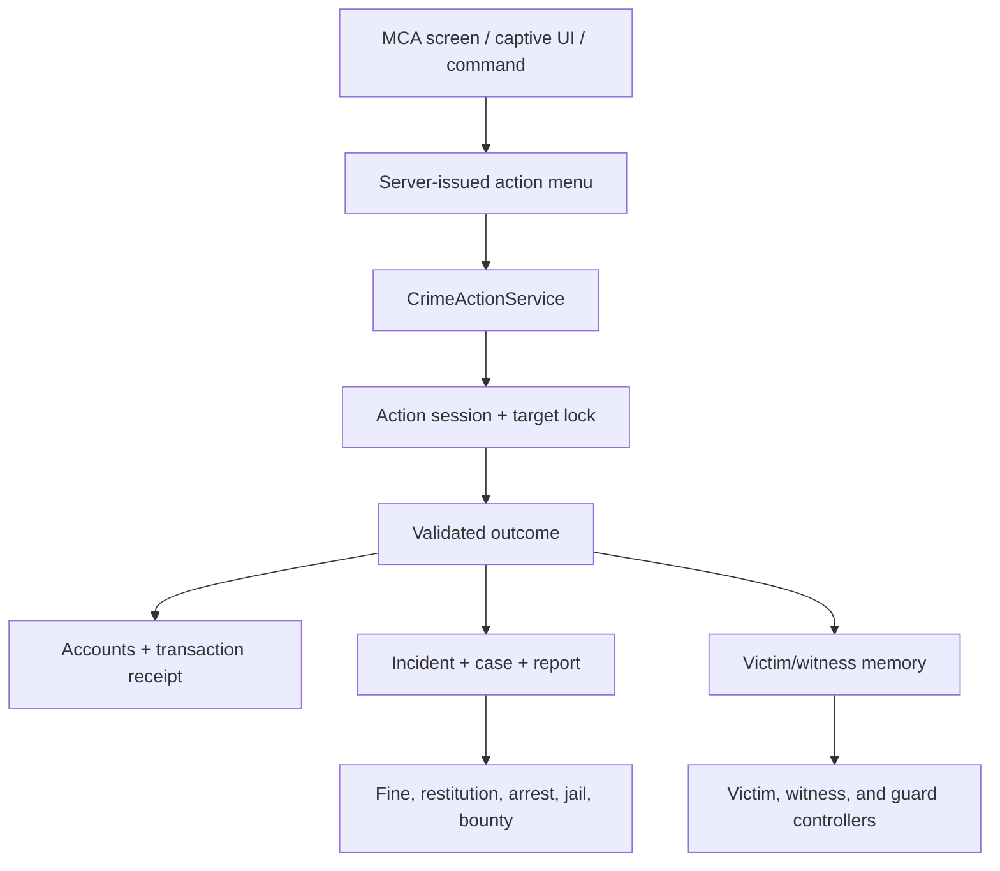
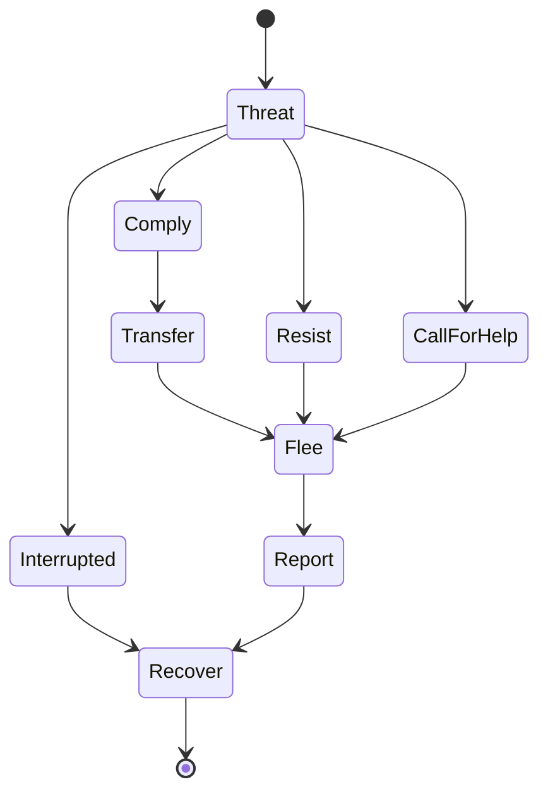

# MCA: Crime — Actions, AI, Economy, and Balance Implementation Specification

**Document type:** repository audit and implementation handoff  
**Primary target:** Minecraft 1.20.1, Forge 47.x, MCA: Crime 0.1.0  
**Audit target:** [`otectus/MCACrime` commit `5354de5`](https://github.com/otectus/MCACrime/tree/5354de5d021b20fc20be8e579ac94b8b5d174783), dated 2026-06-20  
**MCA compatibility target:** MCA Reborn `7.6.20+1.20.1`, commit [`8f85953`](https://github.com/Luke100000/minecraft-comes-alive/tree/8f859530099a379d753380a9a0beb7a74a0cd51e)  
**Prepared:** 2026-08-30  
**Intended reader:** a coding agent implementing the next major MCA: Crime release

---

## Navigation

- **Audit and requirements:** Sections 1–6
- **Action architecture and player integration:** Sections 7–10
- **AI, witnesses, law, captivity, ransom, and dialogue:** Sections 11–16
- **Economy, records, data, networking, relationships, and configuration:** Sections 17–24
- **Implementation map, phases, tests, and release gates:** Sections 25–33

---

## 1. Executive decision

MCA: Crime should stop treating player-facing crimes as instant command transactions. Commands may remain as accessibility, debugging, and administration entry points, but every gameplay action must run through one server-authoritative action engine shared by the MCA interaction screen, world interactions, captive UI, and command fallbacks.

The reported mugging exploit is real and is only one instance of a broader pattern:

- `/crime mug` selects a nearby villager, immediately creates emeralds, and has no target balance, depletion, cooldown, action time, resistance, or aftermath.
- `/crime escape` rerolls a raw probability every time it is called, making rope and normal cuffs effectively guaranteed to break through command spam.
- village-authority ransom settlement creates emeralds immediately rather than transferring finite funds.
- a captor can capture another target and overwrite their single `heldCaptiveRef`, leaving the earlier custody record orphaned.
- victim and witness behavior is mostly absent. A lone victim does not count as a witness, does not remember or report the offender, and only flees if the offender was already globally Red.
- guards jump directly from passive to attack targeting; there is no challenge, surrender, arrest, escort, investigation, or reliable stand-down.
- fines clear all Heat and reward nearby, unrelated villagers instead of resolving specific crimes and compensating actual victims.

The correct fix is a cohesive encounter system, not a collection of command cooldowns. The release should introduce:

1. a common `CrimeActionService` with explicit targets, action sessions, locks, validation, idempotency, and outcomes;
2. a “Crime…” entry in MCA’s villager interaction screen and dedicated, server-populated action/dialogue UI;
3. finite villager purses, village treasuries, escrowed transfers, and conservation checks;
4. victim memory, immediate reactions, fleeing, help-seeking, reporting, and recovery;
5. witness observations and delayed, local reports rather than a witness count alone;
6. guard investigation, challenge, arrest, escort, combat, and stand-down states;
7. crime cases that connect incidents to fines, restitution, jail, ransom, bounty, and resolution;
8. data-driven action and dialogue definitions with safe, code-bound handlers;
9. anti-repeat rules that cover the entire action class: packet replay, command spam, target farming, village farming, alternate-player collusion, and save/reload rerolls.

The minimum acceptable outcome is simple to state: locking one villager in a room and invoking any action repeatedly must never produce unbounded money, unbounded rerolls, duplicate custody, duplicate case resolution, or a motionless NPC who immediately resets to normal.

---

## 2. Audit scope and verification boundary

### 2.1 Material reviewed

The audit covered the full repository snapshot, including:

- all 100 Java files under `src/main/java`;
- all 20 test source files under `src/test`;
- common/client configuration declarations;
- all built-in crime JSON, tags, item models, and language resources;
- Gradle/build metadata and the MCA/Architectury dependency pins;
- the original `mca-crime-spec-document.md`;
- Phase 2, 3, and 4 verification checklists;
- the visible commit history and GitHub issue/commit metadata;
- MCA Reborn’s exact `7.6.20+1.20.1` interaction-screen implementation, dynamic GUI loader, packets, and server interaction handlers.

This is a repository-wide static review, not just a review of `MuggingService`.

### 2.2 Build limitation

`./gradlew test` was attempted. The environment could not download the Gradle 8.8 wrapper from `services.gradle.org` because that host was unreachable, so this review could not independently execute the test suite or build the production JAR. Treat all runtime behavior marked for GameTest or in-world verification below as unverified until CI or a normal development environment runs it.

The implementation must not use this limitation as a reason to skip tests. The first pull request should restore a reproducible CI result and retain the current tests while adding the suites specified in this document.

### 2.3 Evidence convention

Paths in this document are relative to the MCA: Crime repository unless explicitly prefixed with “MCA source.” Function and class names are preferred over brittle line numbers. All findings refer to commit `5354de5`.

---

## 3. Required player experience

The design target is an interaction loop that feels native to MCA:

1. The player opens an MCA villager interaction.
2. A context-sensitive “Crime…” entry appears alongside MCA’s normal interaction controls.
3. The server returns only the actions currently possible against that exact villager.
4. Choosing an action shows its obvious requirements and a confirmation if it is hostile or irreversible.
5. The action happens over time in the world. Distance, line of sight, movement, damage, restraint availability, victim state, and other actors can change the result.
6. The villager speaks and reacts according to personality, relationship, profession, prior encounters, nearby support, and the action outcome.
7. Money or items move from a finite source. Nothing is awarded merely because a button or command was invoked.
8. The victim flees, resists, seeks help, reports, hides, bargains, or recovers. Repeating the interaction produces memory-informed behavior, not a clean reset.
9. Witnesses store observations and attempt to report them. Guards act on reports and observed conduct, not omniscient global state alone.
10. Consequences resolve the particular case: restitution goes to the victim, fines go to the jurisdiction, sentences resolve records, and ransom payments come from an actual payer or treasury.

Commands should be a second door into that same loop. A command must never be a shorter or more profitable version of the UI action.

---

## 4. Current implementation map

### 4.1 What is already valuable and should be preserved

The repository has a useful foundation:

- `CrimeState` centralizes Karma and Heat mutation and derives bands/Wanted state.
- crime types are loaded from data packs through `CrimeTypeLoader` and `CrimeTypeRegistry`.
- serious incidents are persisted in `CrimeWorldData`.
- custody and jail are intentionally separated by legality.
- custody release is guarded so a repeated release is normally a no-op.
- capture uses a timed channel rather than instant restraint.
- MCA access is mostly isolated in `McaCompat` and uses fail-safe checks.
- packets currently flow server-to-client only, so the existing code does not trust client-side status values.
- `FakePlayer` filtering, raid grace, self-defense checks, online-time decay, and a real-time player-captivity cap are good anti-abuse primitives.
- state and math classes already have unit tests and NBT round-trip tests.

The next release should evolve these systems rather than discard them.

### 4.2 Current player-facing entry points

`CrimeCommand` registers these ordinary-player actions:

| Command | Current behavior | Required destination |
|---|---|---|
| `/crime karma`, `/crime status` | Read status | Player card/dossier; command remains read-only fallback |
| `/crime payfine` | Charges emeralds and clears Heat | Guard/authority “Settle case” interaction using specific records |
| `/crime surrender` | Reduces Heat near a broad authority test | Guard challenge/arrest flow and explicit surrender response |
| `/crime ransom` | Creates or instantly settles a demand | Captive action UI and negotiation flow |
| `/crime payransom` | Pays the first open demand found | Demand-specific payer screen with accept/counter/refuse/report |
| `/crime mug` | Instantly grants fixed emeralds from a nearby villager | Target-bound mugging encounter with purse, reaction, and aftermath |
| `/crime escape` | Rerolls escape chance | Captive screen with timed escape work and attempt state |

Operator-only query, repair, reload, jail-anchor, set, release, and debug commands should remain commands. They are administration, not diegetic gameplay.

### 4.3 Current networking and UI

`CrimeNetwork` registers only four server-to-client messages:

- `SelfStatusS2CPacket`
- `BandSyncS2CPacket`
- `BandBulkSyncS2CPacket`
- `CaptiveStatusS2CPacket`

The only substantive UI is the inventory player card. There is no C2S action request, action session, target menu, dialogue panel, progress panel, ransom choice screen, captive escape button, case list, or MCA interaction-screen extension.

### 4.4 Current AI

- `VillagerReaction.fleeFrom` paths ordinary MCA villagers eight blocks away from a player only when that player is already Red.
- `GuardEnforcement` periodically sets nearby guards’ attack target to any legal-target player.
- no victim-specific state, offender memory, help-seeking, witness reporting, surrender demand, arrest, escort, search, or stand-down state exists.

These are reactions in the narrowest technical sense, not an encounter AI.

---

## 5. Audit findings and priorities

### 5.1 P0 — exploit, duplication, or softlock risks

| ID | Finding | Evidence | Required correction |
|---|---|---|---|
| P0-01 | Mugging creates infinite emeralds | `MuggingService.mug` calls `EmeraldCurrency.grant` with `muggingBaseLoot` on every invocation | Withdraw from a finite villager purse through an idempotent transaction; per-target, per-actor, and per-village limits |
| P0-02 | Mugging has no action or repeat state | `RECENT` is only a 200-tick murder-classification marker, not a cooldown | Create an action session and victim/offender encounter memory; stamp the attempt at the point of no return |
| P0-03 | Target selection is ambiguous | `nearestVillager` chooses the nearest visible entity in an inflated AABB, not the villager whose interaction is open | Every request carries the exact target UUID from a server-issued menu session; revalidate range and sight |
| P0-04 | Escape is infinitely rerollable | `CustodyService.attemptEscape` draws a fresh random number for every call | Replace per-click RNG with timed escape work, one active attempt, cooldown, interruption rules, and restraint requirements |
| P0-05 | Village ransom mints currency | `RansomService.demand` grants the captor emeralds immediately for `VILLAGE_AUTHORITY` | Debit a finite village treasury or create an unpaid/countered demand; never call an unconditional grant |
| P0-06 | Family ransom cooldown is bypassed on demand | `cooldownsReady` is called with `payer = null` before payer resolution | Resolve the payer first, then validate all victim, payer/family, village, and captor cooldowns atomically |
| P0-07 | Captor’s one-captive invariant is not enforced | capture checks the target and active channel, then overwrites the captor’s scalar `heldCaptiveRef` | Reject a new capture if the captor owns active custody, both when the channel starts and when it commits |
| P0-08 | Dead captive cleanup is absent from the death handler | `CrimeDetectionHandlers.onLivingDeath` classifies the kill but does not release custody or cancel ransom | Release custody with `CAPTIVE_DIED`, fail linked demands, clear pointers/leashes, and close action sessions |
| P0-09 | Unloaded NPCs can be treated as gone | ransom resolution requires a currently resolved live entity; NPC virtualization config is unused | Distinguish dead, unloaded, and missing; use persistent custody/profile state for unloaded NPCs |
| P0-10 | Payment is only partially transactional | player debit, state flip, captor grant, ledger write, release, and removal are separate side effects | Add a transaction journal/receipt and idempotent resume or compensation path |
| P0-11 | Player captives can remain held after the captor logs out | player kidnapping defaults on, the default cap is 360 online minutes, and login reconciliation treats any non-null owner UUID as valid even when that captor is offline | Add a short captor-disconnect grace for player captives and reconcile elapsed offline state on login |

### 5.2 P1 — systems that make commands feel detached

| ID | Finding | Evidence | Required correction |
|---|---|---|---|
| P1-01 | No MCA interaction-screen integration | no client class references MCA’s `InteractScreen`; no crime action UI resources | Inject one compatibility-gated entry button and open the mod-owned action panel |
| P1-02 | Gameplay commands call services directly | `CrimeCommand` routes straight to `FineService`, `SurrenderService`, `RansomService`, `MuggingService`, and `CustodyService` | Route all entry points through `CrimeActionService` and identical validation |
| P1-03 | No dialogue for crime encounters | current language entries are mostly system/action-bar messages | Add conditional dialogue pools for openings, reactions, outcomes, reports, arrest, ransom, and recovery |
| P1-04 | No player feedback during channels | capture repeats one generic action-bar string; mug/ransom are instant | Sync state, progress, interruption reason, selected target, and outcome without revealing exploitable hidden values |
| P1-05 | Captive UI is declared but inert | `captiveScreenToggle` is marked reserved and cap sync is not rendered | Implement captive panel with restraint, captor, time cap, escape work, negotiate, and call-for-help actions |
| P1-06 | Status data is not a case system | player card shows aggregate Karma/Heat only | Add a case/dossier view showing known jurisdiction, charges, fine/restitution, warrant, and resolution options |

### 5.3 P1 — AI and legal coherence gaps

| ID | Finding | Required correction |
|---|---|---|
| P1-07 | A mugged villager does not specifically flee | Start a victim reaction immediately on threat/outcome, regardless of global band |
| P1-08 | A sealed-room victim is a reusable dispenser | Deplete purse, block repeat payout, preserve memory, seek a reachable safe point, and report when able |
| P1-09 | The victim cannot report their own crime | Store the victim as a direct observer and create a pending report even with zero third-party witnesses |
| P1-10 | Witnesses are anonymous counts | Persist observation identity, confidence, report state, location, action, actor, and victim |
| P1-11 | Witnesses do not flee, report, or gossip | Add active witness reaction states and bounded local knowledge propagation |
| P1-12 | Guards attack immediately | Add investigate → challenge → surrender window → arrest/escort or combat escalation |
| P1-13 | Guard targets may remain stale | Clear targets and crime controller state when legal targeting ends or jurisdiction changes |
| P1-14 | Law is global despite village reputation data | Associate incidents and reports with a jurisdiction; propagate only through configured gossip/authority channels |
| P1-15 | Ordinary villagers can be captured under a relaxed default | Require vulnerability, prior successful coercion, or an explicit compliance outcome by default |
| P1-16 | Capture ignores target resistance during the channel | Allow movement, attack, ally intervention, scream, and resistance to interrupt or change the channel |

### 5.4 P1 — balancing and case-resolution gaps

| ID | Finding | Required correction |
|---|---|---|
| P1-17 | Fines depend on current Heat, not offenses | Assess specific unresolved records and apply Heat changes as an outcome of resolution |
| P1-18 | Fine restitution rewards unrelated nearby villagers | Credit the actual victim or a persisted victim claim; family/village effects are separate and bounded |
| P1-19 | Paying a fine does not resolve ledger records | Make resolution mutable through a controlled case service and retain payment receipts |
| P1-20 | Ransom settlement writes another unresolved `kidnap` entry | Record `extortion`/`ransom` as a linked offense/outcome; do not duplicate the original kidnapping semantics |
| P1-21 | Payer selection ignores affordability and identity conflicts | Exclude captor/victim, check funds, support NPC/treasury payers, and create explicit fallback outcomes |
| P1-22 | Adult-child gating is hard-coded true | Resolve age through `McaCompat.isAdult` for loaded entities and persisted MCA/profile data where available |
| P1-23 | Positive-reward anti-farm config is not wired | Apply daily caps and diminishing returns to trade/gift/defense/restitution rewards before expanding rewards |
| P1-24 | Restraints have no survival cost | Add recipes, durability/consumption, reservation during capture, keys/lockpicks, recovery, and break behavior |
| P1-25 | Several action-critical timings are hard-coded | Move mug reach/window and the 1,200-tick surrender vulnerability into action/config definitions and validate them |

### 5.5 P2 — extensibility, scale, and completeness

- `CrimeType` carries only Karma, Heat, witness multiplier, and an informational victim tag. It cannot express attempt/completion phases, severity, stolen value, fines, jail, reportability, restitution, repeat scaling, or legal response.
- `CrimeLedger` is append-only and `CrimeRecord` is immutable. Resolution exists as a field but has no update path.
- ledger lookup and duplicate detection are linear; the ledger and cooldown maps have no pruning/archive policy.
- many declared configuration fields are inert, including NPC crime, bail, profession death drops, global propagation, protected/responding entity lists, close-friend ransom, virtual NPC custody, witness trust loss, restitution fraction, several relationship rewards, and captive UI.
- the public event API has post-change events but no cancellable pre-action, action result, witness report, arrest, negotiation, or economic transaction events.
- all offender flows assume `ServerPlayer`, blocking the planned NPC-crime phase from reusing the engine.
- no survival recipes exist for the restraint items.
- current tests focus on pure math and NBT; they do not exercise service integration, packets, AI, menus, transactions, or exploit scenarios.

---

## 6. Non-negotiable invariants

These invariants should be encoded as assertions, unit tests, GameTests, and administrative validation output.

### 6.1 Action invariants

1. One actor has at most one active gameplay action session.
2. One target is locked by at most one mutually exclusive hostile action at a time.
3. Every targeted action is bound to an explicit target UUID and dimension.
4. A UI menu is advice, not authority. The server reevaluates availability when an action starts and every tick where context can change.
5. The point of no return is explicit. Attempts, cooldowns, and crimes are recorded at that point, not only on profitable success.
6. Replaying a request nonce returns the prior result and does not repeat side effects.
7. Disconnect, death, dimension change, pack reload, and server restart have defined cancellation or recovery behavior.
8. A command invokes the same action handler and cannot bypass target, time, cost, cooldown, or reaction rules.

### 6.2 Economy invariants

1. For every completed transfer, total debits equal total credits plus an explicitly configured sink.
2. Mugging cannot credit more than the target purse debit.
3. Ransom cannot credit more than the payer/treasury debit.
4. A failed or canceled action cannot create loot.
5. A full player inventory either receives a protected overflow drop exactly once or leaves the source balance unchanged.
6. A transaction ID can commit once.
7. Player-, victim-, and village-window caps apply before credit.
8. Initial virtual balances and regeneration are bounded and documented economic faucets; ordinary action calls are not faucets.

### 6.3 Custody invariants

1. A captive has zero or one active custody record.
2. With the default single-captive setting, a captor owns zero or one active unlawful custody record.
3. `heldCaptiveRef` and `heldByRef` are caches reconciled from the authoritative custody table, never the source of truth.
4. A dead captive has no active custody or ransom.
5. An unloaded NPC may remain in virtual custody; unloaded is not equivalent to dead.
6. Releasing custody clears every pointer, action session, pending demand, leash/restraint controller, and client state exactly once.
7. Escape from unlawful custody never creates a crime; escape from lawful jail follows jail rules.

### 6.4 Legal and memory invariants

1. An incident can exist without an immediate police report.
2. A direct victim remembers the actor even when no third-party witness exists, subject only to a future disguise/identity system.
3. Heat is created by observation/report/enforcement rules; Karma and victim memory may change without a report.
4. Jurisdiction knowledge is local unless a configured propagation path carries it.
5. A resolved fine, sentence, pardon, or restitution updates specific cases; it never blindly erases unrelated records.
6. Guard force ends when the legal basis ends. Controllers must clear vanilla/MCA attack targets on stand-down.

---

## 7. Target architecture



### 7.1 Core types

Create `dev.otectus.mcacrime.action` with these core types:

```java
public record CrimeActionRequest(
        UUID requestNonce,
        UUID menuSessionId,
        int menuRevision,
        ResourceLocation actionId,
        UUID targetId,
        ResourceLocation targetDimension,
        CompoundTag parameters
) {}

public record ActionContext(
        CrimeActor actor,
        LivingEntity target,
        ServerLevel level,
        long gameTime,
        ActionDefinition definition,
        VillagerCrimeProfile targetProfile,
        JurisdictionRef jurisdiction
) {}

public interface CrimeActionHandler {
    ActionAvailability evaluate(ActionContext context);
    ActionStartResult start(ActionContext context, CrimeActionRequest request);
    ActionTickResult tick(ActionSession session, ActionContext context);
    void cancel(ActionSession session, CancelReason reason);
}
```

Supporting types:

- `CrimeActor`: an abstraction over player or NPC actor identity, state, inventory/account, and legal status. Implement `PlayerCrimeActor` first. Do not expose MCA classes in its public API.
- `ActionDefinition`: data-loaded presentation, requirements, timing, crime phases, handler ID, and balance parameters.
- `ActionAvailability`: `AVAILABLE`, `HIDDEN`, or `BLOCKED`, plus a stable reason code and translatable arguments.
- `ActionSession`: server-only session ID, request nonce, actor, target, definition snapshot, phase, start position, start time, progress, target lock, reserved item, deterministic seed, and any handler payload.
- `ActionSessionManager`: one session per actor, target lock index, TTL cleanup, disconnect/death hooks, and session tick.
- `ActionMenuSession`: short-lived server-issued authorization context binding actor, target, dimension, and revision. It is not permission to skip later validation.
- `ActionResult`: stable result code, dialogue event, incident IDs, transfer receipt IDs, reaction state, and non-sensitive UI summary.
- `ActionHandlerRegistry`: a code allowlist mapping handler IDs such as `mcacrime:mug` to implementations. Data packs may configure registered handlers but may not name arbitrary Java classes.

### 7.2 Chokepoints

Only these services may write their corresponding state:

| State | Sole writer |
|---|---|
| Action sessions and locks | `ActionSessionManager` |
| Villager purse / treasury / escrow balances | `EconomicTransactionService` |
| Crime incidents and case resolution | `CrimeCaseService` |
| Victim/offender memories and pending reports | `CrimeMemoryService` |
| Custody table and cached pointers | `CustodyService` |
| Ransom demand lifecycle | `RansomService`, internally using transaction/custody chokepoints |
| Guard encounter state | `GuardEncounterService` |
| Karma and Heat | retain `CrimeState`, called by incident/report/case services |

Do not let action handlers directly grant items, mutate Heat, append raw records, or write custody maps. Handlers request typed effects from the chokepoints.

### 7.3 Action lifecycle

Every action uses the same phases:

1. **Menu evaluation** — calculate visible and blocked actions for the current target.
2. **Start validation** — validate the C2S packet, menu binding, target, state, range, line of sight, item, cooldowns, and locks.
3. **Reservation** — reserve but do not consume required items/currency; lock actor and target.
4. **Point of no return** — after confirmation and the first overt act, stamp the attempt, create any attempt-level incident, and choose a deterministic reaction seed.
5. **Channel/encounter** — tick progress and reevaluate interruption conditions. Victim and witnesses may react during this phase.
6. **Outcome** — compute the outcome once. Apply transfer, incident, relationship, memory, and AI effects in a fixed order.
7. **Cleanup** — release reservations and locks; cache the result by nonce; sync the UI.
8. **Aftermath** — victim/witness/guard controllers continue independently of the closed action session.

The fixed outcome order should be:

```text
validate final context
→ prepare economic/custody effects
→ persist transaction/custody intent
→ commit the effect
→ create/link incident and case records
→ update victim/witness memory
→ start aftermath AI
→ fire post-result events
→ send client result
→ release action locks
```

If the action is canceled before the point of no return, it normally has no criminal/economic effect. If canceled afterward, the attempted offense and memories remain even if no payout or capture occurred.

### 7.4 Action completeness contract

No handler may be registered until its implementation and definition answer every row below. This is the primary guard against adding another instant, isolated command later.

| Concern | Required declaration/behavior |
|---|---|
| Entry points | MCA interaction, captive/world UI, command fallback, NPC AI, or explicit subset |
| Target | exact target type, UUID resolution, dimension, range, line of sight, age/role rules |
| Authority | lawful, criminal, suspicious, or context-dependent; who may perform it |
| Requirements | items, currency, vulnerability, custody, relationship, profession, case, free hands |
| Reservation | what is locked/reserved at start and when it is consumed/released |
| Point of no return | exact phase that records attempt/cooldown/crime/memory |
| Duration | channel/work time, progress model, and tick interval |
| Interruptions | actor/target movement, damage, sight, death, disconnect, unload, dimension, intervention |
| Outcome | deterministic inputs/RNG seed, result codes, and single application rule |
| Economy | finite debit account, maximum credit, caps, overflow, transaction purpose |
| Repetition | actor, target, pair, family, village, and daily windows; repeat escalation |
| Victim AI | immediate reaction, safe goal, memory, refusal/recovery behavior |
| Witnesses | sight/hearing stimulus, reportability, noise, guard-direct behavior |
| Legal effects | attempt/completion charges, value, jurisdiction, case/fine/jail mapping |
| Dialogue | opening, blocked, interrupted, success, failure, repeat, aftermath fallbacks |
| Cleanup | cancel, success, death, logout, chunk unload, server stop/restart, data reload |
| API | pre/post events and stable query/result exposure where applicable |
| Tests | unit, race/replay, GameTest, multiplayer abuse, compatibility/manual matrix |

`/crime validate` should report an action as unsafe/incomplete if a required category is absent. Built-in actions must pass the same validation as data-pack actions.

---

## 8. MCA interaction-screen integration

### 8.1 Exact compatibility finding

MCA Reborn `7.6.20+1.20.1` uses:

- MCA source `net.mca.client.gui.InteractScreen` (relocated to `forge.net.mca...` in the Universal Forge JAR);
- `AbstractDynamicScreen#setLayout` to clear and rebuild child widgets;
- `MCAScreens`, a JSON loader for `assets/*/api/gui/*.json`;
- `InteractScreen#buttonPressed` to route known local layout transitions or send MCA’s `InteractionVillagerMessage`.

Third-party JSON can define a separate layout because `MCAScreens` loads all namespaces and keys by path, but it does not merge a third-party button into MCA’s existing `main.json` or `interact.json`. Overriding `assets/mca/api/gui/main.json` would replace the whole resource and create resource-pack/mod conflicts. Sending a new MCACrime identifier through MCA’s `InteractionVillagerMessage` would reach a server handler that does not know the action.

Therefore, do not replace MCA layout JSON and do not piggyback on MCA’s action packet.

### 8.2 Recommended bridge

Implement a small, client-only compatibility bridge:

1. Add `mcacrime.mixins.json` and a refmap.
2. Target the relocated production classes used by the existing dependency (`forge.net.mca.client.gui.*`). Keep all references in `compat/mca/client`.
3. Inject at the return of MCA `AbstractDynamicScreen#setLayout`.
4. If the screen instance is `InteractScreen` and the active layout is `main` or `interact`, add one ordinary, narrated `Button` labeled `gui.mcacrime.actions`.
5. Use a narrow accessor mixin for `InteractScreen.villager` to read only the target UUID.
6. Clicking the button sends `RequestActionMenuC2SPacket(targetUuid)` and opens `CrimeInteractionScreen` after the server responds.
7. All crime action packets use `CrimeNetwork`; do not send MCA’s `InteractionVillagerMessage`.
8. Preserve the original `InteractScreen` instance as the parent. Back returns to it and refreshes MCA interaction data. If the target is gone, hostile, fleeing, captive, dead, or out of range, close instead.

Use a real widget, not a render-only hotspot. It must support keyboard focus, narration, GUI scale, localization, and controller mods.

### 8.3 Compatibility containment

Create:

```text
compat/mca/client/McaInteractionScreenBridge.java
compat/mca/client/InteractScreenAccessor.java
compat/mca/client/AbstractDynamicScreenMixin.java
client/screen/CrimeInteractionScreen.java
client/screen/CrimeConfirmationScreen.java
```

Register the config in the JAR manifest (`MixinConfigs: mcacrime.mixins.json`) and use Java 17 compatibility plus a generated refmap. Keep this compatibility config non-required and set the UI injection itself to `require = 0`; the bridge method should set a runtime “applied” flag that the compatibility probe checks. Gameplay-critical mixins elsewhere should not inherit this leniency. Verify the exact ForgeGradle/Mixin annotation-processor setup in the production build rather than hand-writing an empty refmap.

The mixin should call only a stable bridge method. No gameplay service may import an MCA client class.

Add a runtime compatibility probe that verifies the target mixin applied. On failure:

- log one clear warning including the detected MCA version;
- leave gameplay enabled;
- retain an optional Shift+right-click fallback and command fallback;
- never crash a dedicated server or block normal MCA interaction.

Because `mods.toml` currently allows MCA `[7.6,8)`, CI must test the lowest supported version and the exact recommended version. If the bridge cannot be made tolerant across that range, narrow the declared version range rather than silently shipping a broken button.

### 8.4 Action screen behavior

The server returns a menu grouped into:

- **Coerce:** threaten, pickpocket, mug, extort, intimidate/bribe witness;
- **Restrain:** restrain/kidnap, search a captive, move/secure/release a captive;
- **Resolve:** apologize, offer restitution, report a crime, rescue, lawful arrest, settle a case;
- **Special:** relationship-, profession-, case-, or pack-defined actions.

The client receives presentation IDs and availability summaries, not authoritative rules. Each row should show:

- localized action name and description;
- broad legality marker: lawful, suspicious, criminal, or context-dependent;
- obvious requirement markers such as restraint, key, free hand, target vulnerable, or authority role;
- channel duration category: quick, short, long;
- a blocked reason when the server chooses to expose one.

Do not show exact compliance rolls, exact hidden purse balance, witness confidence, or guard response probability. Use qualitative text such as “They look alert” or “They appear to have nothing worth taking.”

Hostile actions require a confirmation by default. A client option may suppress repeated confirmations, but that setting does not change server validation.

### 8.5 Command compatibility

Replace direct command calls with adapters:

```java
CrimeActionService.startFromCommand(player, ActionIds.MUG, ExplicitTarget.rayTrace(player));
```

Rules:

- a targeted command performs an exact server ray trace or requires an explicit UUID for operators;
- it starts the same channel and dialogue outcome as the UI;
- it cannot run while another screen/action session has a conflicting target lock;
- it uses the same request throttling and nonce cache;
- it gives no hidden convenience bonus;
- ordinary commands may be disabled with `allowGameplayCommandFallback`, default `true` for accessibility during the transition, with a deprecation message configurable off;
- operator repair/debug commands bypass gameplay UI but must still call safe administrative methods, not raw map edits.

---

## 9. Mugging redesign

### 9.1 Desired encounter

Mugging is an overt, target-bound threat with a finite possible payout and persistent aftermath. It is not an emerald reward button.



### 9.2 Eligibility

Default mugging availability:

- actor is a living, non-spectator player;
- exact target is a living adult MCA villager;
- `enableMugging=true`;
- actor and target are in the same dimension, within 4.0 blocks, with line of sight;
- neither is in lawful/unlawful custody unless a separate captive-extortion action allows it;
- target is not already in an exclusive hostile action, panic, arrest, or combat state that blocks conversation;
- actor is not jailed, captive, surrendering, or already channeling;
- target has not been mugged by this actor inside the attempt cooldown;
- actor has not hit the daily mugging action cap;
- actions against children are hidden by default (`allowHostileActionsAgainstChildren=false`);
- guards use a distinct high-risk handler or are blocked by default rather than behaving like normal villagers.

Cooldown checks must not reveal exact wealth. A victim with no money may still be threatened once and respond, but cannot pay.

### 9.3 Villager purse

Add a persisted `VillagerPurse` to `VillagerCrimeProfile`, stored by villager UUID in world data so chunk unload does not reset it:

```java
record VillagerPurse(
        int balance,
        int capacity,
        int dailyIncome,
        long lastRefillDay,
        ResourceLocation wealthProfile,
        long revision
) {}
```

Do not use MCA trade offers as if they were an inventory. A bounded virtual purse is more predictable and does not break trading. It is an explicitly controlled economic faucet only when initially seeded or refilled.

Default wealth profiles:

| Profile | Typical targets | Capacity | Initial balance | Lazy daily refill |
|---|---|---:|---:|---:|
| `none` | children; config-disabled targets | 0 | 0 | 0 |
| `poor` | unemployed/nitwit | 2 | 0–1 | 0–1 |
| `worker` | ordinary employed villager | 5 | 1–3 | 1 |
| `merchant` | trading professions | 8 | 2–5 | 1–2 |
| `authority` | mayor/monarch/wealthy pack role | 12 | 4–8 | 2 |
| `guard` | guard | 3 | 0–2 | 1 |

Profiles are data driven and selected through profession tags/IDs in `McaCompat`. Refill lazily on first access after dawn:

```text
newBalance = min(capacity, oldBalance + dailyIncome)
```

Do not grant catch-up income for every unloaded day. One access after 100 days may refill to capacity, never accumulate 100 days of emeralds.

### 9.4 Payout and anti-farm limits

On a compliant outcome:

```text
transfer = min(
    target purse balance,
    action max per success,
    actor daily stolen-value remaining,
    jurisdiction daily stolen-value remaining
)
```

Recommended defaults:

| Setting | Default |
|---|---:|
| Threat channel | 60 ticks |
| Maximum per successful mug | 4 emeralds |
| Same actor/target attempt cooldown | 24,000 ticks |
| Victim global recovery cooldown after successful loss | 12,000 ticks |
| Actor successful mug cap per day | 4 |
| Actor stolen emerald cap per day | 12 |
| Village stolen emerald cap per day | 24 |
| Victim fear memory | 7 in-game days |
| Immediate panic duration | 600 ticks |
| Repeat-offense lookback | 7 in-game days |

All caps apply at attempt/transfer time on the server. A zero transfer is a valid result (“I have nothing”), still creates any applicable threat/attempt incident, memory, and reaction, and never calls `grant`.

The source purse is debited and player inventory credited through one transaction ID. If inventory insertion cannot be guaranteed, abort before debit or create one owner-protected overflow item linked to the transaction receipt.

### 9.5 Reaction calculation

Use a deterministic server-side roll per encounter so reconnecting or packet-spamming cannot reroll. Seed with the persisted encounter ID, actor UUID, target UUID, and target encounter counter—not client time.

Inputs are normalized to `0..1`:

- `T`: visible threat from held item tags, armor, health, and allies;
- `A`: actor physical advantage;
- `I`: isolation, reduced by guards/allies within support range;
- `F`: target’s existing fear of this actor;
- `B`: bravery/personality;
- `G`: guard/support confidence;
- `R`: ability to resist, including profession/combat role and health.

Suggested score:

```text
score = -0.40 + 1.20T + 0.35A + 0.25I + 0.50F - 1.10B - 0.60G - 0.30R
p(compliance) = clamp(0.10, 0.90, sigmoid(score))
```

Special rules override the formula:

- guard: never complies unless low-health/surrender context explicitly permits;
- child: not targetable by default;
- currently fleeing/reporting: refuses interaction;
- purse balance `0`: may feign compliance but transfers `0`;
- repeated attempt inside cooldown: no payout, immediate avoidance/report behavior;
- target has a successful prior resistance and nearby support: strong resistance bonus;
- actor attacked the target during the channel: cancel mug and classify physical harm separately.

Keep coefficients in a balance JSON or config and clamp inputs. Tests must assert monotonicity: more threat must not lower compliance, more support must not raise it, and no value may produce NaN or a chance outside bounds.

### 9.6 Victim response and sealed-room behavior

Every overt mug attempt creates a victim memory at the point of no return. After the outcome, the victim should:

1. break normal interaction and trading with the offender;
2. move away immediately;
3. choose the best reachable safe goal: nearest known guard, occupied public building, home, village center, allied adult, or simply the farthest reachable navigation node;
4. shout for help if a responder is within hearing range;
5. create a pending direct-victim report;
6. refuse another hostile interaction from the same actor for the cooldown;
7. retain fear/anger and altered dialogue after panic ends.

If the villager is physically sealed in a room:

- do not teleport through walls merely to defeat the farm;
- attempt multiple reachable safe nodes with a bounded path-failure count;
- fall back to the farthest reachable point, face/avoid the offender, and call for help;
- keep the purse depleted and repeat lock active;
- keep the pending report until a guard/villager is heard/reached or until a configured expiry;
- optionally let guards investigate the last known location if a shout was heard;
- never pay again just because navigation failed.

This makes confinement tactically meaningful without making it an infinite currency machine.

### 9.7 Mugging crime records

Define distinct, linked offenses:

- `threaten_villager`: committed when the overt threat begins;
- `robbery`: committed when value is taken through threat;
- `attempted_robbery`: optional compact record when threat completes but no value transfers for a reason other than empty purse;
- `mugging_assault`: physical harm during the encounter;
- `mugging_murder`: death within the encounter/aftermath window.

One `CrimeIncident` may contain multiple charge components. Do not append unrelated duplicate records. Link all components through `incidentId` and `actionSessionId`.

The current 200-tick `RECENT` map should be replaced by a persisted or safely transient `EncounterLink` with explicit start/end times and cleanup on death, logout, cancellation, and timeout.

---

## 10. Expanded action catalog

The goal is not to ship every action at once. The goal is to ensure all future actions use the same action, AI, memory, economy, and legal systems.

### 10.1 Criminal person-to-person actions

| Action | Core loop | Finite source/cost | Typical reaction | Crime components | Release priority |
|---|---|---|---|---|---|
| Threaten | short overt channel; demand retreat/information/compliance | attempt cooldown; target fear tolerance | comply, defy, flee, call help | intimidation/threat | P1 |
| Pickpocket | stealth channel requiring proximity and target distraction | target purse; actor daily theft cap | unaware, notice, accuse, call guard | theft/attempted theft | P3 |
| Mug | overt threat and demand purse | target purse; caps | comply, resist, flee, report | threat + robbery | P1 |
| Extort | demand a bounded payment or future protection payment | target/business account; long cooldown | bargain, refuse, report | extortion | P3 |
| Restrain/kidnap | vulnerability/compliance plus timed restraint | restraint durability/consumption | resist, scream, allies intervene | attempted kidnap + kidnap | P1 |
| Demand ransom | create a demand for an existing captive | payer/treasury account; cooldowns | negotiate, refuse, report, rescue response | extortion linked to kidnap | P2 |
| Intimidate witness | attempt to delay a pending report | attempt cap; increases suspicion | submit, lie, flee, report immediately | witness intimidation | P3 |
| Bribe witness | offer actor-owned currency | actor debit; witness corruption tolerance | accept, refuse, report bribe | bribery when illegal | P3 |
| Bribe guard | offer actor-owned currency during challenge | actor debit only if accepted; strict cap | arrest, accept corruptly, increase charges | bribery | P4 |
| Search captive | timed inventory/contraband inspection | target inventory; authority context | comply/resist | robbery if unlawful | P3 |
| Coerce information | request rumor/location/family information | no direct money; memory cooldown | truth, lie, refuse, flee | intimidation | P4 |

An accepted bribe must never delete an already authoritative record. It may delay or lower the confidence of one witness report, create a corrupt-guard state, or alter a local response. Direct evidence and other reports remain.

### 10.2 Lawful and restorative actions

| Action | Availability | Outcome |
|---|---|---|
| Report crime | actor has an observation or victim statement; target is guard/authority | creates/updates local report and case |
| Ask about incident | relationship/reputation permits | returns rumors known to this NPC, not global hidden state |
| Apologize | victim remembers actor; action not in immediate panic | may reduce anger slightly; cannot erase case or stolen value |
| Offer restitution | unresolved victim loss; actor has funds/items | transfers to actual victim claim and updates resolution progress |
| Release captive | actor owns unlawful custody | clears custody without ransom; affects victim/family memory |
| Rescue captive | actor can safely reach captive/restraint | timed unlock/cut action; lawful for unlawful custody |
| Surrender | guard has challenged actor or authority interaction is active | starts arrest/case-settlement flow; no magic Heat wipe |
| Pay assessed fine | authority has one or more finable cases | debits actor, allocates restitution/treasury, resolves selected records |
| Turn self in | actor has warrant/open serious case | authority begins lawful custody and sentence calculation |
| Lawful arrest | actor is authorized and target has arrest basis | challenge, surrender, restraint, escort; abuse is a crime |
| Turn in bounty | target/custody matches an issued bounty | one idempotent claim paid by issuer treasury |

### 10.3 Captive actions

The captive panel should expose context-sensitive actions:

- struggle/escape;
- use lockpick or key if possessed and permitted;
- call for help;
- negotiate release;
- view captor, restraint, lawful/unlawful status, and real-time cap;
- accept/refuse a captor’s proposal when player agency is required;
- wait/close.

No captive action should require typing a command.

### 10.4 World actions

Actions involving blocks or property should be world interactions rather than villager-menu entries:

- burglary of a claimed container;
- vandalism/property damage;
- trespass in a claimed home/business;
- jail tampering and breakout assistance;
- destruction/removal of restraints or jail fixtures;
- evidence pickup or concealment.

They still use `CrimeActionService` when timed or transactional, and they create observations/cases through the same incident pipeline.

### 10.5 NPC-performed actions

NPC crime should be built only after `CrimeActor` no longer assumes `ServerPlayer`. NPCs must use the same:

- eligibility and target locks;
- finite purses/treasuries;
- observations and reports;
- cases and consequences;
- cooldowns and idempotent outcome rules.

Do not create a separate “fake” NPC-crime simulator that bypasses the economy or witness systems. A simulated off-screen incident may use abstract actors and accounts, but it must conserve value and create the same record shape.

---

## 11. Villager AI and memory

### 11.1 Persistent memory model

Add a world-persisted `VillagerCrimeProfile` keyed by MCA villager UUID:

```java
final class VillagerCrimeProfile {
    int schemaVersion;
    UUID villagerId;
    VillagerPurse purse;
    Map<UUID, OffenderMemory> offenderMemories;
    List<PendingObservation> observations;
    @Nullable ActiveCustodySummary custodySummary;
    long lastKnownAliveGameTime;
}

record OffenderMemory(
    UUID offender,
    ResourceLocation lastAction,
    long lastEncounterTime,
    int encounterCount,
    float fear,
    float anger,
    int trustDamage,
    long stolenValueOutstanding,
    ReportState reportState,
    long expiresAt
) {}
```

Limits:

- at most 16 offender memories per villager by default, LRU-pruned except records linked to unresolved serious cases;
- at most 8 pending observations per villager;
- fear and anger decay lazily and clamp to `0..1`;
- stolen-value claims and unresolved-case links do not silently expire with cosmetic memory;
- loaded/unloaded state never resets the profile;
- death closes active reactions, custody, and pending ransom, but serious case evidence remains in world data.

### 11.2 Active reaction state machine

Use a bounded server-side controller only for villagers with an active reaction. Do not scan every MCA villager every tick.

States:

| State | Purpose | Exit conditions |
|---|---|---|
| `CALM` | no active controller; normal MCA AI owns behavior | crime stimulus or memory trigger |
| `THREATENED` | face actor, choose response, optional dialogue | comply, resist, flee, interruption |
| `COMPLYING` | brief surrender/payment animation and transfer gate | transfer complete/fails |
| `RESISTING` | shove, move, defend, or break channel | safe distance, combat, help arrival |
| `FLEEING` | navigate to selected safe destination | destination, timeout, path failure threshold |
| `SEEKING_HELP` | approach guard/authority/allied adult | responder reached or timeout |
| `REPORTING` | deliver a pending observation | report accepted, rejected, or interrupted |
| `HIDING` | remain at home/safe building and avoid offender | panic expiry or guard escort |
| `RECOVERING` | resume most MCA behavior but refuse/alter offender interaction | recovery timeout; memory remains |
| `CAPTIVE` | suppress incompatible movement and expose captive reactions | release, death, lawful transfer |

Reaction transitions should be event-driven. Tick active controllers every 5 ticks by default and navigation every 10 ticks unless urgent.

### 11.3 Coexisting with MCA AI

MCA’s villagers use their own brain/behavior systems. A continuous external `setTarget` or `moveTo` call can fight MCA sensors and produce jitter. Keep integration behind `McaCompat` and use the least invasive verified hook.

Recommended staged implementation:

1. For 7.6.20, implement an `ActiveCrimeReactionController` that owns navigation only while a reaction is active.
2. On state entry, use a compatibility method to stop incompatible navigation/interaction and remember whether the target was trading, following, staying, sleeping, or working where safely observable.
3. Reissue path only when the destination changes, path ends, or a bounded retry interval elapses.
4. On state exit, clear the controller’s navigation/attack target and let MCA recompute normal activity. Do not attempt to restore private MCA brain internals blindly.
5. If a verified MCA memory/behavior extension point is available, migrate state-specific behavior into it behind the adapter.

`McaCompat.makeVillagerFlee` should become a lower-level navigation helper, not the complete reaction API.

### 11.4 Safe-destination selection

Score reachable candidates instead of always choosing a point eight blocks directly away:

```text
score = distanceFromThreat
      + responderSafety
      + occupiedBuildingSafety
      + homeFamiliarity
      - pathCost
      - dangerNearDestination
```

Candidate order:

1. guard/authority known and reachable;
2. public occupied building or village center;
3. home/bed;
4. allied adult/family member;
5. farthest reachable navigation sample away from actor.

Use bounded sampling and path attempts. Never perform an unbounded POI search on the server thread.

### 11.5 Personality, relationship, profession, and history

Expose a `ReactionFactors` adapter. If MCA traits/personality APIs are verified, map them to generic factors rather than scattering MCA enum checks through handlers:

- bravery;
- sociability/help-seeking;
- lawfulness;
- greed/corruptibility;
- loyalty to actor;
- loyalty to victim/village;
- combat confidence.

Fallback values must be deterministic and safe if MCA data is unavailable.

History should matter:

- first threat: surprise/fear;
- repeat threat: immediate recognition, lower interaction tolerance, faster report;
- prior successful resistance: confidence bonus;
- prior severe harm: strong avoidance and long memory;
- restitution/apology: anger may fall, but fear and case status recover separately;
- close relationship betrayal: larger trust loss and specialized dialogue;
- Red/Wanted reputation: changes initial caution, but does not replace direct memory.

---

## 12. Witnesses, observations, and reports

### 12.1 Replace `countWitnesses`

`WitnessChecker.countWitnesses(level, victim)` loses every fact needed for believable AI. Replace it with an observation service:

```java
record CrimeObservation(
    UUID observationId,
    UUID incidentId,
    UUID observerId,
    ObserverRole role,
    UUID suspectedActorId,
    @Nullable UUID victimId,
    ResourceLocation actionId,
    ResourceLocation dimension,
    BlockPos location,
    long observedAt,
    float confidence,
    boolean sawActor,
    boolean sawAct,
    boolean heardAct,
    ReportState reportState
) {}
```

`ObserverRole` includes `DIRECT_VICTIM`, `EYEWITNESS`, `HEARING_WITNESS`, `GUARD`, and future `EVIDENCE_ONLY`.

### 12.2 Observation rules

At the point of no return and at important outcome moments:

- direct victim gets an observation with high identity confidence if the action was face-to-face;
- third parties need line of sight to the actor and/or relevant act, not merely the victim;
- a scream or loud struggle can create a hearing observation inside a smaller, obstruction-aware radius;
- sleeping, unconscious, dead, captive, panicking, very young, or otherwise incapable NPCs may have reduced/zero reporting ability;
- witnesses already fleeing may still retain what they saw;
- configured responder entity tags are honored;
- the observation captures exact identities. Later code may count observations for legacy events.

Do not add Heat solely because an observation object exists. Heat/report timing depends on crime type and whether a guard/authority directly saw it or receives a report.

### 12.3 Reporting flow

1. Direct guard observation may create an immediate authoritative report and start a challenge.
2. A civilian eyewitness enters `FLEEING` or `SEEKING_HELP` with a pending report.
3. Reaching a guard/authority changes the report to `FILED`, creates/updates a local case, and applies report-driven Heat.
4. A hearing-only witness may report lower confidence, causing investigation rather than immediate arrest.
5. If the witness cannot path to help, the report remains pending and may be shared with another villager through a bounded local conversation/gossip event.
6. Intimidation or bribery may delay one pending report but cannot erase other observations or already filed reports.
7. Reports expire or lose confidence according to crime severity; direct victim claims and serious crimes persist longer.

### 12.4 Jurisdiction and propagation

Associate each incident/report with:

- target’s home village if present;
- otherwise the nearest valid village/authority in a bounded radius;
- otherwise `WILDERNESS`.

Default propagation is local:

- guards in the jurisdiction receive filed warrants;
- villagers gossip summaries inside that village;
- another village learns only through an explicit authority propagation event, traveler gossip, bounty board, or `globalCrimePropagation=true`.

This makes existing per-village reputation meaningful and avoids omniscient guard aggression.

### 12.5 Legacy events

Keep `CrimeWitnessedEvent` for compatibility, but derive its count from observations and deprecate count-only decision making. Add:

- cancellable `CrimeObservationCreateEvent.Pre`;
- `CrimeObservationCreatedEvent`;
- cancellable `CrimeReportFileEvent.Pre`;
- `CrimeReportFiledEvent`;
- `WitnessReactionChangedEvent`.

Public event payloads should use UUIDs, `ResourceLocation`, vanilla primitives, and nullable vanilla entities. Do not expose MCA implementation classes.

---

## 13. Guard AI, arrest, and justice

### 13.1 Guard encounter states

Replace direct periodic `setTarget` behavior with `GuardEncounterService`:

| State | Guard behavior | Transition |
|---|---|---|
| `UNAWARE` | normal MCA behavior | observation/report/alert |
| `INVESTIGATING` | travel to last known location; question nearby NPCs | identify suspect, lose trail, timeout |
| `APPROACHING` | move to safe challenge range | range reached, suspect attacks/flees |
| `CHALLENGING` | face suspect; state charge; open surrender window | surrender, pay option, flee, attack, timeout |
| `ARRESTING` | timed lawful restraint; allies cover | restraint succeeds/fails/interrupted |
| `ESCORTING` | move prisoner to assigned jail/authority | arrival, escape, path failure |
| `COMBAT` | proportionate force against resisting/dangerous legal target | surrender, incapacitation, legal basis ends |
| `SEARCHING` | inspect last known area after loss of sight | reacquire or timeout |
| `STAND_DOWN` | clear target/controller and return to MCA AI | cleanup complete |

Default guards should not attack a merely Wanted player on sight if a safe arrest is possible. Combat is justified when the target attacks, uses lethal force, actively kidnaps/harms someone, escapes arrest, or a configuration explicitly enables lethal enforcement.

### 13.2 Challenge UI

When a guard challenges a player, send a server-authored prompt with:

- jurisdiction and known charge summary;
- `Surrender`;
- `Pay assessed fine` when every selected charge is finable and the guard may collect;
- `Offer restitution` when applicable;
- `Ask to see charges`;
- `Refuse/Flee`;
- `Bribe` only if the action is enabled, not as a guaranteed option.

No response defaults to refusal after a configurable window. Clicking surrender is a response to a specific guard encounter ID; `/crime surrender` finds and answers that same encounter or initiates a voluntary turn-in at an authority.

### 13.3 Lawful arrest

Arrest uses the action/custody engine:

- verify a filed case, warrant, observed active crime, jail escape, or other legal basis;
- use a lawful restraint reservation;
- allow voluntary compliance to shorten the channel;
- permit interruption and resistance;
- create lawful custody owned by guard/jail/authority;
- escort to a valid assigned jail;
- if no jail exists, use the configured fallback deliberately and tell the player;
- on path failure, retry bounded destinations or use a safe configurable fallback, never leave an invisible permanent custody record.

Blue players are not automatically authorities. If player arrest is enabled, require an explicit server-granted role/permission, valid case, and the same lawful arrest flow. Remove the current default where proximity to any Blue player is enough to legitimize surrender.

### 13.4 Fine and sentence assessment

Extend crime definitions with case consequences:

```json
"case": {
  "severity": 2,
  "fineBase": 6,
  "finePerValueStolen": 1.5,
  "restitutionMultiplier": 1.0,
  "jailBaseTicks": 0,
  "repeatMultiplier": 0.25,
  "warrantThreshold": 2,
  "statuteTicks": 168000
}
```

Assessment uses unresolved, known charges in the jurisdiction:

```text
chargeFine = (fineBase + stolenValue × finePerValueStolen)
           × (1 + repeatCount × repeatMultiplier)

totalDue = sum(chargeFine) + restitutionOutstanding + courtFee
```

Heat may influence urgency or arrest behavior, but not rewrite the historical amount owed. Heat decay must not make a murder or robbery record cheap.

Payment allocation order:

1. direct victim restitution claim;
2. specific property owner claim;
3. jurisdiction treasury fine;
4. configured sink/court fee.

Each resolved charge records a receipt. Partial payment may reduce restitution without marking the case fully resolved.

### 13.5 Stand-down

On payment, surrender, lost legal basis, pardon, sentence completion, wrong suspect, or jurisdiction exit:

- transition relevant guards to `STAND_DOWN`;
- call `McaCompat.clearGuardTarget` if the target matches;
- clear navigation/controller memory owned by MCACrime;
- remove the player from active local alert indices if no other basis exists;
- send one outcome message, not repeated ambient spam.

Add a GameTest specifically asserting that guards stop targeting after Heat/case resolution.

---

## 14. Capture, custody, rescue, and escape

### 14.1 Capture start and commit validation

Both `CaptureService.tryBeginCapture` and `CustodyService.capture` must enforce:

- actor owns no active captive when `maxUnlawfulCaptivesPerActor=1`;
- target is not already captive;
- actor is not captive or jailed;
- target and actor are alive, same dimension, in range, and mutually valid;
- the exact restraint stack reserved at start still exists and matches at commit;
- target remains vulnerable, compliant, unconscious/stunned through an implemented mechanic, or successfully overpowered;
- action/target locks are still owned by this session;
- no conflicting lawful arrest or rescue began;
- server configuration allows the actor/target type.

The current `CaptureVulnerability.Context` lists conditions that are always hard-coded false. Either implement a condition end to end or remove it from player-facing rules until implemented. Never display “outnumbered,” “stunned,” “recently defeated,” or “failed resistance” as valid paths when no code can produce them.

Recommended default: set `villagerCaptureRelaxedVulnerability=false`. Ordinary villagers may become capturable through:

- low health;
- sleeping;
- a completed surrender/compliance reaction;
- a successful prior restraint action;
- a real stun/incapacitation effect;
- a failed resistance state created by the encounter engine.

For player targets, replace the simple boolean with `playerKidnappingPolicy = DISABLED | CONSENT_OR_PVP | PVP_RULES | OPEN`. Fresh installs should default to `DISABLED`; `CONSENT_OR_PVP` is the recommended multiplayer opt-in. Existing worlds that retain open player kidnapping should receive a validation warning unless disconnect grace, captivity cap, escape UI, and admin release are all active. A client never supplies consent as a bare boolean: use a short-lived server challenge/response session or the server’s established PvP/team policy.

### 14.2 Restraint items

Add survival acquisition and lifecycle:

| Restraint | Capture time | Durability/use | Escape model | Release tool |
|---|---:|---|---|---|
| Rope | 100 ticks | consumed or 8-use durability | 120 escape-work ticks | shears/knife-equivalent tag or struggle |
| Cuffs | 140 ticks | 32 durability; one durability on secure/release cycle | 480 escape-work ticks | cuff key or long struggle |
| Locked cuffs | 180 ticks | 64 durability; lock ID | no unaided progress | matching key, lockpick, rescue, admin |

Exact values are configurable. Reserve the stack at channel start, consume/damage only on successful secure, and release the reservation on cancellation. Do not copy stack NBT from the client.

Add recipes and tags for keys, lockpicks, and cutting tools. If a lock ID is used, store only a random lock identifier—not the owner’s identity as authorization—and support admin recovery.

### 14.3 Victim participation

During capture:

- a noncompliant target may move, struggle, shove, attack, or call for help;
- target damage, actor damage, excessive actor/target movement, lost sight, intervention, or item loss may break the channel;
- personality, health, allies, restraints, and prior fear affect resistance;
- a compliant target gets specialized dialogue and a shorter but still visible channel;
- capture attempt itself may create an attempted-kidnap observation before success.

### 14.4 Custody storage and reconciliation

Make the world custody table authoritative and add indices:

```text
captiveId → CustodyRecord
ownerId → set<captiveId>
```

For default single-captive mode, the owner set size must never exceed one. `heldCaptiveRef` is derived during sync/reconcile.

Player-captive disconnect policy must be explicit. Recommended default:

- if an unlawful captor disconnects while a player captive remains online, start a 200-tick grace period;
- release the player with `CAPTOR_GONE` when the grace expires unless custody transferred to another valid owner through an implemented action;
- if the captive is offline, reconcile and apply the elapsed captor-offline policy when the captive returns;
- never require the captive to wait the full general captivity cap merely because the captor logged off;
- NPC captives may remain virtual under the separate NPC policy, but continue to be releasable by admin/rescue/reconciliation.

The captive-status sync must carry an authoritative custody ID/revision, server game time, remaining cap at that time, restraint state, and escape-work revision. The client may animate a countdown between syncs, but the server remains authoritative and resyncs on material transitions plus a low-frequency interval while the captive screen is open. Do not render the current one-time `capRemainingTicks` value as if it stays exact indefinitely.

On upgrade, repair legacy duplicate ownership:

1. group unlawful custody records by kidnapper;
2. if more than one exists, keep the record matching the captor’s current `heldCaptiveRef` when valid;
3. safely release the other records with a migration-specific reason, clear leashes, fail linked demands, and log the record IDs;
4. if no valid pointer exists, prefer safety: release all ambiguous records rather than leave invisible captives.

### 14.5 NPC virtualization

Implement `npcCaptiveVirtualizeWhenUnloaded`:

- custody persists while the NPC chunk is unloaded;
- a lightweight custody summary stores hold dimension/position, owner, restraint, and last verified alive state;
- ransom, cap, and release logic can distinguish `UNLOADED` from `DEAD`;
- on entity load, reconcile leash/controller/restraint state;
- a release while unloaded writes `pendingRelease`, and entity-load reconciliation clears any persisted leash/controller before removing the marker;
- never delete or respawn an NPC merely to make custody bookkeeping convenient.

### 14.6 Escape redesign

Replace raw per-command probability with work-based escape:

```java
record EscapeProgress(
    UUID custodyId,
    int accumulatedWork,
    int requiredWork,
    long lastAttemptTime,
    long cooldownUntil,
    boolean captorAlerted
) {}
```

Defaults:

- one active escape session;
- progress increases only while the captive holds the escape action and interruption conditions permit;
- rope requires 120 work ticks;
- cuffs require 480 work ticks;
- locked cuffs require a matching key, a lockpick action, rescue, or admin release;
- canceling retains 25% of current attempt progress at most, then applies a 200-tick cooldown;
- being moved, damaged, watched closely, or re-secured may pause/reset configurable progress;
- struggling can alert a nearby captor/guard;
- success damages/breaks the restraint once and releases exactly once;
- unlawful escape creates no crime; lawful jail escape uses `JailConfine`/case logic.

The `/crime escape` fallback starts or resumes this action; repeated calls during the same session do nothing beyond returning current progress.

### 14.7 Death and release cleanup

At the start of `LivingDeathEvent` cleanup:

- cancel action sessions involving the entity;
- if the entity is a captive, release with `CAPTIVE_DIED` without trying to chat to it;
- fail/remove linked ransom/negotiation;
- clear captor/captive indices and player caches;
- clear restraint/leash controller state where meaningful;
- close relevant client panels;
- then classify any killing incident using the still-available encounter link.

Ordering matters: preserve enough encounter context to classify mugging/captivity-related murder before cleanup deletes it.

---

## 15. Ransom and negotiation

### 15.1 Demand lifecycle

Replace the current binary `OPEN/PAID/failure` shape with:

```text
DRAFT
→ OFFERED
→ COUNTERED
→ ACCEPTED
→ PAYMENT_PREPARED
→ PAID
→ RELEASED

Terminal alternatives:
REFUSED, EXPIRED, RESCUED, ESCAPED, VICTIM_DIED,
CAPTOR_INVALID, PAYER_INVALID, TREASURY_EMPTY, CANCELED
```

Each transition increments a revision and records actor, time, and request nonce. A stale choice packet cannot accept a newer counteroffer.

### 15.2 Payer resolution

Resolve candidates before checking candidate-specific cooldowns. Candidate rules:

- exclude victim and captor;
- resolve spouse, parents, adult children, siblings, close relatives, optionally close friends;
- call `McaCompat.isAdult` for loaded MCA relatives;
- support online player relatives, loaded NPC relatives with virtual accounts, and offline/unloaded NPC relatives through persisted family/account data where safely resolvable;
- include affordability and willingness in selection;
- do not silently downgrade a broke high-priority payer to an infinite village payment;
- if several player demands exist, address them by `demandId`, never “first open demand in map iteration order.”

After selecting a candidate, atomically validate:

- victim cooldown;
- payer/family cooldown;
- village cooldown;
- captor cooldown and daily proceeds cap;
- no existing open demand for this custody;
- custody ownership and victim state.

Stamp attempt cooldown at `OFFERED`. Optionally stamp a longer successful-settlement cooldown at `PAID`. Document the difference.

### 15.3 Amount and negotiation

The server calculates a bounded range from:

- base ransom;
- relationship tier;
- victim/household wealth profile;
- village treasury balance;
- victim importance/authority role;
- captor’s repeat extortion history;
- configured minimum/maximum.

The captor may choose an amount only inside that range. The payer may:

- accept;
- counter within a server-calculated range;
- refuse;
- ask for proof/status;
- report the demand;
- request time, extending expiry once;
- trigger/strengthen a rescue response.

NPC decisions use deterministic reaction factors and cannot be rerolled by reopening the screen.

### 15.4 Village treasury

Add `VillageTreasuryAccount` keyed by village ID. Sources may include:

- configured bounded initial balance;
- fines allocated to that jurisdiction;
- optional trade tax hooks;
- donations or quest/administration inputs;
- recovered criminal funds.

Sinks include:

- ransom payments, if policy allows;
- bounties;
- guard/jail abstractions if enabled;
- restitution when the jurisdiction guarantees it.

Default village behavior should not instantly pay every demand. Suggested policy:

- authority creates a rescue alert immediately;
- if treasury balance and policy allow, it may offer up to a configured fraction of available funds;
- it never goes negative;
- insufficient funds produces a counteroffer, delay, or refusal;
- per-village ransom spend is capped per day;
- payment visibly transfers from treasury to captor.

### 15.5 Atomic payment

Use a transaction journal:

```java
record EconomicTransaction(
    UUID transactionId,
    AccountRef debit,
    AccountRef credit,
    long amount,
    TransactionPurpose purpose,
    TransactionState state,
    @Nullable UUID demandId,
    long createdAt
) {}
```

Flow:

1. lock demand revision and accounts;
2. validate custody, payer, captor, funds, cap, and inventory capacity;
3. persist `PREPARED` transaction;
4. debit payer/treasury;
5. credit captor;
6. mark transaction `COMMITTED`;
7. mark demand `PAID`;
8. create linked extortion/case record;
9. release captive;
10. mark demand `RELEASED` and retain/archive receipt.

On load, reconcile `PREPARED` transactions idempotently. If the source was debited but credit did not complete, finish the credit or compensate. Do not rely on “all code runs on one server thread” as a substitute for restart-safe sequencing.

### 15.6 Ransom dialogue

Required events:

- captor opens demand to captive;
- captive fear/defiance response;
- family/player payer receives demand with victim/captor identity and amount;
- village authority counter/refusal;
- counteroffer;
- accepted payment;
- insufficient funds;
- rescue/escape/death invalidation;
- captive release response;
- repeat-offender recognition.

System messages may accompany the UI, but dialogue should be the primary presentation.

---

## 16. Dialogue system

### 16.1 Principles

- Dialogue is data driven and localizable.
- The server selects the dialogue event and condition result; the client renders a translation key.
- Dialogue never determines authoritative effects by text matching.
- Variants are deterministic for an encounter so reopening does not cycle until a preferred line appears.
- Packs may add/replace line pools without registering executable code.
- Missing dialogue falls back to a generic translatable line, never an empty or crashing screen.

### 16.2 Conditions

Support generic conditions:

- action and phase;
- outcome/result code;
- target personality factors;
- profession/role tag;
- actor band and Wanted state known to target;
- relationship tier and heart range;
- family relationship;
- prior encounter count;
- fear/anger bands;
- target purse qualitative band;
- witnesses/support nearby;
- restraint/custody state;
- payer tier and affordability band;
- jurisdiction alert state;
- day/night and location category where useful.

Do not make dialogue packs depend directly on MCA Java enum names. Normalize through adapter tags such as `mcacrime:personality/bold`.

### 16.3 Suggested JSON

`data/mcacrime/mcacrime/dialogue/mug.json`:

```json
{
  "event": "mcacrime:mug_opening",
  "fallback": "dialogue.mcacrime.mug.opening.generic",
  "variants": [
    {
      "priority": 100,
      "when": {
        "personality": "#mcacrime:bold",
        "supportNearby": true
      },
      "lines": [
        "dialogue.mcacrime.mug.opening.bold.1",
        "dialogue.mcacrime.mug.opening.bold.2"
      ]
    },
    {
      "priority": 80,
      "when": {
        "relationship": "family"
      },
      "lines": [
        "dialogue.mcacrime.mug.opening.family.1"
      ]
    },
    {
      "priority": 0,
      "lines": [
        "dialogue.mcacrime.mug.opening.generic"
      ]
    }
  ]
}
```

Example English lines:

```json
{
  "dialogue.mcacrime.mug.opening.generic": "What do you want from me?",
  "dialogue.mcacrime.mug.opening.bold.1": "Back away. I am not giving you anything.",
  "dialogue.mcacrime.mug.opening.bold.2": "You chose the wrong person to threaten.",
  "dialogue.mcacrime.mug.opening.family.1": "After everything between us, you would threaten me?",
  "dialogue.mcacrime.mug.empty": "I have nothing. Please leave me alone.",
  "dialogue.mcacrime.mug.comply": "Take it and go.",
  "dialogue.mcacrime.mug.resist": "Help! Guards!",
  "dialogue.mcacrime.mug.repeat": "Stay away from me. I remember you.",
  "dialogue.mcacrime.ransom.refuse": "No. Release them, or the guards will find you.",
  "dialogue.mcacrime.ransom.counter": "That is impossible. This is what we can offer: %s emeralds."
}
```

Use normal `Component.translatable` arguments rather than custom `%` parsing.

### 16.4 Required dialogue matrix

For every shipped action, provide at least:

- opening;
- blocked/refusal;
- channel start;
- actor interruption;
- target interruption;
- success;
- partial/empty outcome;
- resistance/failure;
- witnessed/call-for-help;
- repeat interaction;
- recovery/post-event interaction.

Mugging and ransom additionally require family, bold/cautious, guard/authority, and prior-victim variants before release.

---

## 17. Economy and anti-farming framework

### 17.1 Accounts

Introduce a generic account layer:

```text
PlayerInventoryAccount(player UUID)
VillagerPurseAccount(villager UUID)
VillageTreasuryAccount(village ID)
EscrowAccount(transaction/demand UUID)
VictimClaimAccount(case/victim UUID)
SystemSinkAccount(reason)
```

`EmeraldCurrency` should implement player inventory debit/credit behind this layer. Action code should not call it directly.

### 17.2 Windowed limits

Create reusable `RateLimitKey` and `WindowCounter` types persisted when value matters:

```text
(action, actor)
(action, target)
(action, actor, target)
(action, village)
(purpose, payer/family)
(rewardSource, actor, day)
```

Counters have an expiry and pruning index. Never store forever-growing string keys like the current ransom cooldown map without cleanup.

### 17.3 Diminishing returns

For legitimate positive Karma sources and optional repeated criminal payouts, use an explicit curve:

```text
reward(n) = base × max(floor, decay^n)
```

Recommended passive-positive defaults:

- per-villager trade/gift Karma cap per day: 3;
- per-village passive Karma cap per day: 12;
- global passive Karma cap per day: 20;
- repeated identical action decay: `0.5`;
- floor after cap: `0`, not a tiny infinitely farmable fraction.

Quest/defense rewards use separate counters and validity checks. Restitution cannot be cycled for net positive Karma: the maximum recovery from restitution for a case must be less than the Karma lost for causing that case.

### 17.4 Collusion and alternate-player safeguards

No system can perfectly detect alternate accounts, but it can remove profit loops:

- ransom transfers player/treasury-owned value and adds no system bonus to the captor;
- bounty rewards come from an issuer treasury and one case-backed bounty ID;
- the offender, victim, captor, payer, claimant, and their exact duplicate identities are excluded where roles conflict;
- capture/release loops do not grant positive rewards without a real case and cooldown;
- “rescue” rewards are capped per captive/case/village and cannot be claimed by the captor or collaborators recorded in the incident;
- restitution cannot grant more relationship/Karma value than the original loss;
- repeated actor-target pairs escalate penalties and stop payout;
- server administrators can inspect transaction and case receipts.

### 17.5 Loot on death

`enableProfessionDeathDrops` is currently declared but unused. If implemented:

- use a real loot table with once-only death semantics;
- never call the villager purse payout and profession death drop for the same value without separate sources;
- consumed purse balance does not reappear in death loot;
- action-session/recent-mug state cannot duplicate drops;
- default remains false until GameTests cover duplicate death events and looting modifiers.

---

## 18. Crime incidents, cases, and resolution

### 18.1 Separate incident, charge, report, and case

The current `CrimeRecord` overloads too many concepts. Replace or migrate toward:

```java
record CrimeIncident(
    UUID incidentId,
    @Nullable UUID actionSessionId,
    ActorRef actor,
    @Nullable ActorRef victim,
    ResourceLocation actionId,
    ResourceLocation dimension,
    BlockPos location,
    long occurredAt,
    List<CrimeCharge> charges,
    long valueTaken,
    OptionalInt jurisdictionId
) {}

record CrimeCharge(
    UUID chargeId,
    ResourceLocation crimeType,
    CrimePhase phase,
    long karmaDelta,
    long baseHeat,
    long assessedFine,
    long assessedJailTicks,
    ChargeResolution resolution
) {}

record CrimeCase(
    UUID caseId,
    int jurisdictionId,
    Set<UUID> incidentIds,
    Set<UUID> reportIds,
    ActorRef suspect,
    CaseStatus status,
    long restitutionOutstanding,
    long fineOutstanding,
    long jailTicksOutstanding,
    long revision
) {}
```

An incident is what happened. A report is who knows/claims it. A case is the jurisdiction’s legal grouping. A charge is an assessable rule violation. Their IDs allow precise resolution and auditing.

### 18.2 Resolution API

`CrimeCaseService` must support:

- create incident;
- add observation/report;
- open/update case;
- assess charges;
- pay partial/full restitution;
- pay fine;
- sentence and mark time served;
- pardon/dismiss/expire a charge;
- mark mistaken identity;
- query actor, victim, village, and unresolved indices;
- archive resolved old cases while retaining compact receipts.

Do not expose a mutable list to callers. Each mutation checks expected revision and writes through `CrimeWorldData`.

### 18.3 Heat and Karma integration

- Karma penalty is applied from the incident/charge policy at attempt or completion, independent of whether a report is filed, subject to the configured unwitnessed factor.
- Immediate Heat applies when a guard directly observes an offense or an action explicitly creates an active alarm.
- Reported Heat applies when a report is filed and may scale with confidence/number of independent reports.
- Case resolution reduces or clears only Heat attributable to resolved local cases according to policy; unrelated active alarms remain.
- serious unresolved records survive aggregate Karma recovery.

### 18.4 Backward compatibility

Add root `schemaVersion`. Migrate current `CrimeRecord` entries:

- preserve original record ID as incident ID where possible;
- create one legacy charge with current type and deltas;
- preserve victim, village, witnessed, time, fine, jail, and resolution;
- mark origin `mcacrime:legacy_0_1`;
- create a synthetic filed report only when `witnessed=true`, without inventing witness identities;
- do not duplicate Karma/Heat during migration;
- keep malformed/unknown data in a quarantine/preserved section and report it through validation.

---

## 19. Crime type and action data formats

### 19.1 Keep action definitions separate from crime types

An action describes how gameplay unfolds. A crime type describes legal/reputation consequences. One action may create zero, one, or several charges depending on outcome.

### 19.2 Action definition example

`data/mcacrime/mcacrime/actions/mug.json`:

```json
{
  "id": "mcacrime:mug",
  "handler": "mcacrime:mug",
  "category": "coerce",
  "title": "action.mcacrime.mug",
  "description": "action.mcacrime.mug.description",
  "entryPoints": ["mca_interaction", "command_fallback"],
  "target": {
    "entityTag": "#mcacrime:muggable",
    "adultOnly": true,
    "maxRange": 4.0,
    "lineOfSight": true
  },
  "requirements": {
    "actorFree": true,
    "targetFree": true,
    "exclusiveTargetLock": true
  },
  "channel": {
    "ticks": 60,
    "breakOnActorDamage": true,
    "breakOnTargetDamage": false,
    "maxActorMove": 1.0,
    "maxTargetRange": 4.5
  },
  "cooldowns": {
    "actorTargetTicks": 24000,
    "actorDailyAttempts": 8,
    "actorDailySuccesses": 4,
    "villageDailyValue": 24
  },
  "balance": {
    "maxValue": 4,
    "actorDailyValue": 12,
    "reactionProfile": "mcacrime:mug_default"
  },
  "crimePhases": {
    "pointOfNoReturn": ["mcacrime:threaten_villager"],
    "valueTransferred": ["mcacrime:robbery"],
    "targetKilled": ["mcacrime:mugging_murder"]
  }
}
```

### 19.3 Crime definition example

```json
{
  "id": "mcacrime:robbery",
  "karmaDelta": -12,
  "heatDelta": 18,
  "witnessedMultiplier": 1.25,
  "victimTag": "villager",
  "reportable": true,
  "case": {
    "severity": 2,
    "fineBase": 6,
    "finePerValueStolen": 1.5,
    "restitutionMultiplier": 1.0,
    "jailBaseTicks": 0,
    "repeatMultiplier": 0.25,
    "warrantThreshold": 2,
    "statuteTicks": 168000
  },
  "memory": {
    "fear": 0.35,
    "anger": 0.45,
    "trustDamage": 20,
    "durationTicks": 168000
  },
  "response": {
    "victimReaction": "mcacrime:robbery_victim",
    "witnessReaction": "mcacrime:report_and_flee",
    "guardPolicy": "mcacrime:challenge_then_arrest"
  }
}
```

### 19.4 Loader validation

Reject or disable definitions when:

- IDs are missing/duplicated;
- handler ID is unregistered;
- min/max or chance ranges are invalid;
- cooldown is negative;
- daily cap is lower than a required minimum in an impossible way;
- action references an unknown crime, reaction, dialogue event, item/entity tag, or account policy;
- channel duration is zero for an action declared interruptible;
- a payout action has no finite debit account;
- a custody action lacks release/cleanup policy;
- a crime has a positive criminal payout multiplier or other obviously unsafe balance unless an explicit unsafe override is enabled.

Pack reload should build a complete immutable snapshot and validate all cross-references before changing live state. Once validation succeeds, cancel active sessions with `DEFINITION_RELOADED`, applying normal before/after-point-of-no-return cancellation semantics and releasing every reservation/lock, then atomically install the new snapshot. If validation fails, keep the prior snapshot and leave its sessions running. Test both paths.

---

## 20. Networking and security

### 20.1 Protocol

Bump the channel protocol from its current value to a new incompatible revision. Register explicit C2S and S2C packets:

| Packet | Direction | Purpose |
|---|---|---|
| `RequestActionMenuC2S` | C→S | Request actions for exact target UUID |
| `ActionMenuS2C` | S→C | Server-issued menu session, revision, target summary, action rows |
| `StartActionC2S` | C→S | Start selected action with nonce and menu binding |
| `ActionStateS2C` | S→C | Phase/progress/dialogue/result summary |
| `ActionChoiceC2S` | C→S | Confirmation, negotiation, surrender, or dialogue choice |
| `CancelActionC2S` | C→S | Request cancel; server decides allowed effects |
| `CaseSummaryS2C` | S→C | Known charges and resolution options |
| `CaptiveActionStateS2C` | S→C | Restraint, escape work, cap, negotiation options |
| `ReportAlertS2C` | S→C | Local guard challenge/report notification |

Prefer the general action packets for escape/ransom choices rather than a unique packet for every action. Use specialized S2C snapshots where privacy or UI needs differ.

### 20.2 Validation order

Every C2S handler must:

1. reject a null sender;
2. enqueue on the server thread;
3. apply a cheap per-player packet rate limit;
4. validate packet sizes, enum/ID parsing, NBT depth/size, and parameter allowlist;
5. verify request nonce and return cached result on replay;
6. resolve target by UUID in the sender’s current server level, never from a client entity ID alone;
7. verify menu session actor, target, dimension, revision, and expiry;
8. verify sender/target alive and allowed;
9. verify distance, line of sight, world border, and chunk/entity availability;
10. reevaluate action availability and cooldowns;
11. acquire actor/target locks;
12. reserve required server-owned resources;
13. start the action.

The client must never send:

- payout amount accepted as authoritative;
- compliance outcome;
- witness count or identities;
- “target is vulnerable” boolean;
- relationship tier;
- custody ownership;
- fine/ransom amount without a demand/case revision;
- action progress delta;
- item NBT to consume.

### 20.3 Replay and race protection

- Maintain an LRU result cache per player for at least 256 nonces or 10 minutes.
- Use expected revision on menus, demands, cases, and transactions.
- Acquire locks in stable UUID order to avoid deadlock if future multi-target actions exist.
- Two players mugging the same villager: one target lock succeeds; the other gets `TARGET_BUSY` before any attempt/cooldown unless their threat was already visible.
- Two payers accepting the same ransom: one revision/transaction commits; the other receives the committed result.
- Disconnect after point of no return: handler-defined aftermath remains; no payout is duplicated on reconnect.

### 20.4 Dedicated-server safety

All MCA screen/mixin/client packet handlers must live in client-only packages and registration paths. Add a dedicated-server classloading test or at minimum a CI `runServer` smoke test. No common class may have a static field or signature referencing `Minecraft`, `Screen`, or MCA client classes.

---

## 21. Relationships and social consequences

### 21.1 Victim-specific consequences

Replace blanket nearby restitution with ledger-linked effects:

- victim hearts/trust fall at incident time even if the victim later dies or unloads;
- store pending relationship delta by victim UUID if the entity is unavailable;
- actual witnesses lose trust according to `witnessTrustLoss`;
- close family receive a bounded loss when they learn the report, not magically at any distance;
- village reputation changes when the incident is reported/known locally;
- apology changes anger modestly;
- restitution changes outstanding claim and may restore a capped fraction of trust;
- serving a sentence resolves legal status but does not automatically restore personal trust;
- rescuing a captive benefits that victim/family only once per case and within anti-collusion caps.

### 21.2 Death handling

The current relationship listener skips direct victim updates if the victim is no longer alive and only reaches loaded relatives. New incident processing should capture relationship/family IDs before or during death classification, then persist pending consequences. A killed villager’s family should not forget because they were in another chunk.

### 21.3 Knowledge gating

Separate moral reputation from knowledge:

- global Karma may fall on an unwitnessed act according to the server’s moral model;
- victim remembers a direct actor;
- family/village reputation changes when they learn through victim, witness, report, or evidence;
- distant strangers do not gain detailed memory merely because aggregate Karma changed.

This permits believable local dialogue while retaining the existing Karma axis.

---

## 22. Configuration plan

### 22.1 Configuration layers

Use:

- Forge common config for server policy/toggles and hard safety limits;
- client config for presentation only;
- data packs for action, crime, reaction, dialogue, profession wealth, and guard policy content;
- world saved data for mutable balances, cooldowns, cases, and memories.

Do not duplicate one value in both TOML and JSON. Forge config may apply a global multiplier/override to pack values.

### 22.2 New common settings

Suggested groups:

```text
actions.*
actions.commandFallback
actions.packetRateLimit
actions.menuTtlTicks
actions.maxSessionsPerPlayer

mugging.*
mugging.channelTicks
mugging.maxValuePerSuccess
mugging.actorTargetCooldownTicks
mugging.actorDailyAttempts
mugging.actorDailySuccesses
mugging.actorDailyValue
mugging.villageDailyValue
mugging.victimPanicTicks
mugging.allowHostileActionsAgainstChildren

ai.*
ai.activeReactionTickInterval
ai.maxPathRetries
ai.reportSearchRadius
ai.hearingRadius
ai.memoryLimitPerVillager
ai.observationLimitPerVillager

guards.*
guards.challengeTicks
guards.arrestChannelTicks
guards.lethalEscalationPolicy
guards.localJurisdictionOnly

economy.*
economy.villageInitialTreasury
economy.villageDailyRansomSpendCap
economy.overflowDropPolicy
economy.transactionRetentionDays

custody.*
custody.maxUnlawfulCaptivesPerActor
custody.playerKidnappingPolicy
custody.escapeCooldownTicks
custody.escapeProgressRetentionPct
custody.virtualizeUnloadedNpc
custody.captorDisconnectGraceTicks
custody.surrenderVulnerabilityTicks

cases.*
cases.archiveResolvedAfterDays
cases.maxActivePerActor
cases.reportConfidenceThreshold
```

### 22.3 Existing settings audit

| Existing field/group | Status at audited commit | Plan |
|---|---|---|
| band/Karma/Heat thresholds and decay | live | retain; integrate with cases/reports |
| positive Karma weights/caps | mostly skeleton | wire through reward service before adding rewards |
| `pvpCountsAsCrime` | inert in current victim gate | implement through generalized actor/victim gate or mark unsupported |
| `allowKillingRed` / legal-target policies | partially/inconsistently used | unify in `LegalAuthorityService` |
| `globalCrimePropagation` | inert | implement report propagation policy |
| witness radius | live as count-only | split sight/hearing/report radii |
| protected/responder entity lists | declared but not enforced broadly | compile to tags/predicates in gate/observation service |
| guard scan/aggro and villager flee | live but primitive | deprecate into encounter-controller settings |
| fines/surrender | live but aggregate | migrate to case policies |
| jail/bail | jail partial, bail inert | connect to arrest/cases; implement or remove misleading bail option |
| capture/restraint | partially live | add item lifecycle, vulnerability, AI, invariant checks |
| virtual NPC custody | inert | implement |
| NPC crime | skeleton | keep disabled until shared actor engine exists |
| ransom | live but exploitable | migrate to demand revisions/accounts/treasury |
| close-friend tier | inert | implement only with verified relationship source |
| profession death drops | inert | keep off until loot tests |
| relationship loss/gains and restitution fraction | partial/inert | route through victim/case service |
| profession matching | skeleton | use for data-driven wealth/authority profiles |
| captive client screen | inert | implement |
| chat format toggle | marked deferred | unrelated to this release; remove “reserved” ambiguity or implement separately |

### 22.4 Config migration

- Preserve old keys for one release and log deprecation once.
- Translate `muggingBaseLoot` into `mugging.maxValuePerSuccess` only if the new key is absent, clamped to a safe maximum.
- Old escape chances should not be converted into per-click rolls. Map them to optional work-speed modifiers or ignore with a migration note.
- `villagerCaptureRelaxedVulnerability` should migrate to false unless the server explicitly set it; document the behavior change.
- map the old `enableKidnappingPlayer=false` to `DISABLED`; map `true` to `OPEN` only for existing configs, warn once, and use `DISABLED` as the fresh-install default;
- Validate impossible threshold ordering, negative balances, caps below zero, action durations, and unsupported enabled skeleton features.
- `/crime validate` should list active, disabled, deprecated, and unresolved action/data definitions.

---

## 23. Persistence, pruning, and recovery

### 23.1 Root schema

Add `schemaVersion` and write migrations as explicit functions:

```java
CompoundTag migrateV1ToV2(CompoundTag old);
CompoundTag migrateV2ToV3(CompoundTag old);
```

Never infer version solely from absent fields once multiple releases exist.

### 23.2 World-data sections

Recommended `CrimeWorldData` sections:

```text
schemaVersion
villageReputation
villagerProfiles
incidents
cases
reports
custody
ransoms
accounts
transactions
rateLimits
jails
bounties
archives
quarantine
```

Use index structures in memory and stable serialization. Do not keep all queries as O(n) scans over a growing list.

### 23.3 Pruning

- expired rate-limit entries: prune by expiry bucket at day change;
- completed action nonce receipts: memory-only LRU unless tied to a transaction/case;
- resolved economic transactions: compact after configured retention, retaining ID, accounts, amount, purpose, and commit state;
- resolved cases: archive after configured days; keep unresolved serious cases;
- cosmetic offender memory: LRU/expiry;
- reports: compact observations after case resolution while retaining evidentiary summary;
- dead villager purse/profile: remove purse after death is confirmed, retain unresolved claims/case references;
- jail anchors: add remove/update operations and validate dimension/position on load.

### 23.4 Recovery validation

On world load and `/crime validate`:

- reconcile custody owner/captive indices and player caches;
- release ambiguous legacy duplicate captives safely;
- reconcile prepared transactions;
- fail demands whose custody definitively ended;
- retain demands for unloaded-but-valid NPC captives;
- verify account balances are nonnegative;
- verify every open case references existing or archived incidents;
- verify every ransom payment receipt balances;
- prune expired locks/sessions (short sessions should not persist);
- quarantine malformed entries without dropping the rest of world data.

---

## 24. Public API and events

### 24.1 New query API

Extend `McaCrimeApi` with server-safe queries:

- available action IDs for actor/target;
- active action session summary;
- victim memory summary that the caller is authorized to see;
- known/open cases by actor/jurisdiction;
- custody by captive and owner;
- ransom demand by ID;
- transaction receipt by ID for authorized callers;
- village treasury balance only when policy permits.

Do not expose mutable internal collections.

### 24.2 Events

Add:

- cancellable `CrimeActionStartEvent.Pre`;
- `CrimeActionStartedEvent`;
- `CrimeActionPhaseEvent` where genuinely useful;
- `CrimeActionResultEvent`;
- `EconomicTransactionEvent.Pre/Post`;
- observation/report events from Section 12;
- `VictimReactionChangedEvent`;
- `GuardChallengeEvent` and `ArrestEvent.Pre/Post`;
- `RansomDemandEvent` and `RansomTransitionEvent`;
- `CrimeCaseResolutionEvent`;
- `RestitutionPaidEvent`.

Cancellation must have defined rollback semantics. A pre-event runs before reservation/commit; post-events are informational. Avoid cancellable events after economic debit.

### 24.3 Compatibility policy

- Retain existing events and derive them from new records for at least one major release.
- Mark deprecated methods with replacement documentation.
- Keep MCA symbols behind adapters.
- Optional mod integrations register account, authority, target, or reaction adapters through stable interfaces, not direct edits to core maps.

---

## 25. File-by-file implementation map

### 25.1 Existing files to refactor

| File/package | Change |
|---|---|
| `command/CrimeCommand.java` | make gameplay commands thin `CrimeActionService` adapters; keep admin commands |
| `mug/MuggingService.java` | replace instant service with `MugActionHandler` and encounter-link compatibility facade |
| `network/CrimeNetwork.java` | protocol bump; register C2S/action/case/captive packets; strict handlers |
| `client/*` | add MCA entry bridge, action screens, captive panel, progress/dialogue, client caches with removal |
| `compat/McaCompat.java` | split common/server/client adapters; add normalized role/personality/safe-nav/authority methods |
| `detect/WitnessChecker.java` | deprecate count-only path; delegate to `ObservationService` |
| `detect/CrimeDetector.java` | create incidents through case service; preserve legacy hooks |
| `detect/CrimeGate.java` | generalize protected targets, PvP, legal target, ownership/faction, active action context |
| `crime/type/*` | extend codec/schema, cross-reference validation, migration |
| `enforcement/VillagerReaction.java` | replace broad Red scan behavior with victim/witness controller triggers |
| `enforcement/GuardEnforcement.java` | drive bounded guard encounters and clear stale targets |
| `economy/EmeraldCurrency.java` | implement player account adapter; remove direct gameplay calls |
| `economy/FineService.java` | resolve selected cases and allocate payment; no blanket Heat clear/restitution |
| `economy/SurrenderService.java` | respond to guard encounter or voluntary authority turn-in |
| `captivity/CaptureService.java` | common action validation, victim response, one-captive checks, item reservation |
| `captivity/CaptureTicker.java` | move to generic session ticks or delegate; handle target resistance |
| `captivity/CustodyService.java` | owner index, invariant checks, virtual NPC state, escape progress, complete cleanup |
| `captivity/CustodyRecord.java` | record ID/revision, restraint integrity/lock ID, virtual/pending release state |
| `ransom/*` | demand revisions, payer resolution, treasury/account transfers, negotiation, specific IDs |
| `relationship/RelationshipConsequences.java` | victim/witness/family knowledge-aware consequences and specific restitution |
| `state/world/CrimeWorldData.java` | schema version, indexed stores, accounts, transactions, profiles, reports, cases, pruning |
| `state/PlayerCrimeData.java` | action/challenge summaries only where player-owned; reconcile caches from world data |
| `config/ConfigValidator.java` | validate action/crime/dialogue/wealth references and safety invariants |
| `McaCrimeConfig.java` | remove misleading skeleton comments, add new safety/policy groups, deprecations |
| `assets/mcacrime/lang/en_us.json` | action UI, reason codes, complete dialogue matrix |

### 25.2 New packages/classes

```text
action/
  ActionDefinition.java
  ActionDefinitionLoader.java
  ActionHandlerRegistry.java
  ActionSession.java
  ActionSessionManager.java
  ActionMenuSession.java
  CrimeActionService.java
  ActionAvailability.java
  ActionResult.java
  handler/MugActionHandler.java
  handler/ThreatenActionHandler.java
  handler/RestrainActionHandler.java
  handler/RestitutionActionHandler.java

actor/
  CrimeActor.java
  ActorRef.java
  PlayerCrimeActor.java
  NpcCrimeActor.java                 # later phase

ai/
  ActiveCrimeReactionController.java
  VictimReactionState.java
  SafeDestinationSelector.java
  GuardEncounterService.java
  GuardEncounter.java
  GuardState.java

memory/
  VillagerCrimeProfile.java
  OffenderMemory.java
  CrimeMemoryService.java
  CrimeObservation.java
  ObservationService.java
  CrimeReport.java
  ReportService.java

economy/account/
  AccountRef.java
  EconomicAccount.java
  PlayerInventoryAccount.java
  VillagerPurseAccount.java
  VillageTreasuryAccount.java
  EconomicTransaction.java
  EconomicTransactionService.java
  WindowCounterService.java

casefile/
  CrimeIncident.java
  CrimeCharge.java
  CrimeCase.java
  CrimeCaseService.java
  CaseAssessmentService.java

dialogue/
  CrimeDialogueDefinition.java
  CrimeDialogueLoader.java
  CrimeDialogueService.java

compat/mca/client/
  AbstractDynamicScreenMixin.java
  InteractScreenAccessor.java
  McaInteractionScreenBridge.java

client/screen/
  CrimeInteractionScreen.java
  CrimeConfirmationScreen.java
  CaptiveActionScreen.java
  CaseDossierScreen.java
```

### 25.3 New resources

```text
src/main/resources/mcacrime.mixins.json
src/main/resources/data/mcacrime/mcacrime/actions/*.json
src/main/resources/data/mcacrime/mcacrime/crimes/*.json
src/main/resources/data/mcacrime/mcacrime/dialogue/*.json
src/main/resources/data/mcacrime/mcacrime/reactions/*.json
src/main/resources/data/mcacrime/mcacrime/wealth_profiles/*.json
src/main/resources/data/mcacrime/recipes/*.json
src/main/resources/data/mcacrime/tags/entity_types/*.json
src/main/resources/data/mcacrime/tags/items/{threat_weapons,cutting_tools,keys,lockpicks}.json
```

Use data generation for built-ins where practical and compare generated resources in CI.

---

## 26. Implementation phases and hard gates

### Phase 0 — exploit-closure patch

Deliver before adding more profitable actions.

- disable instant mug payout or implement the finite purse/transaction minimum;
- exact target binding;
- target/actor cooldown stamped at attempt;
- one-captive invariant at capture start and commit;
- death cleanup for custody/ransom/action sessions;
- replace escape reroll with one timed attempt and cooldown;
- fix ransom payer cooldown ordering;
- remove instant village-authority grant;
- add regression tests for each P0 finding;
- add CI build/test.

**Gate:** 100 repeated calls/packets against one target cannot increase total value beyond the seeded/refilled finite source, improve the escape odds, or create multiple custody/payment results.

### Phase 1 — common action engine and network

- action definitions/registry;
- menu sessions, action sessions, locks, nonces, packet validation;
- command adapters;
- generic channel/progress/cancel results;
- player actor implementation;
- basic transaction service;
- migration/version root.

**Gate:** mug, restrain, escape, fine, surrender, and ransom enter through the same server action contract; no direct command-only mutation remains.

### Phase 2 — MCA UI and dialogue

- exact-version interaction-screen bridge;
- action/confirmation/captive/case panels;
- server-filtered availability;
- dialogue loader and baseline matrices;
- narration, keyboard/controller focus, GUI scale testing;
- compatibility fallback and probe.

**Gate:** ordinary gameplay requires no `/crime` action commands and never overrides MCA’s `main.json`/`interact.json`.

### Phase 3 — victim/witness AI and memory

- villager profiles/offender memory;
- reaction controller and safe destinations;
- direct victim observations;
- witness sight/hearing observations;
- delayed reporting/local propagation;
- target-specific refusal/recovery dialogue;
- sealed-room behavior tests.

**Gate:** a mugged villager reacts immediately, cannot pay again inside limits, remembers the offender after reload, and attempts to reach/report to help.

### Phase 4 — cases, guards, and complete economy

- incident/charge/report/case split;
- fine/restitution allocation;
- village treasuries and transaction recovery;
- guard challenge/arrest/escort/stand-down;
- jail/bail/case resolution;
- ransom negotiation and escrow;
- bounty funding/one-time claim foundation.

**Gate:** all value transfers balance, all legal consequences resolve named cases, and guard force starts/ends from a traceable legal basis.

### Phase 5 — expanded actions and NPC crime

- pickpocket, extortion, witness interactions, rescue, lawful player arrest, burglary/property actions;
- NPC actor implementation;
- NPC-on-NPC incidents using the same engine;
- optional integrations and pack API;
- advanced disguise/evidence/corruption only after core tests remain stable.

**Gate:** no new action can be registered without a finite cost/source policy, repeat policy, AI reaction policy, crime/case mapping, dialogue fallback, and tests.

---

## 27. Test plan

### 27.1 Unit tests

Add pure tests for:

#### Actions and security

- action availability reason ordering;
- one action per actor and exclusive target locks;
- stable lock ordering;
- nonce replay returns the same result;
- stale menu/session/demand/case revisions fail;
- cooldown stamps at point of no return, not profitable success;
- disconnect before/after point of no return;
- deterministic reaction does not reroll for the same encounter;
- pack reload policy for active sessions;
- parameter size/allowlist validation.

#### Mugging/economy

- payout equals purse debit;
- payout never exceeds action, actor-day, target, or village cap;
- empty purse yields zero but records attempt/memory;
- 100 repeated attempts in one day cannot exceed the first eligible finite payout;
- lazy refill clamps at capacity and gives no multi-day catch-up windfall;
- full inventory abort/overflow policy is exactly once;
- two concurrent actors cannot debit one purse twice;
- restitution recovery never exceeds configured fraction of original loss;
- positive Karma caps and diminishing returns reach zero.

#### Captivity

- second capture by same owner is rejected at start and commit;
- target double-capture is rejected;
- legacy duplicate-owner migration releases ambiguous records;
- death cleanup clears custody, ransom, pointers, and sessions;
- unloaded NPC remains valid, not dead;
- pending release reconciles on load;
- rope/cuff escape work and cooldown;
- repeated escape request does not add work or reroll;
- locked cuffs require an allowed release path;
- restraint reservation/consumption exactly once.

#### Ransom

- payer is resolved before family cooldown check;
- actor/victim excluded as payer;
- adult-child filtering uses actual age;
- broke payer produces counter/refusal, not infinite fallback;
- treasury never goes negative;
- accept/counter race commits one revision;
- transaction recovery after every simulated interruption point;
- specific `demandId` selection with multiple payer demands;
- ransom creates extortion link, not duplicate kidnap charge.

#### Cases and memory

- incident/report/case linkage;
- Heat applied at direct guard observation vs delayed report;
- specific fine resolution leaves unrelated case untouched;
- partial restitution;
- family consequence knowledge gating;
- memory clamp/decay/LRU and serious-case retention;
- V1→V2 migration without double-applying Karma/Heat.

### 27.2 Property tests

Use property-based tests where possible:

- balances never negative;
- sum of committed debits equals credits plus sinks;
- every active custody appears in both indices consistently;
- owner set respects configured capacity;
- probabilities are finite and clamped;
- increasing bravery/support never increases compliance;
- repeated processing of the same nonce/transaction/case revision is idempotent;
- arbitrary malformed NBT does not crash load or erase unrelated valid sections.

### 27.3 Forge GameTests

Create test fixtures for:

1. **Locked-room mug farm:** villager in sealed room, 100 action packets; bounded payout, repeat refusal, memory present, no duplicate incidents.
2. **Exact target:** two villagers in range; action applies only to menu-bound UUID.
3. **Target moves:** leaves range during channel; cancel with no payout, attempt consequence according to phase.
4. **Witness geometry:** witness sees victim but not actor; no full eyewitness confidence. Witness sees both; full observation.
5. **Direct victim:** no third party; pending victim report exists.
6. **Flee:** open path selects a destination away/toward guard; sealed path fails safely without repeated payout.
7. **Guard lifecycle:** report → challenge → surrender/arrest → resolved → target cleared.
8. **Capture collision:** two actors/one target and one actor/two targets.
9. **Death:** captive dies mid-demand; all linked state closes.
10. **Chunk unload:** captive NPC unload/reload; custody persists/reconciles.
11. **Ransom race:** two accept packets; one transfer/release.
12. **Server restart:** prepared transaction and virtual custody reconcile.
13. **Dedicated server:** no client/MCA screen class load.
14. **Data reload:** invalid action rejected while prior valid snapshot remains or sessions cancel per policy.

### 27.4 MCA in-world compatibility matrix

Test at minimum:

| Scenario | MCA 7.6.20 | Lowest supported 7.6.x | Latest supported 7.6.x |
|---|---:|---:|---:|
| “Crime…” button appears on main/interact layout | required | required or declared unsupported | required or declared unsupported |
| MCA Talk/Interact/Trade still work | required | required | required |
| resource pack replacing MCA layout | no overwrite/conflict | same | same |
| villager portrait/name/relationship data | correct | correct | correct |
| back/escape closes or returns cleanly | correct | correct | correct |
| hostile action makes MCA interaction close | correct | correct | correct |
| flee controller relinquishes to MCA AI | correct | correct | correct |
| guard arrest controller relinquishes/clears target | correct | correct | correct |
| sleeping/following/staying/trading target | no stuck state | no stuck state | no stuck state |

If maintaining the broad MCA range is too costly, change dependency metadata and document exact compatibility.

### 27.5 Multiplayer abuse tests

- packet flood below/above rate limits;
- player disconnect during every action phase;
- actor and target dimension changes;
- PvP target substitution;
- two payers and two captors racing state;
- player inventory rearranged after reservation;
- operator reload while actions run;
- death/respawn clone while jailed/captive;
- fake player/automation attempts;
- alt-player ransom/rescue/bounty loops produce no system profit.

---

## 28. Performance budget

### 28.1 Tick work

- no global entity scan per tick;
- action manager ticks only active sessions;
- reaction manager ticks only active NPCs, every 5 ticks by default;
- guard investigation queries are radius-bounded and interval-throttled;
- safe-destination path attempts are capped per state transition and retry window;
- report propagation is event-driven, not all-villager gossip polling;
- daily refill/counter pruning is lazy/bucketed;
- ledger/case queries use indices.

### 28.2 Default hard limits

Suggested safeguards:

| Resource | Default limit |
|---|---:|
| Active session per player | 1 |
| Active hostile session per target | 1 |
| Pending menu sessions per player | 4 |
| Nonce cache entries per player | 256 |
| Offender memories per villager | 16 |
| Pending observations per villager | 8 |
| Guard encounters per guard | 1 |
| Path retries per reaction state | 3 |
| Dialogue variants evaluated after priority filtering | 32 |
| C2S action requests | configurable token bucket, e.g. 8 burst / 2 per second |

Log aggregate drops at debug level and expose counts in `/crime debug actions`; do not spam normal logs for rejected packets.

---

## 29. Observability and administration

Add operator diagnostics:

```text
/crime debug action <player>
/crime debug target <uuid>
/crime debug purse <villager-uuid>
/crime debug treasury <village-id>
/crime debug case <case-id>
/crime debug transaction <transaction-id>
/crime debug reports <uuid>
/crime debug reconcile
```

Outputs should show IDs, revisions, state, balances/caps, expiry, and invariant violations without leaking private server data to ordinary players.

Add structured debug logging for:

- action start/cancel/result;
- lock conflict;
- transaction prepare/commit/reconcile;
- custody create/release/reconcile;
- report filed and guard encounter transitions;
- migration repair/quarantine.

Avoid logging every action tick.

Optional balance counters:

- stolen value by action/day/village;
- successful/failed/blocked action counts;
- average time to victim report;
- guard challenge/arrest/combat distribution;
- ransom offer/accept/refuse and treasury spend;
- escape work success and interruptions.

These should be local server statistics, disabled or aggregate-only by default.

---

## 30. Acceptance criteria tied to the reported feedback

### “I can lock a villager in a room and spam the mug command for infinite emeralds.”

Pass only if:

- the first eligible payout debits a finite purse;
- further attempts during cooldown transfer zero;
- actor and village daily caps hold;
- command, UI, and forged packets share the same rule;
- the victim remembers the actor and reacts;
- navigation failure does not reset purse/cooldown/memory;
- packet replay and reconnect do not create another transfer;
- an automated test performs at least 100 attempts and proves conservation.

### “Villagers should run away when mugged.”

Pass only if:

- a mug attempt starts a victim-specific reaction even if the actor is Grey/Blue and no one else saw it;
- the victim chooses and attempts a reachable safe destination;
- they seek a guard/authority or call for help when possible;
- they do not immediately resume trading with the offender;
- sealed-room path failure has a safe fallback and never restores payout eligibility;
- reaction ends cleanly and MCA AI resumes.

### “Crime actions involving people should be in the interactions screen.”

Pass only if:

- a real, localized, narrated “Crime…” entry appears in MCA’s interaction screen on supported MCA versions;
- action availability is target-specific and server supplied;
- hostile actions have confirmation and visible progress;
- no MCA base layout resource is overwritten;
- action packets are owned/validated by MCA: Crime;
- normal MCA interactions continue to work;
- gameplay commands are optional fallbacks, not superior paths.

### “Dialogue when you rob or ransom someone would be good.”

Pass only if:

- mugging has opening, compliance, empty-purse, resistance, help, interruption, repeat, and recovery lines;
- ransom has demand, fear/defiance, payer notice, counter, accept, refusal, insufficient funds, invalidation, and release lines;
- at least personality, relationship/family, role, history, and support conditions affect variants;
- dialogue is data-driven, localizable, deterministic per encounter, and has fallbacks;
- no gameplay outcome is inferred from client text.

### “Address all similar issues.”

Pass only if:

- escape cannot be rerolled by spam;
- ransom and bounty cannot mint value;
- capture cannot orphan a prior captive;
- a player captive is released/reconciled after the captor’s disconnect grace rather than waiting hours;
- deaths/unloads/restarts reconcile custody and demands;
- fines resolve specific cases and compensate actual victims;
- witnesses have identities and reporting behavior;
- guards challenge/arrest/stand down rather than only attack;
- every new action declares target, time, finite source/cost, cooldown, reaction, crime mapping, aftermath, and tests.

---

## 31. Release checklist

### Correctness

- [ ] No direct gameplay call to `EmeraldCurrency.grant` outside a balanced transaction credit.
- [ ] No raw per-click/per-command random outcome that can be rerolled without state/cost.
- [ ] Every targeted action uses explicit UUID + dimension + server menu/session validation.
- [ ] One-captive invariant is checked twice and repaired on migration.
- [ ] Entity death/logout/unload/reload paths have explicit action/custody/ransom behavior.
- [ ] All case resolutions are specific and receipt-backed.
- [ ] Guard target cleanup is tested.

### Experience

- [ ] MCA interaction entry works at supported versions and GUI scales.
- [ ] Captive panel makes escape/negotiation discoverable.
- [ ] Action progress and interruption reasons are visible.
- [ ] Dialogue covers all shipped action outcomes.
- [ ] Victims react immediately and remember later.
- [ ] Commands remain accessible but confer no advantage.

### Balance

- [ ] Purse capacities/refill and daily caps are data/config driven.
- [ ] Ransom/fine/bounty transfers conserve value.
- [ ] Restitution cannot become a positive-reputation farm.
- [ ] Repeated actor-target behavior escalates/refuses rather than resets.
- [ ] Default hostile action against children is off.
- [ ] Restraints have recipes and a real lifecycle.

### Engineering

- [ ] CI runs unit tests, Forge GameTests, dedicated-server smoke, and production JAR build.
- [ ] Data pack cross-reference validation is strict and actionable.
- [ ] V1 migration fixture is tested and does not double-apply deltas.
- [ ] MCA client classes never load on dedicated server.
- [ ] API deprecations and protocol incompatibility are documented.
- [ ] No unchecked phase checklist is used as evidence of runtime completion.

---

## 32. Recommended first pull-request sequence

To minimize risk while delivering visible value:

1. Add CI and exploit regression tests.
2. Add world schema version and safe migration scaffolding.
3. Add action session/lock/nonce primitives without changing behavior.
4. Add accounts and finite villager purse.
5. Rewrite mugging behind `CrimeActionService`; make `/crime mug` a fallback adapter.
6. Add immediate victim memory and flee/help behavior.
7. Add MCA “Crime…” button and the mug action UI/dialogue.
8. Enforce one-captive invariant and death cleanup.
9. Replace escape reroll with escape work and captive UI.
10. Refactor ransom to specific demands and finite payer/treasury transactions.
11. Introduce observations/reports and guard challenge/stand-down.
12. Migrate fines/surrender to cases before adding more crime actions.

This order closes the user-visible exploit early, proves the shared architecture on one complete vertical slice, and prevents later actions from repeating the same instant-command design.

---

## 33. Definition of done

The redesign is done when criminal actions feel like interactions with people in a living MCA world rather than remote procedure calls: the player chooses an exact person, the person understands and reacts, the world remembers, any value comes from somewhere finite, law enforcement learns and responds through traceable events, and every repetition has state rather than another free roll.

The most important automated invariant remains:

> Repetition may deepen consequences, but it may never duplicate the same reward, payment, custody, escape roll, or resolution.
