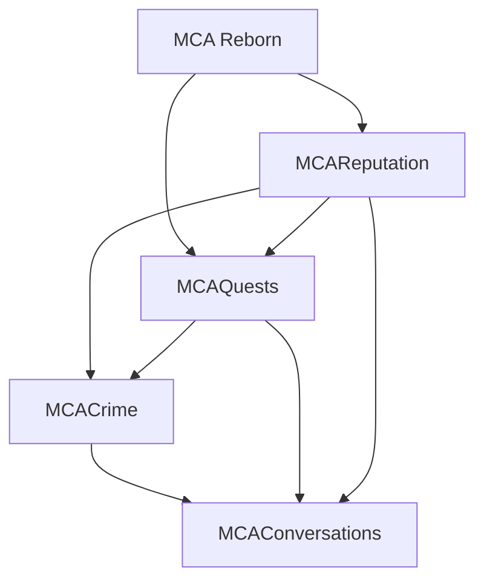

# MCA Crime Suite Integration: Implementation Specification

**Target repositories:** [MCACrime](https://github.com/otectus/MCACrime), [MCAQuests](https://github.com/otectus/MCAQuests), [MCAConversations](https://github.com/otectus/MCAConversations), and [MCAReputation](https://github.com/otectus/MCAReputation)  
**Platform:** Minecraft 1.20.1, Forge, Java 17, MCA Reborn 7.6–7.7 line  
**Document status:** implementation-ready design  
**Prepared:** 2026-08-25

---

## 1. Executive decision

Implement the four mods as a loosely coupled suite with one owner for each kind of truth:

| Concern | Authoritative mod | Other mods may do |
|---|---|---|
| Crime classification, karma, heat, band, wanted/legal-target state, jail, fines, custody, ransom, and legal case lifecycle | **MCACrime** | Query immutable views and invoke narrow, validated commands |
| Public/community standing, witnessed awareness, incident history, gossip eligibility, titles, and amends status | **MCAReputation** | Record or resolve incidents through its public API |
| Quest definitions, objectives, progress, rewards, and quest lifecycle | **MCAQuests** | Accept externally registered types and contextual signals |
| Dialogue selection, conversational actions, phrasing, personality overlays, and who has already told whom | **MCAConversations** | Query the three factual systems and present their state |

The most important implementation rule is **one producer per logical deed**. MCACrime and MCAReputation currently both detect villager assaults and deaths. Installing both naively would create duplicate incidents and double penalties. The integration must therefore add a successful-authority handshake: MCACrime becomes the producer for overlapping crimes only after its Reputation adapter has registered successfully. If that adapter is absent, disabled, incompatible, or throws, MCAReputation keeps its native detector active. There must never be a state in which both produce the same deed or neither does.

The target load/build direction is:



Every edge above is an **optional compile-time integration edge**, not a hard runtime dependency. Each mod must continue to load and retain its standalone behavior when any companion is missing.

### Required end state

When all four mods are installed:

1. One player action creates one Crime case and at most one corresponding Reputation incident.
2. Reputation receives the real witness UUIDs and a dimension-aware community key, not only a witness count or bare village ID.
3. Quest objectives advance once from stable Crime transaction IDs; quest rewards can make precise, idempotent amends to a selected case.
4. Conversations can discuss legal state and known incidents without leaking unwitnessed information.
5. Paying a fine, serving a sentence, being pardoned, rescuing a captive, or completing restitution updates every linked system through a durable, replayable transaction.
6. Removing or reinstalling a companion mod does not corrupt data or crash classloading.
7. Dedicated servers remain authoritative. Clients cannot invent progress, resolve cases, pay fines without funds, or request private records they are not entitled to see.

---

## 2. Source baseline and audit scope

This design is based on the following default-branch snapshots. Pin implementation branches to these commits before changing code so that later upstream drift is explicit.

| Repository | Audited commit | Audited version | Important baseline |
|---|---|---:|---|
| MCACrime | [`5354de5`](https://github.com/otectus/MCACrime/tree/5354de5d021b20fc20be8e579ac94b8b5d174783) | 0.1.0 | Forge 47.4.10, MCA 7.6.20, Architectury declared; 87 tests reported by the merge commit |
| MCAQuests | [`2d1757d`](https://github.com/otectus/MCAQuests/tree/2d1757d68ef71dcc92b9b0ce8ca811809c8ac64b) | 1.1.0 | Forge 47.4.10, MCA 7.6.20; existing optional Reputation bridge; 306 tests reported |
| MCAConversations | [`89edad2`](https://github.com/otectus/MCAConversations/tree/89edad20fa01b62a8e3e765c8bbf1a5b6df5e8a1) | 1.2.1 | Forge 47.4.10, MCA 7.7.0-beta.2, runtime MCA range `[7.6,8)`; Quests and Reputation bridges |
| MCAReputation | [`8fac797`](https://github.com/otectus/MCAReputation/tree/8fac797bb452976ff92a97bc5266460943ee15f3) | 0.2.0 | Forge 47.4.10, MCA 7.7.0-beta.2; public API version 1; 241 tests reported |

The implementation agent must re-run the audit if any repository has moved beyond these commits. In particular, do not assume README claims are implemented when source disagrees. At this snapshot, MCAReputation documentation mentions a Quests Journal “View Deeds” link, but the pinned MCAQuests `JournalScreen` and journal packets do not contain that link or enough dimension-aware community identity to implement it safely.

### Baseline compatibility cleanup

Before integration work, make the suite build reproducibly:

- Use Java 17 toolchains in every repository.
- Remove MCACrime's machine-specific `org.gradle.java.home=/usr/lib/jvm/java-17-openjdk-amd64` setting.
- Select one MCA compile baseline for all four repositories. Prefer 7.7.0-beta.2 because Reputation and Conversations already compile against it, while retaining a tested runtime range of `[7.6,8)` if 7.6.20 production tests pass.
- Audit actual Architectury imports. Remove the hard dependency from mods that no longer reference it; do not retain it merely because an older build file did.
- Keep Forge 47.4.10 for the integration branch unless a separate, tested upgrade is intentionally made. Do not mix dependency upgrades with integration bug fixes.
- Ensure every jar check rejects shaded classes belonging to MCA or any companion mod.

---

## 3. Non-negotiable invariants

These are acceptance requirements, not suggestions.

### 3.1 Authority and feedback-loop rules

- Crime karma is a global legal/moral axis. Reputation score is dimension-aware public/community standing. They are related by events, but they are not mirrors.
- A Reputation score change must never automatically change Crime karma or heat.
- A Crime action may create or resolve a Reputation incident exactly once.
- Quests may alter Crime state only through typed MCACrime commands with a stable deduplication key.
- Conversations never mutates legal or civic state by writing capabilities directly. Its actions invoke public APIs.
- Conversations memory is presentation memory, not legal truth.
- Guards use Crime legal-target state. Reputation may affect social treatment but must not silently turn a player into a legal target.

### 3.2 Optional-mod safety

- No always-loaded class may have a method signature, field, annotation, superclass, or constant-pool reference to an optional mod class.
- Test `ModList.isLoaded` before loading an optional adapter class.
- Load the adapter with a guarded `Class.forName` or isolated bootstrap call; catch `LinkageError`, `ReflectiveOperationException`, and other failures at the boundary.
- Perform an API-version handshake. A present but incompatible mod behaves as unavailable and logs one actionable warning.
- Do not put `@Mod.EventBusSubscriber` on an optional adapter class. Register an instance only after the compatibility check succeeds.
- Register data-driven type IDs unconditionally when the host mod can safely parse them without the optional mod. At runtime, unavailable integrations return false or a typed no-op result rather than breaking a datapack reload.

### 3.3 Server authority, replay, and privacy

- Mutations run on the logical server thread.
- Every cross-mod write carries a stable transaction or deduplication key.
- Client packets are requests, never authoritative results.
- Selector-based commands resolve to an exact case ID before mutation.
- Unwitnessed crimes must not become village gossip merely because MCAConversations is installed.
- Clients receive only the records needed for the current UI and permitted by the requesting player's identity.
- All lists and payload maps have explicit size and string-length bounds.

### 3.4 Compatibility promises

- Preserve the existing MCACrime API getters and existing event accessors.
- Add new methods and immutable view types; do not expose internal mutable capabilities or SavedData.
- Old worlds must load without manual NBT editing.
- Removing MCAReputation, MCAQuests, or MCAConversations must leave MCACrime playable.
- Reinstalling a companion must replay pending integration work without duplicating completed work.

---

## 4. Current-state audit and gaps

### 4.1 MCACrime

The existing public API is read-only and small: karma, heat, band, and wanted state. It has no declared API version and no record-query or typed mutation surface. Internally, `CrimeState` is already the correct choke point for karma/heat mutation and event emission; preserve that architectural advantage.

Existing built-in crime IDs are:

| ID | Default karma | Default heat | Notes |
|---|---:|---:|---|
| `mcacrime:harm_villager` | -10 | 15 | Overlaps MCAReputation assault detection |
| `mcacrime:kill_villager` | -50 | 40 | Overlaps MCAReputation death detection |
| `mcacrime:assault_guard` | -15 | 25 | Needs a Reputation incident definition |
| `mcacrime:jailbreak` | -20 | 30 | Needs an official/legal visibility policy |
| `mcacrime:kidnap` | -40 | 35 | Custody lifecycle must link to the case |
| `mcacrime:theft` | -8 | 12 | Needs victim/community/witness context |
| `mcacrime:mugging_murder` | -70 | 55 | Must not also create an unrelated duplicate kill incident |

Important gaps found in source:

- `CrimeCommittedEvent` carries crime type, optional victim, witnessed boolean, deltas, and record ID, but not the dimension-aware community, witness UUIDs, or a context snapshot.
- `CrimeWitnessedEvent` contains only the witness count.
- `CrimeRecord` stores a bare optional integer village ID and no dimension. Two villages with the same MCA ID in different dimensions can collide.
- `CrimeWorldData.villageReputation` is keyed by bare integer village ID.
- Records start with fine amount and jail ticks at zero and do not have a complete indexed lifecycle for precise fine, sentence, pardon, or amends resolution.
- `FineService.payFine` clears heat and heals relationships but does not resolve a specific ledger record or emit a fine transaction event.
- Jail and custody services emit useful lifecycle events, but those events lack case, community, and integration transaction links.
- `RansomService` writes another kidnapping-style ledger entry on settlement instead of expressing a dedicated ransom lifecycle event.
- The config exposes quest karma weights, and `KarmaSource.QUEST` exists, but no Quests integration calls them.
- MCACrime applies its own village standing loss through `RelationshipConsequences`, which would double public consequences if Reputation also records the deed.
- The UI shows a compact player card but has no complete legal-status/case-file screen.
- Bounties are reserved in NBT/specification only; they are not a present feature and must not be exposed as if implemented.

### 4.2 MCAReputation

MCAReputation already has the strongest public integration surface. Its versioned API supports dimension-aware `CommunityKey`, `ReputationRequest`, stable dedupe keys, subject and witness UUIDs, context maps, incident queries, awareness queries, and monotonic resolution states.

Important integration facts:

- It directly detects MCA villager assault and death. That detector must cooperate with MCACrime.
- Its witness model stores UUIDs; a boolean/count from MCACrime is insufficient.
- Its assault coalescing and death-folding behavior is not identical to MCACrime's cooldown/lethal suppression behavior.
- Existing incident definitions `mcareputation:villager_assaulted` and `mcareputation:villager_killed` should be reused for overlapping crimes so existing dialogue and query content keeps working.
- Integration toggles exist for Quests and Conversations but not Crime.
- `integrationEnabled` recognizes the existing companion namespaces; it must accept and explicitly configure the Crime adapter.
- Its jar validation already rejects shaded companion classes. Extend the rule to MCACrime.

### 4.3 MCAQuests

MCAQuests has data-driven objective, condition, and reward registries and a good optional Reputation compatibility pattern. However:

- `McaQuestsApi` can register types and notify a villager conversation, but does not expose a general contextual external-objective signal.
- Internal `QuestManager.notifyExternalObjective` can advance external signals but accepts too little context for robust Crime filters.
- Quest lifecycle events do not expose a stable active-quest instance/transaction ID suitable for cross-mod outcome deduplication.
- Journal village entries do not include dimension plus village ID, so cross-mod links can select the wrong community.
- No Crime objective, condition, reward, journal section, or lifecycle adapter exists.
- Existing Reputation compatibility demonstrates the required safe-classloading pattern and fallback behavior; reuse it rather than inventing a second style.

### 4.4 MCAConversations

MCAConversations already separates always-loadable bridge interfaces from guarded Quests and Reputation implementations. It also merges external Reputation gossip with native conversation voice and keeps told-memory locally, which is exactly the correct ownership split.

Missing Crime behavior includes:

- no Crime bridge or API-version handshake;
- no legal-state or case-query dialogue condition;
- no guard conversation actions for fine payment, surrender, or case status;
- no Crime template variables;
- no fallback Crime gossip when Reputation is absent;
- no Crime-aware graph, placeholder, locale, or optional-classload tests.

When Reputation is present, Conversations must use the Reputation incident as the only public-gossip source for a Crime deed. Direct Crime gossip in that configuration would duplicate stories and could reveal private acts.

---

## 5. Target architecture

### 5.1 Compatibility package pattern

Each optional edge uses three layers:

1. **Host-owned SPI or public API**, containing only host, Java, and stable Minecraft types.
2. **Always-loaded bridge**, which performs presence/version checks without importing optional types.
3. **Isolated adapter package**, which imports both APIs and is loaded only after the check.

Recommended package placement:

| Host | Always-loaded boundary | Optional implementation |
|---|---|---|
| MCACrime → Reputation | `compat.ReputationBridge` | `compat.reputation.CrimeReputationCompat` |
| MCACrime → Quests | `compat.QuestsBridge` | `compat.quests.CrimeQuestsCompat` |
| MCAConversations → Crime | `compat.CrimeBridge` | `compat.crime.ConversationsCrimeCompat` |

MCAReputation should not import MCACrime to decide whether its core detector is owned. Instead, add a generic public authority registration described in section 7. MCAQuests likewise should not import MCACrime: MCACrime registers its types into the Quests API.

### 5.2 Integration outbox

Forge mods cannot atomically commit SavedData in two different mods. MCACrime therefore needs a durable outbox for every cross-mod write whose loss would create divergent truth.

An outbox entry contains:

```java
public record CrimeIntegrationOperation(
    UUID operationId,
    ResourceLocation target,       // e.g. mcareputation:record_incident
    UUID playerId,
    UUID crimeRecordId,
    ResourceLocation action,       // create, resolve, mirror
    CompoundTag payload,
    long createdGameTime,
    int attempts,
    long nextAttemptGameTime,
    Status status                  // PENDING, COMPLETE, DEAD_LETTER
) {}
```

Rules:

- Write the authoritative Crime change and its outbox operation in the same `CrimeWorldData` dirty cycle.
- Attempt delivery after the Crime transaction completes.
- Retry on server start, player login, and bounded periodic ticks with exponential backoff.
- Treat a duplicate result with the same semantic outcome as success.
- Do not retry validation errors forever. Move them to a bounded dead-letter list and log one structured warning.
- Bound pending plus dead-letter entries globally and per player; prune acknowledged entries after a configurable retention period.
- Never call an optional API while deserializing SavedData.

This outbox handles incident creation, case-resolution propagation, and link recovery. Quest progress signals may also use it when objective completion is important across a crash boundary; purely conversational notifications do not need durable delivery.

### 5.3 Transaction identity

Use stable keys derived from the authoritative object, never wall-clock time:

| Operation | Deduplication key |
|---|---|
| Reputation incident for a Crime case | `crime:<crime-record-uuid>` |
| Reputation resolution | `crime-resolution:<record-uuid>:<resolution-revision>` |
| Quest objective signal | `crime-signal:<record-or-transaction-uuid>:<signal-id>` |
| Quest outcome changing Crime state | `quest:<active-instance-uuid>:<outcome>:<reward-index>` |
| Fine payment | `fine:<payment-transaction-uuid>` |
| Jail release | `jail-release:<sentence-uuid>:<reason>` |
| Custody release | `custody-release:<custody-record-uuid>:<reason>` |

Store raw UUID/key fields in data, not only concatenated strings. Concatenated keys are for external API dedupe.

---

## 6. MCACrime core work

This phase must land before any companion adapter. It turns MCACrime into a stable integration host while preserving existing standalone behavior.

### 6.1 Version the public API

Add a monotonically increasing integer and a compatibility query:

```java
public final class McaCrimeApi {
    public static final int API_VERSION = 1;

    public static int apiVersion() { return API_VERSION; }

    // Existing methods remain source- and binary-compatible.
}
```

The first integration release may call this version 1 even though older unversioned methods exist. Adapters require an explicit compatible range, for example exactly 1 initially.

### 6.2 Dimension-aware community identity

Add a Crime-owned type so always-loaded MCACrime code does not depend on Reputation:

```java
public record CrimeCommunityKey(ResourceLocation dimension, int villageId) {
    public CrimeCommunityKey {
        Objects.requireNonNull(dimension, "dimension");
    }
}
```

Do not use `ResourceKey<Level>` in serialized public DTOs unless all adapters already treat it as stable. A `ResourceLocation` is simpler to serialize, test, and use without resolving a live level.

Every new case records the victim/event dimension and the resolved MCA village ID together. `Optional<CrimeCommunityKey>` is valid when a crime occurs outside a known community.

### 6.3 Immutable public views

Add the following immutable records or final value classes. Collections must be defensive copies and bounded.

```java
public record CrimePlayerSnapshot(
    UUID playerId,
    int karma,
    int heat,
    Band band,
    boolean wanted,
    boolean legalTarget,
    boolean jailed,
    long remainingJailTicks,
    boolean captive,
    boolean holdingCaptive,
    int unresolvedCaseCount,
    int outstandingFineTotal
) {}

public record CrimeRecordView(
    UUID id,
    UUID offenderId,
    Optional<UUID> victimId,
    ResourceLocation crimeType,
    Optional<CrimeCommunityKey> community,
    Set<UUID> witnessIds,
    boolean witnessed,
    long committedGameTime,
    int heatGenerated,
    int karmaDelta,
    int fineAmount,
    long jailTicks,
    CrimeResolution resolution,
    long resolutionRevision,
    Optional<UUID> linkedReputationIncidentId,
    Map<String, String> context
) {}
```

`witnessed` remains separately serialized for legacy/migrated records where only a boolean is known. For new records it must equal `!witnessIds.isEmpty()` unless the crime is explicitly recorded by an official non-villager authority; represent the latter through context/visibility, not a fabricated witness UUID.

Also add bounded query types:

```java
public record CrimeRecordQuery(
    Set<ResourceLocation> crimeTypes,
    Set<CrimeResolution> resolutions,
    Optional<Boolean> witnessed,
    Optional<UUID> victimId,
    Optional<CrimeCommunityKey> community,
    long maxAgeTicks,
    int limit,
    SortOrder order
) {}
```

Validate `limit` to `1..100`, cap filter set sizes, and sort deterministically by game time then UUID. Public APIs return views, never internal records.

### 6.4 Read API

Add:

```java
CrimePlayerSnapshot snapshot(ServerPlayer player);
Optional<CrimeRecordView> record(MinecraftServer server, UUID recordId);
List<CrimeRecordView> selectRecords(ServerPlayer player, CrimeRecordQuery query);
Optional<CustodyView> custody(MinecraftServer server, UUID entityId);
Optional<JailSentenceView> sentence(ServerPlayer player);
```

The query is implicitly scoped to the requesting/offender player unless a separate server-only administrative API is used. Do not let a client supply an arbitrary player UUID to enumerate another player's case history.

### 6.5 Typed mutation API

Do not expose `setKarma`, capability objects, mutable ledger records, or raw SavedData. Add command objects with validation and typed results:

```java
CrimeMutationResult adjustKarma(ServerPlayer player, KarmaChangeRequest request);
CrimeMutationResult reduceHeat(ServerPlayer player, HeatReductionRequest request);
CaseResolutionResult resolveCase(ServerPlayer player, CaseResolutionRequest request);
FinePaymentResult payFine(ServerPlayer player, FinePaymentRequest request);
SurrenderResult surrender(ServerPlayer player, SurrenderRequest request);
CustodyActionResult releaseCaptive(ServerPlayer actor, CustodyActionRequest request);
```

Every request includes:

- a namespaced source ID;
- a stable dedupe key with a maximum length;
- an exact target record/transaction ID where applicable;
- a bounded reason/action ID;
- an optional immutable context map with strict key/value limits.

Every result contains a status enum such as `APPLIED`, `DUPLICATE`, `NO_MATCH`, `NOT_ALLOWED`, `INSUFFICIENT_PAYMENT`, `INVALID_STATE`, `DISABLED`, or `ERROR`, plus the resulting immutable snapshot and exact affected IDs where applicable.

`resolveCase` must reject a broad selector. The caller may use a selector to preview, but must choose an exact case ID before mutation. This prevents a quest reward or conversation click from silently pardoning all offenses.

### 6.6 Case lifecycle

Keep existing serialized resolution names for compatibility and normalize them into a public enum:

- `UNRESOLVED`
- `SERVED`
- `FINED`
- `PARDONED`
- `ESCAPED`
- `EXPIRED`

Add a monotonically increasing `resolutionRevision` and resolution metadata:

```java
public record CrimeResolutionEntry(
    long revision,
    CrimeResolution resolution,
    ResourceLocation source,
    String dedupeKey,
    long gameTime,
    Optional<UUID> actorId,
    Map<String, String> context
) {}
```

Recommended transition rules:

| From | To | Allowed? | Meaning |
|---|---|---:|---|
| `UNRESOLVED` | `FINED` | yes | Assigned restitution/fine was paid |
| `UNRESOLVED` | `SERVED` | yes | The linked sentence completed naturally |
| `UNRESOLVED` | `PARDONED` | privileged/explicit | Legitimate pardon or corrected case |
| `UNRESOLVED` | `ESCAPED` | yes | Custody was escaped; case remains legally actionable |
| `ESCAPED` | `SERVED`, `FINED`, `PARDONED` | yes | Later final disposition |
| any final state | weaker/different final state | no by default | Requires an explicit admin correction operation |
| any | same state, same dedupe | duplicate success | Safe replay |

`ESCAPED` is not forgiveness. Queries for unresolved/actionable cases should include both `UNRESOLVED` and `ESCAPED` by default.

Index records by record UUID and offender UUID. Existing append-only lists can remain the serialized form initially, but mutation must replace/update by ID through one ledger service and mark SavedData dirty once.

### 6.7 Witness snapshot

Change `WitnessChecker` to return a result object rather than only an integer:

```java
public record WitnessResult(Set<UUID> witnessIds, int scannedCandidates) {
    public int count() { return witnessIds.size(); }
    public boolean witnessed() { return !witnessIds.isEmpty(); }
}
```

Requirements:

- Capture MCA villager UUIDs after distance, alive-state, spectator, and line-of-sight filtering.
- Sort before serialization for deterministic tests.
- Enforce a maximum stored witness count; if more witnesses qualify, retain a stable nearest-first subset and store `witness_count_total` in context.
- Snapshot witnesses during crime detection. Never rescan later for the same case.
- Preserve the existing `CrimeWitnessedEvent.getWitnessCount()` accessor and add `getWitnessIds()` as a defensive immutable set.

### 6.8 Context snapshot

Add a small allowlisted context map to new records. Populate only stable, useful facts:

- `victim_name` as a sanitized snapshot for later UI text;
- `victim_role` such as villager/guard/child/family/captive;
- `detection` such as direct, custody, jailbreak, command;
- `witness_count_total`;
- `sentence_id`, `custody_id`, or `ransom_id` when linked;
- `legacy_migration` when applicable.

Do not serialize arbitrary entity NBT, chat, player-provided strings, or display components into this map.

### 6.9 New lifecycle events

Keep existing events. Add immutable server events with stable transaction IDs:

| Event | Minimum payload |
|---|---|
| `HeatChangedEvent` | player, old/new heat, source, dedupe key |
| `CrimeRecordResolvedEvent` | player, before/after record views, resolution entry, operation ID |
| `FinePaidEvent` | payer, transaction ID, affected case IDs, amount, old/new heat |
| `PlayerSurrenderedEvent` | player, transaction ID, resulting sentence ID, affected case IDs |
| `RansomDemandedEvent` | captor/captive IDs, custody/ransom IDs, amount, community |
| `RansomPaidEvent` | payer/captor/captive IDs, transaction ID, amount, release result |
| `CustodyChangedEvent` | custody view before/after, reason, linked case ID |

Extend `CrimeCommittedEvent` with either a `CrimeRecordView` accessor or new full-snapshot accessors. Preserve old constructor/accessors where binary compatibility requires it; a new overloaded constructor can delegate.

Events fire only after authoritative state is committed. Listener failures are isolated and must not roll back or duplicate the Crime transaction.

### 6.10 Fine and sentence semantics

Replace “pay emeralds, clear all heat” with a precise transaction:

1. Resolve the requested or server-selected actionable cases in deterministic oldest-first order.
2. Calculate the cost from those case records and config.
3. Revalidate inventory and legal state on the server.
4. Remove payment once.
5. Mark affected cases `FINED` and attach the payment transaction ID.
6. Reduce heat by the configured amount attributable to those cases; do not silently erase unrelated heat unless an explicit `pay_all` operation does so.
7. Enqueue linked Reputation resolutions.
8. Emit one `FinePaidEvent` and one merged player notification.

For jail:

- Create a sentence UUID and link exact case IDs at surrender/jailing time.
- Only `SENTENCE_SERVED` may automatically mark linked cases `SERVED`.
- `ADMIN`, `INVALID_JAIL`, or a captivity safety cap releases the entity but does not count as moral/legal atonement.
- `PARDON` maps to `PARDONED` only through an explicit privileged transaction.
- Escape marks linked cases `ESCAPED` and may create a separate jailbreak case.

### 6.11 Standalone village fallback

Replace the dimensionless `Map<Integer, ...>` with `Map<CrimeCommunityKey, ...>` and version the data migration. Treat this store as a **standalone/fallback social snapshot**, not a second canonical reputation system.

- Without MCAReputation, current MCACrime relationship consequences may update the fallback store.
- With MCAReputation active, public standing writes go only through the Reputation bridge. Mirror the resulting score/tier into the fallback store after successful operations so uninstalling Reputation does not reset all context.
- Never apply both the local village penalty and a canonical Reputation incident for one deed.
- Do not use the mirrored value to feed another Reputation write.

### 6.12 Explicitly deferred features

Bounties and NPC-authored crimes remain future work. Reserve extension-friendly query fields, but do not add `has_bounty` conditions, bounty UI, bounty events, or compatibility content until MCACrime actually implements an authoritative bounty lifecycle.

---

## 7. MCAReputation integration

### 7.1 Add a generic core-incident authority handshake

MCAReputation needs a way to delegate overlapping low-level detection without importing MCACrime. Add public types containing no optional-mod references:

```java
public enum CoreIncidentKind {
    MCA_VILLAGER_ASSAULT,
    MCA_VILLAGER_KILL
}

public interface CoreIncidentAuthority {
    ResourceLocation authorityId();
    boolean owns(CoreIncidentKind kind);
}

public interface CoreIncidentAuthorityRegistration extends AutoCloseable {
    ResourceLocation authorityId();
    @Override void close();
}
```

Add to `McaReputationApi`:

```java
CoreIncidentAuthorityRegistration registerCoreIncidentAuthority(
    CoreIncidentAuthority authority
);

boolean hasExternalAuthority(CoreIncidentKind kind);
```

Authority rules:

- Reject duplicate authority IDs.
- If two distinct authorities claim the same kind, log an error and keep MCAReputation's native detector active. Ambiguity must fail safe, not arbitrarily pick a mod.
- Call `owns(kind)` inside a guarded boundary. A thrown error means false for that event and is rate-limited in logs.
- MCACrime's implementation returns true only while its Crime detector and Reputation integration are both enabled and compatible.
- Register during common setup after both configs are available; unregister on server/mod shutdown if the lifecycle supports it.
- MCAReputation's assault/death event handlers check authority immediately before constructing their own request. They skip only when exactly one healthy external authority claims the kind.

This handshake is superior to `ModList.isLoaded("mcacrime")`: a merely installed but broken or disabled adapter cannot create an incident black hole.

### 7.2 Crime → Reputation adapter

`MCACrime.compat.ReputationBridge` must be always-loadable and expose only Crime/Java/Minecraft types. Its guarded implementation should:

1. Require `McaReputationApi.API_VERSION == 1` initially.
2. Register MCACrime as the authority for villager assault and death only after incident recording has been validated.
3. Subscribe to full Crime lifecycle events or a Crime-owned post-commit SPI.
4. Convert a `CrimeRecordView` to one `ReputationRequest`.
5. Queue an outbox operation before/with delivery.
6. Store the returned Reputation incident UUID on the Crime record.
7. Mirror the canonical community score into Crime's fallback snapshot after success.

The adapter must not call back into `CrimeState` in response to Reputation score events. That would form a feedback loop.

### 7.3 Crime-to-incident mapping

Use the existing Reputation incident IDs for overlapping deeds and Crime-owned data definitions for the rest:

| Crime type | Reputation incident | Default visibility | Notes |
|---|---|---|---|
| `mcacrime:harm_villager` | `mcareputation:villager_assaulted` | witnessed | MCACrime owns coalescing while authority is active |
| `mcacrime:kill_villager` | `mcareputation:villager_killed` | witnessed; retain severe unwitnessed history per definition | Must not also emit an assault for the lethal hit |
| `mcacrime:assault_guard` | `mcacrime:guard_assaulted` | witnessed/official | Subjects include guard UUID |
| `mcacrime:jailbreak` | `mcacrime:jailbreak` | official/community | Link sentence UUID and former jail community |
| `mcacrime:kidnap` | `mcacrime:kidnapping` | witnessed | Link custody UUID and captive subject |
| `mcacrime:theft` | `mcacrime:theft` | witnessed | Link owner/victim where known |
| `mcacrime:mugging_murder` | `mcacrime:mugging_murder` | witnessed; retain severe hidden history as configured | This is the one logical deed; suppress a second generic kill incident |

Place the new incident JSON in the MCACrime jar under the Reputation data path expected by MCAReputation, using the `mcacrime` namespace. MCAReputation must treat third-party namespaces as valid when their definitions pass schema validation.

Every request includes:

```text
source             = mcacrime:crime_bridge
dedupeKey          = crime:<record UUID>
community          = exact dimension + village ID
subjects           = victim/captive/guard UUIDs
witnesses          = snapshotted witness UUIDs
gameTime           = committed game time
context.record_id  = Crime record UUID
context.crime_type = Crime type ID
context.victim_role, sentence_id, custody_id, ... when present
```

Do not use the current time when replaying an old outbox entry. Preserve the original event time.

### 7.4 Visibility and awareness

Apply the following privacy model:

- A witnessed crime supplies real witness UUIDs. Reputation's existing awareness propagation decides who later knows it.
- An unwitnessed ordinary assault or theft may remain solely in the Crime ledger if the incident definition does not retain unwitnessed events.
- A severe unwitnessed killing may be retained as hidden/private history if the Reputation definition supports it, but it contributes no public gossip until discovered, confessed, or otherwise made known.
- Official acts such as a recorded jailbreak may be community-visible because the authority itself knows, but that policy must be explicit in the incident definition; do not fabricate villager witnesses.
- Conversations asks `villagerKnows` before mentioning a linked incident. A Crime record's mere existence is not enough.

### 7.5 Resolution mapping

Crime owns legal disposition. Reputation owns the civic interpretation of that disposition.

| Crime disposition/action | Reputation status/action |
|---|---|
| `FINED` after full assigned restitution | Resolve linked incident as `ATONED` by default |
| `SERVED` after natural sentence completion | Resolve as `ATONED` |
| `PARDONED` | Resolve as `FORGIVEN` unless the pardon represents factual exoneration |
| Admin correction proving the event false | Resolve as `DISPROVEN` through a distinct correction command |
| `ESCAPED` | Leave original incident active; optionally record `mcacrime:jailbreak` |
| `EXPIRED` | Do not automatically forgive a severe active Reputation incident |

Use a config/data mapping for installations that prefer `APOLOGIZED` instead of `ATONED` for fines, but ship the table above as the default.

Resolution is a durable saga:

1. MCACrime commits the case revision and an outbox entry.
2. The adapter resolves the linked Reputation incident.
3. On success, MCACrime acknowledges the outbox entry.
4. On crash/replay, a same-or-stronger monotonic Reputation status counts as success.

MCAReputation should make a duplicate `record` result recoverable by returning the existing incident ID. If API v1 does not guarantee that, add one of these backward-compatible methods:

```java
Optional<UUID> findIncidentByDedupeKey(
    MinecraftServer server,
    UUID playerId,
    CommunityKey community,
    ResourceLocation source,
    String dedupeKey
);
```

or extend `ReputationResult` so `DUPLICATE` includes the original ID. The Crime outbox must be able to repair a lost link after a crash between the Reputation commit and Crime's link write.

### 7.6 Prevent double social consequences

When the bridge is active for a case:

- skip MCACrime's local village-reputation penalty for that case;
- retain direct personal MCA hearts/family relationship consequences only if Reputation does not already apply the same personal-heart effect;
- ensure a fine/restitution heals personal relationships once;
- show a single merged notification rather than separate Crime and Reputation action-bar messages.

Document the final matrix for each effect in code comments and tests. The desired default is:

| Effect | Owner with Reputation installed |
|---|---|
| Karma/heat/band/wanted | MCACrime |
| Personal MCA hearts | MCACrime, exactly once |
| Community score/tier/title | MCAReputation |
| Awareness/gossip candidacy | MCAReputation |
| Wording/told memory | MCAConversations |

### 7.7 Reputation configuration and resources

Add:

```toml
[integrations]
enableCrimeIntegration = true
```

The authority remains unclaimed when either side disables the bridge. Add Crime to source/integration diagnostics and jar-content checks. Add optional load-order metadata so Reputation initializes before Crime, but do not make Crime mandatory.

Author data definitions for:

- `mcacrime:guard_assaulted`
- `mcacrime:jailbreak`
- `mcacrime:kidnapping`
- `mcacrime:theft`
- `mcacrime:mugging_murder`
- optional positive/civic deeds `mcacrime:fine_paid`, `mcacrime:sentence_served`, and `mcacrime:captive_rescued`

Positive deeds must not erase the original incident. They may provide small positive context while the original incident is resolved monotonically.

---

## 8. MCAQuests integration

MCACrime owns and registers its Quests adapter. MCAQuests supplies a generic, versioned extension surface and never imports Crime classes.

### 8.1 Extend the Quests public API

Add an API version if one is not already public, then expose contextual external signals:

```java
public record ExternalObjectiveSignal(
    ResourceLocation signalId,
    UUID transactionId,
    Optional<UUID> subjectId,
    long gameTime,
    Map<String, String> context
) {}

public interface ContextualExternalSignalObjective extends QuestObjective {
    boolean matchesSignal(
        ServerPlayer player,
        QuestContext questContext,
        ExternalObjectiveSignal signal
    );
}

public static ExternalSignalResult notifyExternalObjective(
    ServerPlayer player,
    ExternalObjectiveSignal signal
);
```

Compatibility behavior:

- Existing `ExternalSignalObjective` remains supported.
- The dispatcher calls the contextual interface when implemented, otherwise adapts to the old signal ID/subject pair.
- Results report matched active quest instance IDs and changed objective indices.
- The dispatcher stores/compares the transaction UUID so a replay cannot increment progress twice.
- Context is allowlisted and bounded: at most 16 entries, 64-character keys, and 256-character values are reasonable initial limits.

Quest lifecycle events must expose a stable active quest instance UUID, not just the quest definition ID. Add an accessor while keeping old constructors/getters compatible. Freeze integration reward data on acceptance, or version the accepted quest snapshot, so a datapack reload cannot change an already accepted reward and enable replay exploits.

### 8.2 Crime condition types

Register these IDs through `McaQuestsApi` from `CrimeQuestsCompat`:

#### `mcacrime:karma`

```json
{ "type": "mcacrime:karma", "min": -100, "max": -1 }
```

At least one bound is required. Values are inclusive.

#### `mcacrime:heat`

```json
{ "type": "mcacrime:heat", "min": 25, "max": 100 }
```

#### `mcacrime:band`

```json
{
  "type": "mcacrime:band",
  "values": ["red", "dark_red"],
  "negate": false
}
```

Use the exact serialized band IDs already owned by MCACrime. Reject unknown values during datapack validation.

#### `mcacrime:status`

```json
{
  "type": "mcacrime:status",
  "wanted": true,
  "legal_target": true,
  "jailed": false,
  "captive": false,
  "holding_captive": false,
  "unresolved_min": 1
}
```

All fields are optional, but at least one must be present.

#### `mcacrime:has_record`

```json
{
  "type": "mcacrime:has_record",
  "crime_types": ["mcacrime:theft", "mcacrime:harm_villager"],
  "resolutions": ["unresolved", "escaped"],
  "witnessed": true,
  "community": "quest_villager",
  "victim": "quest_villager",
  "max_age_ticks": 168000,
  "negate": false
}
```

Supported scopes should be explicit enums: `any`, `quest_villager`, and `quest_community`. Resolve `quest_community` from the live giver and dimension; never compare only village integers. Cap age and list sizes.

When Crime is missing, these IDs are not present because their definitions live in the Crime jar. When Crime is present but the Quests bridge is disabled or incompatible, adapter registration should still install parsers that evaluate false and log a single warning, so Crime-shipped quest resources do not break the entire reload.

### 8.3 Crime objective types

Implement event-driven objectives wherever possible:

| Type ID | Completing signal | Required filters |
|---|---|---|
| `mcacrime:pay_fine` | `FinePaidEvent` | amount, case type, community, pay-all flag |
| `mcacrime:surrender` | `PlayerSurrenderedEvent` | community/guard, minimum linked cases |
| `mcacrime:serve_sentence` | release reason `SENTENCE_SERVED` | sentence/case filters; admin release never counts |
| `mcacrime:rescue_captive` | custody release reason `RESCUED` | captive role/UUID/community |
| `mcacrime:release_captive` | custody release | allowlisted release reasons |
| `mcacrime:reduce_heat` | `HeatChangedEvent` crossing threshold | target heat, optional minimum reduction |
| `mcacrime:commit_crime` | `CrimeCommittedEvent` | type/witness/community; available for authored outlaw/undercover packs, not used by default rehabilitation content |

For objectives that must track a crime-free duration, add a dedicated stateful objective:

```json
{
  "type": "mcacrime:remain_lawful",
  "duration_ticks": 24000,
  "forbidden_types": ["#mcacrime:violent"],
  "reset_on_crime": true
}
```

This objective polls elapsed server time cheaply and subscribes to Crime events to reset/fail. Persist the start time and last processed Crime record UUID in objective extra data.

All signals include a unique Crime transaction UUID. The objective progress entry keeps a bounded set or last stable transaction IDs so event replay and outbox retry are idempotent.

### 8.4 Crime reward types

Add narrow rewards:

#### `mcacrime:adjust_karma`

```json
{
  "type": "mcacrime:adjust_karma",
  "amount": 5,
  "reason": "community_service"
}
```

Clamp amount to config, use source `mcaquests:reward`, and dedupe by active quest instance plus reward index.

#### `mcacrime:reduce_heat`

```json
{ "type": "mcacrime:reduce_heat", "amount": 15 }
```

Only non-negative reductions are allowed in ordinary content. Increasing heat belongs to a deliberately named punitive reward/action.

#### `mcacrime:resolve_record`

```json
{
  "type": "mcacrime:resolve_record",
  "selector": {
    "crime_types": ["mcacrime:theft"],
    "resolutions": ["unresolved"],
    "community": "quest_community",
    "max_age_ticks": 168000,
    "order": "oldest"
  },
  "resolution": "fined",
  "maximum_records": 1
}
```

The reward resolves the selector to exact case IDs once, validates the maximum, and then calls the typed Crime API. Default `maximum_records` is 1 and the hard cap should remain small. The same operation propagates to linked Reputation incidents through the Crime outbox.

Do not ship a blanket `clear_heat` reward. If needed for trusted datapacks, gate it behind a server config and name it explicitly so reviewers can find it. Do not expose admin release or mass pardon as ordinary quest rewards.

### 8.5 Quest lifecycle → Crime karma

Do not award or remove Crime karma for every quest globally. That would make repeatable filler quests a karma farm and could duplicate explicit rewards. Add an opt-in top-level block to quest definitions:

```json
{
  "id": "mcacrime:restitution/theft",
  "crime": {
    "on_complete_karma": 5,
    "on_fail_karma": -2,
    "on_abandon_karma": -1,
    "reason": "restitution"
  }
}
```

The Quests lifecycle adapter calls MCACrime with:

```text
source    = mcaquests:quest_outcome
dedupeKey = quest:<active instance UUID>:<complete|fail|abandon>:crime
```

If an explicit `mcacrime:adjust_karma` reward exists for the same completion, schema validation should warn or reject a second top-level completion delta unless `allow_stack` is deliberately true.

### 8.6 Built-in quest content

Ship optional Crime-authored content in MCACrime, not MCAQuests, so removing Crime also removes definitions that depend on it. Minimum quest chains:

1. **Restitution for theft** — exact unresolved theft case, repay/return value, resolve one record, modest karma restoration.
2. **Apology and restitution for assault** — require the victim or community, perform a conversation/apology step when Conversations is present with a non-conversation fallback, then resolve the case.
3. **Surrender to a guard** — open from a guard dialogue or quest offer, surrender, serve the natural sentence, then complete.
4. **Rescue a captive** — identify an active custody record, release with `RESCUED`, reward positive Reputation context without granting arbitrary pardons.
5. **Community service** — remain lawful plus ordinary work objectives; reduce heat in bounded increments and resolve only the linked case.

Use feature conditions so the same quest has a safe fallback when Conversations or Reputation is absent. Never make an optional-mod-only step the sole path to completing core Crime content.

### 8.7 Journal integration

First extend `JournalVillageEntry` and its packets with:

```text
dimension ResourceLocation
villageId int
```

Migrate/derive old snapshots as Overworld only when no dimension exists, and mark them legacy. Then add a generic journal extension point or a guarded Crime client hook that supplies:

- a global **Legal Status** card: karma, band, heat, wanted, jail status, unresolved case count;
- a per-community **Case File** action using exact dimension plus village ID;
- a server-requested, paginated case list;
- links from a case to its linked Reputation deed when the Reputation client integration is available.

Do not implement the advertised “View Deeds” link by guessing a community from display name. Identity must be fixed first.

---

## 9. MCAConversations integration

MCAConversations owns this adapter because it owns dialogue condition/action registration, rendering, gossip voice, and told-memory.

### 9.1 Bridge structure

Add:

```text
compat/CrimeBridge.java
compat/crime/ConversationsCrimeCompat.java
compat/crime/CrimeQueryCodec.java
compat/crime/CrimeEventBridge.java
```

`CrimeBridge` uses a pure Conversations-owned SPI and is always safe to load. `ConversationsCrimeCompat` imports `McaCrimeApi`, requires Crime API v1, registers event listeners at runtime, and returns a no-op implementation after any linkage failure.

Initialize it next to the existing Quests and Reputation bridges. Add `enableCrimeIntegration = true` to the Conversations integration config and expose adapter health in diagnostics.

### 9.2 Dialogue conditions

Register condition IDs in the MCA registrar unconditionally so malformed/optional data has deterministic behavior.

#### `conversations_crime`

```json
{
  "condition": "conversations_crime",
  "min_karma": -100,
  "max_karma": -1,
  "min_heat": 20,
  "bands": ["red", "dark_red"],
  "wanted": true,
  "legal_target": true,
  "jailed": false,
  "unresolved_min": 1
}
```

All present fields are ANDed. An empty object is invalid. When Crime is unavailable, score false/zero without crashing.

#### `conversations_crime_record`

```json
{
  "condition": "conversations_crime_record",
  "crime_types": ["mcacrime:harm_villager"],
  "resolutions": ["unresolved", "escaped"],
  "witnessed": true,
  "known_to_speaker": true,
  "victim": "speaker",
  "community": "speaker",
  "max_age_ticks": 168000,
  "select": "newest"
}
```

`known_to_speaker` is evaluated as follows:

1. If a linked Reputation incident exists and Reputation is available, call `villagerKnows`.
2. Without Reputation, true only if the speaker UUID is in the snapshotted witness set, is the victim, or is a recognized guard/authority with explicit legal access.
3. Never infer awareness from community membership alone.

The selected record is attached to the server-side conversation context for template variables and actions. A later action must revalidate the record before mutation.

### 9.3 Dialogue actions

Register one allowlisted action family:

```json
{
  "action": "conversations_crime_action",
  "operation": "pay_fine",
  "record": "selected",
  "pay_all": false
}
```

Supported initial operations:

- `open_status` — sends/opens a read-only legal-status screen;
- `pay_fine` — only with a valid guard/authority speaker and server-side inventory revalidation;
- `surrender` — only with a valid guard/authority and current legal target;
- `pay_ransom` — only for a current, server-validated ransom record;
- `apologize` — records an explicit conversation signal and may advance a quest, but does not by itself pardon a case;
- `confess` — may make a hidden linked Reputation incident known according to an explicit Reputation action, without creating a duplicate Crime case.

Do not expose arbitrary `set_karma`, `clear_heat`, `release`, or `pardon` dialogue actions. Those are privilege-escalation surfaces.

All actions use a server conversation/session nonce plus exact target IDs. Ignore replayed/expired nonces.

### 9.4 Template variables

Add sanitized, server-derived variables:

| Variable | Value |
|---|---|
| `{crime_karma}` | formatted current karma |
| `{crime_heat}` | formatted current heat |
| `{crime_band}` | localized band name |
| `{crime_status}` | localized legal status |
| `{crime_type}` | localized selected case type |
| `{crime_victim}` | sanitized victim snapshot/name if speaker is allowed to know it |
| `{crime_fine}` | selected/aggregate validated fine |
| `{crime_sentence}` | localized remaining/assigned sentence |

Do not expose UUIDs or raw context-map values as generic placeholders. Placeholder signatures must be identical across `en_us` and `pt_br`.

### 9.5 Check bias and social behavior

Avoid stacking Crime karma and Reputation standing into the same social check:

- With Reputation available, Reputation remains the sole numeric source for public trust/respect bias. Crime contributes contextual gates such as wanted, jailed, holding a captive, or being the speaker's known offender.
- Without Reputation, Conversations may apply a small configurable band-based fallback bias, hard-clamped to approximately `[-4, +4]`, to trust/respect only.
- Crime state must not directly boost warmth, romance, or attraction.
- A guard's enforcement path remains MCACrime's responsibility, not a high negative conversation check.

### 9.6 Gossip source selection

Select exactly one path per server:

**When Reputation is available:**

- Crime records are converted to Reputation incidents.
- Conversations receives them through its existing external Reputation gossip-candidate integration.
- Reputation supplies whether the speaker knows, the phrase key/arguments, and the incident identity.
- Conversations supplies voice/personality and told-memory.
- The direct Crime event-to-gossip adapter is disabled.

**When Reputation is absent:**

- `CrimeEventBridge` turns witnessed Crime records into bounded native gossip candidates.
- Only the victim, witnesses, and explicit authorities initially know the candidate.
- Store the Crime record UUID as the external identity so told-memory dedupes correctly.
- Lifecycle changes update/suppress the candidate; a resolved case can use post-amends phrasing rather than vanish abruptly.

Do not serialize an unbounded new enum value for every Crime type. Prefer a generic external gossip candidate carrying a validated phrase key, stable ID, severity, subjects, and typed arguments.

### 9.7 Conversation content

Add content branches for:

- guards explaining heat, fines, surrender, jail, sentence completion, and escaped status;
- a witnessed villager confronting the offender;
- an unaware villager who must not know the deed;
- victim/family apology and restitution;
- captive fear, rescue, release, and ransom follow-up;
- post-fine, post-sentence, pardoned, and still-unresolved states;
- compatible Quests offers and progress lines for the built-in restitution chains.

Every Crime branch requires:

- a non-Crime fallback;
- personality overlay coverage where the surrounding intent system expects it;
- English and Brazilian Portuguese locale parity;
- exact placeholder parity;
- graph reachability and loop limits;
- no action that assumes Reputation or Quests is present.

### 9.8 Conversation memories

Use bounded, player-scoped memories only for presentation state, for example:

```text
crime.witnessed.<record UUID>
crime.discussed.<record UUID>
crime.apology_offered.<record UUID>
crime.jailed.<sentence UUID>
crime.released.<sentence UUID>
crime.rescued.<custody UUID>
```

Prune by age/count and never consult these instead of the Crime API to decide whether a fine is paid or a sentence is complete.

---

## 10. Integrated player flows

### 10.1 Witnessed villager assault

1. Forge damage event reaches MCACrime.
2. MCACrime gates the actor, classifies the crime, snapshots victim/community/witness UUIDs, applies karma/heat once, and writes one case.
3. MCACrime posts its events and queues the Reputation create operation.
4. MCAReputation's native assault detector sees the healthy Crime authority and skips its own record.
5. The Crime adapter records `mcareputation:villager_assaulted` with `crime:<record UUID>` dedupe.
6. The linked Reputation incident and community score become available to Conversations.
7. Conversations uses Reputation awareness for gossip; it does not also consume the direct Crime gossip path.
8. The Crime Quests adapter emits one contextual objective signal keyed by the record UUID.
9. The client receives one combined notification.

Acceptance: one Crime record, one karma/heat application, zero or one Reputation incident according to definition, one quest increment, and no duplicate gossip.

### 10.2 Unwitnessed crime

1. MCACrime always creates the legal/private case and applies configured karma.
2. Witness UUIDs are empty. Heat follows Crime config, not a fabricated public witness.
3. Reputation either drops the ordinary unwitnessed incident or retains a severe incident as hidden according to its data definition.
4. Conversations cannot mention it unless the speaker is the victim/authority, later learns it through Reputation, or the player confesses.
5. A deliberately authored private/legal Quest objective may still react to the Crime event.

Acceptance: installing Conversations cannot reveal an unwitnessed crime to an arbitrary villager.

### 10.3 Restitution quest

1. Quest condition selects one exact actionable Crime record in the giver's dimension-aware community.
2. Acceptance freezes the record ID and active quest instance ID into quest state.
3. Objectives use exact subjects/transactions.
4. Completion calls `resolveCase` with dedupe derived from active instance and reward index.
5. MCACrime changes the case and writes a Reputation resolution outbox entry.
6. Reputation resolves the linked incident to `ATONED` and may record a small restitution deed.
7. Conversations immediately selects post-amends lines from canonical state.

Acceptance: reloading, reconnecting, or replaying the reward cannot resolve a second case or award karma twice.

### 10.4 Paying a fine through a guard

1. Conversation condition verifies an authorized guard and selects exact payable cases.
2. The client clicks a server-issued action with a short-lived session nonce.
3. MCACrime recalculates price, checks inventory, removes items, resolves cases, reduces attributable heat, and emits one transaction.
4. Reputation resolutions are durably delivered.
5. Quests advances `pay_fine` once.
6. Conversations moves to the success/failure branch based on typed server result.

Acceptance: packet spam or a repeated click cannot remove payment twice or grant free resolution.

### 10.5 Surrender and sentence

1. A guard conversation or `/crime surrender` calls the same typed service.
2. The sentence records a UUID and exact case IDs.
3. A surrender objective advances once.
4. On natural expiry, release reason `SENTENCE_SERVED` resolves linked cases and completes a serve-sentence objective.
5. Admin/safety/invalid-jail release frees the entity but does not complete atonement.
6. Escape marks cases `ESCAPED` and creates a distinct jailbreak deed when appropriate.

### 10.6 Kidnapping, rescue, and ransom

1. The custody record, Crime case, and ransom demand have distinct IDs with explicit links.
2. The kidnapping case maps to one Reputation incident.
3. Rescue emits `RESCUED`; voluntary release, cap expiration, captive death, and ransom payment remain distinguishable.
4. Quests filters on release reason and exact captive/community.
5. Conversations exposes captive/family/rescuer follow-up without treating ransom settlement as a second kidnapping.
6. Ransom payment produces a dedicated lifecycle event and audit context, not a duplicate `KIDNAP` case.

### 10.7 Companion removal and reinstallation

- If Reputation disappears, Crime stops claiming external authority automatically and resumes its dimension-aware fallback standing; Conversations switches to its direct witnessed-Crime gossip path.
- If Reputation returns, pending outbox work replays with original dedupe keys. Existing linked incidents are recovered rather than duplicated.
- If Quests disappears, Crime continues; no objective signals are attempted beyond a bounded unavailable/no-op result.
- If Conversations disappears, all factual state remains intact.
- If an integration version is incompatible, log once, expose degraded status in diagnostics, and keep standalone behavior.

---

## 11. Persistence and migration

### 11.1 Version Crime SavedData

Add an explicit schema integer at the root of `CrimeWorldData`. Migrate stepwise, not with a single unversioned best-effort loader.

Suggested versions:

| Schema | Meaning |
|---:|---|
| 0 | Existing unversioned data |
| 1 | Dimension-aware community keys |
| 2 | Indexed mutable case lifecycle, witness UUIDs, context, links |
| 3 | Integration outbox and dedupe records |

The loader performs `0 → 1 → 2 → 3` in memory, validates, and writes the latest schema on the next save. Keep a backup recommendation in release notes; do not write an automatic copy into arbitrary filesystem paths from mod code.

### 11.2 Legacy community migration

Old Crime data contains only village integer IDs. Follow a deterministic rule:

- interpret legacy IDs as `minecraft:overworld`;
- add `legacy_migration=assumed_overworld` to migrated records/context;
- log one aggregate warning per world, not one line per record;
- never merge two new dimension-aware keys merely because their village integers match.

This matches the only defensible information available. Do not guess a dimension from the player's current location at load time.

### 11.3 Legacy witness migration

Old records have only `witnessed: boolean`, and possibly an event-time count, but no witness identities.

- Preserve the boolean.
- Leave the witness UUID set empty.
- Mark `legacy_witness_identity_missing=true`.
- Do not invent nearby villagers during migration.
- When backfilling to Reputation, do not give arbitrary villagers awareness. Treat the incident as hidden/private unless an explicit administrator migration policy elects official/community visibility.

### 11.4 Record/link migration

For every legacy record:

- preserve its record UUID, type, offender, victim, time, deltas, and existing resolution exactly;
- initialize `resolutionRevision` to 0;
- initialize missing context to an empty bounded map;
- initialize Reputation link empty;
- rebuild the record-ID index and validate duplicate UUIDs;
- if duplicate IDs are found, retain the first canonical record, deterministically re-ID later duplicates, and record/log the repair.

Backfill only records whose semantic mapping is known. Queue a Reputation create operation for unresolved/actionable records when integration first becomes healthy. Use `crime:<existing UUID>` dedupe. Do not backfill already resolved trivial cases unless configured, and do not apply new Crime karma/heat during backfill.

### 11.5 Dedupe storage

Store recent mutation keys per player/source with:

- key hash plus the bounded original key when diagnostics need it;
- resulting status and affected IDs;
- created and expiry game time;
- a hard per-player/global cap;
- pruning on safe intervals, not every tick.

Critical long-lived identities such as `crime:<record UUID>` should be recoverable from the record/link itself and not depend solely on an expiring dedupe cache.

### 11.6 Unknown-field and removal behavior

Minecraft NBT loaders normally reconstruct known fields, so unknown companion payload can be lost if not designed deliberately. Keep integration data in Crime-owned generic structures using resource IDs and primitive/NBT values. Never serialize an MCAReputation class name or Java object.

If a target adapter is missing, preserve pending operations without trying to deserialize target-specific Java classes. Apply retention caps, but do not discard unresolved operations immediately simply because a mod is absent for one boot.

---

## 12. Networking and UI

### 12.1 Packet protocol

Add a Crime network protocol integer separate from the mod version. A safe minimum packet set is:

| Direction | Packet | Purpose |
|---|---|---|
| C2S | `RequestCrimeStatusPacket` | Request own current snapshot |
| S2C | `CrimeStatusSnapshotPacket` | Return immutable legal summary |
| C2S | `RequestCrimeRecordsPacket` | Request own paginated cases with bounded filter |
| S2C | `CrimeRecordsPagePacket` | Return a page plus stable continuation token |
| C2S | `CrimeActionRequestPacket` | Fine/surrender/ransom/status action with nonce and exact IDs |
| S2C | `CrimeActionResultPacket` | Typed result and updated snapshot |
| S2C | `OpenCrimeScreenPacket` | Server-authorized opening/context |

Existing sync packets remain supported during a compatibility window.

Validation requirements:

- Reject unknown protocol versions cleanly.
- Enforce maximum page size, filter counts, context length, and continuation lifetime.
- Ignore arbitrary target-player UUIDs; ordinary requests are always scoped to the sending player.
- Marshal server-thread mutations through the packet context.
- Re-check distance, speaker identity, guard authority, inventory, case state, and nonce at action time.
- Rate-limit record queries and actions separately.
- Never send hidden witness identities or private victim data to a client that cannot view it.

### 12.2 Crime Status screen

Provide one canonical screen reachable from the existing inventory player card, Quests Journal extension, guard conversations, and `/crime status` affordances.

Sections:

1. **Legal summary** — karma, band, heat, wanted/legal target, current jail/custody state.
2. **Actionable cases** — type, community, age, witnessed/official status, fine/sentence, disposition.
3. **Resolved history** — paginated and collapsed by default.
4. **Available actions** — server-provided fine, surrender, ransom, or case-detail actions.
5. **Community/deed link** — visible only when a linked Reputation incident and compatible client are present.

The screen displays server-provided localized keys and typed values. Do not trust it to calculate payment or resolution.

### 12.3 Notification arbitration

Introduce a small server-side transaction notification policy:

- the authoritative initiating service chooses one primary message;
- companion adapters attach secondary details to the same result where possible;
- Reputation/Quest event listeners suppress their generic toast/action-bar message when the event context contains a Crime transaction already notifying the player;
- logs and advancements remain independent where appropriate.

This avoids three messages for one assault or fine payment while retaining all state changes.

---

## 13. Configuration contract

Keep integration defaults conservative and predictable.

### 13.1 MCACrime

Recommended additions:

```toml
[integrations]
enableReputation = true
enableQuests = true
enableConversations = true
mirrorReputationFallback = true
replayPendingOperations = true

[integrations.quests]
maxKarmaRewardMagnitude = 25
allowBlanketClearHeatReward = false
maxRecordsResolvedPerReward = 3

[integrations.reputation]
backfillLegacyUnresolvedCases = true
legacyWitnessPolicy = "private"
```

Do not keep unused global `questCompleteKarma`/`failQuestKarma` settings as implicit behavior. Deprecate them with a migration message or reinterpret them only as defaults for an explicit quest `crime` block.

### 13.2 MCAReputation

```toml
[integrations]
enableCrimeIntegration = true
```

Incident deltas, visibility, retention, tags, gossip phrases, and allowed resolutions remain data-driven in Reputation incident JSON.

### 13.3 MCAQuests

Provide generic external-signal bounds and optional integration diagnostics. Crime-specific balance belongs to Crime config and quest data, not Quests core.

### 13.4 MCAConversations

```toml
[integrations]
enableCrimeIntegration = true
crimeFallbackCheckBiasCap = 4
```

Direct Crime gossip is automatically selected only when Reputation is unavailable. Avoid a user-facing toggle that can accidentally enable both paths; if an advanced override exists, validation must reject a duplicate-source configuration.

### 13.5 Config reload

- Integration toggles may take effect on config reload only if all registrations can be safely changed at runtime.
- Otherwise mark them restart-required and say so in comments/UI.
- A toggle turning off Crime authority must immediately cause Reputation's native detector to resume for future events.
- Reload must never re-register listeners twice.

---

## 14. Mod metadata, build graph, and classloading

### 14.1 Recommended load order

Use optional `mods.toml` relationships to establish this order without making companions mandatory:

1. MCAReputation
2. MCAQuests
3. MCACrime
4. MCAConversations

Concretely:

- MCACrime: optional Reputation `AFTER`; optional Quests `AFTER`; optional Conversations `BEFORE`.
- MCAConversations: optional Crime `AFTER` in addition to its existing companion rules.
- MCAReputation may declare optional Crime `BEFORE` for clarity.
- MCAQuests may declare optional Crime `BEFORE` for clarity.

Check the complete generated order for cycles with the existing Reputation/Quests/Conversations metadata. One directional declaration per edge is sufficient; remove redundant rules if Forge reports a cycle.

### 14.2 Compile graph

For a local multi-repository build:

```text
MCAReputation classes
        ↓
MCAQuests classes
        ↓
MCACrime classes
        ↓
MCAConversations classes
```

- Quests may compileOnly against Reputation as it does now.
- Crime compileOnly against Reputation and Quests outputs/APIs.
- Conversations compileOnly against Crime, Quests, and Reputation APIs.
- No companion implementation is shaded into another jar.
- Prefer Maven/local-published API artifacts over sibling `build/classes` paths for reproducible CI. If sibling outputs remain temporarily, fail with a clear message when absent and provide standalone build tasks.

### 14.3 API artifacts

Longer-term, publish a small API classifier/artifact from each host mod:

```text
mcacrime-api
mcareputation-api
mcaquests-api
```

The artifact contains public DTOs/interfaces only and has the same Minecraft/Java ABI assumptions. This reduces accidental adapter imports of internals. Until then, enforce package-import rules in tests or Checkstyle.

### 14.4 Jar hygiene

Extend `checkJarContents` tasks to fail if a jar contains classes/resources from a companion outside deliberately namespaced datapack resources. Examples:

- MCACrime jar must not contain `net/.../mcareputation/*.class` or MCAQuests classes.
- MCAConversations jar must not contain MCACrime, MCAQuests, or MCAReputation classes.
- Shared incident/quest JSON in the Crime namespace is expected and allowed.

---

## 15. Runtime compatibility matrix

Test each row on a dedicated server and, where UI is involved, a real client. “Loads” alone is not sufficient.

| Installed set | Required behavior |
|---|---|
| MCACrime only | Existing detection, karma/heat, guards, jail, custody, fallback community state, commands, and UI work |
| Crime + Reputation | One producer for assault/kill; full incident links/resolutions; no duplicate community penalty |
| Crime + Quests | Conditions/objectives/rewards/content work; standalone Crime fallback remains authoritative for social snapshot |
| Crime + Conversations | Legal conditions/actions and witnessed direct Crime gossip work; unwitnessed privacy holds |
| Crime + Reputation + Quests | Precise case/amends saga works without Conversations |
| Crime + Reputation + Conversations | Reputation is the sole public gossip path; Crime legal dialogue/actions work |
| Crime + Quests + Conversations | Quest-linked legal dialogue works; direct witnessed Crime gossip supplies missing civic story |
| All four | Complete flows in section 10 with no duplicates or feedback loops |
| Reputation/Quests/Conversations without Crime | Their existing behavior is unchanged; Crime data types from absent resources do not appear |
| All four, then remove each optional companion one at a time | World loads, remaining systems work, and pending generic operations remain bounded |
| Reinstall a removed companion | Links/outbox recover idempotently; no duplicate incident/progress/reward |
| Present but incompatible API version | Adapter disables cleanly and standalone fallback resumes |

Also test MCA 7.6.20 and the chosen 7.7 baseline if claiming the runtime range. Do not claim compatibility from compilation alone.

---

## 16. Security, abuse prevention, and performance

### 16.1 Abuse prevention

- Reject FakePlayers and non-server players in gameplay detection and reward entry points unless a specific trusted automation path is designed.
- Clamp every karma/heat/reputation delta at both codec and API boundaries.
- Make repeatable restitution content cooldown-aware; a player must not farm positive karma by repeatedly committing and cheaply resolving the same class of offense.
- A case cannot yield more restorative karma than configured, and default restoration should be less than the original loss.
- Fine payment checks item identity/count and performs removal in one server transaction.
- Conversation action nonces are bound to player, speaker, operation, record IDs, and expiry.
- Quest rewards cannot select another player's cases.
- Admin mutation APIs remain separate from gameplay APIs and require command permission checks.

### 16.2 Performance

- Do not scan all world entities or all ledger records each tick.
- Witness scanning happens only for a candidate crime and uses the existing bounded radius/LOS path.
- Maintain record indexes by UUID, offender, and optionally community/actionable status.
- Quest objectives are event-driven; polling objectives only inspect the player's snapshot and persisted timestamps.
- Outbox retry uses a priority queue/next-attempt time and a per-tick delivery budget.
- Journal/case-file packets are paginated.
- Conversations queries at most a small bounded number of recent cases and reuses the selected case within one dialogue evaluation.
- Awareness queries use MCAReputation's indexed API rather than scanning all incidents.

### 16.3 Threading

- Forge gameplay events and public mutations assert/log if called off the server thread, then safely schedule when the API contract allows it.
- Do not retain live entity references in durable views or outbox entries.
- Optional adapter callbacks must not block on I/O.
- Client rendering reads immutable snapshots only.

---

## 17. Test plan

### 17.1 MCACrime unit tests

Add tests for:

- API version and immutable/defensive public views;
- dimension-aware community equality and NBT round-trip;
- witness UUID snapshot, stable ordering, truncation, and legacy boolean behavior;
- record index, exact mutation, transition table, and duplicate operation results;
- fine allocation across exact cases, insufficient funds, retry, and unrelated heat preservation;
- sentence reason semantics (`SENTENCE_SERVED` versus admin/cap/invalid/escape);
- custody/ransom linkage without duplicate kidnapping cases;
- outbox create/resolve/retry/backoff/dead-letter/link recovery;
- schema migrations 0→1→2→3;
- duplicate legacy record-ID repair;
- cross-dimension village ID collision;
- no FakePlayer detection;
- one notification per transaction.

### 17.2 Reputation integration tests

Test the authority truth table:

| Crime adapter | Claims healthy? | Reputation native detector | Crime bridge recorder |
|---|---:|---:|---:|
| absent | no | on | off |
| present but disabled | no | on | off |
| present and incompatible | no | on | off |
| present but `owns` throws | fail-safe no | on | off/degraded |
| healthy | yes | off | on |
| two authorities claim | ambiguous/fail-safe | on | neither accepted as exclusive |

Also test:

- one hurt event produces one incident and one standing delta;
- lethal hit does not create both assault and kill/mugging incidents;
- dedupe replay returns/recoverably locates the same incident ID;
- exact witness awareness and unwitnessed privacy;
- Crime resolution maps monotonically;
- `ESCAPED` leaves the original active and adds jailbreak only once;
- local Crime village consequence is suppressed only after canonical bridge success;
- incident JSON schemas, phrase keys, resolution rules, and locale coverage;
- no MCACrime class loads in Reputation-only runs.

### 17.3 Quests integration tests

Add tests for:

- API version and old/new external-signal adapters;
- bounded signal codec and transaction dedupe;
- each Crime condition at inclusive boundaries and unavailable fallback;
- each objective's event/reason filters;
- `SENTENCE_SERVED` completes while admin/cap release does not;
- record selector resolves to one frozen exact ID;
- reward replay after save/reload is idempotent;
- explicit top-level quest karma versus reward stacking validation;
- repeatable quest anti-farming rules;
- Journal entry dimension/village round-trip and legacy migration;
- Crime-authored quest data loads with all supported companion combinations;
- no MCACrime class loads in Quests-only runs.

### 17.4 Conversations integration tests

Add tests for:

- guarded bridge loading: missing, incompatible, and throwing Crime API;
- condition JSON parsing, empty/invalid objects, boundaries, and fail-false behavior;
- `known_to_speaker` with linked Reputation, fallback witness, victim, guard, and unrelated villager;
- action authorization, nonce expiry/replay, stale case, inventory race, and wrong speaker;
- exact one gossip source with and without Reputation;
- resolved-case/post-amends phrasing;
- template sanitization and hidden victim data;
- `en_us`/`pt_br` key and placeholder parity;
- dialogue graph reachability, no dead ends, and overlay coverage;
- bounded told-memory pruning;
- no MCACrime class loads in Conversations-only runs.

### 17.5 Integration and production tests

Automate a four-repository fixture when possible, then run real Forge production jars because MCA mixins can behave differently in ForgeGradle development runs.

Minimum scripted scenarios:

1. witnessed assault;
2. unwitnessed assault;
3. lethal attack after recent harm;
4. guard assault;
5. theft and restitution quest;
6. fine payment via command and dialogue;
7. surrender, natural sentence, admin release, escape;
8. kidnapping, rescue, ransom payment, captive death;
9. Overworld and Nether villages sharing the same numeric ID;
10. server crash/restart between canonical write and adapter acknowledgement;
11. datapack reload during an accepted quest;
12. remove/reinstall each companion;
13. malicious packet replay/spam;
14. 20+ villagers in witness radius to exercise witness caps;
15. dedicated server startup with no client-only classload.

For every scenario, assert counts and final values, not only log absence:

```text
Crime cases created
karma delta applications
heat delta applications
Reputation incidents created
Reputation score delta applications
Quest objective increments
rewards applied
gossip candidates created
player notifications sent
pending outbox entries
```

### 17.6 CI jobs

Recommended jobs:

- `unit-java17` per repository;
- `jar-hygiene` per repository;
- `optional-classload` for absent companions;
- `suite-matrix` for the combinations in section 15;
- `datapack-lint` for schemas, IDs, dialogue graphs, and locales;
- `migration-fixtures` using committed small NBT fixtures from each supported schema;
- `production-smoke` launching a dedicated server with production jars;
- `api-compat` using a binary compatibility checker for public API packages.

Do not make one repository's ordinary PR build depend on live access to three sibling repositories. Publish/test pinned API artifacts or use a separate suite orchestration workflow.

---

## 18. Implementation sequence and commit gates

Work in the order below. Each phase should be reviewable and green before the next consumes it.

### Phase 0 — Freeze and harmonize the baseline

Repositories: all four.

Tasks:

- create integration branches pinned to section 2;
- align Java/MCA/Forge metadata deliberately;
- remove MCACrime's absolute JDK path;
- inventory Architectury imports/dependencies;
- add/verify jar-content checks;
- capture baseline test counts and production startup logs.

Gate: every mod builds and runs standalone with no functional changes.

### Phase 1 — MCACrime integration foundation

Repository: MCACrime.

Tasks:

- API version, community key, snapshots, queries, typed mutation results;
- witness UUID snapshot and full committed-event view;
- indexed case lifecycle and exact fine/sentence/custody links;
- missing lifecycle events;
- SavedData schema migration, dedupe store, and durable outbox;
- packet/query bounds and status/case-file server services;
- standalone fallback community migration.

Gate: MCACrime-only behavior and old-world fixtures pass; old API callers compile; no companion classes are needed at runtime.

### Phase 2 — Reputation authority and bridge

Repositories: MCAReputation, then MCACrime.

Tasks:

- generic core-incident authority API;
- recoverable dedupe result/link lookup;
- Crime integration config and diagnostics;
- Crime guarded adapter and authority registration;
- incident definitions/mapping;
- resolution outbox delivery and fallback score mirroring;
- double-consequence and notification suppression.

Gate: every row of the authority truth table passes; one assault/kill creates one public incident; crash replay recovers the same link.

### Phase 3 — Quests API and Crime quest adapter

Repositories: MCAQuests, then MCACrime.

Tasks:

- contextual external-signal public API and transaction dedupe;
- active quest instance ID on lifecycle events;
- Journal community identity;
- Crime conditions/objectives/rewards and codecs;
- explicit quest outcome block;
- built-in restitution/surrender/rescue content;
- optional Journal Legal Status/Case File integration.

Gate: all Crime quest data loads in every applicable mod combination; reward/event replay cannot double-progress or resolve the wrong case.

### Phase 4 — Conversations bridge and content

Repository: MCAConversations.

Tasks:

- guarded Crime bridge and health diagnostics;
- legal and record conditions;
- allowlisted actions/nonces;
- template variables;
- Reputation-versus-direct Crime gossip source selection;
- guard/victim/captive/amends dialogue content;
- locale, placeholder, overlay, and graph lint updates.

Gate: no private incident leak, no duplicate gossip with Reputation, and all content lints pass in both locales.

### Phase 5 — UX and operational polish

Repositories: MCACrime, MCAQuests, MCAConversations.

Tasks:

- canonical Crime Status/Case File screen;
- Inventory and Journal entry points;
- merged notifications;
- `/crime debug integrations` and validation reports;
- config comments, user/admin docs, datapack author docs, and changelogs.

Gate: dedicated client/server smoke tests pass with keyboard/mouse flows and no client-only server classload.

### Phase 6 — Matrix, migration, and release

Repositories: suite orchestration plus all four.

Tasks:

- full matrix and production scenarios;
- old-world copies through migration and rollback rehearsal;
- binary/API compatibility report;
- dependency metadata and version ranges;
- release candidates installed from jars, not IDE classpaths.

Gate: definition of done in section 20 is fully checked.

---

## 19. File-level change map

Exact package roots should follow each repository's existing convention; the names below describe responsibilities and should not cause an unnecessary package-wide rename.

### 19.1 MCACrime

Modify or add:

- `McaCrimeApi` — version, snapshot/query/mutation facade.
- `api/model/CrimeCommunityKey`, `CrimePlayerSnapshot`, `CrimeRecordView`, `CrimeRecordQuery`, custody/sentence views.
- `api/request/*` and `api/result/*` — bounded typed commands/results.
- `api/event/HeatChangedEvent`, `CrimeRecordResolvedEvent`, `FinePaidEvent`, `PlayerSurrenderedEvent`, ransom/custody lifecycle events.
- existing committed/witnessed/jail/release events — additive snapshot/transaction accessors.
- `CrimeState` — retain as sole karma/heat mutation choke point; add dedupe-aware paths.
- `CrimeDetector` and `WitnessChecker` — full immutable event snapshot and single-deed suppression.
- `CrimeRecord`, `CrimeLedger`, `CrimeWorldData` — schema, indexes, lifecycle, links, outbox.
- `FineService`, `SurrenderService`, `JailService`, `CustodyService`, `RansomService` — exact linked transactions.
- `RelationshipConsequences` — canonical-versus-fallback effect arbitration.
- `compat/ReputationBridge` and `compat/reputation/CrimeReputationCompat`.
- `compat/QuestsBridge` and `compat/quests/CrimeQuestsCompat`, codecs, objectives, rewards, listeners.
- network protocol/packets and Crime Status/Case File screens.
- `mods.toml`, build script, Gradle properties, config, language files.
- Reputation incident JSON and Crime-authored quest JSON.
- unit, migration, optional-classload, content, and integration tests.

### 19.2 MCAReputation

Modify or add:

- `McaReputationApi` — core authority registration and recoverable dedupe lookup/result.
- public `CoreIncidentKind`, `CoreIncidentAuthority`, registration handle.
- gameplay assault/death handlers — fail-safe authority check.
- config — Crime integration toggle.
- integration/source diagnostics and optional metadata.
- jar-content validation for MCACrime classes.
- authority, dedupe-recovery, no-double-record, data-definition, and classload tests.

Do not add a direct compile dependency from Reputation to Crime.

### 19.3 MCAQuests

Modify or add:

- `McaQuestsApi` — API version, contextual signal notification, optional read-only active quest facade if adapters need it.
- `ExternalObjectiveSignal`, `ContextualExternalSignalObjective`, typed dispatch result.
- objective progress dedupe storage.
- quest lifecycle events — active instance UUID accessors.
- quest definition codec — optional opaque/registered integration block or a Crime-registered extension field mechanism.
- journal model/packets — dimension and village ID.
- API docs and test fixtures.

Do not add a direct Crime import. Crime registers its own types.

### 19.4 MCAConversations

Modify or add:

- mod initializer — guarded Crime bridge bootstrap.
- `compat/CrimeBridge` and pure SPI.
- `compat/crime/ConversationsCrimeCompat`, query codec, event/gossip bridge.
- MCA dialogue registrar — unconditional Crime condition/action names with safe fallback.
- template context factory — sanitized legal variables.
- external/native gossip candidate abstraction and single-source arbitration.
- integration config and optional metadata/build compileOnly edge.
- guard, villager, victim/family, captive, and amends dialogue/chat-intent resources.
- `en_us` and `pt_br` locale entries.
- optional-classload, condition/action, gossip, graph, overlay, and locale tests.

---

## 20. Definition of done

The project is complete only when all statements below are true.

### Correctness

- [ ] A single harm/kill action never applies Crime or Reputation consequences twice.
- [ ] There is no successful-adapter failure mode where both assault/kill detectors are disabled.
- [ ] Every new case uses dimension-aware community identity.
- [ ] Witnessed cases store real bounded witness UUIDs; migrated records never invent them.
- [ ] Fine, sentence, pardon, escape, custody, and ransom transitions link exact records and emit stable transaction IDs.
- [ ] Crime karma/heat and Reputation score remain distinct and cannot feed back recursively.
- [ ] A Quest replay cannot double progress, double reward, or resolve a different case.
- [ ] Conversations cannot reveal a deed to a villager who does not know it.
- [ ] With Reputation present, there is one public gossip source; without it, witnessed Crime gossip still works.

### Compatibility

- [ ] Each mod loads and functions without every optional companion.
- [ ] Present-but-incompatible optional mods degrade safely with one actionable warning.
- [ ] Always-loaded classes have no optional-type linkage.
- [ ] Existing MCACrime API getters and event accessors remain compatible.
- [ ] Old Crime worlds migrate automatically and deterministically.
- [ ] Removing/reinstalling companions preserves and reconciles state without duplication.
- [ ] All claimed MCA/Forge version combinations pass production-jar tests.

### Security and performance

- [ ] All mutations are server-authoritative, bounded, validated, and deduplicated.
- [ ] Conversation/UI action replay and unauthorized record access are rejected.
- [ ] No unbounded per-tick scans, ledger scans, outbox retries, packet lists, or memory maps exist.
- [ ] Dedicated server startup does not load client classes.
- [ ] Jars do not shade companion implementations.

### Content and UX

- [ ] Crime Status/Case File is reachable and uses server snapshots.
- [ ] Journal community links use dimension plus village ID.
- [ ] Restitution, surrender/sentence, and captive rescue flows work with graceful optional fallbacks.
- [ ] English and Brazilian Portuguese keys/placeholders match.
- [ ] Dialogue graph, overlay, schema, and datapack lints pass.
- [ ] One player action produces one coherent notification.

### Operations

- [ ] `/crime debug integrations` reports presence, API version, enabled state, authority ownership, adapter health, pending/dead-letter counts, and last error without exposing sensitive data.
- [ ] Migration, rollback, admin recovery, and datapack author documentation are published.
- [ ] The full installation matrix and crash-replay scenarios are CI-backed or have retained reproducible test evidence.

---

## 21. Coding-agent execution rules

A coding agent implementing this specification should follow these constraints:

1. **Do not implement all repositories in one unreviewable patch.** Use the phases and gates in section 18.
2. **Re-audit before editing.** If a pinned file changed, update this plan's assumptions explicitly rather than forcing old code shapes onto new source.
3. **Write contract tests before each adapter.** Especially test authority fallback, transaction dedupe, and privacy before content work.
4. **Preserve public compatibility additively.** Prefer overloads/default methods/new immutable DTOs.
5. **Keep optional types isolated.** Run an absent-companion classload test after every adapter change.
6. **Use exact IDs.** Resolve selectors before mutation and persist the selected record/quest/sentence/custody UUID.
7. **Commit authoritative state before integration callbacks.** Use the outbox for recovery; never pretend a multi-mod call is atomic.
8. **Do not silently broaden scope.** Bounties and NPC crime are deferred until their core lifecycle exists.
9. **Validate resources as code.** Incident, quest, dialogue, and locale files must be schema/lint tested.
10. **Test production jars.** A successful ForgeGradle unit/dev run is not sufficient for MCA mixin/classloading compatibility.

Suggested PR order:

```text
R1  MCAReputation: generic authority + recoverable dedupe API
C1  MCACrime: versioned API/data/lifecycle/outbox
C2  MCACrime: Reputation adapter + incident data
Q1  MCAQuests: contextual signals + quest instance IDs + journal identity
C3  MCACrime: Quests adapter + quest content
V1  MCAConversations: Crime bridge/conditions/actions
V2  MCAConversations: gossip/content/locales
C4  MCACrime: canonical status UI + notification arbitration
S1  Cross-repository suite matrix/release metadata
```

Where an API consumer PR cannot compile until its provider merges, build against the exact provider commit and record that SHA in the PR description. Replace sibling-class-directory assumptions with published/local Maven API artifacts before release.

---

## 22. Audited source references

These links pin the source baseline used for this design:

- [MCACrime at audited commit](https://github.com/otectus/MCACrime/tree/5354de5d021b20fc20be8e579ac94b8b5d174783)
- [MCACrime source tree](https://github.com/otectus/MCACrime/tree/5354de5d021b20fc20be8e579ac94b8b5d174783/src)
- [MCACrime original specification](https://github.com/otectus/MCACrime/blob/5354de5d021b20fc20be8e579ac94b8b5d174783/mca-crime-spec-document.md)
- [MCAQuests at audited commit](https://github.com/otectus/MCAQuests/tree/2d1757d68ef71dcc92b9b0ce8ca811809c8ac64b)
- [MCAQuests source tree](https://github.com/otectus/MCAQuests/tree/2d1757d68ef71dcc92b9b0ce8ca811809c8ac64b/src)
- [MCAConversations at audited commit](https://github.com/otectus/MCAConversations/tree/89edad20fa01b62a8e3e765c8bbf1a5b6df5e8a1)
- [MCAConversations source tree](https://github.com/otectus/MCAConversations/tree/89edad20fa01b62a8e3e765c8bbf1a5b6df5e8a1/src)
- [MCAReputation at audited commit](https://github.com/otectus/MCAReputation/tree/8fac797bb452976ff92a97bc5266460943ee15f3)
- [MCAReputation source tree](https://github.com/otectus/MCAReputation/tree/8fac797bb452976ff92a97bc5266460943ee15f3/src)
- [MCAReputation README at audited commit](https://github.com/otectus/MCAReputation/blob/8fac797bb452976ff92a97bc5266460943ee15f3/README.md)

If source and prose documentation conflict, source plus tests are authoritative for implementation planning. Update this specification's baseline table and any affected contracts before coding against a newer commit.

