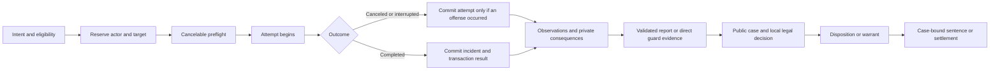

# MCA: Crime — technical audit and implementation specification

**Audit date:** 2026-09-05  
**Repository:** [otectus/MCACrime](https://github.com/otectus/MCACrime)  
**Audited revision:** [`b3e6e6c0bdf8151e80329ab8b104fcb8995689f8`](https://github.com/otectus/MCACrime/tree/b3e6e6c0bdf8151e80329ab8b104fcb8995689f8), version **0.5.1**. `git ls-remote origin refs/heads/main` matched this revision during the audit.  
**Target:** Java 17, Minecraft 1.20.1, Forge 47.x, MCA Reborn. This is an implementation specification, not a claim that the proposed changes have been implemented.

**Navigation:** [Scope and verification](#1-executive-direction-and-scope) · [Current systems](#2-current-implementation-map) · [34 findings](#3-prioritized-defect-and-refinement-register) · [Architecture](#4-authoritative-architecture-and-implementation-contracts) · [Evidence and AI](#5-evidence-law-and-villager-behavior) · [Custody and sentences](#6-custody-arrest-prison-and-player-agency) · [Gameplay modules](#7-criminal-loops-and-substantial-optional-features) · [Network/UI/config](#8-networking-ui-configuration-and-integrations) · [Migration](#9-persistence-migration-and-failure-recovery) · [Performance](#10-performance-and-technical-cleanup) · [Tests](#11-verification-requirements-and-acceptance-suite) · [Phases](#12-phased-implementation-plan-for-the-coding-agent) · [Research](#13-comparative-research-and-adapted-design-rationale) · [Pinned sources](#14-source-navigation-for-implementation)

## 1. Executive direction and scope

The most valuable update is a coherent justice and custody system built on the existing mod. MCA: Crime already contains substantially more than its README describes: cases, observations, reporting, civilian reactions, player and NPC captivity, guard challenges, escorts, generated cells, thieves, fences, player bounties, and optional companion integrations. The chief weakness is that these systems do not consistently share their rules. A menu may prohibit an action that a command permits; a sentence may settle unrelated cases; a restrained player may remain unrestricted; a report may influence enforcement without sufficient evidence; and separate economic paths have different failure guarantees.

Implement the reliability work first. Then make consequences understandable and fair. Add substantial gameplay only after the same rules hold across commands, menus, NPC controllers, multiplayer, restart, and failure recovery.

### 1.1 Deliverable hierarchy

| Release work | Required outcome | Scope boundary |
|---|---|---|
| Maintenance release | Close payment, capture, sentencing, packet, persistence, and world-edit defects; correct documentation | Preserve registry IDs and existing worlds; no new crime categories required |
| Justice and polish release | Evidence-based enforcement, unified custody, usable case UI, bounded AI, coherent balance | Build on existing classes; migrate incrementally |
| Optional gameplay modules | Explicit ownership/theft, contraband searches, witness interactions, restorative sentences, richer bounty pursuits | Independently configurable; disabled until their prerequisites and tests pass |
| Extension work | Stable companion contracts, diagnostics, datapack authoring | Crime owns justice; other add-ons retain ownership of general reputation, quests, professions, relationships, and economies |

Do not treat every optional proposal as a prerequisite for a release. The complete backlog is specified so a coding agent can make coherent incremental changes without inventing incompatible foundations.

### 1.2 Evidence and verification limits

The review covered the repository structure, production packages, configuration, resources, tests, build, documentation, and cross-system execution paths. The snapshot contains **356 production Java files, 94 test source files, and 73 resource JSON files**. All 73 JSON files parsed successfully. This is broad static and build verification, not a proof that every possible defect has been found.

Verification performed:

- `gradlew.bat cleanTest build --offline`: successful fresh test execution and packaged build.
- **699 tests, 0 failures, 0 errors, 0 skipped**, across 94 XML test suites.
- MCA binding probes passed against **7.6.20+1.20.1**, **7.7.0-beta.2+1.20.1**, and **7.7.1-alpha.2+1.20.1**.
- `checkJarContents` passed for `mcacrime-0.5.1.jar`; companion implementation classes were not accidentally bundled.
- Current remote `main` matched the local audited revision.

No real-client gameplay, dedicated-server multiplayer scenario, crash injection, visual screenshot comparison, or CPU profile was executed during this audit. Existing passing tests validate many calculations and isolated state transitions; they do not establish that service compositions are correct. The manual checklists contain unchecked items and contradictory expectations. GitHub issue pages could not be retrieved through browsing, so findings below are source findings and design proposals, not an asserted complete inventory of reported issues.

Finding labels:

- **C — confirmed source defect:** the code demonstrably omits a required guard, loses information, contradicts another path, or performs an incorrect transition. A reproduction is still required before shipping a fix.
- **R — credible runtime/compatibility risk:** the source exposes a plausible failure that depends on Forge ordering, another mod, world geometry, or concurrency. Validate the scenario; do not advertise it as an observed exploit.
- **D — deliberate design refinement:** current behavior may be intentional but is a poor default or creates an avoidable gameplay problem.

Priority: **P0** protects items/money, saves, world integrity, or authoritative state; **P1** repairs core gameplay and multiplayer correctness; **P2** improves polish, maintainability, and balance; **P3** is optional expansion. Effort: **S** localized, **M** several cooperating classes, **L** cross-system work, **XL** a separately releasable module. These are relative estimates, not calendar promises.

## 2. Current implementation map

All package paths below are relative to `src/main/java/dev/otectus/mcacrime/`.

| Area | Current implementation | Assessment and intended ownership |
|---|---|---|
| Bootstrap/config | `McaCrime`, `McaCrimeConfig`, `config/ConfigValidator` | Large COMMON config plus CLIENT presentation config. Keep server authority, introduce validated immutable policy snapshots and explicit reload behavior. |
| Detection | `detect/CrimeDetectionHandlers`, `CrimeDetector`, `CrimeGate`, `CrimeClassifier`, `WitnessChecker`, `CrimeCommunityResolver` | Damage/death and direct action entry points. Separate actual incident commitment from knowledge and enforcement. |
| Crime definitions | `crime/type/*`, `data/mcacrime/mcacrime/crimes` | Twelve shipped definitions: harm/kill villager, assault guard/player, murder player, theft, kidnap, extortion, jailbreak, mugging murder, attempted mugging, mugging. IDs exist without every actor/path using identical semantics. |
| Morality and player state | `crime/CrimeMath`, `engine/CrimeState`, decay/reconciliation, `state/PlayerCrimeData` | Karma, Heat, band, wanted state, arrest and jail state. Public law must no longer be inferred from arbitrary private case count. |
| Cases and storage | `ledger/*`, `state/world/CrimeWorldData`, `CrimeDataMigrations` | Indexed case ledger, resolutions, outbox, memories, custody, cells, criminals, stolen goods, warrants. Current world schema is **7**. Retain overworld SavedData ownership; split responsibilities behind repositories. |
| Observation and social response | `memory/*`, `ai/CrimeReactionService`, `dialogue/*`, `relationship/RelationshipConsequences` | Victim/eyewitness/hearing memories, help seeking, compliance, resistance, flight, reports, hearts and village consequences. Good foundation, but several enforcement and social paths bypass knowledge. |
| Player actions | `action/*`, `action/handler/*`, legacy `mug/MuggingService`, `captivity/Capture*` | Twelve handlers and additional capture/NPC mug channels. Consolidate session locking and terminal outcomes without removing command access. |
| Guards and justice | `enforcement/*`, `economy/FineService`, `SurrenderService`, `SentenceCalculator` | Challenges, refusal, lawful targeting, force, escort, NPC pursuit/custody. Several independent legality and eligibility checks disagree. |
| Captivity/jail | `captivity/*`, `jail/*`, restraints and render state | Lawful/unlawful custody, rope/cuffs/locked cuffs, rescue, ransom, escape, assigned jails, generated holding cells. Authority is divided across custody, arrest and jail objects. |
| Criminal NPCs | `job/*`, `ai/thief/*`, `mug/npc/*` | Persistent thief/fence roles; thieves target players, take currency or one eligible item, flee guards, and can be arrested. Roles are not proof of crimes. |
| Economy | `economy/*`, `economy/account/*`, `economy/fence/*`, `ransom/*` | Currency abstraction, finite villager purses/treasuries, fines, bail, ransom, fence offers, receipts. Strengthen failure/retry guarantees and stock persistence. |
| Bounties | `bounty/*`, warrant/claim/contract records | Player warrants and kill/alive rewards; optional generic bounty-board quest. Autonomous bounty-hunter parties and a full NPC warrant system are future features. |
| Network/client | `network/*`, `client/*`, `client/screen/*`, `client/hud/*` | Protocol 7; server requests, private status, public band/restraint/job sync, menus, dossier, HUD, MCA interaction button. Harden direction, sizes, freshness and tracking scope. |
| Compatibility/API | `compat/*`, `compat/mca/*`, `api/*`, `integration/*` | Runtime MCA binding, public read views/events, optional Reputation/Quests/Locks adapters and integration outbox. Preserve no static MCA linkage. |
| Assets/packaging | resources, `build.gradle`, Gradle wrapper, `META-INF/mods.toml`, docs | Restraint assets, one client pose mixin, item/tag/recipe/dialogue data, tests and manual checklists. Documentation and release reproducibility need repair. |

### 2.1 Existing strengths to preserve

Keep UUID-based identities, dimension-aware community keys, overworld SavedData, immutable public views, data-driven crime/dialogue definitions, the action handler seam, finite purses, nonce/result caching, pure calculation tests, the MCA member manifest and probe fleet, optional adapters behind bridges, client logout cache clearing, and compare-before-restoring cell blocks. Expand these protections where currently incomplete.

Do not replace the mod with a new ECS, database, generalized event-sourcing framework, or full NPC brain. Introduce small coordinating services around the current repositories and actors. Several types already exist, including `CrimeActor` and `VillagerCrimeActor`; extend them rather than creating competing abstractions.

## 3. Prioritized defect and refinement register

Every item below includes an implementation direction and a regression requirement. Shared architecture and exact behavior are further specified in sections 4–10. A test of a helper predicate alone does not close a service-level finding.

### B01 — Fine policy differs between UI and execution

**P0 · C · M.** `GuardChallengeService` checks `MANDATORY_CUSTODY` when deciding whether to show payment. `FineService.pay` does not enforce that case flag. Direct `/crime payfine` and `SettleCaseActionHandler` can therefore reach payment under rules the guard UI rejects, when other fine gates permit it. `FineCalculator` quotes aggregate Heat, while `FineAllocation` can charge a base per selected case; the displayed amount need not equal the eventual debit.

Implement `SettlementQuote` and a single settlement policy used by the guard UI, dossier, commands and action handlers. Include selected case IDs/revisions, exact currency amount, expiry, permission and rejection reason. Reject mandatory-custody cases in the execution service regardless of entry point. Never clear Heat for cases whose resolution failed. Preflight cancelable resolution events before charging; return a typed outcome if payment or resolution cannot complete.

**Regression/acceptance:** create a low-Heat mandatory-custody case; GUI, command and forged valid-menu request all reject payment without inventory change. With three cases, the quoted total equals the debit. Cancel one case resolution and verify the transaction is either wholly rejected or requoted before consent; no partial unannounced charge.

### B02 — Surrender rewards precede successful arrest

**P0 · C · M.** `SurrenderService.surrender` reduces Heat, clamps it below the jailable threshold, stamps surrender, and clears escaped status before `ArrestService` establishes custody/destination. Arrest can fail because no cell is available. Repeat surrender can also modify an existing sentence.

Prepare a lawful disposition first. Reserve a safe destination or choose an explicit noncustodial disposition. Only a committed disposition earns the one-time surrender discount. The discount belongs to a sentence/case set and cannot stack. If surrender cannot be accepted, retain cases, Heat, escape status and timers, and tell the player why. Do not manipulate Heat merely to make a later eligibility check pass.

**Regression/acceptance:** disable fallback/cell generation and remove assigned jails; repeated surrender changes no legal state. Surrender during an existing sentence cannot shorten it again. A successful surrender applies its discount once after restart/retry.

### B03 — Sentences settle cases that were never sentenced

**P0 · C · M.** `SentenceResolutionService` selects all of the offender's current actionable cases in `markServed`, `markBailed` and `markEscaped`. A `sentenceId` in resolution context does not constrain the selection. Crimes committed after a sentence started can be marked served or bailed with the older sentence. Escape also relabels unrelated cases; `ESCAPED` itself remains actionable in the current implementation and is not a completed settlement.

Persist an immutable sentence case set and the case revisions on which it was based. Resolution selects that set only. New offenses remain separate, with explicit consolidation only through a new adjudication. Escape is a custody transition plus, where justified, a new escape incident; it is not settlement of every open case. Apply the same case binding to NPC sentences, whose release currently does not settle their case ledger.

**Regression/acceptance:** sentence cases A/B, commit C, serve/buy release for A/B; C remains actionable. Repeat callbacks do not add duplicate resolutions. NPC release resolves its assigned cases and retires related reports. Migration behavior is defined in section 9.

### B04 — Capture can consume a restraint and report false success

**P0 · C · M.** `CaptureTicker` consumes the restraint before `CustodyService.capture`, ignores the capture result and emits success. `ArrestService` similarly ignores the result of lawful capture. Multiple capture/action systems have independent locks; eligibility can change during a channel.

Use one actor/target session reservation and one `CaptureCommitResult`. Validate all conditions immediately before commit. Reserve the exact restraint stack/slot, install custody, then consume under the transaction contract; release the reservation on rejection. A failed custody transition must never show success or consume an item. Commands, restraints and action-menu capture must call the same service.

**Regression/acceptance:** two players complete capture against the same target in the same tick; exactly one wins and only that player's restraint is consumed. Kill, rescue, change dimension, change config, fill the captor's quota, or remove the restraint during the channel; each yields one correct terminal result.

### B05 — Player restraints are not derived from custody consistently

**P0 · C · L.** Unlawful player capture and bounty-hunter capture create custody but do not establish the same arrest restraint state used by `RestraintHandlers` and player visual resolution. These players can therefore have custody records without the corresponding restrictions/visuals. `CustodyService.tick` skips all lawful records on the assumption that jail owns them; hunter-held players awaiting delivery are a distinct state and can miss the intended timeout/owner handling.

Make custody phase and restraint type authoritative. Derive action restrictions, visuals, speed and tether behavior from a shared `RestraintPolicy` over custody. Do not infer restraint exclusively from `ArrestStates`. Model `HUNTER_HELD` explicitly, with a delivery deadline, owner-disconnect policy and absolute captivity cap. Reconcile existing records on login without silently escalating them to a new sentence.

**Regression/acceptance:** lawful guard, lawful hunter and unlawful player capture each give consistent rules to subject and observers. Late tracking, death/clone, reconnect, owner death and failed delivery leave no invisible restraint, permanent speed modifier or unlimited captivity.

### B06 — Economic receipts do not provide a complete transaction guarantee

**P0 · C/R · L.** `EconomicTransactionService` records a receipt before some debits/credits. `Currency.credit` returns no success status. Fine, ransom, purse, bounty and stolen-goods paths use different sequences. A provider exception or failed debit can consume a receipt without delivering value; a crash between player inventory saves and SavedData saves can produce ambiguous recovery.

Implement the transaction contract in section 4.5: explicit provider identity, stable transaction IDs, prepared/committed/delivered states, bounded pending operations and idempotent delivery where supported. Never promise cross-file atomicity from `setDirty`, `synchronized`, or an in-memory receipt. Expose ambiguous external delivery as a recoverable diagnostic state; do not blindly issue a second credit. Use the correct `TransactionReason` rather than classifying purse theft and every transfer as restitution.

**Regression/acceptance:** failed charge, throwing provider, failed credit, duplicate completion and injected crash/save orderings have documented conservation outcomes. Ordinary failed operations leave inventory and case state unchanged. No operation is reported paid until delivery is verified or durably owed.

### B07 — Fence stock resets on reopening

**P0 · C · M.** `FenceTradeService.open` constructs a new `FenceMerchant` and fresh offers with uses reset. Per-offer maximum uses therefore do not impose persistent stock; two players also receive independent offer instances.

Persist stock and buy budget by fence UUID, stock epoch and offer ID. Reserve/decrement it at trade commit on the server thread. Reopening, two simultaneous menus and reload must share the same stock. Store restock time in monotonic world game time, with an explicit disabled state. Revalidate fence existence, job, custody, distance, dimension and current menu revision before trading and in `stillValid`.

**Regression/acceptance:** exhaust an offer, reopen and reconnect: it remains exhausted until the scheduled restock. Two players compete for the last unit; only one trade succeeds. A dead, removed, distant or jailed fence cannot continue trading from an old menu.

### B08 — Fence price policy permits adverse incentives and unsafe values

**P0/P1 · C/D · M.** `FencePricing` derives the fence's buy price from its marked-up sell price, so increasing Heat can increase what the fence pays the player. Existing tests establish `buy < sell` for the same state, not across players/states. `FenceGoodsRegistry` merges directional flags with OR, preventing a datapack `false` from reliably removing a tag/provider direction. Large configured/data prices can reach unbounded emerald-stack construction before offer validation.

Price buy and sell directions separately; risk raises the player's purchase price and reduces or leaves unchanged the fence's purchase offer. Enforce cross-state arbitrage bounds against the minimum possible sell price and maximum possible buy price. Apply a defined provider → tag → datapack override → blacklist precedence, with explicit remove/replace semantics. Bound arithmetic and reject unsupported merchant costs before creating stacks.

**Regression/acceptance:** sweep allowed Karma/Heat/Wanted/config extrema and two-player permutations; no unbounded buy-low/sell-high loop. A datapack can turn buying or selling off. Negative, nonfinite, overflow-sized and nonexistent-item entries produce bounded diagnostics and preserve the last valid registry.

### B09 — Bounty revisions and retention can reopen paid rewards

**P0 · C/D · L.** A claim key includes warrant revision. A new crime can revise an open warrant, permitting another reward based on its whole history. `BountyClaimLedger.expire` removes old claims without ensuring their warrant is terminal. The same live revision can become payable again after retention. Reward payment is marked before a void credit, and kill reward eligibility is not the same explicit check as lawful lethal force.

Attach reward lots to newly eligible case IDs, with an immutable funded amount and one resolution across alive/dead/quest paths. Preserve terminal claim tombstones while any referent can still be replayed. If revisions remain, pay only the eligible unpaid delta; never repay old lots. Kill rewards require an explicitly lethal-eligible warrant at the instant of lawful attribution. Alive delivery validates receiving authority, custody and warrant again. See section 7.5.

**Regression/acceptance:** kill/re-capture, revise the warrant, restart, expire ordinary history and replay a quest signal: old reward lots never repay. Two hunters resolving simultaneously receive at most the policy's single award or explicitly split award.

### B10 — Stolen property can disappear during recovery or cleanup

**P0 · C/R · L.** `StolenGoodsLedger.claim` removes records before recovery delivery. Death recovery is attached to `LivingDropsEvent` at high priority, where later cancellation/other death systems need compatibility testing. Arrest returns only to nearby online owners. Expiry removes property whose thief is inactive, conflating laundering, unloading and loss. Non-item currency recovery can lack an eligible recipient/provider.

Create an evidence/property inventory with ownership and delivery state. Arrest transfers custody of property to that inventory regardless of owner online status. Offer owner-specific claim access later. Default death recovery uses one documented drop/escrow route, with a receipt for actual handoff; never spawn both. Preserve full ItemStack NBT and provider ID. Expire investigation metadata separately from undelivered owned assets. Missing providers/dimensions place assets in recoverable storage.

**Regression/acceptance:** offline/far owner, full inventory, grave mod canceling drops, thief unload, dimension removal, restart and provider removal preserve one recoverable copy or one acknowledged delivery. No cleanup deletes an outstanding property claim merely because its entity is unloaded.

### B11 — Load-time caps silently discard valid runtime records

**P0 · C · L.** Several `CrimeWorldData` collections accept more entries while running than the loader restores: criminals/stolen goods/warrants are capped at 4096, claims at 8192 and contracts at 1024. Other long-lived collections are unbounded. Evicting actionable reports or pending observations also changes justice semantics under pressure.

Apply consistent insertion/load policies and separate active critical state from archiveable history. Never silently drop custody, owed property, live warrants, unsettled payments or unresolved cell restoration. When capacity is exhausted, reject the new dependent action before taking an item/payment; aggregate redundant observations where safe. Preserve overflow legacy records in a quarantined/archive section with counts and recovery tooling. Add indices and incremental maintenance rather than raising every cap indiscriminately.

**Regression/acceptance:** save/reload at limit−1, limit, limit+1 and malformed legacy oversize fixtures. Every accepted critical record survives; rejected operations have no side effects. Active evidence cannot be erased by generating cheap unrelated reports.

### B12 — Malformed records and future schemas need end-to-end protection

**P0 · C · M.** `CrimeRecord.load` can retain a null crime type from `ResourceLocation.tryParse`; later saving calls `type.toString()`. Future-schema data is preserved read-only in `CrimeWorldData`, but higher-level operations can still mutate player capabilities, inventory or blocks while the world store refuses or lacks data.

Validate each record independently, preserve invalid original NBT in a quarantine entry, and keep the rest of the world readable. Unknown valid namespaced crime IDs remain valid historical records. Introduce one server mutation gate for unsupported future schema and storage failure; all actions, decay, job mutation, payments, custody and world building must consult it. Read-only status should be explicit to operators and affected players.

**Regression/acceptance:** malformed type/UUID/dimension/enum, negative clocks and truncated compounds cannot prevent unrelated records from saving. Loading schema N+1 leaves original NBT intact and prevents every Crime-owned mutation, including emerald consumption and cell placement.

### B13 — Private case existence grants public enforcement authority

**P1 · C/D · L.** `ChallengeBasis` and `GuardChallengeService` allow any actionable case count to establish a challenge. `CrimeDetector` stores unwitnessed incidents too. Thus the report/identity/jurisdiction path does not consistently determine what guards know. `MugActionHandler` additionally issues a guard alert directly rather than through observed communication.

Separate private incident truth from admissible public cases. A guard may intervene in a personally perceived active threat, act on a valid local report/warrant, or respond to visible unlawful custody. Private case count, negative Karma, or a controller's omniscient actor UUID must not silently substitute for evidence. Preserve any explicitly selected legacy red-band law as a documented separate server policy, not as inferred witness knowledge.

**Regression/acceptance:** an unseen crime behind a wall changes configured private morality but triggers no guard challenge or public standing penalty. A witness reaches a guard and the appropriate case becomes actionable once. A case in another jurisdiction does not automatically authorize local punishment.

### B14 — Reports can duplicate consequences and outlive resolved cases

**P1 · C · M.** `ReportService.file` creates a fresh report ID each time, and standing penalties can apply per report. `deliver` does not itself verify reporter ownership of the observation, competence, range/LOS, expiry and `canReport`. `actionableAgainst` filters expiry/jurisdiction without filtering resolved cases. Jurisdiction may be recomputed from the reporter when the original victim is unavailable.

Use a stable `(incidentId, observerId, evidenceKind)` identity and one public consequence per incident/community. Store crime location and jurisdiction at commitment; never move it to a reporting witness. Validate delivery at commit and filter terminal cases everywhere. Multiple independent witnesses strengthen evidence within a cap; they do not multiply the crime's base penalty. Keep failed delivery pending for bounded retry rather than marking the controller reported first.

**Regression/acceptance:** deliver one observation repeatedly, use the wrong reporter, move the guard behind a wall, unload/kill the victim, and resolve the case before a delayed report arrives. There is no duplicate penalty, relocated case, stale warrant or false completed delivery.

### B15 — Witness detection overstates identity and competence

**P1 · C/D · M.** `WitnessChecker` scans an inflated box and primarily checks sight to the victim. The observation layer can record a known offender despite no sight of that offender. Sleeping/captive/incompetent observers and vertical/diagonal range need a shared perception policy.

Use a broad-phase AABB followed by squared spherical range and explicit perception samples to the relevant act and actor. Distinguish seeing harm, recognizing an actor and merely hearing disturbance. Do not infer identity from a server UUID. A victim can recognize a nearby attacker independently of third-party witnesses; a sleeping victim may wake and observe subsequent acts. Hearing alone supports investigation, not conviction. See section 5 for confidence and disclosure rules.

**Regression/acceptance:** walls, glass/opaque-block policy, corners, floors, invisibility, projectile shooters, sleeping villagers and captive witnesses produce the specified role/confidence. No test should equate seeing a hurt villager with seeing the shooter.

### B16 — Damage detection uses an unreliable lethal prediction

**P1 · C/R · M.** `CrimeDetector.onHarm` skips harm when the incoming `LivingHurtEvent` amount is at least the victim's health. Forge processes armor/magic reduction after its living-hurt hook; predicting death here can omit assault when the victim survives. Zero/modified/canceled damage and death cancellation also need correct event treatment. [Forge's LivingEntity patch](https://raw.githubusercontent.com/MinecraftForge/MinecraftForge/1.20.x/patches/minecraft/net/minecraft/world/entity/LivingEntity.java.patch) supports the ordering concern; the final patch must verify the exact pinned 47.4.10 source and player/entity branches.

Aggregate combat incidents using a stable hit/encounter ID, confirm actual applied harm at an appropriate hook or bounded end-of-tick reconciliation, and upgrade to killing only after confirmed death. Avoid charging assault and murder twice for the same terminal hit. Do not permanently consume a cooldown for a canceled/non-damaging event. Account explicitly for armor, absorption, shields, totems, resurrection and downstream cancellation.

**Regression/acceptance:** an incoming nominally lethal hit reduced by armor produces one assault; a totem save is not murder; a canceled hit produces neither; confirmed death produces the chosen single upgraded case.

### B17 — Raid and self-defense exemptions are too broad

**P1 · C/D · M.** `CrimeGate` treats an active raid as broad grace and treats the victim targeting the attacker as self-defense. A player who provokes a guard/retaliating villager can then exploit that retaliation as lawful justification. Player attribution does not yet cover every owned projectile/pet/environmental cause.

Track initiating aggression, lawful response and disengagement in bounded combat encounters. Self-defense authorizes proportionate response to an unjustified attack; it does not legalize attacking a guard responding to the player's offense. Raid grace applies to configured accidental friendly fire, not deliberate repeated assault or murder. Add source-attribution adapters for well-supported indirect causes; unknown cause stays unattributed rather than accusing the nearest player.

**Regression/acceptance:** provoke guard then kill; defensive victim then killed; accidental raid splash versus repeated aimed attacks; projectile, pet and unattributed environmental damage. Each has one documented classification and no revenge-loop exemption.

### B18 — NPC arrest can fabricate a new witnessed attempted mugging

**P1 · C · M.** Report-based NPC pursuit constructs a committed incident without `CAUGHT_IN_ACT`, but `NpcArrestService.commitAttempt` can add a new attempted-mugging record with caught-in-act and mandatory-custody flags anyway. Controller arrest state can be changed before custody succeeds.

Pursuit must carry a typed `LegalDecision` referencing existing case/evidence IDs. Arresting on a report must not manufacture another offense or eyewitness evidence. An interrupted active attempt may commit exactly one attempt case if that attempt truly occurred. Stage controller changes until custody commits.

**Regression/acceptance:** report a completed mugging, arrest the thief later: exactly the original eligible case is sentenced. Arrest a genuinely active interrupted attempt: one attempt case, with caught-in-act only for an actual perceiving responder. Failed capture leaves the NPC in a valid pursuit state.

### B19 — Guard conversations and assignments lack shared validity

**P1 · C/R · M.** Challenges can be initiated/responded to without consistent current guard reach/LOS/aliveness checks. A failed fine payment can close the encounter as refusal. Nearby guards are reused through player scans and `LawHold`, creating potential multi-offender control conflicts. Selecting a busy nearest responder can prevent selection of another available guard.

Assign one encounter owner and bounded backup responders through a coordinator. Revalidate response origin, guard, dimension, reach, LOS and encounter revision. Insufficient money, stale quote or transport failure keeps a nonhostile explanation/requote state; it is not resisting arrest. Closing a screen is not an affirmative refusal. A dead/unloaded guard invalidates or transfers the encounter without punishing the player.

**Regression/acceptance:** two offenders plus an innocent bystander cannot clear each other's guard ownership. A distant/dead guard cannot accept payment or refuse on the player's behalf. A player who cannot afford the fine gets surrender/review choices without immediate attack.

### B20 — Thief control does not reconcile all eligibility and custody changes

**P1 · C/R · M.** `ThiefBehaviorService` can recreate a scouting controller without first honoring persisted custody. Approach has weak path-progress/timeout handling. Ongoing NPC mugging does not consistently revalidate LOS, target creative/spectator/custody status or changed feature flags. `onMugEnded` records failure even after success. The nearest guard heuristic can miss a more dangerous visible guard.

Give custody higher priority than criminal AI, revalidate target eligibility throughout an attempt, and use bounded approach/search/retreat states. Record successful and failed attempts separately. Score the top bounded set of nearby responders with perception and path availability. Enter states through one transition method so cleanup and navigation changes always execute.

**Regression/acceptance:** reload with a jailed thief beside a player; no mugging occurs. Put a target behind an unreachable barrier; the thief abandons within the configured deadline. Switch target to spectator, draw a weapon, remove LOS, disable thieves, or start custody mid-mug; no theft commits afterward.

### B21 — NPC pursuit and escort can arrest through walls or stall indefinitely

**P1 · C/R · M.** `NpcCriminalPursuit` uses exact live target coordinates and can arrest within distance without a corresponding LOS check. `NpcCustodyService` can replace an overdue guard with the same stuck nearest guard and restart the timer. Invalid dimensions and unavailable destinations need bounded recovery.

Use last-seen pursuit, actual reach/LOS for restraint, navigation progress and exclusion of failed guards. An escort lease has a nonrenewable overall deadline; reassignment cannot reset it indefinitely. Resolve failure to a validated fallback or nonpunitive custody release with cases retained. NPC sentence service must share player case settlement invariants.

**Regression/acceptance:** a wall two blocks thick prevents arrest; losing sight starts search. A stuck guard is not repeatedly reselected; the escort resolves within its total deadline. Unloaded entities never become implicitly dead or permanently imprisoned.

### B22 — Generated-cell removal can abandon blocks and restoration data

**P0 · C/R · L.** `HoldingCellService.dismantle` removes the cell record before restoration; unloaded portions are skipped and cannot be retried. `CellBuilder` does not consistently check placement results, protection hooks, occupancy or hazards. Block-state snapshots can be affected by neighbor updates. Expiry can dismantle an occupied cell. Breaking generated materials may create a renewable resource source.

Treat temporary construction as a journaled world operation. Retain per-block restoration records until resolved; retry on chunk load without force-loading the world. Record final placed states after neighbor updates, compare before restoration and preserve unrelated edits. Preflight claims, border, block entities, fluids, other occupants and safe floor/volume. Never expire an occupied cell before transferring/releasing its inmate. Give temporary blocks explicit drop and piston/explosion policies or avoid generated cells in protected/player-built areas.

**Regression/acceptance:** cell across a chunk boundary, partial placement rejection, restart during build/removal, player edits, piston/explosion, inmate still inside at TTL and repeated cell creation. No permanent unwanted blocks, duplicated bars, overwritten player build or missing recovery record.

### B23 — Jail teleport/safety checks can report success without a safe destination

**P0 · C/R · M.** `JailService` can accept a jail assignment while teleport fails. `findSafeStand` checks air and non-air support instead of full collision, hazards and entity clearance; unloaded anchors use a raw above-anchor fallback. Missing-dimension/fallback reconciliation is incomplete.

Create one `SafeCustodyDestination` validator used by player jail, NPC jail, fallback, escort and release. Verify dimension, border, loaded availability, collision box, support, hazards and occupancy. Treat teleport return/actual destination as part of the result. If safe relocation is impossible, release physical restrictions or defer intake under a bounded explicit state; never claim a player is safely jailed after failure.

**Regression/acceptance:** slabs, fences, cactus, magma, lava, powder snow, suffocation, world border, removed dimension and canceled/modded teleport. No item loss, repeated unsafe teleport loop or permanent custody.

### B24 — Captivity clocks, limits and escape controls disagree

**P1 · C/D · M.** Login cleanup releases every captive after the first even when `maxUnlawfulCaptivesPerCaptor` permits more. Locked-cuff escape can be enabled with a nonzero chance but work duration remains `Integer.MAX_VALUE`. Escape interruption lacks a consistent terminal UI update. PHYSICAL jail time continues while escaped, allowing an escaped sentence to finish as served.

Honor configured quotas deterministically by capture time/ID, not hardcoded one. Supply meaningful work duration for every escapable restraint. Define all clocks and offline behavior in section 6. Absolute deprivation caps continue through transfers; sentenced service time pauses outside valid custody. Distinguish administrative safety release from sentence completion. Show current progress and reason on every terminal path.

**Regression/acceptance:** quota 3 retains three valid captives after reconnect; enabled locked-cuff escape completes in configured time. Escape pauses served time but not the bounded safety policy. Transfer/re-capture cannot renew an unlimited captivity chain.

### B25 — Session/menu authorization can become stale or cross systems

**P0/P1 · C/R · M.** Menu sessions do not bind the exact issued action set, and some instant targeted handlers rely on opening-time reach checks. Capture, action sessions and NPC mugging maintain separate locks. Session completion does not uniformly prove that it won the terminal transition. Rescue can release custody, trigger cancellation cleanup, and subsequently finish again.

One `InteractionSessionCoordinator` owns actor and target leases for all coercive/economic channels. A menu token binds actor, target, dimension, offered action IDs, policy/revision and expiry. Every action revalidates relevant reach, LOS, eligibility, permissions and required items at execution. Use a compare-and-transition terminal guard; only the winning terminal transition emits events, rewards, feedback and unlocks. Bind request nonce to a payload hash.

**Regression/acceptance:** request a nonoffered action, reuse nonce with a changed payload, move away after opening, start capture during mugging, and complete rescue while release callbacks fire. All rejected paths are side-effect-free; each session has exactly one terminal outcome.

### B26 — Packet direction and decoding limits are incomplete

**P0 · C/R · M.** `CrimeNetwork` registrations lack explicit `NetworkDirection`. Dist-based S2C handling is not logical-side authorization: an integrated server runs in physical CLIENT. Bulk map decoders have no application-level entry bound. Some collection decoders clamp counts without consuming/rejecting excess entries, risking field misalignment. Most C2S requests lack rate limiting.

Register each packet with its legal direction, retain server-thread enqueueing and enforce sender/context. Reject invalid counts before allocation or iteration; never silently clamp a serialized count and then decode trailing fields from the wrong offset. Bound strings, entries, bytes and pending requests. Add token buckets per request category. Snapshot packets must never be accepted as server commands. See section 8.1. [Forge sides](https://docs.minecraftforge.net/en/1.20.1/concepts/sides/) and [SimpleImpl guidance](https://docs.minecraftforge.net/en/1.20.1/networking/simpleimpl/) explain the distinction and validation obligations.

**Regression/acceptance:** wrong-direction packets are rejected on dedicated and integrated servers; oversized/negative counts, invalid enum values, stale IDs and packet floods do bounded work and mutate no game state. Malformed payloads never become an implicit REFUSE action.

### B27 — Client snapshots expose unnecessary global state and stale timers

**P1/P2 · C/D · M.** Restraint bulk/broadcast paths distribute records more broadly than entity tracking requires. Multiple state changes produce duplicate self-status updates. Captivity cap data is not consistently refreshed/counting down, and one client action-progress channel can be overwritten by unrelated sessions. Dossier results stop at 64 records without pagination and use totals that can differ from payable quotes.

Send private data only to its subject/authorized viewer; send observable poses/jobs only to tracking clients. Use subject UUID plus entity lifecycle validation, per-stream revisions and batched end-of-tick diffs. Give each active channel an ID and role. Send server time/remaining duration and periodic correction, plus explicit unlimited/paused flags. Add paginated dossier queries with server filters and quote-backed totals.

**Regression/acceptance:** a late tracker sees correct restraints; a nontracker receives no private custody owner/property list. Reconnect/dimension transfer clears stale entity IDs. Two simultaneous channel roles cannot overwrite each other's terminal status.

### B28 — Ransom and relationship consequences bypass common semantics

**P1 · C/D · M.** `RansomService.settle` appends extortion directly rather than using the usual Heat/Karma/observation/integration pipeline. Demand payment does not fully revalidate expiry and ownership at the moment of transfer, and selection is implicit. Village ransom cooldown keys omit dimension. Apology can restore hearts repeatedly; rescue family gain ignores `familyHeartGain`; `witnessTrustLoss` and other declared social settings are unused. Unwitnessed acts can affect loaded relatives/village standing without a knowledge route.

Commit extortion through the incident service exactly once at the defined stage. Bind payment to demand ID, owner revision, currency and current expiry. Dimension-scope cooldowns. Make apology/restitution/rescue benefits incident-bound and capped, with knowledge-aware recipients and deduplicated family IDs. Do not grant rescue/reputation rewards to an offender or collaborator for undoing a captivity they created. Keep family content in MCA; Crime emits contextual consequences.

**Regression/acceptance:** two demands for one payer cannot select the wrong captive; expired/ownership-changed demands charge nothing. Same village number in two dimensions has independent cooldowns. Repeated apology or friend kidnap/rescue cycles cannot manufacture unlimited hearts or standing.

### B29 — Role assignment can overwrite important NPC state

**P1/P2 · C/R/D · M.** Criminal assignment repeatedly rolls on eligible adults, so a low per-sweep probability is not a stable population percentage. Guard promotion does not consistently exclude criminal/captive/special actors. Profession presentation overwrites the stored previous profession on changes; reverting an unloaded entity clears restoration metadata before a live restoration is possible. Stale-record cleanup can forget a living unloaded criminal.

Introduce village role caps and persistent assignment cohorts/cooldowns. Exclude guards, archers, children, captives, active quest actors, protected roles and configured family/player-owned NPCs. Keep the original profession snapshot until restoration succeeds, with compare-before-restore ownership. Prefer an overlay role label to replacing actual work/trade professions. Never infer death from long unloading.

**Regression/acceptance:** a village visited for 100 days does not steadily turn everyone into a criminal. Disable presentation while a fence is unloaded, reload it: original profession is restored. Guard top-up cannot promote a jailed thief or consume a protected quest actor.

### B30 — Reload, lifecycle and error handling are not uniformly isolated

**P1 · C/R · M.** `McaCrime.onConfigReload` checks COMMON type but not the owning config/mod, then changes caches, currency, presentation and fence registry without an explicit server-thread handoff. Several static services have independent cleanup; `CrimeMaintenanceSweep.clearAll` is not wired into the same lifecycle. Detection can permanently disable itself after catching `Throwable` for the session. Companion holder/initialization state needs integrated-server world-switch testing.

Filter reloads by the exact Crime config. Parse and validate a complete candidate policy, then apply on the server thread at a tick boundary. Retain the last good policy on rejection. Move runtime maps/counters under a server-scoped context or a single lifecycle owner, with explicit client-only caches separate. Catch expected compatibility failures locally; do not swallow VM-fatal errors or disable all detection indefinitely because one entity hook fails. Surface degraded feature status with rate-limited diagnostics.

**Regression/acceptance:** reload another mod's COMMON config: Crime changes nothing. Open world A, close it, open world B in the same client process: no old cooldown, holder, maintenance time or disabled-detector flag survives. A recoverable adapter error disables only the dependent feature.

### B31 — Integration ownership and recovery need stronger contracts

**P1 · C/R · L.** The outbox is a useful retry foundation, but capacity/revival and late success after local fallback need accounting. Reputation authority is claimed in the replay-start path, coupling authority ownership to a delivery option. The Quests adapter tracks accepted holders in a static set without reconstructing that index from saved quests; its objective represents any board bounty, not a persistent individual contract. Published names/rewards can become stale.

Separate detection authority from outbox replay. Store one public-effect ID and its current owner so fallback, late companion delivery and repair cannot apply the same penalty twice. Rebuild pending/holder views from authoritative saved state at login/start; callbacks carry stable operation/contract IDs. Crime alone pays bounty principal. Quests only tracks/presents it and may grant separate explicitly configured nonprincipal rewards. Unknown companion versions yield explicit capability status and a functional standalone path.

**Regression/acceptance:** replay disabled does not accidentally disable required authority negotiation. Companion unavailable → local fallback → companion recovery → replay yields one public consequence. Restart with accepted contracts, invalidate the last bounty and reconnect: quest state converges without duplicate payment or permanently stale objectives.

### B32 — Numeric and datapack validation are too permissive

**P0/P2 · C/R · M.** Raw long additions/multiplications can overflow before clamping in crime/fine calculations; reputation integer sums can overflow. `CrimeType` accepts unrestricted LONG/DOUBLE fields. Duplicate definitions can depend on iteration order, and some loaders replace the whole registry after partial errors.

Use saturating checked arithmetic with explicit nonfinite rejection. Define safe limits for currency, deltas, multipliers, durations, radii, lists and aggregate costs. Resolve duplicate IDs deterministically by resource-pack override rules; reject duplicate logical IDs within a final source set with file diagnostics. Preserve last valid runtime policy for reload failure. Unknown crime IDs in historical saves are not automatically invalid definitions.

**Regression/acceptance:** LONG_MIN/MAX, NaN/infinity, huge price/time/radius, duplicate IDs and missing items cannot wrap into positive Karma, zero Heat, free purchases, negative timers or giant allocation loops.

### B33 — UI layout and interaction feedback need accessibility work

**P2 · C/D · M.** `CrimeConfigScreen` shrinks its panel without scrolling/reflowing its nine options, allowing controls to extend beyond it. Several screens draw long names/translated lines without wrapping. Guard challenges auto-open over current screens; same-encounter updates can leave existing buttons built from old eligibility. Dossier status is largely tooltip-based; channel HUD positioning ignores the anchor controls used by other HUD sections. The MCA button gate also hides nonhostile apology/rescue interactions from unarmed players.

Implement the UI contract in section 8.2: responsive layouts, keyboard/narrator access, independent HUD placement, semantic icons/text, quote-aware updates, and one safe entry point for lawful actions. Preserve existing hostile confirmation as a client option. Do not require a weapon merely to inspect charges, apologize, rescue with a valid tool, or talk to a fence.

**Regression/acceptance:** all screens fit the minimum supported scaled viewport, long translations and large GUI scales; every action is reachable with keyboard only. Inspecting charges or closing an overlay cannot itself cause a criminal refusal.

### B34 — Build metadata, tests and documentation overstate or contradict support

**P1/P2 · C · M.** Current README/config/API/migration docs describe older states; actual schema is 7 and feature set includes 0.5.1 systems. The phase-7 checklist reverses fence affinity behavior and confuses player/victim/thief death in recovery tests. Dynamic Gradle plugin ranges and adapters conditionally compiled from sibling build folders make artifact content dependent on local environment. Minecraft/Forge ranges extend beyond the specifically built 1.20.1/47.x target.

Publish one feature/config/API support matrix generated where practical from source. Mark historical design specs as historical. Pin build plugin versions and verified companion API artifacts or explicit versioned build inputs. Release builds must assert required adapter presence and absence of bundled companion implementations. Narrow advertised game/loader support to tested binaries; broad MCA family support still requires manifest and runtime tests. Do not add an unnecessary hard Architectury dependency: Crime has no direct Architectury linkage and MCA owns its runtime requirement.

**Regression/acceptance:** clean standalone and integration-enabled release builds have intentional, documented artifact contents. CI cannot silently skip mandatory release probes. Every manual scenario identifies actor/victim, exact setup, expected result, version and recorded evidence.

## 4. Authoritative architecture and implementation contracts

### 4.1 Introduce coordination, retain the existing domain code

Add the following responsibilities. Names are recommended; equivalent names are acceptable if ownership stays unambiguous.

| New or expanded component | Owns | Existing code to route through it |
|---|---|---|
| `CrimeServerContext` | One server's runtime registries, scheduling budgets, policy revision, mutation availability and cleanup | Static session maps, maintenance counters, guard assignments, integration runtime indices |
| `IncidentService` | Validated intent/attempt/commit/upgrade lifecycle, actor attribution, immutable incident context, ordered events | `CrimeDetector`, direct action commits, NPC mugging, ransom, jailbreak |
| `EvidenceService` | Observations, recognition, corroboration, report delivery, public-case activation | `WitnessChecker`, `ObservationService`, `ReportService`, `CrimeMemoryService` |
| `JusticeService` / `LegalDecision` | Local authority, permitted actions/force, admissible cases, reason codes | `CrimeGate`, `OutlawResolver`, `ChallengeBasis`, guards, bounty capture, commands |
| `DispositionService` | Quotes, fine/restitution, sentence creation, surrender discounts, release/settlement | `FineService`, `SurrenderService`, `ArrestService`, `SentenceResolutionService`, bail handler |
| `InteractionSessionCoordinator` | Actor/target reservations and exactly one terminal transition | Action sessions, capture channels, NPC mug sessions, rescue/ransom channels |
| `CustodyService` expanded | One canonical custody phase, owner, restraint, deadline, release reason | `ArrestStates`, jail capability, NPC custody, visuals and restrictions become delegates/projections |
| `ResponderCoordinator` | Guard encounter leases, priorities, backups, last-known locations, search/escort budgets | `GuardEnforcement`, `LawHold`, `NpcCriminalPursuit`, `EscortService` |
| `CrimeTransactionService` | Stable transaction plan, escrow/delivery state and reconciliation | Currency transfers, fines, ransom, bounties, stolen goods, fence trades |
| `SafeCustodyDestination` / `TemporaryCellJournal` | Safe intake/release and recoverable temporary world edits | `JailService`, `CellBuilder`, `HoldingCellService`, NPC intake |
| Small repositories over `CrimeWorldData` | Cases, evidence, custody, warrants, property, economic operations and cells | Keep one storage authority initially; stop callers mutating raw maps |

Service methods that mutate the game require a server-thread assertion, a supported writable schema and a validated policy snapshot. Commands and event subscribers translate input into domain requests; they do not duplicate eligibility or arithmetic. Query APIs return immutable bounded snapshots, with `UNAVAILABLE` distinguished from a real zero/clean state.

Do not immediately split SavedData into many files: this increases cross-file recovery obligations. First separate Java responsibilities while retaining storage compatibility. Only split archival history after profiling establishes a benefit and migration/recovery tests exist.

### 4.2 Core invariants

1. One committed incident has one stable ID. Repeated event callbacks upgrade/refer to it; they do not silently create equivalent crimes.
2. A private incident, an observation, a public case, a warrant, a sentence and a custody record are different concepts.
3. A case's offender, original location and jurisdiction are immutable. Resolution history is append-only and revisioned.
4. A sentence names its cases. Completion cannot resolve unrelated cases.
5. One actor has at most one incompatible active coercive channel, and one target at most one controlling channel. Compatible viewing/inspection does not require a control lock.
6. One custody record controls a subject. Transferring custody changes its owner/phase; it does not create a second record or renew the safety cap.
7. One transaction ID identifies one immutable payload and one currency/provider. Reusing the ID with a different payload is invalid.
8. No permanent reward derives solely from an attempted action, repeated UI request, Heat threshold crossing, spawned property or self-created rescue.
9. An NPC's profession/criminal role is not evidence. Guards cannot read hidden thief state as proof.
10. No packet, player UUID guess or client-provided price establishes authority.
11. No critical state disappears because an entity/chunk is unloaded, a collection is full, a companion is absent or an optional feature is disabled.
12. Failed validation produces no inventory, legal, relationship, control or world-edit side effect.
13. Cleanup releases only control/modifiers owned by the terminating lease, preserving another mod's current behavior where possible.
14. Every deprivation of player control has a visible reason and a bounded recovery path.

### 4.3 Recommended persistent model additions

Use existing records where their semantics fit; do not store duplicate mutable copies without a declared source of truth.

| Record | Required fields or changes |
|---|---|
| Incident/case | Existing ID; actor UUID and kind; victim UUID/kind where present; crime ID; encounter ID; original dimension/position/community; committed tick; original configured severity/value; lifecycle; case revision; provenance flags; public activation state; linked evidence IDs; optional currency/property transaction IDs |
| Observation | Stable ID; incident ID; observer UUID; observation kind; perceived location/time; recognized actor UUID only if justified; recognition confidence; direct/relayed origin; reportability; report state; expiry; original jurisdiction |
| Public case | Can be a projection/extension of existing `CrimeRecord`; evidence qualification and activation timestamp; enforcement tier; terminal disposition; no separate unsynchronized offender list |
| Sentence | Sentence ID; subject UUID/kind; case IDs and adjudicated revisions; jurisdiction; total/remaining service ticks; earned service credits; surrender credit marker; policy snapshot/version; start tick; release disposition; custody ID |
| Custody | Custody ID/revision; subject; owner type/UUID; phase; lawful basis/case or warrant IDs; restraint; current dimension/location; intake destination; original capture time; accumulated deprivation duration; disconnect/delivery deadlines; release history; property escrow ID |
| Warrant | Stable ID; jurisdiction; subject; qualifying case IDs; allowed force/disposition; public name/description policy; status; revision; last reliable sighting; reward lot IDs |
| Reward lot/claim | Stable lot ID; eligible case IDs; funded principal/currency; claimant/result; transaction ID; terminal receipt; archival eligibility; no reissue merely on revision |
| Property/evidence | Stable lot ID; owner; source incident/transaction; exact stack or currency quantity/provider; current holder/location; delivery state; recovery/claim authority; receipt; no expiry-driven destruction of owed assets |
| Fence stock | Fence UUID; epoch; next restock tick; offer ID and definition revision; stock/sold/bought counts; available currency budget; reserved quantities; optional item payload |
| Temporary cell | Operation ID; dimension; intake/release points; occupants; block records with original/final placed state and restoration status; build/recovery phase; last error/retry |
| Policy metadata | Schema versions, law preset/migration mode, policy revision, adapter capability versions, migration journal/version |

Keep `ResourceLocation` IDs stable on disk and over the network. Do not persist enum ordinals. Add schema-versioned parsing of named enum values with safe unknown-state handling. Bound arbitrary context strings/NBT without stripping valid item components needed for property recovery; oversize assets should be ineligible for theft before removal.

### 4.4 Incident and event ordering

Recommended lifecycle:

Opening a menu is not an attempt. Starting a threat channel may be attempted robbery only after the defined threatening act begins. Successful theft upgrades that attempt or commits a linked completed offense according to the crime definition; default is one robbery case with an outcome upgrade. A later killing can be a separate serious offense or an upgraded compound crime, but the same terminal hit is not charged twice.

Within one committed operation: validate and reserve → run cancelable preflight → commit authoritative records → update derived player state → enqueue integration operations → release locks → publish immutable post-events → schedule client diffs. A post-event listener must see the case that caused the new Wanted state. Guard against same-operation reentrant mutation; queue unrelated follow-up actions until after commit. No post-event is cancelable, and post-event failure does not roll back a committed transaction silently.

Maintain existing API event classes as compatibility notifications where feasible. Add richer events with IDs/revisions and document ordering. Do not change existing event meanings without a versioned compatibility path. Existing `McaCrimeApi.sentence` and custody views should return actual sentence/case/owner details once available, rather than permanently empty placeholders.

### 4.5 Money and item transaction contract

For each transfer, build an immutable plan containing transaction ID, source, recipient, provider ID, exact amount/stack, reason, case/incident IDs and preconditions. A quote is not a transfer.

Required states: `PREPARED`, `SOURCE_DEBITED`, `DELIVERY_PENDING`, `DELIVERED`, `REJECTED`, `NEEDS_RECONCILIATION`. State names may be combined when source and destination are inside the same SavedData mutation. A terminal receipt includes payload hash and outcome. Do not prune receipts while the originating operation remains replayable.

For balances wholly owned by Crime, validate and update both sides in one server-thread operation over the same store. For vanilla inventory, calculate exact slot deltas, revalidate stack identity/count and inventory revision, and maintain an escrow/delivery receipt. Give overflow through an explicit claim route or a verified world-drop route, not a silent `void` credit. For external currency, extend the adapter contract with `tryDebit`, `tryCredit`, idempotency key support and query/reconciliation capability. Disable automatic retry of a non-idempotent ambiguous credit; retain the debt and expose operator repair.

**Crash boundary:** player inventory files and world SavedData are not a transactional database. A design using only these files must document its remaining crash window. For high-value transfers, use persisted escrow with claimant acknowledgments/receipts and reconciliation, or a currency provider with durable idempotency. Do not claim exactly-once crash recovery until fault injection proves it for the chosen persistence protocol. If an ambiguity cannot be proven resolved, prefer a visible recoverable pending transfer over automatic duplication/deletion. [Forge SavedData documentation](https://docs.minecraftforge.net/en/1.20.1/datastorage/saveddata/) describes `setDirty` persistence scheduling; the cross-store limitation here is an architectural inference from separate stores.

## 5. Evidence, law and villager behavior

### 5.1 Keep moral, social and legal information separate

| Information | Who owns/knows it | Gameplay role |
|---|---|---|
| Karma | Crime/player moral history | Self-facing long-term behavior and optional band flavor; does not grant guards knowledge |
| Personal trust/fear | Individual MCA relationship plus Crime incident memory | A victim can fear or distrust the player even after a fine is paid |
| Community standing | MCA: Reputation when authoritative; Crime fallback otherwise | Public social effects of known incidents; applied once per incident/community |
| Heat | Local active attention, with a compatibility aggregate for existing UI/API | Intensity and decay of search/challenge; not a substitute for an offense or conviction |
| Case/warrant | Law's admissible knowledge | Fine, arrest, search scope, bounty and permitted force |
| Active threat | Perceiving responder's immediate facts | Intervention to stop harm even before a report reaches a desk |

Fresh-world recommended law mode is evidence-based and jurisdictional. Existing worlds can retain an explicit legacy band policy during migration, but private incidents still must not masquerade as witnessed crimes. Display that server policy in the dossier/help. Long-term bad Karma alone should not authorize killing in the recommended mode. Good Karma can affect courtesy or a modest minor-offense discount, never immunize murder/kidnapping.

### 5.2 Perception and reporting rules

Use one bounded `PerceptionSnapshot` per nearby incident, reused by reaction and report creation. Defaults are conservative and adjustable:

1. Broad phase within 24 blocks for sight and 16 for sound; follow with real distance checks. Act-specific sound may override these values through a validated definition.
2. A direct victim within 4 blocks with unobstructed perception of the actor has recognition confidence 1.0. A clear nearby eyewitness who sees actor and act has 0.9. Partial/distant identification has 0.5. Hearing-only has no identified actor by default and confidence 0.25 about a disturbance.
3. Default public identification threshold is 0.75. Confidence is an explicit game rule, not an assertion of real-world probability. Do not sum repeated rumors to cross it. Two genuinely independent partial direct observations may raise identification to 0.75 if both name the same perceived actor and original observation IDs differ. Relayed copies are one source.
4. Invisibility, darkness and obstruction affect seeing/recognition through a shared policy. Do not initially add a complex numeric stealth simulation: correct LOS and explicit recognition are more valuable. Vanilla invisibility does not erase already recognized identity. Projectile attribution distinguishes seeing the impact from seeing/recognizing the shooter.
5. Sleeping/unconscious observers do not recognize an unseen act. Bound hands do not automatically prevent speech: a captive can verbally report to a guard in reach if conscious and not under an explicit speech-blocking mechanic. Children prefer flight/help and are excluded from hostile player actions by default; do not treat age as automatic omniscience or blanket immunity from witnessing.
6. An observer records the original incident location/community. A report can be delivered after the victim/offender unloads. No entity must remain loaded solely for the report to exist.
7. A guard who directly observes a qualifying threat activates evidence immediately. A civilian must communicate: approach an eligible responder within 4 blocks with LOS for 20 ticks, or use an explicitly modeled bell/report interaction. Merely choosing REPORTING does not count as delivery.
8. If a report cannot be delivered, the observation remains pending, subject to statute/observer state. Retry with backoff and a bounded AI budget; never continuously pathfind toward an unreachable guard.
9. Default limits: 8 detailed observations per observer, with incident deduplication and compact summaries for overflow. Preserve pending serious evidence before harmless ambient observations. Flood pressure cannot clear a live warrant.
10. Public standing applies at first qualified disclosure. A second witness improves evidence but does not apply the base penalty again. The offender's own presence cannot count as a witness against themselves.

The private dossier may show the player's own known actions, but label them `Unreported`, `Under investigation`, `Charged`, or `Resolved`. Do not send secret witness identities, exact confidence or planned guard routes to the offender by default. Debug visibility requires operator permission. An accessibility awareness indicator may say “Someone noticed the disturbance” only when the player could plausibly perceive that reaction; it is not a wallhack.

### 5.3 Jurisdiction and severity

Community key remains dimension plus stable MCA village ID. Snapshot jurisdiction when the incident occurs. If MCA village IDs can be recycled/merged in a supported version, the adapter must expose a migration mapping or a Crime-owned stable jurisdiction alias; do not silently attach history to a different village with the same recycled number.

Wilderness incidents use an explicit dimension-scoped wilderness jurisdiction. They do not become universal warrants because a community is null. Cross-village enforcement is an optional server policy: default serious warrants may be shared between configured allied jurisdictions after a delay; minor fines stay local. A guard may stop immediate violence outside its home area without receiving global historical knowledge.

| Tier | Typical acts | Default response | Lethal force / bounty |
|---|---|---|---|
| Warning | First unintentional low harm, first clearly marked trespass | Explain and allow correction | Neither |
| Minor | Petty proven theft, repeated trespass, credible noninjurious threat | Quote fine/restitution or short service | No lethal force; no ordinary kill bounty |
| Serious | Robbery, deliberate assault, unlawful captivity, repeated violent resistance | Surrender/custody, bounded sentence; victim protection | Alive bounty only when configured and evidence qualifies |
| Severe | Confirmed homicide, lethal attack in progress, repeated serious escape with violence | Coordinated arrest/defense | Lethal defense only under defined danger; dead-or-alive warrant must explicitly authorize it |

Crime definitions gain `severity`, `attemptPolicy`, `reportPolicy`, `finePolicy`, `sentencePolicy`, `forcePolicy`, `statuteTicks` and optional restitution valuation. Preserve old delta fields for pack compatibility. Defaults for custom old definitions map to conservative minor/serious rules based on explicit flags, not arbitrary huge Heat values. If no legal profile can be safely inferred, retain the historical record and require pack definition before new punitive use.

### 5.4 Guard escalation and de-escalation

Use phases `IDLE → INVESTIGATING → APPROACHING → CHALLENGING → RESTRAINING → ESCORTING → RETURNING`; `PURSUING → SEARCHING` branches follow flight/violence. A responder has one lease and a reasoned priority: protect a threatened victim > stop current severe violence > secure an active captive > existing escort > warrant approach > routine patrol.

- A peaceful wanted player receives an audible/subtitled warning and a visible encounter notice before forced arrest, except ongoing harm requires immediate interruption.
- Recommended challenge grace is 20 seconds; nearby backups hold positions rather than all attacking or overlapping the speaker. A player may inspect charges without resetting the whole encounter indefinitely; grant one bounded review extension of 10 seconds.
- Esc closes/dismisses the panel. It does not send REFUSE. Show a persistent reopen prompt with an actual bound key or clickable self-panel option. Explicit refusal or deliberate flight after warning can escalate; a failed payment cannot.
- Surrender stops attack targeting before restraint, subject to continued nonviolence. A guard attack already in flight must be handled fairly: do not convert damage caused by that guard into prisoner resistance.
- Backups cap at 2 plus one lead in the standard preset. Guard assignment considers reachability and current obligations. Do not strip the village of all defenders for petty theft.
- Losing LOS records a last-seen position. After a 3-second loss, pursue that position/search sectors rather than exact hidden coordinates. Search lasts 30 seconds for minor and 60 for serious cases, bounded by radius and navigation budget. The warrant remains after the search ends.
- Heat decay pauses during active seen pursuit, violence or a fresh report cooldown. Once disengaged for 30 seconds, active attention decays. An unpaid case/warrant persists according to its statute; hiding and paying are distinct choices.
- Nonlethal custody should be possible without making guards immortal. Before adding custom combat damage modification, prefer voluntary surrender, capture of vulnerable targets, shields/spacing and clear force policy. If guard takedown damage is introduced, scope it to an owned law encounter and stop at a configured health floor; unrelated mobs/environment retain normal damage.
- Any emergency teleport is a bounded recovery mechanism with feedback, not ordinary tracking or punishment. It must not generate resisting-arrest/jailbreak charges for involuntary displacement.

**Acceptance:** a scripted offender can surrender, pay an eligible quote, flee to a last-seen search, or attack with distinct predictable outcomes. A bystander, other mod's combat target or out-of-jurisdiction minor offender is not drawn into the encounter accidentally.

### 5.5 Deeper villager reactions without rewriting MCA

**E01 · P2 · M — Individual memory and trust repair.** Extend `OffenderMemory` to distinguish victimization, witnessed violence, help received and broken promises. Personal fear decays faster than trust loss; settling a case ends enforcement but not instant personal forgiveness. Suggested default: acute fear 2–5 minutes, recent-victim avoidance one game day, trust recovery through incident-bound apology/restitution and ordinary MCA relationships. Bound remembered offenders per villager and compact terminal histories. A repeat offender gets a recognizably different line and behavior, not a stacked movement penalty forever.

**E02 · P2 · M — Contextual reaction choices.** Use MCA traits only through available adapter capabilities; otherwise retain deterministic UUID-seeded factors already present. Armed/combat-capable villagers weigh strength, injury, allies and escape routes instead of always resisting solely because an item looks like a weapon. Unarmed compliance lasts only while a credible coercive session exists, not indefinitely after weapon removal. Add a one-time hesitation/false compliance branch with a visible cue; it cannot reroll every tick until the player loses.

**E03 · P2 · M — Help and protective behavior.** Witnesses may ring a reachable bell, escort children toward shelter, seek a known guard, or aid a released victim. A bell communicates disturbance/location, not the offender's identity to every loaded entity. One witness can become the messenger while others flee; avoid dozens of identical pathfinding jobs. Reuse MCA homes/buildings when dimension-valid. All destinations undergo hazard, chunk and reachability checks; existing `SafeDestinationSelector` currently receives optimistic reachability/danger values and must be fed actual bounded estimates.

**E04 · P2 · S/M — Social consequences with recovery.** Victims may refuse nonessential trade temporarily, show nervous dialogue, request restitution, or accept an apology with a cooldown. Never block all essential interactions indefinitely, and do not alter unrelated marriage/family progression directly. Queue consequences for known unloaded family members with a TTL and dedupe ID, applying them only when the relationship/knowledge still qualifies. Do not penalize every loaded relative for an unseen act.

**Acceptance for E01–E04:** two villagers with different relationships can react differently to the same offender; paying a fine stops the guard but leaves a victim cautious; successful restitution repairs only the intended memory once. Unload/reload restores memory without forcing every NPC into a fresh panic. A crowded village selects bounded messengers and retains normal MCA work when calm.

## 6. Custody, arrest, prison and player agency

### 6.1 Canonical custody state machine

Use `FREE`, `CAPTURE_CHANNEL`, `UNLAWFULLY_HELD`, `HUNTER_HELD`, `RESTRAINED_BY_LAW`, `ESCORTING`, `JAILED`, `ESCAPED`, `RELEASING`, `RECOVERY_PENDING`. `CAPTURE_CHANNEL` may remain transient in the session service. Persist all phases that can survive a save. Transitions require a subject revision and legal basis where lawful.

| Transition | Required preconditions | Failure handling |
|---|---|---|
| Free → capture | Eligible subject/actor, same dimension, range/LOS, required restraint, vulnerability/consent/legal basis, free session locks | No item consumed; descriptive rejection |
| Capture → held | Preconditions still valid at commit; exact restraint reservation | One success only; otherwise release locks |
| Unlawful → rescue/release | Current record revision, rescue tool/key/authority, channel complete | Re-evaluate owner and restraint; no stale key bypass |
| Hunter held → law | Valid warrant, receiving guard/jail, reach/LOS, custody transfer accepted | Retain bounded hunter hold or release at deadline; no premature bounty |
| Law restraint → escort | Case-bound sentence/intake reservation and viable escort | Safe fallback or nonpunitive release; no Heat discount until disposition commits |
| Escort → jailed | Validated destination and confirmed placement | Recovery pending with deadline; never mark completed intake on teleport failure |
| Jailed → served/released | Assigned service completed or explicit disposition | Settle only sentence cases, return property, remove owned modifiers, retire encounter |
| Held/jailed → escaped | Deliberate qualifying escape under the selected mode | Stop served-time credit; create one escape incident when legally justified |
| Any → safety release | Owner/dimension/system failure or absolute cap | Restore agency and preserve unresolved case history; no fabricated offense |

### 6.2 Eligibility and restraints

Fresh defaults: no hostile actions against MCA children; no capture of creative/spectator players, dead entities, FakePlayers, actors already under incompatible custody or configured protected/quest entities. Server permission and PvP/team policy are authoritative. Unknown MCA age/protection capability fails conservatively for hostile actions, with a visible reason.

Rope is cheap, quick to cut and weak for transport. Cuffs take longer to apply and need a key/cutting exception or longer struggle. Locked cuffs need a key or a deliberately configured difficult escape; do not expose a nonzero success chance behind a multi-year channel. Define key matching explicitly: generic `keys` tags are pack policy, not an implication that any lock mod's key opens every cuff. A future keyed cuff should have a lock ID and server-validated key capability; retain generic legacy keys through compatibility configuration.

Recommended restraint permissions:

- Block attacks, weapon use, placing/breaking blocks and unauthorized container interactions while fully restrained.
- Permit chat, help, dossier, self-actions, surrender/release requests and accessibility controls.
- Permit eating/drinking through a configured safe allowlist; do not make hunger a routine execution mechanism.
- Inspect use-item effects carefully: “food” can also teleport or cause area effects in modpacks. Use tags plus explicit adapter checks, with server enforcement.
- Escape attempts have readable progress, cancellation reasons and cooldowns. Avoid repeated mandatory rapid clicking; hold/toggle interaction is an accessibility option.
- Tether a transported captive to the actual current holder where the mode supports transport. A fixed capture anchor is an explicitly named stationary restraint mode, not an accidental universal tether.
- Player restraints use the same source as their pose and restrictions. NPC render fallback is harmless if a custom model cannot pose; authoritative custody still works.

### 6.3 Time, offline state and release

Name clocks honestly. `gameTime` is monotonic simulation time and ignores `/time set`/sleep changes to dayTime. Service duration uses simulation ticks while the subject is in valid custody; player service ordinarily advances while online, NPC service may advance while unloaded according to a documented server policy. Prison escape does not count as served time.

An absolute **player control-deprivation cap** is separate from service. Recommended fresh defaults: **2 minutes unlawful captivity**, **2 minutes hunter delivery hold**, **10 minutes total lawful custody per continuous episode**. Existing configured values, including the current 360-minute cap, are preserved until an operator chooses a preset; expose a migration notice rather than silently rewriting the configuration. Standard sentencing below normally finishes much sooner.

For a setting named real minutes, accumulate server-measured monotonic elapsed online time, persist accumulated duration, and reset the monotonic reference on login/start. Explicit integrated-server pause contributes no time; ordinary server lag does not multiply the promised maximum by four. Reconcile elapsed duration before accepting further control actions after a long stall. Do not use client clocks, wall-clock dates or `dayTime` for anti-exploit deadlines. Tests must cover pause, lag and restart.

Transfers, changing cuff type, adding a sentence, logout/login and switching captors retain the episode's accumulated deprivation. A safety release grants a default 2-minute recapture grace against the same episode/cases; new independently committed serious violence can override grace through `JusticeService`, not a raw capture flag. Never extend captivity by cycling a harmless new offense.

Owner death releases unlawful captives or transfers them to neutral rescue handling. Owner disconnect starts a default 60-second server-running grace, then releases safely; no full jail penalty for a dropped network connection. Captive logout persists state but does not leave an active controller ticking against a missing player. Rejoin validates owner, dimension, deadlines and remaining authority before restriction resumes.

Missing jail dimensions, destroyed intake, disabled custody feature, lost MCA capability and corrupted records resolve through recovery. Essential property remains claimable. Operator commands offer a nonpunitive release and explain unresolved cases; players have a `/crime help` or self-panel recovery request that cannot clear valid cases or grant money.

### 6.4 Sentences that produce play rather than waiting

**E05 · P2 · M — Bounded, case-based sentencing.** Calculate a sentence from adjudicated offense severity/value, actual prior adjudications, harm and voluntary surrender, then cap it. `priorWarrants` must not be treated as convictions: Wanted can close through decay, admin changes or surrender. Maintain a bounded adjudication history with a recency window. No offline historical migration creates extra repeat-offender penalties.

Recommended fresh standard profile, in real gameplay intent at 20 TPS:

| Disposition | Base service | Alternatives / limits |
|---|---:|---|
| Minor warning | 0 | Correct behavior; once per relevant incident/category cooldown |
| Petty proven theft | 30–60 seconds | Restitution plus fine; service available if poor |
| Deliberate assault / robbery | 2 minutes | Partial restitution; surrender reduces service by 25% once |
| Unlawful captivity | 3 minutes | Release victim immediately; restitution and safety restrictions |
| Confirmed homicide | 5 minutes | Mandatory custody in standard mode; no arbitrary instant fine bypass |
| Repeat adjudicated serious offense | +25% per recent conviction, at most +100% | Window 7 game days; total hard cap still applies |
| Escape without new violence | Remaining original service + at most 60 seconds | No resetting full sentence or forgiving newly committed cases |

The table is a proposed balance preset, not the current code's behavior. Exact deltas for Karma/Heat remain separately configurable. The maintenance release can keep existing sentence arithmetic while fixing case binding, then introduce this preset as a versioned choice.

**E06 · P2/P3 · L — Restorative service.** Provide two small built-in jobs before a generalized prison activity system: deliver a specified quantity from an approved item tag to an evidence/warden terminal, or repair a designated Crime-owned damaged object through a server action. Each assignment has a sentence ID, objective ID, required count, credit cap and receipt. Items are consumed once; placement/breaking elsewhere gives no credit. Maximum credit is 50% of the sentence; the last 10 seconds requires a valid release check. Avoid creating resources that can be repeatedly farmed back into credit. MCA: Quests may display these objectives but Crime owns progress/credit.

**E07 · P2 · M — Clear bail terminology.** The current optional bail behaves as a paid early sentence release. Rename its user-facing concept to “Buy remaining sentence”/“Early release payment,” preserving the old config alias. A true bail system, if later desired, is a deposit before adjudication with explicit return/forfeit rules and a hearing deadline; do not call the current purchase a refundable bond. Severe/mandatory cases follow a separate early-release policy, not an amount-only gate.

**E08 · P2 · M — Jail administration.** Add validated intake and release points, capacity, jurisdiction assignment, occupant list, and a preview/validation command. Prefer existing player-built jails. Automatic holding cells are emergency facilities with temporary materials and strict protection checks; in survival-friendly/claim-heavy packs default them off unless a safe unclaimed site is found. Never confiscate a player's entire inventory by default. Optional contraband intake uses owned property escrow with a receipt and guaranteed release claim.

**Acceptance for E05–E08:** a new player with no emeralds can resolve an ordinary offense without a long forced wait; a repeat serious offender has a bounded additional consequence; service credit cannot be duplicated; jail capacity and safe release are visible and testable. No prison feature requires a separate economy, court simulator or settlement-management add-on.

## 7. Criminal loops and substantial optional features

These modules are proposals, not descriptions of already shipped functionality. A module can be omitted without weakening the mandatory bug fixes. Each must have an off switch that stops new activity and safely reconciles existing state.

### 7.1 Improve the existing thief and fence loop first

**E09 · P1/P2 · M — Predictable thief encounters.** Extend `ThiefBehaviorController`, `ThiefPolicy`, `NpcMuggingService` and `ActiveIncidentRegistry` with explicit approach deadline, target eligibility, visibility loss, last failure reason and outcome. Suggested defaults: think every 10 ticks, approach at most 15 seconds, repath at most once per second unless a meaningful target change occurs, abandon after 3 consecutive path failures, mug threat visible for at least 4 seconds, victim immunity from a new NPC mug for 10 minutes after a completed or interrupted encounter. Server-wide per-village concurrent mug cap is 1 by default; honor the existing declared village crime cap by wiring it or deprecating it visibly.

A thief warns and closes distance before stealing; drawing a qualifying weapon, reaching a guard, breaking the encounter range/LOS or winning a valid escape cancels the current attempt. A simple weapon tag can establish defensive readiness, but an empty decorative gun should not become a mandatory universal exploit fix: add an optional `WeaponThreatAdapter` for loaded/usable state where a mod exposes it. Fallback remains deterministic and documented. Deny auto-detection of obvious ammunition, gun parts, blocks and tools merely containing a keyword; explicit pack tags take precedence.

Preserve currency-first **or** one eligible item fallback as the default theft policy. The current planner does not steal both by default; correct documentation accordingly. Exclude nested containers, irreplaceable/quest-bound items and equipped slots by default. Allow packs to opt in to richer eligibility through tags/adapters. Never strip NBT to fit the record; reject an unsupported/oversize stack before theft. A vulnerable player cannot be chain-mugged by multiple thieves while the HUD shows only one encounter.

**E10 · P2 · M — Population-aware criminal roles.** Assign on meaningful lifecycle events/cohorts, not unlimited repeated lottery rolls. Recommended caps: at most one active village thief per 10 eligible adults, minimum population 5 before any automatic criminal role; at most one fence per 20 adults with minimum population 8; at most one criminal role assigned per village per 3 game days. Caps are configurable, not forced conversions. Wild-origin roles apply only to actual eligible MCA entities that appear through normal spawning; do not promise standalone wilderness bandit spawning from the existing assignment sweep.

A role can become dormant after release and resume ordinary life for at least one day. Reoffending is a distinct decision with a cooldown, not an immediate post-jail mug. Persist role/profession ownership safely. Exclude player family/protected named actors by default through an adapter/tag; do not infer “family” from display names. NPC crime against other villagers can later reuse `CrimeActor`, but do not add it until observation/reaction services can resolve nonplayer offenders correctly.

**E11 · P2 · M — Fences as a useful risky service.** Offer bounded everyday illicit supplies, occasional rare stock and a clear buy/sell direction. Low Karma may grant limited criminal affinity discounts; Heat risk never raises what the fence pays. Show the adjusted price and a short reason (“Risk surcharge,” “Trusted customer”). Allow refusal during an active guard confrontation and close safely if the fence flees/captivity begins. Use a finite purse/buy budget and actual persisted offer uses.

Fresh safe pricing: minimum sale 2 currency units; maximum buy price strictly below the minimum possible sale price across allowed player states, with a configurable margin of at least 1. Keep merchant costs representable in two vanilla payment slots or route to a custom transaction screen; never split an unsupported huge cost into an unbounded number of stacks. Rare universal lock/master keys are excluded from automatic adapter stock unless the pack explicitly enables them, since their utility can bypass another mod's intended progression. This is stock policy, not a replacement locking system.

**Acceptance for E09–E11:** a completed NPC mug produces a legible outcome and recoverable property; drawing a weapon interrupts once; a jailed thief stays dormant; long-running villages obey role caps; the same fence stock and prices remain coherent across two players and restart.

### 7.2 F01 — Explicit ownership, theft, trespass and pickpocketing

**P3 · XL · Default off.** This is the highest-value substantial expansion after the existing robbery loop works. Add `OwnershipService`, `PropertyIncidentDetector`, `ContainerTransferTracker`, `TrespassService` and a pickpocket action handler. Reuse incidents, evidence, transactions and property escrow.

**Ownership rules:** only explicitly registered property or a supported ownership adapter is protected. Initial implementation supports configured block/container anchors with an owner UUID/community, dimension, bounded region, trusted UUIDs/team policy and access flags. Do not classify every chest, crop, bed or workstation inside an MCA village as stolen property. Player-built villages and modded storage need normal access to remain usable. Claims/protection permissions override Crime's willingness to edit; they do not automatically imply every permitted action is legally theft.

**Theft trigger:** opening a chest is inspection, not theft. Record an incident only after an unauthorized net item extraction commits. Track source menu/container identity and real slot deltas. Cover shift-click, drag, hotbar swap, double-click collection, creative bypass policy, double chests, breaking an owned container and automation. Opening and closing without taking anything creates no case. Insert-and-withdraw of one's own items must not create theft or value inflation. If a machine's operator cannot be attributed reliably, record unassigned property loss or no player crime; never accuse the nearest player. Claims may prevent the transfer entirely, in which case no completed theft occurs.

Group extractions from one owner/container encounter into one case within 10 seconds, retaining per-lot property provenance. Value comes from a bounded pack table, not raw crafting-recursion estimates or arbitrary NBT names. A stolen stack split/merge updates lot counts; provenance cannot duplicate total owned value. Initial scope may constrain theft to ordinary vanilla containers and explicitly refuse unsupported storage while documenting that limit.

**Trespass:** opt-in bounded regions with vertical extent, entry warning, exemptions and a 10-second leave grace. Crossing a corner/stair boundary must not repeatedly retrigger. Only continued unauthorized presence after warning creates minor trespass. Safe passage to a release point, teleport placement errors, rescue emergencies and known public paths have exemptions. Entering by involuntary knockback is not immediate criminal refusal.

**Pickpocket:** conscious target, behind/obscured approach, 3-second channel, range 1.5 blocks, one eligible purse/item attempt per target per day. Start has no item transfer; detection can turn it into one attempt incident. Completion transfers a capped amount via the transaction service. Do not steal entire NPC equipment inventories or quest items. Failure decision is sampled once per encounter from a seeded policy; opening/closing the menu cannot reroll it.

**Data/network/migration:** new property anchor and lot schemas; server-only trust lists, ownership revisions and extraction receipts; clients receive only target access status and their own outcome. Existing world containers remain unowned after migration unless explicitly enrolled. Disabling the feature leaves property claims/recovery available and stops new theft accusations.

**Tests/acceptance:** player-owned chest in a village is safe; a registered private chest produces one case for actual unauthorized extraction; permitted teammate causes none; overlapping regions/vertical floors behave predictably; all supported inventory gestures preserve exact counts; automation without known attribution never frames a player. Pickpocket retries do not reroll or duplicate payouts.

### 7.3 F02 — Contraband, probable-cause searches and evidence lockers

**P3 · L · Default off.** Add `ContrabandPolicy`, `SearchSession`, `EvidenceLockerService` and search/intake actions. A fence's stock tags do not automatically make those items illegal everywhere. Separate `illicit_goods`, `contraband` and `search_exempt` concepts. TNT, tools, weapons, locks and potions are ordinary Minecraft equipment in many packs; no universal possession crime by default.

Search requires a configured jurisdiction, an explicit policy and a case/observable basis: visible prohibited item, witnessed theft with matching property, or an authorized search term of an existing serious warrant. Guards do not continuously inspect every inventory. Present the reason and exact search scope before a voluntary search; coercive search requires valid law custody. A false/stale request cancels without refusal or confiscation.

Default search scope is normal inventory only; backpacks, Curios and external storage are included only through explicit adapters that can preserve property safely. A found prohibited item creates one possession incident per search/item category, not per stack or tick. Claimed stolen goods link to the original property lot; possession is not automatic proof that the current holder committed the original theft.

Confiscate only policy-selected stacks into a real property escrow. Supply a receipt listing exact items, jurisdiction, case and claim conditions. Innocent property returns immediately when a case is dismissed; prohibited property follows the pack's forfeiture rule. Forfeiture must be a terminal explicit disposition, never generic expiry. Prison intake can hold weapons without accusing their owner of contraband when possession is otherwise legal.

**Migration/compatibility:** current items remain ordinary items. No retroactive scan on upgrade. Claims, soulbound inventories and grave mods must be respected; unsupported inventories are excluded with diagnostics. A missing item mod quarantines the original NBT for operator recovery.

**Tests/acceptance:** a guard cannot search a peaceful player solely for negative Karma; a correct search handles a full/changed inventory atomically; canceled search takes nothing; evidence locker double-claim/restart preserves exactly one delivery; a trading recipient is not automatically convicted as the thief.

### 7.4 F03 — Witness intimidation, negotiation and nonviolent resolution

**P3 · L · Default off for coercive extensions; apologies/restoration enabled after fixes.** Add `WitnessInteractionPolicy` and handlers for `request_discretion`, `offer_restitution`, `intimidate_witness` and optionally `bribe`. Use existing relationship factors/dialogue and action channels.

- Offer restitution only for a qualifying victim/property case. Successful restitution repairs a bounded part of personal trust and satisfies the restitution component; it does not erase a reported homicide or unrelated charges.
- Request discretion is available only before reporting and only for minor offenses. It may delay or withdraw that observer's voluntary minor complaint. Other witnesses, direct guard evidence and public cases remain.
- Intimidation is a visible new threat incident. It can cause short-term silence/flight, not delete evidence. A brave witness may seek help; a frightened witness may later report the intimidation with the original act. Outcomes are fixed per encounter, with a cooldown preventing repeated rerolls.
- Optional bribery uses actual transferred funds and a single precomputed outcome. Rejection is not silently charged. Acceptance stores a receipt and that witness's disposition; other evidence survives. No universal “pay to erase all crimes.”
- Killing or imprisoning a witness removes their future personal actions but not delivered testimony. An unreported observation may become unavailable if no evidence remains; do not create magical posthumous reporting to force punishment. The additional violent act can have its own witnesses, victim evidence and consequences.
- A player may report an NPC crime through a guard/dossier when the server has a matching victim observation/property transaction. Do not allow free-text accusations or arbitrary client-supplied suspect UUIDs to convict someone.

**Data/network:** incident-bound negotiated outcome, participant IDs, expiry, sampled result and transaction receipt. Reveal only action availability and understandable stakes; do not expose all witness confidence or hidden personality numbers. No new relationship database is needed.

**Tests/acceptance:** intimidation cannot reset a delivered warrant; multiple independent witnesses remain independent; repeated bribe requests cannot reroll or overcharge; a valid victim report can activate an NPC case after the thief unloads; fabricated client accusations do nothing.

### 7.5 F04 — Case-based bounty boards and bounded hunter pursuits

**P2 for payout repair; P3/L for NPC warrants and hunter parties.** Keep `BountyService`, `BountyContractBoard`, `WarrantService` and the optional Quests bridge, but separate reward entitlement from pursuit presentation.

**Bounty rules:** a contract references a warrant and explicit unpaid reward lots. Default reward is funded by a bounded village bounty budget or an authorized server subsidy with per-target/claimant/day caps. Suggested standard cap: 32 currency units per resolved serious case, 96 per target in one game day. Do not count harmless attempted muggings as a source of unlimited funded reward. Alive custody earns a configured premium only when the receiving guard/jail accepts intake; suggested multiplier 1.25. A lawful kill receives only dead-or-alive lots and never an alive premium. Suicide, unattributed death, NPC-only kills and invalid claimant sources do not mint a player reward.

Anti-farming relies on accounting, not guesses about real-world identity: one reward per eligible case, no repeated old principal, bounded funding, no reward for an offense caused by the claimant or their explicitly known collaborator, and configurable PvP rewards off by default on fresh cooperative servers. Team/friend exclusions are server choices; do not inspect IP addresses or pretend alternate accounts can be reliably detected. A player who briefly attacks a friend to create a warrant cannot earn more reward than the funded/eligible case budget allows.

**Board UI:** list subject, jurisdiction, known offense category, alive-only/dead-or-alive restriction, posted reward, expiry/status and last reliable sighting region. Do not show exact live hidden coordinates. An accepted contract remains visible as fulfilled, expired or invalidated with its reason. The current generic MCA: Quests board may remain as a compatibility objective; individual contracts need persistent contract IDs and progress that is reconstructed after restart.

**NPC warrants:** reuse actor kind and case evidence for genuine NPC offenses. Do not criminalize every thief/fence role. A villager with no witnessed offense has no bounty. NPC alive capture follows the same safe intake/property rules, then retires its eligible lots. A released NPC may reform, remain dormant or reoffend later; its new offense is a new case, not a recycled warrant payment.

**Optional hunter parties:** maximum one active party per target, one leader plus up to two allies, global default cap four parties. Spawn/assign only through configured safe loaded outskirts/available NPCs; never at the target's exact hidden position or inside a claimed home. Announce a pursuit clue (“Hunters have asked about you in Oakvale”). Travel toward the last public sighting, search within 48 blocks for at most 60 seconds, then withdraw or wait for new evidence. Cooldown at least one game day after a failed pursuit. Hunters respect shelter/claim interaction rules, do not destroy builds, and offer surrender for alive warrants. No offscreen simulated theft, death or inventory seizure.

**Tests/acceptance:** alive/dead/quest races pay one lot; new case pays only its own lot; a long-running open warrant survives receipt cleanup without repayment; target disconnect/missing dimension cancels pursuit safely; all parties obey global caps and cannot wall-track. An NPC can complete the crime → report → warrant → capture → release loop without a fake ServerPlayer.

### 7.6 F05 — Local guard posts, patrols and rescue response

**P3 · L · Default off.** Add lightweight guard-post assignments to existing MCA guards, using a bell or admin-assigned point, with up to 8 patrol nodes and a jurisdiction. A post is a law-service anchor, not a new settlement building/profession economy. Guards patrol when idle, prioritize current threats, return to duty and respect home/work ownership.

Provide a contextual “Report captive”/“Request escort” interaction when a player has valid knowledge of an unlawful captive. Guards require a known location and safe path; they do not read every custody record globally. A rescue attempt prioritizes victim safety, restrains an offender only with proper basis, and returns recovered property through escrow. Friends may help cut rope if allowed, but no spontaneous village-wide army follows every complaint.

Optional protection contracts cover an area/time with one available responder and a modest server-priced fee. They cannot buy immunity or command guards to attack arbitrary UUIDs. Defer contracts if normal guard capacity is already exhausted.

**Data/compatibility/tests:** persist post/route IDs and guard assignments, retain original profession; use a `ResponderAdapter` for Guard Villagers or another explicitly supported guard entity. Test unloaded patrol nodes, raids, multiple complaints, no available guard, claim barriers and another mod's current combat. Duty resumes after a case without permanently commandeering NPC AI.

### 7.7 F06 — Modpack-authored law profiles and small roleplay hooks

**P2/P3 · M.** Add named law profiles assigned to jurisdictions/dimensions, with bounded overrides of fines, contraband tags, warning policy, warrant sharing and custody mode. Ship only a few coherent presets: `cooperative`, `standard`, `strict_roleplay`; preserve an `existing_world_legacy` migration profile. Resolve server policy first, jurisdiction override second, validated per-crime definition third where allowed. Prohibit circular profile inheritance and conflicting minimum/maximum bounds.

Add optional village amnesty or restitution days through an operator/datapack trigger: settle only selected minor eligible cases, produce a recorded disposition, and never erase murder/captivity or steal another add-on's festival/calendar system. Add a small “probation” state for recently released serious offenders: a warning on renewed minor trouble and quicker lawful guard recognition of an already public offender, with expiry. Probation does not authorize random searches or make all future actions illegal.

Expose scripting/event hooks for case creation, evidence, disposition and property recovery, all routed through authoritative services. Avoid shipping a general script engine; integrations can call the versioned API. Acceptance includes profile reload rollback, per-dimension separation, historical policy snapshots and no retroactive sentence extension.

### 7.8 Features intentionally outside this update

Do not implement a complete court/jury simulation, player government/taxation, gangs with territorial warfare, a new marriage/family system, general NPC careers, an economy replacement, unlimited custom prisons/dimensions, a weapon overhaul, detailed biological injury, or a full Hitman disguise engine. These are either disproportionate to the mod or better owned by another add-on. A simple disguise/anonymous description can be explored later after recognition works, but changing clothes must never erase already identified case history.

Do not add permanent NPC deletion, automatic execution sentences, invisible catch-up crimes while players are offline, or unavoidable repeated PvP captivity as standard content. They undermine the stated polish/reliability goal and are unnecessary to make consequences meaningful.

## 8. Networking, UI, configuration and integrations

### 8.1 Packet contract

Increment the protocol when wire formats change; do not reinterpret protocol 7 payloads silently. Define the direction at registration for every message and test dedicated plus integrated servers. Client presence remains required for custom UX unless a separate documented server-only mode is intentionally built; do not advertise server-only compatibility from server authority alone.

| Message group | Direction / authority | Required bounds and freshness |
|---|---|---|
| Menu request | C2S, sender is actor | Loaded target only, same dimension, reach/LOS, 4 requests/second burst 4; no arbitrary chunk loads |
| Start/respond/cancel action | C2S, sender's issued session | Menu/encounter ID + revision + nonce + action ID; 8/second burst 8; payload hash binds nonce; only allowed transition |
| Dossier query | C2S, self or explicit permission | Page size at most 32, allowed filters/cursor, one query per 10 ticks, bounded response |
| Guard response | C2S, active encounter owner | Explicit enum/ID validation, quote revision, guard validity; never decode failure as REFUSE |
| Private self/custody/property status | S2C to subject/authorized viewer | Stream revision, server clock, subject/session ID; bounded strings/lists; no hidden witnesses |
| Observable band/restraint/job state | S2C tracking entity | Tracking-scoped snapshot + deltas, bounded batch, clear on stop tracking/removal/world switch |
| Fence/search/property transaction | C2S request, S2C result | Server-issued quote/offer/lot ID, current stock/property revision; no client amount or item NBT authority |
| Policy capabilities | S2C | Only client-needed rules, policy version/hash, bounded tags/IDs; server always revalidates |

Suggested application bounds: 64 menu entries, 16 requirement keys per action, 256 entries per observable-state batch, 32 dossier rows, 128 bytes for short resource/string identifiers where practical, and a documented total payload budget (target ≤32 KiB for ordinary snapshots). Names/components require bounded serialization as well as display truncation. Paginate larger snapshots instead of raising limits to world size. Decoder rejection should disconnect/reject the malformed request in a controlled way; use the networking layer's appropriate protocol error, not a server crash.

Queue at most one equivalent snapshot request per player/tick. Rate-limit logs so a malicious client cannot turn rejections into disk spam. Server tick work from valid requests must also be bounded. Batch Karma/Heat/Wanted/custody changes into one coherent private status per tick, with immediate terminal encounter feedback.

### 8.2 Player-facing UX contract

**Case dossier:** self-visible tabs for current charges, resolved history and recovered property. Each case detail includes localized crime name, time, jurisdiction, known legal status, remaining restitution/fine, sentence association and next available action. Show why payment is unavailable. Provide pagination/filtering and a stable selected row after refresh. Raw UUIDs, resource IDs and internal enums belong in debug tooltips only. Unknown historical crime IDs get a readable fallback plus identifier in details.

**Guard encounter:** show the guard, jurisdiction, reason, relevant charges, exact quote and nonhostile options. Prioritize Surrender, Pay exact amount when eligible, Review charges and Refuse. Buttons update when the same encounter's revision changes. Pending payment disables duplicate submission and waits for the server result. Insufficient funds keeps the encounter open with alternatives. Auto-opening may be replaced with a prominent nonmodal notification while another critical screen is open; the server grants the same warning window independent of rendering.

**Crime interaction menu:** legal/helpful actions remain available without a weapon. Mark hostile actions with icon + text and the optional confirmation. Describe the actual initiating act (“Threaten and demand valuables”), not implementation concepts. Show channel duration and principal requirements. Target death, movement or state changes produce a clear stale-menu result and a refresh option.

**HUD:** independently position action progress, law attention and custody status; the current anchor setting must not imply it controls a fixed-center channel when it does not. Provide scale, safe margins, opacity and preview/reset controls. Display remaining time with “paused,” “awaiting intake” or “release available” where relevant. Distinguish being mugged from performing a mug and from escaping restraints using session roles. Avoid overlapping vanilla boss bars, subtitles, hotbar and common minimap positions; support manual placement rather than hardcoding every mod.

**Accessibility:** every meaning conveyed by color also has text or shape. Maintain readable contrast; offer a high-contrast palette, reduced flashing/animation and independent sound/subtitle toggles. Buttons/list entries provide narrator text with disabled reasons. All actions work by keyboard focus/Enter/Escape, with scrollable focused details rather than hover-only essential information. No required rapid-click escape minigame. Announce important state changes once, not every tick. Respect GUI hidden/spectator states while retaining an accessible way to inspect custody.

**Responsive layout:** support the minimum Minecraft scaled viewport used by the release test matrix (at least 320×240), GUI scales 1–4 where supported, long usernames, long translated strings, Unicode and right-to-left text ordering. Wrap or ellipsize names with full detail access. Place all config controls in a scrollable list; never shrink only the background panel. Restore an appropriate parent screen only if still valid; do not reopen an obsolete merchant/MCA screen after its target disappears.

**Rendering:** keep the single client-only pose mixin unless a tested renderer hook replaces it. Apply poses only to supported models and the correct current subject; test slim/wide player models, MCA variants, armor, held items, riding/swimming, invisibility and custom player models. Provide a pose toggle that never changes custody. Clear cached screen/entity references on logout/close. Wrist bindings and a restrained pose must agree with server restraint type, with a graceful no-pose fallback for unsupported renderers.

### 8.3 Configuration policy and defaults

Retain `McaCrimeConfig` as the Forge entry point, but group runtime policy into immutable records for law, evidence, custody, AI, economy, networking and integrations. Each key has units, range, default, restart/reload semantics and migration alias. A validator distinguishes errors from advice; disabling dialogue is a valid preference, not a warning that the mod is broken. Correct the assertion that hearing range smaller than sight range cannot produce hearing witnesses: walls make that perfectly possible.

Clean up declared but unused knobs. Source reference inspection found no production consumers outside declaration/validation for `tradeKarma`, `giftKarma`, `questCompleteKarma`, `defendVillageKarma`, `protectVillagerKarma`, `failQuestKarma`, the general daily Karma caps/diminishing factor, `enableNpcCrime`, `maxActiveNpcCrimesPerVillage`, `minTimeBetweenNpcCrimes`, `witnessTrustLoss`, `familyHeartGain`, `villageRepRise`, and `dedupeRetentionTicks`. For each, either wire a scoped authoritative behavior with tests or deprecate it with an exact replacement. Do not invent trade/quest rewards in Crime simply to make every old knob do something; generic rewards belong with their owning add-on/integration.

| Proposed policy key/group | Fresh standard value | Existing-world / reload behavior |
|---|---|---|
| `law.mode` | Evidence/local | Legacy profile preserved; explicit preset adoption |
| `law.karmaAloneAuthorizesForce` | false | Preserve explicitly configured legacy choice with visible explanation |
| `evidence.identificationThreshold` | 0.75 | New evidence only; do not revoke/convict old cases silently |
| `evidence.sightRadius`, `hearingRadius` | 24, 16 blocks | New perception snapshots; validate radius budget |
| `guards.challengeTicks`, `reviewExtensionTicks` | 400, 200 | Existing encounters retain original deadline |
| `guards.backupsPerEncounter` | 2 | Release excess leases safely on reduction |
| `guards.searchTicksMinor`, `searchTicksSerious` | 600, 1200 | Existing search can shorten safely, never extend without bound |
| `captivity.allowPlayerKidnapping` | false for fresh cooperative/standard servers | Preserve old explicit value; PvP/team gates still apply |
| `captivity.unlawfulCapSeconds` | 120 | New episode policy; a stricter safety cap may release early, never extend old holds |
| `captivity.hunterDeliverySeconds` | 120 | Snapshot at intake; transfer does not reset |
| `captivity.totalLawfulCapSeconds` | 600 | Bounded episode; previous lower cap wins |
| `captivity.recaptureGraceSeconds` | 120 | Same cases/episode only; serious new violence exception |
| `captivity.lockedCuffEscapeWorkTicks` | 1200 if escaping enabled | Zero chance remains disabled, with truthful UI |
| `sentences.profile` | Standard table in §6.4 | Active sentence policy snapshotted; never lengthen retroactively |
| `thieves.concurrentMugsPerVillage` | 1 | Existing sessions finish/cancel safely if feature disabled |
| `thieves.targetGraceTicks` | 12000 | Victim-scoped cooldown persisted across reload |
| `fences.stockUses`, `dailyBuyBudget` | 8/offer, 64 currency | Persist actual usage/budget, no reopening reset |
| `bounties.pvpRewards` | false in cooperative, explicit in PvP packs | Existing funded lots retain disposition or cancel/refund explicitly |
| `features.ownership/contraband/witnessCoercion/hunterParties` | false | Independent migrations; disabling preserves recovery access |
| `performance.*` | Bounded budgets in §10 | Runtime reductions throttle noncritical work, never drop critical state |

Do not expose hundreds of coupled knobs without presets. Provide `/crime config describe <key>` and `/crime validate` output with current effective value/source and actionable errors. An operator-only dry-run preset command shows a diff before applying; this is an in-mod admin UX, not a requirement for a coding agent to ask permission while implementing. Server config must be authoritative in multiplayer. Sync only policy fields that affect affordances; a client-local COMMON value must not decide whether the player can legally act.

### 8.4 Compatibility and public API contract

**MCA Reborn:** retain `McaBinding`/`McaHandles` and the real-jar manifest probes. Match complete signatures where possible, including return type and parameter types; do not accept the first same-name/same-arity overload. Report capabilities individually: age, family, profession, population, navigation, screen target. Missing optional population/name support should not disable unrelated crime. Missing safety-critical age/protection/owner support must reject the dependent hostile action instead of assuming adulthood. Do not replace cached runtime reflection with compile-time MCA type references.

**MCA: Reputation:** one detector owns overlapping deeds. Crime produces stable incidents; Reputation owns community standing when available. Use explicit authority negotiation independent of replay flags. Resolve/repair operations carry the same incident and public-effect IDs. Keep private victim reactions in Crime even if public standing is external. Removing Reputation leaves a documented fallback projection, not a second accumulated penalty. Do not build a second general gossip/reputation simulation here.

**MCA: Quests:** Crime owns case, custody, reward entitlement and payout; Quests owns objective presentation/progress UI. Bound individual contract signals to immutable contract IDs when the companion API permits; otherwise keep the generic objective with clearly stated semantics. Reconstruct accepted holder state on login/restart, and do not reward the same principal from quest JSON and Crime. Service objectives can be an optional bridge later.

**Locks Reforged:** current integration contributes fence goods by item registry presence; it is not a complete lockpicking/theft detector. Keep this lightweight provider, add explicit datapack precedence and rare/master-key exclusions. Only add ownership/lockpick crime attribution through a verified version-specific API; do not guess from an item name or cancel all lock interactions.

**Other entities/guards:** `EntitySelectors` can recognize configured responders, but recognizing an entity is not enough to control it safely. Add `ResponderAdapter` capabilities for movement, combat ownership, interaction and custody handoff. Guard Villagers is a sensible optional test target; no compatibility claim until a pinned 1.20.1 build passes. MineColonies is inspiration/protection integration territory, not permission to commandeer its workers/guards.

**Claims, graves, inventory and travel mods:** add small capability adapters for permission checks, item extraction, death ownership and teleport outcomes. Test FTB-style claim protection, one supported grave mod, Curios/backpacks, one firearm mod and one travel/teleport mod on pinned compatible versions selected at implementation time. This is a required matrix category, not an assertion that those mods are currently integrated. Unknown adapters default to avoiding destructive edits/extractions. Preserve regular Minecraft inventory behavior when these mods are absent.

**API:** extend API v1 additively where possible; expose `LegalDecisionView`, `SettlementQuoteView`, sentence case IDs, custody phase, property claims and typed unavailable/error states. Mutating extension APIs must run on the server thread and return `SUCCESS`, `REJECTED`, `STALE`, `UNAVAILABLE`, or `PENDING`, with operation IDs. Add registration contracts for crime definitions, weapon threat capabilities, protected actors, responders, currencies and property access. Validate at registration and document which registrations require restart. Avoid exposing mutable SavedData or unrestricted client-triggerable mutation methods.

## 9. Persistence, migration and failure recovery

### 9.1 Schema sequence

Current world schema is **7**. Use sequential migrations, with implementation-specific increments if phases ship separately. Recommended boundaries:

- **Schema 8 — integrity foundation:** per-record validation/quarantine, transaction metadata/provider IDs, persistent fence usage, explicit record bounds, cell restoration journal and canonical custody ID/revision. Add a schema field to the player capability (initial version 1) without changing its registry/capability identity.
- **Schema 9 — justice model:** incident/evidence qualification, sentence case sets, case-based reward lots, jurisdiction-scoped warrants and policy snapshots. Retain legacy IDs and resolution history.
- **Later optional schema(s):** ownership anchors/property provenance, searches, service tasks, hunter parties and law profiles. Do not allocate fields to every future feature before its module exists.

Migration steps are deterministic, idempotent and independently testable. Preserve a backup/export of original data through the release workflow; write a concise migration report with old/new schema, record counts, inferred fields and quarantines. Do not mark a migration completed until its required state is represented. Unknown fields should survive where possible; unsupported future schema puts the whole Crime mutation layer into explicit read-only/degraded mode.

### 9.2 Existing-data decisions

| Legacy state | Required migration rule |
|---|---|
| Unwitnessed unresolved case | Preserve private history. Do not fabricate witnesses, reports or a public warrant. |
| Witnessed case without identities | Preserve `legacy_witness_identity_missing`; do not assign nearby current villagers as historical witnesses. Existing public enforcement can remain through an explicit legacy-public basis, not fabricated testimony. |
| Existing active sentence without case IDs | Infer only pre-sentence actionable cases when a trustworthy sentence start/context exists. Store the inferred set and marker. If no reliable association exists, allow the existing bounded custody to finish and retain unrelated cases for review; never settle the offender's entire ledger automatically. |
| Existing NPC lawful custody | Bind supported existing NPC case references; suspend thief AI immediately. Unknown basis enters bounded recovery, not a fresh invented attempted mugging. |
| Existing escaped prisoner | Preserve remaining sentence/basis; stop awarding service while escaped in the new law profile. Do not increase already promised duration during migration. |
| Existing warrant/claim revision | Import stable warrant ID and historical paid entitlement. Mark historical principal consumed conservatively; only newly eligible cases can generate new reward lots. |
| `priorWarrants` counter | Preserve as legacy diagnostic history, not automatically as convictions for sentence multiplication. Start adjudication history from reliable resolution records only. |
| Stolen currency without provider ID | Stamp the configured provider at migration with `legacy_currency_assumed`; do not convert balances if the provider changes later. Unavailable provider stays claimable/pending. |
| Stolen item/undelivered property | Preserve full NBT and ownership; move into evidence/claim storage if old holder cannot be found. No cleanup-only deletion. |
| Fence merchant uses not previously saved | Start one new stock epoch and log that prior uses cannot be reconstructed. Do not grant monetary compensation or invent negative stock. |
| Unloaded profession restoration | Keep previous profession and pending restoration until entity loads and compare-before-restore succeeds. |
| Generated cell with partial/unloaded blocks | Import restoration journal; do not erase its record until all block entries are resolved or explicitly waived by an operator. |
| Dimensionless village/ransom cooldown | Preserve existing overworld assumption metadata. Unknown original dimension cannot be recovered; do not copy the cooldown to every dimension. |
| Invalid record | Quarantine original compound and reason; continue loading valid records. Quarantine is inspectable/exportable and bounded by a documented storage policy. |
| Save exceeding old load caps | Preserve active/owed records; archive excess terminal history. Never silently select the first N and discard the rest. |

### 9.3 Retention and indexing

Classify records by retention semantics:

- **Critical active:** custody, assigned sentences, owed property, pending transactions, live reward lots, unresolved temporary cells. No blind TTL deletion.
- **Actionable legal:** active cases/reports/warrants until statute/disposition. Compact duplicate evidence; preserve enough source identity for dedupe and legal basis.
- **Terminal accounting:** transaction/claim tombstones until all replay sources and referenced operations are terminal; then retain compact dedupe markers for the documented replay horizon.
- **Historical flavor:** old resolved dialogue/fear/role history can expire/compact under bounded policy.

Maintain indices by offender, victim/property owner, jurisdiction, active status, sentence ID and due time. Do not scan the entire ledger for every nearby player each guard tick. Maintenance uses cursors and bounded work, updates dirty state only when data changes, and resets with the server context. Treat entity unload as location uncertainty; remove a role only for confirmed death/removal or an explicit administrative policy with restoration handling.

Default caps should be configurable and measured. Capacity pressure returns a typed failure before an action commits, with one operator alert and useful counters. Do not silently evict serious reports to make room for trivial sounds. Loading an oversized legacy store may temporarily exceed normal live limits while compaction/recovery completes; this is preferable to data loss.

### 9.4 Recovery UX and commands

Extend operator diagnostics with `/crime debug case <id>`, `custody <uuid>`, `transaction <id>`, `property <id>`, `cell <id>`, `integrations`, and `performance`. Output provenance, revision, current owner, pending step and last rejection/error. Avoid personal data unrelated to gameplay. Permission-gate other-player/private evidence inspection.

Provide explicit repair operations: retry a safe pending step, nonpunitive release, return escrow property, retire a terminal stale warrant, and export a quarantined record. Repair uses the same services and generates a receipt/audit reason; it never edits arbitrary NBT strings in place. A dry-run identifies the concrete records affected. Ordinary `/crime status`, dossier, surrender, fine and self-help require no operator privileges; economic/admin grants and other-player mutations remain permission-gated.

## 10. Performance and technical cleanup

### 10.1 Known workload risks

The busiest paths combine per-player nearby-entity scans, per-thief candidate/risk scans, witness/hearing scans, pathfinding and maintenance over loaded entities. `CrimeWorldData` growth increases query/save cost. Independent nested counters also distort timing: bounty delivery checks currently sit behind guard-scan cadence and another counter, so default intended intervals can be multiplied.

Do not optimize reflection before measuring these paths; MCA handles are already cached. Avoid indiscriminately adding `ConcurrentHashMap` or `synchronized` as a substitute for server-thread ownership. Their presence does not make multi-step game mutations atomic.

### 10.2 Scheduling budget

Use server game time deadlines rather than incrementing nested counters in services called at different intervals. Services receive `now`/elapsed ticks explicitly. Separate immediate correctness from deferred planning:

- Immediate: cancel invalid active channels, apply a terminal outcome, enforce a due safety release and validate a received mutation.
- Budgeted: candidate selection, long-range investigation, patrol, role assignment, archival maintenance and integration replay.
- Cached per tick/pass: nearby eligible actors/responders and public legal decisions for unchanged case/policy revisions.

Initial configurable budgets: at most 64 active civilian reaction controllers (preserve current sensible cap), 32 active thief planners, 16 new navigation requests per dimension per tick, 64 new LOS queries per dimension per tick for noncritical planning, and 128 maintenance records per tick. Use fair round-robin cursors and small priorities so one busy village cannot starve others. An active threat can use a reserved budget; it must not bypass all limits. These starting values require profiling before release, not blind acceptance.

No ordinary query should load/generate a distant chunk. Path destinations must be within loaded, policy-allowed regions. Avoid heightmap/world access outside known loaded chunks while selecting shelters. Back off unreachable paths; do not retry the same blocked goal every 10 ticks indefinitely. AI ownership includes navigation and specific brain-memory writes; clear only what Crime owns, or restore a compatible normal state, rather than erasing unrelated walk/attack memories indiscriminately.

### 10.3 Measurable release targets

Collect a baseline before changes and compare the same hardware, Java flags, render/simulation distance, seed and entity layout. Record actual results; no performance claim is established by this specification.

| Scenario | Target / invariant |
|---|---|
| Quiet world with 10 players and 200 loaded MCA NPCs | Crime p95 server-tick contribution target ≤1 ms; no ongoing path work for inactive cases |
| Dense test with 20 players, 500 NPCs and 32 active crime planners | Crime p95 target ≤3 ms and p99 ≤5 ms; budgets remain respected; adjust supported density or budgets if unmet |
| 10,000 historical cases / 1,000 active or recent legal records | Query pages bounded; no per-player whole-ledger scan on a guard tick; save/load timings and file size recorded |
| Network | Tracking-scoped state; ordinary update ≤32 KiB; no world-sized map burst; unchanged state causes no recurring bulk sync |
| 30-minute encounter churn plus world switch | Runtime maps return near baseline; no retained old server/player/Screen references; controller count stays capped |
| Path blocked / guard unavailable | Bounded retries, clear fallback and eventual cleanup; no silent permanent control |

Use a profiler appropriate to the pinned Forge build (for example a compatible server profiler selected and verified at implementation time), plus internal counters for scans, LOS, path requests, queue sizes, dropped/coalesced notifications and transaction retries. Debug metrics are off or cheap by default.

### 10.4 Cleanup work worth doing

- Split the 1,400-line `CrimeWorldData` and 1,200-line config responsibilities behind typed repositories/policies, without a mass file move that obscures behavioral fixes.
- Remove duplicated arithmetic and gate logic after callers route through shared services. Retain compatibility facades for public APIs and commands.
- Replace broad `catch (Throwable)` around routine operations with narrow exceptions and explicit degraded capabilities. Keep logs actionable and rate-limited.
- Standardize time units and names (`Ticks`, `Seconds`, `GameDay`) and use safe conversions. Avoid “real” for simulated ticks.
- Use typed IDs/reasons rather than ad hoc string prefixes for transaction keys, village cooldowns and actor references.
- Make deterministic selection/order explicit for case allocation, duplicate resources, quota retention and tie-breaks.
- Preserve existing item IDs, textures and contributor credits. Add resource/model/lang consistency checks rather than redesigning all assets.
- Resolve deprecations relevant to the pinned target and build tooling incrementally. The build emitted deprecation warnings, but a wholesale API migration to a newer Minecraft version is separate scope.
- Document source-of-truth ownership and mutation threading beside services; comments describing obsolete behavior must be corrected with code changes.

## 11. Verification requirements and acceptance suite

### 11.1 Testing strategy

Keep the existing 699-test baseline. Extend pure tests for arithmetic/state machines, but add service-composition tests: the same production entry point used by a command/menu/event must be exercised, with world/currency/adapter dependencies supplied through narrow interfaces. A passing `canFine` predicate test does not prove that `FineService` calls it.

Use deterministic seeds and a controllable clock for probability, cooldown, retention, stock and search tests. Store minimal NBT fixtures for each historical schema and malformed/oversized cases. Add property-based or exhaustive bounded matrix tests where invariants cross many values. Do not write tests that merely assert the implementation's constants or duplicate its formula line for line.

Use a dedicated Forge runtime scenario harness or reproducible client/server checklist for actual entities, events, navigation, merchants, claims, teleports, mixins and inventories. Record tested versions and results. Automated in-world harnesses are welcome if maintainable; they do not remove the need for at least one two-client rendering/input test. Distinguish a test “planned” from “executed and passed.”

### 11.2 Required regression scenarios

| Test ID | Setup and action | Required assertion | Closes/supports |
|---|---|---|---|
| T01 | Mandatory case at Heat eligible for ordinary fine; call guard, command and settle action | All reject without debit/settlement | B01 |
| T02 | Several cases with per-case bases and a quoted total | Exact displayed amount is debited once, selected IDs only | B01, B25 |
| T03 | Cancel pre-resolution or make currency debit fail | No Heat clear, partial case settlement or consumed receipt | B01, B06 |
| T04 | Surrender with no valid assigned/generated/fallback jail | No Heat/escape/discount mutation, clear result | B02, B23 |
| T05 | Surrender twice and reconnect during existing sentence | One discount, original case set/duration preserved | B02, B03 |
| T06 | Sentence A/B, commit C during sentence, serve or buy early release | A/B resolve; C remains; no duplicate callback history | B03 |
| T07 | NPC sentenced for one reported mugging, then released | Original case resolved; no fabricated attempt; related warrant retired | B03, B18, B21 |
| T08 | Two players finish capture on same target/tick | One custody record, one item consumed, two accurate results | B04, B25 |
| T09 | Capture target dies, becomes creative, enters custody, moves dimension, or restraint vanishes | No completion side effect after invalidation | B04, B20, B25 |
| T10 | Unlawful, guard and hunter player custody, then late client tracking | Same authoritative restraint/restrictions/pose and correct owner | B05, B27 |
| T11 | Hunter fails delivery and disconnects; captive reconnects | Bounded release, no automatic fabricated sentence/reward | B05, B24 |
| T12 | External provider throws before/after debit/credit; retry same operation | Typed pending/failed outcome; no unverified second credit | B06 |
| T13 | Save/stop between each transaction step and reverse player/world save order | Exactly documented reconciliation result; no silent loss/duplication claim | B06, B10 |
| T14 | Exhaust fence offer; reopen, reconnect, second player opens | Shared persistent exhaustion and restock epoch | B07 |
| T15 | Two menus buy last stock; fence dies/moves/is jailed before commit | One valid trade at most; stale trade takes nothing | B07 |
| T16 | Cross-player Karma/Heat/Wanted extremes and allowed price policies | No repeatable stock-funded arbitrage; bounded representable price | B08, B32 |
| T17 | Datapack disables tag/provider item or sets huge/nonfinite/invalid price | Deterministic override/rejection, last good pool retained | B08, B32 |
| T18 | Pay bounty, revise warrant, replay/expire history, capture again | Old reward lots never pay again | B09 |
| T19 | Concurrent alive/dead/quest resolution; nonlethal-only warrant killed | One eligible payout; no unlawful lethal reward | B09, B31 |
| T20 | Stolen unique NBT item; owner offline/far/full inventory; arrest/death | One recoverable property claim with exact data | B10 |
| T21 | Later mod cancels drops; thief unloads; original currency mod removed | No property deletion or substitute-currency minting | B10, B31 |
| T22 | Critical collections at every cap boundary then save/reload | All accepted critical state restored; rejection precedes side effect | B11 |
| T23 | Corrupt type/UUID/dimension/enum and future-schema save | Valid records survive; future store blocks all Crime mutations | B12, B32 |
| T24 | Private unwitnessed assault in isolated room with nearby exterior guards | No public case, standing drop, guard alert or charge from case count | B13–B15 |
| T25 | Victim recognizes close attacker; third parties see only victim/projectile impact | Correct distinct recognition and report basis | B15, B16 |
| T26 | Repeat report, wrong reporter, dead guard, wall between reporter/guard | At most one valid report/consequence; failed delivery remains pending | B14 |
| T27 | Report after original victim unload/death or after settlement | Original jurisdiction retained; terminal case cannot revive | B14 |
| T28 | Nominal lethal hit with armor/absorption/totem/canceled death | Actual assault/death classified once, correct cooldown | B16 |
| T29 | Provoked guard targets attacker; attacker kills; repeat under raid | No self-defense/raid blanket immunity | B17 |
| T30 | Player projectile/pet/unknown environment cause | Correct known attribution, no nearest-player blame | B17 |
| T31 | Report-based later NPC arrest versus actual active attempt | No manufactured caught-in-act flags or duplicate crime | B18 |
| T32 | Two offenders, one innocent, several busy/idle guards | Owned assignments stay distinct; eligible alternate guard selected | B19 |
| T33 | Poor player attempts fine; closes/reopens review; guard dies | No false refusal, unlimited grace exploit or remote payment | B19, B33 |
| T34 | Reload jailed thief, change victim eligibility mid-mug, remove LOS | No illegal AI continuation or theft after cancellation | B20 |
| T35 | Unreachable victim, hidden suspect, stuck escort and guard replacement | Bounded retries; last-seen search; no wall arrest or renewed infinite timer | B20, B21 |
| T36 | Cell spans unloaded chunk; partial placement failure; restart mid-removal | Restoration journal survives until resolved | B22 |
| T37 | Player alters cell, piston/explosion breaks it, TTL expires occupied | Preserve unrelated edits; no resource farming or inmate abandonment | B22 |
| T38 | Invalid dimension, hazard/slab/fence intake, teleport rejection, border | Safe bounded recovery; no false successful jail | B23 |
| T39 | Captive quota 3; transfer chains; locked-cuff escape enabled; interrupted escape | Correct quota, nonrenewable cap, feasible channel, one terminal HUD event | B24 |
| T40 | Escape PHYSICAL jail, wait, recapture | Outside time does not serve sentence; new cases unaffected | B03, B24 |
| T41 | Nonoffered action, stale menu, changed nonce payload, distant instant action | Reject without work/reward beyond bounded validation | B25 |
| T42 | Rescue completes while release listener cancels session | Exactly one terminal event and one earned benefit | B25, B28 |
| T43 | Wrong-direction/oversize/truncated/invalid-enum packets on both server types | Bounded rejection, no state change or implicit refusal | B26 |
| T44 | Packet flood of valid-looking menu/dossier/challenge requests | Rate budgets hold, logs bounded, server responsive | B26 |
| T45 | Late tracking, entity ID reuse, dimension/world switch, simultaneous channels | No stale/private state leakage; revisions converge | B27 |
| T46 | Expired/changed-owner ransom, two demands, same village ID in two dimensions | Correct demand/currency, no charge on stale request, separate cooldowns | B28 |
| T47 | Repeated apologies and collaborator kidnapping/rescue loop | Incident-bound capped repair, no infinite hearts/standing | B28 |
| T48 | 100-day role assignment simulation; profession toggle while unloaded | Caps hold and original profession survives until restored | B29 |
| T49 | Other mod COMMON reload; invalid Crime reload; world A→B | Only correct policy applied on server thread; no stale runtime state | B30 |
| T50 | Reputation unavailable/fallback/recovery, replay disabled, outbox full/revival | One public consequence, proper authority, bounded pending state | B31 |
| T51 | Restart with accepted bounty quest, last contract invalidated offline | Holder/progress reconciles; no stale objective/payment | B31 |
| T52 | Arithmetic extremes, duplicates, malformed crime data | No wraparound/nonfinite outcomes; deterministic useful errors | B32 |
| T53 | 320×240, long locale, GUI scale changes, narrator/keyboard only | All controls visible/reachable; key facts not hover/color-only | B33 |
| T54 | Clean standalone and release build, with/without companion API inputs | Intentional adapter content, passing required probes and jar check | B34 |
| T55 | Preset adoption and schema 0…7 → new schema; repeat migration | Idempotent result, no retroactive harsher sentence/fabricated evidence | §9 |
| T56 | Profile the three density/history scenarios plus 30-minute churn | Recorded timing/budgets/memory, no unsupported performance claims | §10 |

Each optional feature adds the tests specified in its section. At minimum F01 must cover inventory gestures and attribution, F02 escrow and search authority, F03 evidence non-erasure, F04 reward accounting and pursuit caps, F05 ownership-safe patrol cleanup, and F06 profile/migration rollback.

### 11.3 Runtime compatibility matrix

Required before a justice/custody release:

1. Dedicated server + two clients with MCA 7.6.20+1.20.1.
2. Repeat the core arrest, restraint, theft and release scenarios with MCA 7.7.0-beta.2+1.20.1 and 7.7.1-alpha.2+1.20.1. Manifest resolution alone is insufficient.
3. Integrated singleplayer and LAN; close one world and open another in the same process. Verify packet logical direction and runtime reset.
4. No optional companions; Reputation only; Quests only; both; Locks only and alongside both. Select/version-lock compatible companion releases based on actual APIs, not outdated checklist filenames.
5. An unavailable/outdated optional adapter: standalone features still function, degraded status is legible and no companion implementation class loads unconditionally.
6. One pinned claim/protection mod, grave mod, inventory extension, firearm mod, travel mod and custom renderer combination. Run only applicable scenarios; document exact support and exclusions.
7. Dedicated headless boot checks client-class isolation, optional-class loading and mixin sidedness. Keep existing `NoMcaStaticLinkTest`, `OptionalClassloadTest`, `MixinConfigTest`, resource coverage and jar-content checks.

Replace the existing phase checklists' ambiguous instructions with exact commands/fixtures and actor labels: **offender**, **victim**, **reporter**, **guard**, **claimant**. In a stolen-item death test, kill the thief that holds the lot when testing thief drops; killing the victim is a separate preservation scenario. Fence affinity tests must expect negative Karma to lower purchase prices within bounds, with Heat increasing risk costs; the current checklist's reversed expectation must not be copied.

## 12. Phased implementation plan for the coding agent

### Phase 0 — Reproduce and establish release truth

**Size S/M; no new gameplay.** Pin the audited baseline in the work log, rerun the existing build in the intended release environment, inspect actual companion API inputs and save fixtures. Add failing service-level regressions for B01–B05, B07, B09, B12, B18 and B26 before fixes. Correct README/schema/feature claims and manual test terminology alongside affected changes. Record each finding as confirmed by reproduction, code-only or not reproduced.

**Gate:** current suite remains green except intentionally failing new reproductions on the baseline; new regression tests fail for the claimed reason. No speculative runtime risk is promoted to a fixed bug without validating the relevant path.

### Phase 1 — Integrity and authority maintenance release

**Size L, split into small PRs.** Implement server mutation gate, packet direction/bounds, shared menu/action validation, terminal session guard, fine eligibility/quote parity, capture commit result and surrender commit ordering. Fix sentence case binding with a minimal backward-compatible record addition. Repair persistent fence uses, critical load caps/quarantine and bounded numeric/stack handling. Introduce transaction/property recovery primitives sufficient to stop known loss/duplication paths. Add durable cell removal tracking and safe destination validation before enabling generated-cell cleanup changes.

Suggested PR boundaries: (1) packets/session authorization; (2) fines/surrender/sentence membership; (3) custody capture/visual authority; (4) fence/amount safety; (5) storage/property/cell recovery. Avoid unrelated formatting/file moves in these PRs.

**Dependencies:** quote and capture fixes use shared validation but need not wait for the entire new law system. Bounty entitlement can receive an immediate conservative no-repay guard before full reward-lot redesign.

**Gate:** all P0 defect paths have direct regression coverage; critical records survive migration/restart; no economic success is reported on failure; two-client restraint and headless boot pass. Optional expansions remain disabled/unimplemented. Document any external-currency crash ambiguity as a pending-delivery limitation rather than claiming atomicity.

### Phase 2 — Unified evidence, law and custody

**Size L.** Introduce `IncidentService`, `EvidenceService`, `JusticeService`, `DispositionService` and canonical custody phases incrementally behind old facades. Route player/NPC direct commits, ransom, reports, guards, bounty capture and commands through them. Fix detection finality, aggression/self-defense provenance, report dedupe/jurisdiction and NPC fabricated arrest cases. Add case-bound NPC sentencing and consistent release/property reconciliation. Implement server-scoped runtime lifecycle and policy snapshots.

**Dependencies:** storage/transaction foundation from phase 1. Schema migration must land before enabling evidence-based enforcement on upgraded worlds. Maintain explicit legacy-law interpretation where necessary; no retrospective invented witnesses.

**Gate:** T01–T13, T18–T33, T38–T52 and migration tests pass as applicable. Demonstrate the same crime → observation → report → challenge → disposition loop for a player and an NPC. Every guard decision exposes a basis and case IDs in operator diagnostics. No private case-count omniscience remains.

### Phase 3 — AI, balance and UX polish

**Size L.** Deliver E01–E05 and E08–E11: bounded guard/thief control, last-seen search, coherent release cooldowns, role caps, memory-based villager reactions, predictable fences, useful dossier/guard UI and accessible HUD. Introduce the standard/cooperative profiles with explicit migration behavior. Fix config reload isolation, unused/deprecated knobs, repeat-offender semantics and integration holder/authority recovery. Add performance counters and run density/churn profiles.

**Gate:** no unbounded approach/escort/search; victim/grace/custody loops are fair in two-client play; 320×240 and keyboard/narrator scenarios pass; measured performance is documented. Existing worlds retain their chosen configuration and all promised property/recovery paths.

### Phase 4 — Property crime and witness gameplay

**Size XL; multiple opt-in modules.** Implement F01 ownership/theft/pickpocketing first, then F02 contraband/searches, then F03 witness interactions. Add E06 restorative tasks once property transactions and sentencing receipts are reliable. E07 terminology cleanup can ship earlier; true refundable bail is separate and optional.

**Dependencies:** evidence/justice, canonical custody, item transaction/property escrow, claims adapters, UI quotes and bounded sessions. Do not implement generalized container theft before supported extraction can be attributed and conserved.

**Gate:** no false theft accusations in ordinary player-built villages; unsupported inventory/claim cases fail safely; all seized/stolen property is recoverable according to explicit rules; coercion cannot delete already public evidence or mint social rewards.

### Phase 5 — Bounty pursuit, patrol and extension release

**Size L/XL; optional.** Complete F04 NPC warrants/contract UI/hunter parties, F05 posts/patrol/rescue and F06 law profiles/hooks. Stabilize versioned companion API build inputs and publish extension examples. General quest content remains in MCA: Quests; general public reputation remains in MCA: Reputation.

**Gate:** one payout per reward lot across all consumers; no exact-coordinate wall tracking, infinite hunter spawns or permanent guard control; off switches cleanly stop new work while preserving active recovery. API example integrations pass with companions present and absent.

### 12.1 Recommended first implementation assignment

Start with **B01, B02, B03, B04, B05, B12, B25 and B26**. These affect basic trust in fines, surrender, sentences, restraints and client authority. Deliver a reviewable patch with reproductions and migration fixtures before pursuing new mechanics. Then address **B06–B11, B22 and B23** for economy, property and world integrity. Evidence and NPC-law work follows on that stable foundation.

Do not silently “fix” every design preference in the maintenance release. Mark behavior-preserving bug repairs separately from changed defaults and opt-in modules in changelogs. If a runtime-risk finding cannot be reproduced, retain its invariant/test requirement and report the result honestly.

### 12.2 Definition of done for each phase

- Affected public entry points use the same domain rule; no command/menu bypass remains.
- Saved data, inventory, blocks, UI and companion state converge after retry/restart.
- New config has units, valid bounds, effective-source diagnostics and reload/migration semantics.
- Tests exercise the production service composition and relevant in-world behavior.
- User-facing text explains the consequence/action and avoids internal implementation details.
- Existing item/recipe IDs, asset credit and supported saves remain compatible, or a tested migration is supplied.
- Documentation distinguishes shipped, optional and future functionality; manual results include exact versions.
- Release notes state measured validation and material limitations. No checklist box is marked complete based solely on a helper-unit test.

## 13. Comparative research and adapted design rationale

These sources informed the proposals; they are not claims of API compatibility or proof that a mechanic will be balanced in Minecraft. Descriptions are deliberately brief. All detailed rules elsewhere in this specification are original recommendations for MCA: Crime.

| Primary source | Relevant observed design | Adaptation for MCA: Crime |
|---|---|---|
| [ESO: consequences of criminal actions](https://help.bethesda.net/app/answers/detail/a_id/27034/~/what-are-the-consequences-of-criminal-actions-in-eso) | Witnessed crime and escalating law responses | Distinct warning, fine, custody and severe-threat responses; avoid lethal enforcement for routine Minecraft mishaps |
| [ESO: Heat, Infamy and bounties](https://help.bethesda.net/app/answers/detail/a_id/27038/~/how-do-heat%2C-infamy%2C-and-bounties-work) | Attention and longer-term bounty are separate; combat affects decay | Separate active search Heat from unpaid case/warrant history, with a real disengagement requirement |
| [ESO: resolving crimes](https://help.bethesda.net/app/answers/detail/a_id/27042/~/how-can-my-character-resolve-their-crimes%3F) | Multiple routes out of criminal status | Hiding ends a pursuit; payment/service resolves eligible cases; victim trust has its own recovery |
| [Rockstar: Red Dead Redemption manual, law enforcement, printed pp. 12–13](https://media.rockstargames.com/rockstargames-newsite/img/manuals/en_us/RDR_PS3_ESSENTIALS_MANUAL_ENG.pdf) | Reported crime, LOS-based pursuit escape, surviving bounty, posters and alive/dead capture | Witness communication, last-seen searches, persistent contracts and distinct delivery rewards. This source is **Red Dead Redemption**, not a claim about Red Dead Redemption 2. |
| [IO Interactive: HITMAN February 2021 patch notes](https://ioi.dk/fr/hitman/patch-notes/2021/february-patch-notes) | Trespass feedback and colorblind visual differentiation require careful consistency | Correct legal-zone feedback and redundant icon/text meaning; do not depend on red/green alone |
| [IO Interactive: HITMAN March 2021 patch notes](https://ioi.dk/hitman/patch-notes/2021/march-patch-notes) | Fixes address unwanted detection through geometry | Make wall/vertical/corner perception tests first-class acceptance scenarios |
| [IO Interactive: World of Assassination January patch notes](https://ioi.dk/hitman/patch-notes/2023/hitman-woa-january-patch-notes) | Trespass-zone geometry/AI behavior details affect fairness | Define vertical ownership regions and entry grace; avoid repeated boundary charges |
| [Guard Villagers author page](https://modrinth.com/mod/guard-villagers) | Guards patrol, use equipment/food and interact with village support | Finite useful local responders and optional guard adapters; reuse NPCs rather than spawning unlimited pursuers |
| [Observant Villagers author page](https://modrinth.com/mod/observant-villagers) | Witnessed property acts, individual trade refusals, social recovery and witness choices | Personal memory surviving legal settlement; explicit ownership and real extraction prevent false positives. Its listed 1.18.2 support makes this inspiration, not a recommended 1.20.1 integration. |
| [MineColonies: Guard Tower](https://minecolonies.com/wiki/buildings/guardtower/) | Guard posts and patrol responsibilities tie protection to a locality | Small optional guard-post routes with capacity and return-to-duty; leave colony management to its owner |
| [MineColonies: Colony Protection](https://minecolonies.com/wiki/systems/protection/) | Protection and permissions are explicit systems | Honor protection APIs and distinguish building permission from legal ownership; never overwrite claims for an emergency cell |

The strongest shared lesson is legibility: the player should be able to connect an act, someone noticing it, a communicated accusation, and a specific consequence. Minecraft adds constraints those games do not share: arbitrary player construction, chunk unloading, dimension travel, movable containers, server operators, datapacks and many overlapping mods. That is why explicit property enrollment, bounded navigation, persistent recovery and server-side decisions take precedence over elaborate stealth meters or dramatic unlimited police escalation.

## 14. Source navigation for implementation

Links below are pinned to the audited commit. Paths and methods in individual findings provide the more specific entry points. Review current code again before implementation if `main` has advanced; do not assume line numbers or call paths remain unchanged.

| Findings / responsibility | Pinned source |
|---|---|
| B01 fine execution and allocation | [FineService](https://github.com/otectus/MCACrime/blob/b3e6e6c0bdf8151e80329ab8b104fcb8995689f8/src/main/java/dev/otectus/mcacrime/economy/FineService.java), [FineAllocation](https://github.com/otectus/MCACrime/blob/b3e6e6c0bdf8151e80329ab8b104fcb8995689f8/src/main/java/dev/otectus/mcacrime/economy/FineAllocation.java) |
| B02 surrender order | [SurrenderService](https://github.com/otectus/MCACrime/blob/b3e6e6c0bdf8151e80329ab8b104fcb8995689f8/src/main/java/dev/otectus/mcacrime/economy/SurrenderService.java) |
| B03 sentence selection | [SentenceResolutionService](https://github.com/otectus/MCACrime/blob/b3e6e6c0bdf8151e80329ab8b104fcb8995689f8/src/main/java/dev/otectus/mcacrime/ledger/SentenceResolutionService.java) |
| B04–B05 capture/custody | [CaptureTicker](https://github.com/otectus/MCACrime/blob/b3e6e6c0bdf8151e80329ab8b104fcb8995689f8/src/main/java/dev/otectus/mcacrime/captivity/CaptureTicker.java), [CustodyService](https://github.com/otectus/MCACrime/blob/b3e6e6c0bdf8151e80329ab8b104fcb8995689f8/src/main/java/dev/otectus/mcacrime/captivity/CustodyService.java), [RestraintHandlers](https://github.com/otectus/MCACrime/blob/b3e6e6c0bdf8151e80329ab8b104fcb8995689f8/src/main/java/dev/otectus/mcacrime/enforcement/RestraintHandlers.java) |
| B06 transfer receipts | [EconomicTransactionService](https://github.com/otectus/MCACrime/blob/b3e6e6c0bdf8151e80329ab8b104fcb8995689f8/src/main/java/dev/otectus/mcacrime/economy/account/EconomicTransactionService.java) |
| B07–B08 fence economy | [FenceTradeService](https://github.com/otectus/MCACrime/blob/b3e6e6c0bdf8151e80329ab8b104fcb8995689f8/src/main/java/dev/otectus/mcacrime/economy/fence/FenceTradeService.java), [FencePricing](https://github.com/otectus/MCACrime/blob/b3e6e6c0bdf8151e80329ab8b104fcb8995689f8/src/main/java/dev/otectus/mcacrime/economy/fence/FencePricing.java) |
| B09 warrants and claims | [BountyService](https://github.com/otectus/MCACrime/blob/b3e6e6c0bdf8151e80329ab8b104fcb8995689f8/src/main/java/dev/otectus/mcacrime/bounty/BountyService.java), [BountyClaimLedger](https://github.com/otectus/MCACrime/blob/b3e6e6c0bdf8151e80329ab8b104fcb8995689f8/src/main/java/dev/otectus/mcacrime/bounty/BountyClaimLedger.java) |
| B10 property recovery | [StolenGoodsLedger](https://github.com/otectus/MCACrime/blob/b3e6e6c0bdf8151e80329ab8b104fcb8995689f8/src/main/java/dev/otectus/mcacrime/mug/npc/StolenGoodsLedger.java), [StolenGoodsRecovery](https://github.com/otectus/MCACrime/blob/b3e6e6c0bdf8151e80329ab8b104fcb8995689f8/src/main/java/dev/otectus/mcacrime/mug/npc/StolenGoodsRecovery.java) |
| B11–B12 storage | [CrimeWorldData](https://github.com/otectus/MCACrime/blob/b3e6e6c0bdf8151e80329ab8b104fcb8995689f8/src/main/java/dev/otectus/mcacrime/state/world/CrimeWorldData.java), [CrimeRecord](https://github.com/otectus/MCACrime/blob/b3e6e6c0bdf8151e80329ab8b104fcb8995689f8/src/main/java/dev/otectus/mcacrime/ledger/CrimeRecord.java), [migrations](https://github.com/otectus/MCACrime/blob/b3e6e6c0bdf8151e80329ab8b104fcb8995689f8/src/main/java/dev/otectus/mcacrime/state/world/CrimeDataMigrations.java) |
| B13–B15 public knowledge | [ChallengeBasis](https://github.com/otectus/MCACrime/blob/b3e6e6c0bdf8151e80329ab8b104fcb8995689f8/src/main/java/dev/otectus/mcacrime/enforcement/ChallengeBasis.java), [ReportService](https://github.com/otectus/MCACrime/blob/b3e6e6c0bdf8151e80329ab8b104fcb8995689f8/src/main/java/dev/otectus/mcacrime/memory/ReportService.java), [WitnessChecker](https://github.com/otectus/MCACrime/blob/b3e6e6c0bdf8151e80329ab8b104fcb8995689f8/src/main/java/dev/otectus/mcacrime/detect/WitnessChecker.java) |
| B16–B17 classification | [CrimeDetector](https://github.com/otectus/MCACrime/blob/b3e6e6c0bdf8151e80329ab8b104fcb8995689f8/src/main/java/dev/otectus/mcacrime/detect/CrimeDetector.java), [CrimeGate](https://github.com/otectus/MCACrime/blob/b3e6e6c0bdf8151e80329ab8b104fcb8995689f8/src/main/java/dev/otectus/mcacrime/detect/CrimeGate.java) |
| B18–B21 responders/NPCs | [NpcArrestService](https://github.com/otectus/MCACrime/blob/b3e6e6c0bdf8151e80329ab8b104fcb8995689f8/src/main/java/dev/otectus/mcacrime/enforcement/NpcArrestService.java), [GuardChallengeService](https://github.com/otectus/MCACrime/blob/b3e6e6c0bdf8151e80329ab8b104fcb8995689f8/src/main/java/dev/otectus/mcacrime/enforcement/GuardChallengeService.java), [ThiefBehaviorService](https://github.com/otectus/MCACrime/blob/b3e6e6c0bdf8151e80329ab8b104fcb8995689f8/src/main/java/dev/otectus/mcacrime/ai/thief/ThiefBehaviorService.java), [NpcCustodyService](https://github.com/otectus/MCACrime/blob/b3e6e6c0bdf8151e80329ab8b104fcb8995689f8/src/main/java/dev/otectus/mcacrime/enforcement/NpcCustodyService.java) |
| B22–B24 jail safety | [HoldingCellService](https://github.com/otectus/MCACrime/blob/b3e6e6c0bdf8151e80329ab8b104fcb8995689f8/src/main/java/dev/otectus/mcacrime/jail/HoldingCellService.java), [JailService](https://github.com/otectus/MCACrime/blob/b3e6e6c0bdf8151e80329ab8b104fcb8995689f8/src/main/java/dev/otectus/mcacrime/jail/JailService.java), [JailConfine](https://github.com/otectus/MCACrime/blob/b3e6e6c0bdf8151e80329ab8b104fcb8995689f8/src/main/java/dev/otectus/mcacrime/jail/JailConfine.java) |
| B25 actions | [CrimeActionService](https://github.com/otectus/MCACrime/blob/b3e6e6c0bdf8151e80329ab8b104fcb8995689f8/src/main/java/dev/otectus/mcacrime/action/CrimeActionService.java), [ActionSessionManager](https://github.com/otectus/MCACrime/blob/b3e6e6c0bdf8151e80329ab8b104fcb8995689f8/src/main/java/dev/otectus/mcacrime/action/ActionSessionManager.java) |
| B26–B27 networking | [CrimeNetwork](https://github.com/otectus/MCACrime/blob/b3e6e6c0bdf8151e80329ab8b104fcb8995689f8/src/main/java/dev/otectus/mcacrime/network/CrimeNetwork.java), [network package](https://github.com/otectus/MCACrime/tree/b3e6e6c0bdf8151e80329ab8b104fcb8995689f8/src/main/java/dev/otectus/mcacrime/network) |
| B28 social/economic actions | [RansomService](https://github.com/otectus/MCACrime/blob/b3e6e6c0bdf8151e80329ab8b104fcb8995689f8/src/main/java/dev/otectus/mcacrime/ransom/RansomService.java), [RelationshipConsequences](https://github.com/otectus/MCACrime/blob/b3e6e6c0bdf8151e80329ab8b104fcb8995689f8/src/main/java/dev/otectus/mcacrime/relationship/RelationshipConsequences.java) |
| B29 roles | [WorldCriminalJobService](https://github.com/otectus/MCACrime/blob/b3e6e6c0bdf8151e80329ab8b104fcb8995689f8/src/main/java/dev/otectus/mcacrime/job/WorldCriminalJobService.java), [CriminalJobAssignmentSweep](https://github.com/otectus/MCACrime/blob/b3e6e6c0bdf8151e80329ab8b104fcb8995689f8/src/main/java/dev/otectus/mcacrime/job/CriminalJobAssignmentSweep.java) |
| B30–B31 lifecycle/adapters | [McaCrime](https://github.com/otectus/MCACrime/blob/b3e6e6c0bdf8151e80329ab8b104fcb8995689f8/src/main/java/dev/otectus/mcacrime/McaCrime.java), [CrimeIntegrationPump](https://github.com/otectus/MCACrime/blob/b3e6e6c0bdf8151e80329ab8b104fcb8995689f8/src/main/java/dev/otectus/mcacrime/integration/CrimeIntegrationPump.java), [McaQuestsBountyCompat](https://github.com/otectus/MCACrime/blob/b3e6e6c0bdf8151e80329ab8b104fcb8995689f8/src/main/java/dev/otectus/mcacrime/compat/mcaquests/McaQuestsBountyCompat.java) |
| B32–B34 config/UI/build | [McaCrimeConfig](https://github.com/otectus/MCACrime/blob/b3e6e6c0bdf8151e80329ab8b104fcb8995689f8/src/main/java/dev/otectus/mcacrime/McaCrimeConfig.java), [ConfigValidator](https://github.com/otectus/MCACrime/blob/b3e6e6c0bdf8151e80329ab8b104fcb8995689f8/src/main/java/dev/otectus/mcacrime/config/ConfigValidator.java), [client screens](https://github.com/otectus/MCACrime/tree/b3e6e6c0bdf8151e80329ab8b104fcb8995689f8/src/main/java/dev/otectus/mcacrime/client/screen), [build.gradle](https://github.com/otectus/MCACrime/blob/b3e6e6c0bdf8151e80329ab8b104fcb8995689f8/build.gradle) |
