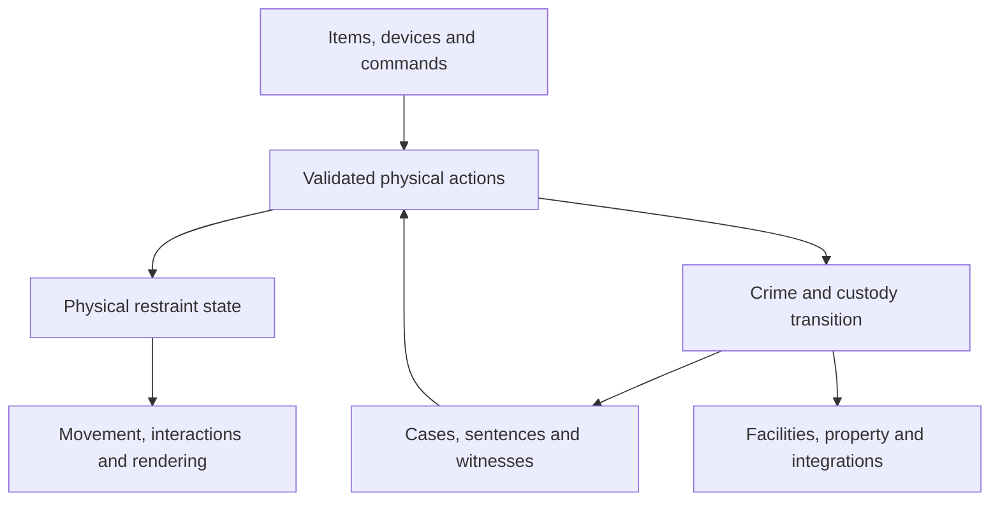

# MCA: Crime — Full Cuffed Integration and Replacement Plan

**Prepared:** 17 September 2026  
**Implementation target:** Minecraft 1.20.1, Forge, Java 17  
**Recommended release:** MCA: Crime 0.8.0, subject to the repository's release schedule  
**Status:** Source-grounded implementation specification; no code changes or in-game validation were performed for this document.

**Navigation:** [Scope and baselines](#1-required-outcome) · [Protected textures](#3-item-identity-and-protected-textures) · [Feature inventory](#4-complete-functioning-feature-inventory) · [Architecture](#6-architecture-separate-physical-restraints-from-legal-custody) · [Migration](#17-save-migration-and-lifecycle) · [Milestones](#20-implementation-milestones-and-reviewable-deliverables) · [Acceptance tests](#21-acceptance-tests) · [Complete registry inventory](#appendix-a-exhaustive-active-registry-and-resource-inventory)

## 1. Required outcome

Integrate Cuffed's complete functioning feature set directly into MCA: Crime. Replace overlapping MCA: Crime mechanics with their Cuffed equivalents, and connect the resulting systems to MCA: Crime's law, custody, villagers, property, economy, and companion integrations.

The explicit visual exception is **MCA: Crime's existing cuff item textures**. Preserve those files byte-for-byte and keep using them for the replacement cuff items. This exception does not protect the old restraint models, poses, rendering layers, escape mechanics, movement restrictions, item names, or internal implementation.

The result must be one coherent MCA: Crime mod. Installing Cuffed must not be necessary. Installing Locks Reforged must not be necessary to use the new lockpicking system. Do not ship two competing restraint engines, two sources of physical restraint state, or duplicate versions of equivalent items.

“Everything” means all active items, blocks, restraint types, interactions, enchantments, recipes, presentation, commands, statistics, and functioning integrations in the pinned Cuffed baseline. Section 5 separately accounts for unfinished and disabled code found in that repository. Those entries must receive explicit implementation dispositions rather than disappear from the inventory.

### 1.1 Replacement priorities

1. Cuffed supplies the replacement physical gameplay: restraint slots, application, keys, struggling, lockpicking, escorting, chains, detention devices, frisking, and prison equipment.
2. MCA: Crime supplies legal meaning: whether an action is kidnapping, lawful arrest, rescue, theft, assault, or jailbreak; which cases and sentences are affected; and who knows about it.
3. Existing MCA: Crime functionality without a Cuffed replacement remains operational. This includes masks, sand bottles, witnesses, case records, sentencing, fines, ransom, bounties, family consequences, criminal occupations, facilities, and civic services.
4. Existing infrastructure may be reused after refactoring. Existing overlapping gameplay must not survive merely because it already has tests or integrations.
5. Correct source defects while transferring features. A packet exploit, item duplication, corrupted health value, or render-state leak is not a feature-parity requirement.

## 2. Reviewed baselines and evidence

| Repository | Reviewed branch and commit | Observed baseline |
|---|---|---|
| [LazrProductions/cuffed](https://github.com/LazrProductions/cuffed/tree/48a336508abda1f4684bd337bc83199a212e5422) | `1.20.1` at `48a336508abda1f4684bd337bc83199a212e5422` | `mod_version=1.3.15`; Minecraft 1.20.1; Forge 47.4.4; Java 17; Lazr's Lib dependency |
| [otectus/MCACrime](https://github.com/otectus/MCACrime/tree/d5b738df7241b216f327597f640f8955c1c795f2) | `main` at `d5b738df7241b216f327597f640f8955c1c795f2` | `mod_version=0.7.4`; Forge 47.4.10; Java 17; world schema 14 |

These are commit-pinned source observations, not a claim that every registered Cuffed feature is defect-free at runtime. Public issue reports are regression inputs unless separately confirmed by source inspection or reproduction.

Cuffed also has other version branches. An open [NeoForge port PR, #51](https://github.com/LazrProductions/cuffed/pull/51), was unmerged when reviewed. Its author's testing claims are not evidence that this plan's Forge target has been tested. This request is an integration into the current MCA: Crime repository, not a Minecraft-version port.

Before coding, record the current heads and compare changes since these commits. Adapt file locations if the repository has moved; do not discard intervening work. If another release has consumed schema 15 or version 0.8.0, allocate the next unused numbers.

### 2.1 Important source findings

- Cuffed registers **37 items, 15 blocks, 10 restraint definitions, six enchantments, four entity types, two effects, and seven custom recipe serializers**. Its resource directory contains 43 recipe JSON files. The complete active registry inventory is in Appendix A. [Cuffed registries](https://github.com/LazrProductions/cuffed/tree/48a336508abda1f4684bd337bc83199a212e5422/src/main/java/com/lazrproductions/cuffed/init)
- Its restraint capability attaches to players. General living entities participate in anchoring through a separate mixin. Full MCA/Townstead villager restraint support therefore needs deliberate adaptation. [Server events](https://github.com/LazrProductions/cuffed/blob/48a336508abda1f4684bd337bc83199a212e5422/src/main/java/com/lazrproductions/cuffed/event/ModServerEvents.java)
- Cuffed's item descriptions and older guide text are not consistently authoritative. For example, leg shackles permit walking in the current restraint definition, while the description implies complete immobility; escort interaction is also inconsistent between guide text and capability code. Resolve these explicitly below. [Restraint definitions](https://github.com/LazrProductions/cuffed/tree/48a336508abda1f4684bd337bc83199a212e5422/src/main/java/com/lazrproductions/cuffed/restraints/custom)
- MCA: Crime currently has a single restraint enum, a custody record containing one restraint, legacy capture channels, an optional Locks Reforged cuff menu, coarse restraint visuals, and several confinement/escort paths. These are the principal replacement seams. [Current captivity package](https://github.com/otectus/MCACrime/tree/d5b738df7241b216f327597f640f8955c1c795f2/src/main/java/dev/otectus/mcacrime/captivity)
- MCA: Crime 0.7.4 already includes Townstead facilities, custody care, property policies, transfer attribution, and integration delivery machinery. Use these concrete seams rather than inventing another town or reputation database. [Facilities](https://github.com/otectus/MCACrime/tree/d5b738df7241b216f327597f640f8955c1c795f2/src/main/java/dev/otectus/mcacrime/facility), [property services](https://github.com/otectus/MCACrime/tree/d5b738df7241b216f327597f640f8955c1c795f2/src/main/java/dev/otectus/mcacrime/property)

### 2.2 Source and asset provenance

Both repositories contain GPLv3 license text, and MCA: Crime declares `GPL-3.0-only`. Cuffed's README identifies GPLv3, but its `gradle.properties` still declares `All Rights Reserved`, which is expanded into mod metadata. Record and resolve that concrete discrepancy before distributing copied code or assets. Do not silently assume that all contributed artwork has identical provenance. [Cuffed license](https://github.com/LazrProductions/cuffed/blob/48a336508abda1f4684bd337bc83199a212e5422/LICENSE), [Cuffed metadata](https://github.com/LazrProductions/cuffed/blob/48a336508abda1f4684bd337bc83199a212e5422/gradle.properties), [MCA: Crime metadata](https://github.com/otectus/MCACrime/blob/d5b738df7241b216f327597f640f8955c1c795f2/gradle.properties)

Implementation deliverables must include a provenance manifest: original repository, commit, original path, resulting path, credited author, applicable license evidence, and modifications. Retain applicable notices and corresponding source when distributing adapted material. Specifically review the contributed posters and fuzzy-cuff artwork. If an asset cannot be reused, supply original replacement artwork with the same gameplay role. Planning and independent architecture work can proceed while provenance is resolved.

Lazr's Lib is infrastructure, not user-facing Cuffed gameplay. Replace its configuration, networking, screen helpers, and math utilities with MCA: Crime/Forge facilities where practical. Do not copy library internals without a separate provenance review. The recommended finished mod has no new mandatory Lazr's Lib dependency.

## 3. Item identity and protected textures

### 3.1 Required texture preservation

The following paths are relative to MCA: Crime's repository root:

| Protected file | SHA-256 at the reviewed commit |
|---|---|
| `src/main/resources/assets/mcacrime/textures/item/restraint_cuffs.png` | `df1a7d30af0e4795cf706c94a4b37036dd748c4f9c750b793550daeb6f6997f4` |
| `src/main/resources/assets/mcacrime/textures/item/restraint_locked_cuffs.png` | `b0a86e25652e6d1acc7b2d1cf58a4be73b9e3bc4218760917337e324fd7d084f` |

Keep the existing item models pointing at these texture resources. Model transforms or metadata may change if necessary, but do not replace the pixels with Cuffed inventory sprites or an automated redraw. Validate the hashes against the actual implementation baseline before editing and after building. If the user has changed the art since the pinned commit, preserve the newer art and record its new baseline hashes.

`textures/entity/cuffs.png` is a worn-entity texture, not one of the protected item textures. Replace the existing simplistic worn-cuff visuals with the integrated Cuffed-style restraint geometry and animation.

### 3.2 Recommended canonical mapping

Use the two existing cuff registry IDs for Cuffed's two functional metal-restraint families. This keeps old stacks resolvable and preserves the weaker/stronger order without maintaining MCA: Crime's old cuff mechanics.

| Existing MCA item | New displayed identity | New behavior | Item art |
|---|---|---|---|
| `mcacrime:restraint_cuffs` | Shackles | Cuffed shackles on arms or legs | Existing `restraint_cuffs.png` |
| `mcacrime:restraint_locked_cuffs` | Handcuffs | Cuffed handcuffs on arms or legs | Existing `restraint_locked_cuffs.png` |
| `mcacrime:restraint_rope` | Legacy conversion carrier | Converts to tape; no independent rope restraint engine | Tape art after conversion |

This mapping is a design decision, not a claim about the old items' names or behavior. Update translations, recipes, help, fence stock, and command suggestions together. Existing ordinary cuffs intentionally acquire the less restrictive Cuffed shackle behavior. New lawful arrests use the handcuff definition unless configured otherwise.

Do not additionally register visible `mcacrime:handcuffs` and `mcacrime:shackles` item duplicates. Those words may be definition IDs; their item references resolve to the existing IDs above. Cuffed likewise uses the same handcuff item for both arms and legs, and the same shackle item for both placements. Do not invent mandatory separate leg-item recipes.

Add the remaining active Cuffed items under `mcacrime`, normally retaining their source path names. Use `duck_tape` as the registry path for straightforward source correspondence; the displayed English name can be “Duct Tape.” Fuzzy handcuffs are a separate functional/cosmetic variant with the source's lower durability, not a substitute for either protected cuff icon.

For rope, keep a hidden compatibility carrier for at least the migration release. Normalize it to the new tape item at controlled inventory/application boundaries and offer a lossless conversion recipe. Old datapacks must not cause an unknown-item deletion. `forge:rope` compatibility may map approved items to the tape-arm profile, but must not restore the removed timed rope escape system.

## 4. Complete functioning-feature inventory

Every row is required for the completed integration. A staged implementation is acceptable; a partial stage must not be released as “everything from Cuffed.”

| ID | Cuffed feature | Required MCA: Crime result |
|---|---|---|
| R01 | Arm handcuffs | Strong arm restraint; blocked combat/item/inventory actions; full worn model and escape behavior |
| R02 | Arm shackles | Weaker arm restraint; mining blocked, useful hand interactions retained |
| R03 | Leg handcuffs | Immobilized voluntary movement, jumping, sprinting, and mount control; independent arm use |
| R04 | Leg shackles | Walking allowed; jumping and sprinting blocked; weaker durability |
| R05 | Fuzzy handcuffs | Distinct registered arm variant, source durability, model/appearance, statistics; truthful acquisition documentation |
| R06 | Tape on arms, legs, head | Three placements from one item; arm/leg struggling; head gag and voice-chat integration |
| R07 | Empty bundle hood | Vanilla bundle used as head covering; first-person obscuring overlay and worn model; reject filled bundles |
| R08 | Multiple simultaneous restraints | Independent head/arms/legs, composed restrictions, independent removal and durability |
| R09 | Body-area application | Click appropriate body area; server validates position, distance, item and target |
| R10 | Self application/removal | Source-style self interactions where hands and keys permit, with discoverable controls |
| R11 | Dispenser application | Handcuffs, shackles, fuzzy cuffs, empty bundles; position selects valid slot; one item per successful application |
| R12 | Restraint keys | Distinct handcuff and shackle key families; selective slot unlocking and item return |
| R13 | Struggling and durability | Alternating arm/leg inputs, cooldown, Unbreaking, break sounds, item-drop policy, HUD progress |
| R14 | Native lockpicking | Cuffed-style skill check for restraints, padlocks, cell doors and safes; fully server validated |
| T01 | Direct escort | Hold and guide a restrained subject; start/stop interaction and visible status |
| T02 | Forced seating/mounting | Transfer escorted subjects into valid seats, vehicles, mounts, bunks and pillories |
| T03 | Chains | Chain eligible living entities to a holder; render chains and support deliberate removal |
| T04 | Fixed anchors | Fence and tripwire-hook anchors; multi-subject transfers and persistent knot entities |
| T05 | Weighted anchors | Place, attach, retrieve and transport anchor entities; preserve enchantments |
| T06 | Chain tension and suspension damage | Distance-based pull and overextension damage, with actor attribution and independent configuration |
| I01 | Frisking | Search restrained players, inspect inventory/armor/offhand, select confiscated stacks |
| I02 | Possessions boxes | Store, preview, remove and spill contents; preserve all item data and exact ownership accounting |
| L01 | Padlocks | Attach to supported blocks, deny unauthorized interaction, remove/unlock/pick, diamond reinforcement |
| L02 | Bound keys | Bind blank keys to individual lock identities; matching keys operate locks |
| L03 | Key rings | Create, add, bind, inspect and disassemble rings; preserve individual key identity |
| L04 | Key copying | Raw molds, baking, finite-quality baked molds, iron-key copies, key reset recipe |
| L05 | Cell doors | Working two-block keyed doors; bar connections, lock state, interaction and picking |
| L06 | Safes | Configurable storage, key operation, lockpicking, waterlogging/presentation, correct drops |
| P01 | Reinforced construction | Stone, smooth stone, lamp, chiseled stone, slab, stairs, bars and gapped bars |
| P02 | Pillories | Place, close around a subject, detain, release, struggle out, lock with padlocks |
| P03 | Guillotines | Pillory attachment, activation/reset, animation, execution, configurable head drops |
| P04 | Bunks | Reinforced bed behavior, sleeping/respawn, escorted placement, safe release interactions |
| P05 | Posters | All seven authored poster variants, placement/orientation and poster-change recipe |
| P06 | Meal trays | Carry/place food and utensils, visible contents, eat/remove contents, utensil nutrition bonuses |
| P07 | Forks and spoons | Utensils and reinforced-block excavation through persistent cracking progress |
| P08 | Knife and wounds | Weapon interaction, Wounded effect, treatment, feedback and injury attribution |
| P09 | Bandages | Treat self or others; remove wounds and apply intended recovery effect |
| P10 | Prisoner tags | Apply/remove display nicknames, persistence options, statistics, genuine identity retained internally |
| E01 | Imbue | Configurable transfer of captor damage to restrained subjects without recursion or invalid health |
| E02 | Famine, Shroud, Exhaust | Hunger, blindness, weakness/mining fatigue; bounded durations and correct cleanup |
| E03 | Silence | Mana draining through supported magic integrations, independent of the voice gag |
| E04 | Buoyant | Weighted anchors float in water |
| E05 | Vanilla enchantments | Unbreaking and Curse of Binding supported for appropriate restraint items |
| A01 | Creative utility items | Restraint cutter, universal key, binding resetter; server-enforced operator/creative authorization |
| A02 | Commands and extension API | Apply/remove restraints, anchor management, nicknames, registry diagnostics, third-party definitions |
| A03 | Presentation and resources | Models, animations, sounds, effects, particle, GUI, tooltips, recipes, tags, loot and translations |
| A04 | Statistics | All 19 source statistics, with events counted once rather than per visual update |
| C01 | Existing working compat | Better Combat, Epic Fight, ParCool, Elenai Dodge 2, supported magic mods, PlayerRevive, Simple Voice Chat |

## 5. Dormant, inconsistent and incomplete upstream content

Do not mistake the presence of a Java file for a working feature. Record these entries separately in the implementation's parity checklist.

| Entry | Observed source status | Required disposition |
|---|---|---|
| Warden's Guide/booklet | Item registration commented out; substantial screen and localization content exists | Complete and register an MCA: Crime guide covering all integrated mechanics. Rewrite outdated instructions; do not reactivate stale text unchanged. |
| Toilet | Block/item/renderer registration disabled; prototype block entity uses the tray entity type and a small item store | Complete as an additional prison furnishing with its own correct registration, item storage, saving and drops. No invented working sewage simulation. Track as completion of dormant code, not existing feature parity. |
| Privacy restrictions | Stored enum/data and a commented-out API TODO; no complete enforcement flow | Complete an optional server-enforced policy for restraining, anchoring, detaining and nicknaming. Define `ALWAYS`, `ASK`, `ONLY_WHEN_RESTRAINED`, `NEVER` behavior and ensure every entry point checks it. |
| TacZ | Adapter `load` is empty; setup mistakenly assigns the voice-chat installed flag | Implement real, version-probed attack/reload/use restrictions if TacZ support is included; no “supported” label for an empty adapter. Required tracked completion before the broader integration claims full repository coverage. |
| Knights of Britannia | Loading and mana-drain calls commented out | Complete a verified optional mana adapter against an explicitly supported build; do not create scoreboard objectives speculatively. |
| Creative bind breaker | Registered with `CreativeKey` although a dedicated breaker class exists | Implement and register the distinct reset function; rotating bindings must invalidate old keys. |
| Fuzzy cuff scope | Registered restraint is arms-only; item tooltip advertises legs too | Required parity is the functioning arm variant. Correct the tooltip. A leg variant is a separately documented enhancement. |
| Leg shackles | Definition allows movement, unlike part of the help text and historic input behavior | Walking is allowed; sprint/jump remain blocked. Use one restriction policy on both sides. |
| Tape leg settings | Current leg class reads arm configuration in several methods | Use independent leg durability/break settings. |
| Lockpicking a door/safe | Source completion destroys the target block rather than merely unlocking it | Preserve this in a named Cuffed parity outcome; also offer non-destructive unlock. Never silently destroy a safe without transferring its contents. |
| Reinforced blocks | README calls them unbreakable; current implementation allows pickaxes and utensil excavation | Implement the actual qualified resistance rules and describe them honestly. Absolute protection is a distinct containment/server policy. |

Dormant completions form a separately testable milestone. Gallows, electric bars, additional Minecraft ports and other unimplemented issue suggestions are not part of the source's functioning feature set and are not prerequisites for this request.

## 6. Architecture: separate physical restraints from legal custody

### 6.1 One owner for each kind of state

Keep `CrimeWorldData` as the durable world-level authority. Add a physical-restraint table keyed by entity UUID, including players, MCA villagers and supported Townstead variants. A capability may expose a lightweight view/index, but must not become a second independent persistent copy.

Legal custody and physical restraint are related but distinct:

- A handcuffed player can have no criminal sentence.
- A sentenced player can be free of cuffs inside a locked cell.
- Removing an arm restraint does not remove a leg restraint, chain or pillory.
- Opening a cell door does not pardon its occupant.
- Breaking free from a kidnapper is not jailbreak.
- A player using a bundle on herself is not kidnapping herself.



### 6.2 Proposed data contracts

Names below are proposed new types, not claims that they already exist.

```text
RestraintDefinition
  id: ResourceLocation
  slot: HEAD | ARMS | LEGS
  item mapping, restriction profile, escape profile, render profile
  supported rig/entity predicate; compatible enchantments

AppliedRestraint
  instanceId: UUID
  definitionId: ResourceLocation
  itemSnapshot: one complete ItemStack
  remainingDurability, definitionRevision
  applier: player UUID | NPC UUID | device reference | system
  applicationContext: voluntary | unlawful | lawful | administrative
  custodyId?; appliedTick; revision

PhysicalRestraintState
  subject UUID; last known dimension; generation; revision
  head?, arms?, legs?
  tetherId?; escortId?; detentionId?

TetherRecord
  id; subject UUID; holder EntityRef or AnchorRef
  chain item ownership/return status; length; policy; revision

DetentionRecord
  id; subject UUID; device GlobalPos and device identity
  occupant generation; pose; escape work; revision

LockRecord
  lockId UUID; bindingRevision; canonical target GlobalPos/UUID
  owner/authority; locked; reinforced; key-binding policy

FriskSession / LockpickSession
  sessionId; authenticated actor; target identity and revision
  dimension; source item identity; expiry; server-owned progress
```

Add a stable custody identity if the existing record only supplies a subject/sentence identity. `sentenceId` alone is insufficient: unlawful captures do not have sentences, and two successive captures of the same subject must not accept each other's delayed packets.

Definitions are immutable and use explicit factories/codecs. Applied restraints are independent instances. Do not reuse Cuffed's registry object as mutable per-player data during deserialization; `RestraintAPI.getNewRestraintByKey` currently returns the registered object. A two-player save/load test must prove complete isolation.

### 6.3 Service boundaries

Introduce `restraint`, `tether`, `detention`, `locks`, `frisking`, and `prison` packages, or equivalent packages consistent with the repository. Responsibilities:

- `RestraintService`: apply/remove/change one slot; own item movement, snapshots and lifecycle.
- `RestrictionResolver`: compose active definitions and detention into a single immutable policy.
- `TetherService`: holder/anchor relationships, bounded physics and chain returns.
- `DetentionService`: device occupancy, mounting and release positions.
- `LockService`: target identity, bindings, access and lock-state changes.
- `LockpickService`: server sessions and action verification for every lock target.
- `FriskingService`: verified inventory transfers and evidence ownership.
- `CustodyTransitionService`: translate physical events into existing custody/legal actions.

All authoritative mutations run on the server thread and honor `ServerMutationGate`. Client classes belong behind client-only registration. Persistence uses dimension-qualified references and UUIDs, never transient entity IDs as identity.

### 6.4 Existing paths to replace or adapt

| Current MCA: Crime path | Change |
|---|---|
| `item/CrimeItems.java`, `item/RestraintItem.java` | Register the complete item set; replace enum-only behavior with item-to-definition/slot mapping |
| `captivity/RestraintType.java` | Retain only as a deprecated import/API projection where necessary; never authoritative for new state |
| `CaptureInteractHandler`, `CaptureService`, `CaptureTicker`, `CaptureChannel(s)` | Route interactions through the new application service; retire the legacy mandatory capture channel and old commit path |
| `captivity/CustodyRecord.java` | Keep legal/captor/sentence/care data; reference new physical state and stable custody identity |
| `captivity/CustodyService.java` | Keep ransom, rescue and legal bookkeeping; call physical services transactionally |
| `captivity/CustodyConfine.java` | Replace physical kidnapping teleport tether with the chain/anchor engine; retain appropriate legal release/cap policy |
| `captivity/CuffEscapeService.java`, `CuffLockProgress.java` | Replace with definition-based struggle/picking; old combination survives only as migration input |
| `enforcement/RestraintPolicy.java`, `RestraintHandlers.java` | Replace coarse “any restraint blocks everything” behavior with composed restrictions |
| `enforcement/EscortRestraint.java` | Retire independent movement-force loop; guard escorts use the shared transport service |
| `enforcement/NpcCustodyService.java`, existing escort orchestration | Keep legal destinations, sentence membership and reassignment; use new physical escort/tether APIs |
| `RestraintVisualResolver`, `RestraintVisualState`, `RestraintVisualType` | Replace wrist-only projection with slot/rig/transport presentation |
| `client/render/RestraintWristLayer.java`, `mixin/client/RestraintPoseMixin.java` | Replace overlapping geometry/pose application, preserving optional rig support |
| `ClientRestraintData`, `ClientRestraintRig`, restraint sync packets | Upgrade to versioned multi-slot snapshots and tracking deltas |
| `compat/LocksReforgedBridge.java`, `compat/locksreforged/CuffLockPickingMenu.java` | Remove automatic selection for cuffs; retain other integration duties and an explicitly selected adapter if implemented |
| `jail/CellBlueprint.java`, `CellBuilder`, `HoldingCellService` | Offer integrated prison materials through existing generation/restoration journals |
| `facility/*`, `captivity/CustodyCareService.java` | Connect furniture, meals, treatment and transport without duplicating Townstead ownership |
| `property/*`, contraband services, integration outbox | Connect search, seizures, locks and recovered property through existing attribution/delivery contracts |

The old public `CustodyView` and similar readers may need compatibility projections. Deprecation is acceptable; publishing contradictory old and new physical truth is not.

## 7. Restraint behavior and controls

### 7.1 Authoritative restriction matrix

Apply restrictions per action, not per raw key code. Client input feedback mirrors the server policy. Modded attacks, movement and inventory transactions must consult the same policy.

| Restraint | Mine blocks | Hand actions / inventory | Walk | Jump / sprint | Additional effect |
|---|---|---|---|---|---|
| Arm handcuffs | No | No, except explicitly allowed escape/care interactions | Yes | Yes | Strong arm pose and struggle |
| Arm shackles | No | Yes | Yes | Yes | Weaker restraints; useful hands retained |
| Fuzzy arm cuffs | No | No, as handcuffs | Yes | Yes | Separate appearance/durability |
| Arm tape | No | No, as handcuffs | Yes | Yes | Weak, removable without a metal key |
| Leg handcuffs | Yes | Yes | No voluntary movement | No | External escort, knockback and transport still work |
| Leg shackles | Yes | Yes | Yes | No | Resolve existing client/server disagreement in favor of walking |
| Leg tape | Yes | Yes | No voluntary movement | No | Weak leg bind |
| Bundle hood | Yes | Yes | Yes | Yes | Obscured vision; no automatic block on text chat |
| Head tape | Yes | Yes | Yes | Yes | Voice gag when the supported voice mod is present |
| Pillory detention | No | No, except escape/help/care | No | No | Fixed occupancy and pose; separate from head-slot gear |

“Hand actions” for strong arm restraints includes attacking, item use, block/entity interaction, drop, inventory mutation, hotbar manipulation and offhand swapping. Define the allowed exceptions by action type: struggle, configured self-escape, status/help, chat, and externally provided care. Do not cancel the only route to escaping before the escape handler receives it.

Combine restrictions using the most restrictive active policy. Two identical enchantment effects do not blindly multiply. Removing one source must not restore an action still forbidden by another source. Do not apply legacy blanket movement slowdown just because arms are cuffed.

### 7.2 Applying restraints

Default gameplay follows Cuffed: body-area interaction and immediate application when eligible. The old mandatory MCA capture channel is replaced. Expose an optional application-duration policy for servers that want it, implemented within the new transaction/session engine rather than by keeping the old capture engine running.

For body selection, use the server-validated entity interaction hit position. For standard standing players, reproduce Cuffed's practical head/arms/legs regions. For crouching, swimming, short/tall MCA bodies and Townstead rigs, use normalized rig-aware regions instead of hard-coded world heights. Provide a slot selector in the Crime interaction menu and self-status screen as an accessible alternative. The selected slot is a request; the server rechecks compatibility.

Each application must:

1. Resolve actor, target, dimension, distance, line of sight, requested slot and one source item.
2. Check target lifecycle, rig support, slot occupancy, applicable server policy and action lease.
3. Distinguish voluntary, criminal, lawful and administrative contexts using server evidence.
4. Reserve one exact item with its tags, damage and enchantments.
5. Commit item transfer, physical state and any custody transition once.
6. Publish sound, model, HUD, statistics and legal observations only after success.

A rejected action consumes nothing. A duplicate main-hand/offhand/event delivery cannot equip twice. Applying a second slot to the same captive does not create another kidnapping case or reset captivity clocks.

Retain low-health restriction as a configurable Cuffed behavior, off in the Cuffed parity preset, with source threshold 30% when enabled. Make support for sleeping, surrender and a configurable action duration explicit balance options. Existing legal permissions and server-disabled PvP/kidnapping still apply; mechanical permissiveness is not permission to override server rules.

When low-health/downed application is enabled, account for the source's post-application recovery behavior: five seconds of regeneration at amplifier 2, and its PlayerRevive-assisted revival path. Make that recovery configurable and apply it once on successful application, never once per retry or additional packet.

Dispenser actions use a device actor, not a forged “victim restrained herself” identity. Track responsible ownership when known. Unknown responsibility must not be fabricated into a player conviction. Consume one item only after successful application and keep failed-dispense behavior predictable.

### 7.3 Removal, escape and durability

- Metal restraints support their correct family key, lockpicking and configured struggling. Block-lock keys and cuff-family keys are different concepts.
- Tape and hoods support the source's keyless removal interaction where the actor has usable hands. A hood must not delete contents because filled bundles were never eligible.
- Arm struggle uses alternating attack/use actions; leg struggle uses alternating left/right actions. Translate rebound inputs into semantic actions before transmission.
- The server owns remaining durability, minimum action spacing, alternating-action validation, Unbreaking rolls and break completion. Never accept an arbitrary durability delta.
- Offer hold-to-struggle accessibility at the same server-limited work rate. It changes ergonomics, not effective escape speed.
- On break, clear the selected instance once, resolve its one item according to the configured drop rule, update restrictions, and emit one event.
- Returned items preserve their actual damage, custom name, enchantments and supported NBT. Guard/system-issued restraints need explicit item ownership so release cannot mint free cuffs endlessly.

Normal metal restraints start from Cuffed's configured durability: handcuffs 40, shackles 15, fuzzy cuffs 30. Arm and leg tape default to five work units. Keep arm/leg settings independent. Do not confuse these configured values with the placeholder `999` in source item registration.

Opening a single restraint is a physical event, not an unconditional `CustodyService.release`. Lawful escape transitions depend on the active custody/escort/device conditions. The same breakout episode must not file multiple jailbreak cases as successive slots are removed. Kidnapping victims never gain Heat merely for escaping.

## 8. Native lockpicking

Implement the Cuffed-style interactive skill check within MCA: Crime. It must function with neither Cuffed nor Locks Reforged installed. Installing Locks Reforged must no longer silently switch the cuff mechanic.

Preserve distinct difficulty profiles for padlocks, reinforced padlocks, doors, safes, handcuffs, fuzzy cuffs and shackles. Carry over the meaningful source progress/speed settings, then document the new tick-based interpretation rather than claiming frame-dependent values are identical.

Preserve the actual interaction: rotate the pick toward a visible ghost-pick target and confirm the alignment, raising a progress meter that drains faster as phases advance. The source starts at 30 on a 0–40 meter, chooses another target after a successful alignment, wins at 40 and fails at zero. Its angular window is asymmetric, approximately ten degrees below through five degrees above the target. Treat those as explicit parity parameters, with a configurable accessibility window. Replace render-frame-driven drain/animation with server ticks plus interpolated client rendering. The server chooses each phase target and accepts at most one bounded-angle input per phase after the configured minimum interval. Perfect-input automation remains possible in a client-assisted alignment game; the server must nevertheless prevent fabricated completion, arbitrary targets and impossible action rates. [Source minigame](https://github.com/LazrProductions/cuffed/blob/48a336508abda1f4684bd337bc83199a212e5422/src/main/java/com/lazrproductions/cuffed/client/gui/screen/LockpickingScreen.java)

Recommended source-derived starting profiles:

| Target | Progress per successful action | Speed increase parameter |
|---|---:|---:|
| Padlock | 8 | 10 |
| Reinforced padlock | 6 | 13 |
| Cell door | 6 | 14 |
| Safe | 3 | 10 |
| Handcuffs, arms or legs | 6 | 12 |
| Fuzzy cuffs | 6 | 14 |
| Shackles, arms or legs | 8 | 10 |

Create a server session bound to actor, target instance, lock revision, dimension and actual pick stack. The client sends attempts/cancel messages; it never sends authoritative success, another player's identity, item damage or an arbitrary block to destroy. Validate session freshness and eligibility on every meaningful action and at completion. Bound latency tolerance and document that client-assisted timing games cannot prove a human supplied the inputs.

Cancel on death, logout, dimension change, invalid range, removed/replaced target, relevant damage, item change, custody replacement, or closed menu. A stale successful response cannot unlock a new lock placed at the same coordinates.

Successful outcomes must be explicit:

- Restraint: remove that selected restraint and process the configured item return.
- Padlock: break/remove the padlock, preserving the protected block.
- Door/safe: the **Cuffed parity outcome** breaks the target; the configurable alternative unlocks it. For a broken safe, move/drop its contents exactly once before removal.

Record lockpicks used/broken and successful picks accurately. A used pick is not automatically a broken pick. If an optional Locks Reforged provider is later selected explicitly, it must use the same target/session validation and provide no fallback bypass when its adapter fails.

## 9. Escorting, chains, anchors and vehicles

### 9.1 Unified transport

Preserve both Cuffed transport concepts: close escort of a restrained subject and a visible chain attached to a holder/anchor. They have different presentation and interaction rules but share ownership and lifecycle checks.

Replace MCA: Crime's overlapping player escort force, kidnapping teleport tether and NPC capture leash with this engine. Guard destination selection, pursuit, reassignment and jail admission remain in the existing enforcement orchestration.

The pinned Cuffed capability starts escort from an empty-hand, non-crouching interaction, while the guide says sneak-interact. Use the actual current interaction as the default and explain it in the guide. Sneaking/explicit release stops escort; sneak-interacting the appropriate body area also supports keyless gear removal. Resolve these actions in a documented priority order so a release request does not unexpectedly begin another escort.

Do not copy Cuffed's unconditional per-tick teleport-to-captor escort loop. Preserve its visible close-escort behavior using collision-aware movement, NPC navigation and bounded server correction. Corrections must not push targets through walls, suffocate them in blocks, or transport them across dimensions implicitly.

### 9.2 Chain behavior

- A vanilla chain item attaches an eligible subject to a holder. Empty-hand release and anchor transfer must be possible under the applicable interaction policy.
- Support the complete Cuffed chainable-entity tag and MCA/Townstead targets. Keep full-body restraint support separate from chain eligibility.
- Transfer held chains to fences, tripwire hooks and weighted anchors. Multiple subjects may share a fixed anchor; maintain indexed reverse relationships.
- Preserve the source defaults of five-block chain length and a 12-block overextension threshold as configurable starting values. Validate finite positive values and consistent ordering.
- Preserve overextension/suspension damage as a configurable feature. Use an explicit damage cause and the responsible actor/device. MCA: Crime guards should use a custody transport policy that avoids deliberately harming prisoners; player-owned chains still expose the source mechanic.
- Weighted anchors retain placement, movement, pickup and Buoyant behavior. Pickup cannot duplicate an anchor or leave references to a removed entity.
- When a chain breaks or is deliberately released, return/drop one chain according to the record's ownership policy. Repeated callbacks cannot create more chains.

Index by subject, holder UUID and anchor position. Never copy the all-entities scan performed by Cuffed's block-interaction handler. Tick only active loaded tethers. Reconcile unresolved references at bounded intervals.

### 9.3 Seats, mounts, sleeping and dismounting

Allow an escorted subject to be placed into a valid seat/vehicle/mount, bunk or pillory. Validate passenger capacity, mount capability, dimensions, target identity and safe attachment position. Do not assume every clicked entity is a valid vehicle.

Leg restraint blocks voluntary steering and the appropriate dismount route, not gravity, vehicle movement, external impulses or emergency release. When a vehicle is destroyed, removed or changes dimensions, end the stale seat claim and find a safe exit. Use the same rule for players and NPCs without assuming all entities are `ServerPlayer`.

### 9.4 Transport arbitration

Exactly one system applies authoritative displacement at a time. Priority is:

1. Valid occupied detention device.
2. Valid seat/mount transport.
3. Close escort.
4. Chain tension.
5. Normal movement filtered by limb restrictions.

Store suspended lower-priority relationships explicitly or detach them; do not let all five tick against the same subject. Legal jail containment evaluates the resulting position and its reason, rather than adding another uncontrolled physical correction.

## 10. Locks, keys, safes and block protection

### 10.1 Persistent identity and key lifecycle

Use server-created UUID lock identities. The pinned Cuffed `KeyItem` already binds to a UUID; historic issue #14 about position-bound keys must not be treated as proof that current keys still use positions. Carry the identity approach forward and add a binding revision so a reset invalidates old keys without relying on coordinates. [Key implementation](https://github.com/LazrProductions/cuffed/blob/48a336508abda1f4684bd337bc83199a212e5422/src/main/java/com/lazrproductions/cuffed/items/KeyItem.java)

Implement blank key binding, bound-key use, key rings, key reset, raw molds, furnace baking, finite-use baked molds and copying with iron. A copied key retains the original lock identity/revision. Preserve names and intended metadata through crafting.

Key-ring recipes must reject ambiguous multiple-ring combinations or process every input without losing keys. Do not consume several rings and return one key. Capacity defaults to 16. Reducing configured capacity must not erase existing keys; reject additions until the ring is within limits.

The creative bind breaker performs a real rekey/reset. The universal key and restraint cutter require server permission even if a client somehow holds the item. Keep command permissions consistent with MCA: Crime's operator actions; creative mode and server administration can be independently configured where appropriate.

### 10.2 Padlocks and protected target groups

Normalize multipart targets before access checks:

- Both halves of a door resolve to the same canonical lock.
- A double chest's inventory resolves to one protected group.
- A pillory's two halves and its occupancy state agree.
- A safe's native lock and external padlocks must not compete.

Attach only to supported blocks, even if the source description says “any block.” Port the `lockable_blocks` tag and expose extension hooks, but validate target capabilities. One canonical lock owner controls access to a target group. Reject conflicting duplicate lock attachments.

Implement diamond reinforcement using a configurable item tag. Lock visuals must remain selectable and removable. Breaking/replacing the supporting block detaches the correct padlock once. Check that the current block still has a property before accessing it; never set a door property on air or a replacement block.

A matching key grants physical access. It does not manufacture ownership or a legal warrant. Conversely, permission to investigate a crime is not a generic bypass for every unrelated private lock.

### 10.3 Server-enforced protection

Cover interaction, breaking, explosions, pistons/movement, redstone and inventory automation according to the selected policy. Cancellation of a right-click is not sufficient to protect stored items.

For native safes, own both the vanilla container access and Forge item-handler access. Every cached handler must re-evaluate current lock state; toggling the lock cannot leave a previously obtained unrestricted handler usable. Handle insertion as well as extraction and document permitted automation modes.

Use 36 slots as the source-derived safe default. Slot-count changes must preserve stored overflow rather than silently truncate it. Physical locks remain functional when MCA: Crime's optional property-law subsystem is disabled; importing locks must not automatically enable that separate legal subsystem.

For externally padlocked vanilla containers, provide narrow vanilla/Forge hooks that protect vanilla hoppers, hopper minecarts and `IItemHandler` transfers. Recheck paired containers. For modded containers, require a verified adapter or explicitly report the unsupported automation route. Do not promise protection against every mod's private storage implementation based only on an interaction event.

Close or revalidate open menus when a lock closes, rekeys or loses its supporting block. Respect spawn protection and installed claim hooks. Creative/operator removal must leave an actionable recovery route for abandoned locks and never silently delete a safe's inventory.

### 10.4 Locks Reforged coexistence

Continue its existing fence-stock integration if enabled. On a target already owned by Locks Reforged, delegate to a verified adapter or reject a second lock; never install two independent access checks with contradictory state. A generic `keys` tag must not turn every key into a master key for either system.

The default lockpicking provider is MCA: Crime's Cuffed-style implementation. An optional explicitly chosen provider can be added, but is not required to complete source feature parity.

## 11. Frisking, possessions and contraband

### 11.1 Functional scope

Port the possessions box and interactive frisking menu, including vanilla inventory, armor and offhand. Extend searching to appropriate MCA/Townstead equipment and actual stored possessions through adapters. Villager trade offers are not inventory stacks and must not be confiscated as though they were.

A searcher's authority and the target's physical state are checked separately. The source allows frisking an arm-restrained player. MCA: Crime adds legal classification: a permitted guard search, a voluntary transfer and a criminal seizure must not all be treated as the same event.

Keep ordinary box storage, item preview, stack retrieval, spilling and destruction drops. Lawfully seized property may use a sealed evidence mode backed by existing property/escrow records; ordinary Cuffed-style boxes remain usable.

### 11.2 Transaction requirements

Each server-controlled transfer must validate:

1. Searcher and target are still alive, present and within reach in the same dimension.
2. The target still meets the required restraint/search conditions.
3. The current custody generation and search session still match.
4. The exact possessions box still exists in its reserved slot/hand.
5. The source slot and stack match the expected revision.
6. The destination has capacity and permits the complete serialized item.

Use a single transaction per extraction with a unique transfer ID. Record source ownership, legal grounds, quantity and destination. The source stack is debited and destination credited once. Concurrent searchers, target death, inventory swap, menu close and disconnect must not produce duplicated or lost items.

Reject unsupported menu click types server-side: arbitrary slot insertion, double-click collection, hotbar swaps, drag, throw and quick-move must either have defined safe behavior or fail without mutation. A disabled UI control is not enforcement. A search delay is server-owned.

Bound box slot count, per-stack NBT size and total serialized payload. Prevent recursive boxes/containers from causing unbounded nested storage. Honor modded item stack limits; do not hard-code 64 as the universal maximum.

Do not blindly copy the upstream `FriskingContainer`: its `stillValid` returns true, it exposes a `clearContent` that clears the subject's inventory, and transfer methods mutate source inventory without the required session checks. [Source container](https://github.com/LazrProductions/cuffed/blob/48a336508abda1f4684bd337bc83199a212e5422/src/main/java/com/lazrproductions/cuffed/inventory/FriskingContainer.java)

### 11.3 Legal and integration consequences

- Successful criminal extraction creates theft evidence using actual removed goods and the actor's identity.
- A lawful search discovers contraband only through the existing discovery gate. Opening a screen must not expose every hidden property fact to all guards.
- Store confiscated goods in linked evidence/escrow records, with reliable return and overflow handling.
- Return the right goods when custody ends, bail is paid or property is recovered; a possession box is not an excuse to bypass the existing recovery ledger.
- Curios and Cosmetic Armor Reworked support are recommended concrete extensions to the inventory-provider interface, motivated by upstream issue #37. Test each supported adapter; absent optional mods must not affect startup.

## 12. Prison construction, furniture and detention devices

### 12.1 Reinforced building set

Implement all source blocks: reinforced stone, smooth stone, chiseled stone, lamp, slabs, stairs, bars, gapped bars, cell doors, safe, bunk, pillory, guillotine, poster and tray. Carry over all corresponding item models, blockstates, recipes, loot, tags and relevant connection geometry.

Default reinforcement follows the current source's pickaxe-qualified breaking plus fork/spoon excavation. Configure explosion/piston resistance and authorized removal separately. A hard-containment jail may disallow prisoner excavation; soft containment can permit it and let the existing jail system evaluate escape. Do not describe a tool-breakable block as absolutely unbreakable.

Integrate these materials into new generated holding cells through configurable blueprints. Keep safe exit geometry, occupancy limits, facility exclusion rules, restoration journals and exact block-state/block-entity backups. Existing temporary cells finish under their saved blueprint/journal; do not rewrite occupied structures automatically on upgrade.

Player-built permanent prisons are never dismantled because a temporary-cell cleanup task sees an occupant leave.

### 12.2 Pillories

Implement placement, orientation, two-block integrity, close/open behavior, occupant pose, padlocking, escort admission, struggling and release. Generalize source player-only occupancy to supported villager actors.

One device holds at most one subject. One subject holds at most one device claim. Closing validates a real nearby subject and a safe alignment, then atomically claims occupancy. If two players close it simultaneously, only one transaction succeeds.

The pillory's physical detention is independent of the head slot so a hood/gag need not be erased. The source's `pillory` restraint ID can be preserved as an import/extension identity, backed by a composite detention profile. This is an integration refinement over its source representation.

Support the source breakout mechanic based on crouch transitions, with a configurable work threshold initially matching 100 transitions. Bound accepted transitions server-side and provide accessible input. When disabled, invalid/missing devices must still release their stale occupant; a breakout toggle must not disable lifecycle cleanup.

Opening/removing a pillory ends detention, not every legal obligation. Unloading its chunk is not evidence the device was destroyed. On genuine destruction, select a safe standing position and clear only that device's claim.

### 12.3 Guillotines

Port the source pillory-mounted device, blade state, five-tick activation delay, reset action, sounds, visual blood state and optional player-head drop. Extend targets only where a valid model/device interaction is supported. A nonplayer target without a head item must not generate a fabricated player head.

Route execution through a single attributed server action and the normal damage/death pipeline. The source calls `kill` and then extreme damage; do not copy that combination. Respect canceled deaths, invulnerability policy, totems and configured PlayerRevive behavior. If the server wants a force-execution rule, make it explicit and test its semantics.

Award drops, close custody, recover property and evaluate bounties only after confirmed death. A repeated activation packet, unloaded chunk or canceled death must not create duplicate heads or rewards. Persist enough execution state to avoid replaying an already committed action after restart.

Using a device on an unlawfully held villager can produce the applicable assault/homicide consequences through MCA: Crime. A prisoner being sentenced does not automatically authorize execution. Do not introduce automatic capital sentencing as an accidental consequence of importing this block.

### 12.4 Bunks and respawn

Implement sleeping, occupied state, two-part integrity, normal respawn behavior and escort-assisted placement. Verify behavior in dimensions where beds cannot set spawn; Cuffed follows explosive-bed behavior, so any different prison policy must be explicitly configured.

For forced custody use, snapshot the prior respawn location. On release, restore it only if this system still owns the temporary override; do not overwrite a legitimate spawn point the player set later. Source issue #28 requests paper-based spawn clearing; this is an optional addition, not verified source behavior.

Connect bunk use to jail facility care and Townstead schedules through the existing adapter. Do not globally reassign NPC homes or professions.

### 12.5 Trays, utensils and excavation

Support one food item and one of each utensil on a tray, both as an item and a placed block. Preserve loaded contents through placement, pickup, save/load and destruction. Present food/utensils in the world and tooltip.

The source adds roughly one-third of base nutrition per utensil, up to about double base nutrition with all three. Implement a deliberate configurable formula with correct integer rounding, food effects and container remainders. Use the item's proper consumption behavior or a verified adapter so modded foods do not lose custom effects or bottles/bowls. Consume food only once, on the server.

Fork/spoon excavation should reproduce the source concept: each valid use damages the utensil, and successful work advances a reinforced block's crack stage. Source starting values are 25% success and five stages. Store target block identity/state, dimension and progress; validate again before removal. Replacing a cracked block must not cause the replacement to disappear later. Never let the auxiliary crumbling entity bypass claims or jail policy.

Feed/treat restrained subjects through explicit caregiver interactions, or temporarily use the weaker shackle profile for meals. A general “allowed item use” exception must not let a handcuffed prisoner use arbitrary weapons.

### 12.6 Posters, tags and guide

Include Serenity, Skeleton, Impunity, Zooom, A Shadow Locked Away, Prisoner and Lantern, with their applicable author credits and source-to-asset provenance. Preserve placement and variant-change recipes. Avoid treating decor as evidence about an unrelated player.

Prisoner tags set a display alias. Never replace account UUID, true MCA family identity, ownership identity, command lookup identity or audit actor. Restore prior display state without overwriting changes owned by another mod. Bound nickname length and sanitize text formatting. Preserve independent death/logout persistence options.

Register the completed guide and explain body selection, self-use, keys, chaining, devices, search, escape, lockpicking and consequences. Generate key labels from actual bindings. The guide must describe configured behavior where it differs from parity defaults.

## 13. Enchantments, wounds and effects

### 13.1 Enchantment semantics

| Enchantment | Required implementation |
|---|---|
| Unbreaking | Server-owned chance/cooldown behavior for struggle durability; do not blindly apply vanilla damage twice |
| Curse of Binding | Physical restraint persistence through death where configured; does not erase or create a sentence |
| Famine | Hunger while equipped; appropriate bounded handling for NPC needs |
| Shroud | Blindness while equipped; distinguish wearer vision from what other observers can see |
| Exhaust | Weakness and mining fatigue while equipped |
| Silence | Source mana-drain concept; configurable rate, initially 0.5% of maximum per tick for a parity profile |
| Imbue | Transfer a bounded fraction of captor damage to eligible restrained subjects |
| Buoyant | Float weighted anchors in water while retaining their chain relationships |

Do not apply hostile enchantments automatically to every lawfully arrested NPC. Guard equipment profiles select them explicitly. All features remain available for gameplay and configuration.

Track which system owns applied effects/modifiers. Removing cuffs must not erase blindness from another mod, reset an unrelated movement modifier, or leave a permanent weakness modifier behind. Refresh durations in bounded intervals rather than replacing identical effects every tick.

For mana systems, verify the real provider and clamp all operations. If two integration adapters refer to one shared mana pool, do not drain it twice. Missing capabilities are normal absence, not a null dereference. Expose unsupported integrations truthfully in diagnostics.

### 13.2 Imbue damage correctness

Reimplement this algorithm rather than transferring the source loop. In the pinned source, subjects can be gathered for both arm and leg restraints and damage totals are accumulated while iterating; this deserves an independent correctness review. Historic issue #44 reports NaN health, but that report alone does not identify the current cause. [Damage handler](https://github.com/LazrProductions/cuffed/blob/48a336508abda1f4684bd337bc83199a212e5422/src/main/java/com/lazrproductions/cuffed/event/ModServerEvents.java), [issue #44](https://github.com/LazrProductions/cuffed/issues/44)

Required algorithm:

1. Resolve eligible recipients once, deduplicated by UUID.
2. Validate finite incoming damage and ignore transferred damage marked by this system.
3. Compute a bounded transfer budget from source damage and configured enchantment levels.
4. Distribute according to a documented rule, with no zero-recipient division or duplicate recipient.
5. Attribute transferred damage to the correct captor/action.
6. Reduce captor damage consistently with the selected transfer contract; handle canceled recipient damage explicitly.

Add a reentrancy guard and causal identifier so mutually enchanted captors cannot recurse forever. Do not use an unbounded amount of redirected damage as a path to negative damage or healing. Verify normal, canceled, armored, lethal and cross-dimension cases.

### 13.3 Wounds and bandages

Implement knife-induced wounds, reduced maximum health/movement, effect presentation, blood-drip particles and bandage treatment. The source knife adds a 20-point wound increment; use configurable, clamped severity and a nonzero minimum health floor.

Remove the source pattern that deals magic damage when adding/removing wound attribute modifiers. Treatment must not unexpectedly kill a patient. Apply treatment once on the server, clear all owned wound modifiers, resync severity and consume one bandage. Confirm health remains finite through stacking, reconnect, death, healing and interaction with other health modifiers.

Preserve regeneration after treatment as a configurable effect. Connect NPC treatment to `CustodyCareService` and Townstead needs without directly writing incompatible external data. A cosmetic blood-particle toggle must not change wound mechanics.

## 14. Integration with MCA: Crime's existing gameplay

### 14.1 Incident and custody transition table

| Physical action | Legal/custody treatment |
|---|---|
| Player applies first involuntary restraint to an eligible civilian/player | Begin unlawful custody and one kidnapping incident if no lawful authority applies |
| Adds another restraint, hood or anchor during that custody | Update physical state; do not reset custody age or create duplicate kidnapping |
| Guard restrains a valid suspect | Use existing lawful authority checks, case selection and sentence identity |
| Player restrains a legitimate bounty target | Use existing capture/bounty authority; physical possession alone cannot create a claim |
| Subject removes a single restraint | Update physical state; assess escape conditions against remaining restraints/device/escort |
| Subject escapes unlawful custody | Release that custody, no jailbreak penalty, preserve appropriate rescue/recovery handling |
| Subject defeats lawful confinement | One jailbreak transition for the episode; retain unresolved sentence/cases |
| Caregiver temporarily removes gear | Authorized equipment change, not escape and not pardon |
| Captor/ransom/admin releases custody | Clear physical claims owned by that custody, complete existing financial/legal transition once |
| Outsider steals through frisking | Record transferred property and witnessed theft; do not silently call it confiscation |
| Guard confiscates discovered contraband | Use existing discovery/deduplication and evidence storage rules |
| Door is picked but subject stays inside | Lock/property event; no automatic jailbreak merely because the lock opened |
| Chain/device damages or kills a subject | Attributed combat/death incident; existing defenses and witness rules apply |

Use context-sensitive physical and legal transactions. Self-applied restraints, voluntary demonstration and administrative testing must not produce kidnapping by default. The actor cannot simply mark her own malicious packet “lawful”; that decision is server-owned.

### 14.2 Guards, villagers and Townstead

- Keep MCA dynamic binding across the supported package roots. Do not import hard MCA class references into the new shared engine.
- Use current `McaCompat`, actor contracts and Townstead capability probes for eligibility, equipment, body shape, movement control, needs and occupation.
- Disable AI actions through bounded, reversible control claims. Avoid a blanket permanent `setNoAi(true)` that destroys schedules or fails to restore movement.
- Hand restraints inhibit applicable combat/work/item actions; leg restraints inhibit path movement; head effects integrate with perception/speech only where a verified capability exists.
- Pause or transfer existing work claims through the existing work-suspension machinery. Restore work only if the claim/occupation still belongs to this system's generation.
- Route guard-to-jail transfers through `NpcCustodyService`, `CrimeFacilityService` and current cell reservations. Restraints must not make a reserved hospital/care handover impossible.
- Preserve `CustodyCarePolicy`: critical needs may suspend confinement while legal cases and sentence membership remain. Meals and treatment must not count as a pardon.
- Support MCA body scale, player slim/wide arms, Townstead life stages and nonhumanoid rig fallback. Unsupported slots return a clear unavailable reason instead of rendering cuffs at arbitrary world coordinates.

### 14.3 Economy, family and companion mods

Add suitable restraints, picks, counterfeit/copying supplies and prison goods to existing fence stock through data-driven pricing and current anti-arbitrage rules. Do not add a parallel money abstraction. Prices and rewards use the configured currency provider.

Ransom remains bound to the existing custody. Applying more slots cannot restart a ransom cooldown, change its payer unexpectedly, or allow repeated payout. Rescue rewards, family notifications, property return and bounty collection must consume the same transition once.

Deliver social/legal effects through the existing integration hooks and outbox. MCA: Reputation should receive committed incidents and meaningful rescue/abuse events, not every struggle click or frame of restraint. MCA: Quests and Conversations can read new physical projections through the public API, with optional bounded events for rescue, transfer and search outcomes. Do not broadcast hidden crimes through public dialogue topics.

## 15. Compatibility and client presentation

### 15.1 Required optional-mod adapters

| Mod/system | Required behavior | Implementation constraint |
|---|---|---|
| Better Combat | Prevent prohibited attacks and incompatible arm animation while restrained | Temporary local state plus server action enforcement; do not permanently change user settings |
| Epic Fight | Respect restraint movement/attack rules and restore battle-mode presentation | Integrate with MCA: Crime's existing compatibility work; avoid competing global mode toggles |
| ParCool | Deny parkour actions that violate the active limb policy | Session-scoped restriction rather than rewriting its persistent configuration |
| Elenai Dodge 2 | Deny prohibited dodges | Restore original state; do not replace every user's cooldown with an arbitrary constant |
| Combat Roll | Account for source key blocking and verify a real server action hook if supported | Key suppression alone is insufficient to claim complete support |
| Iron's Spells, Ars Nouveau, Mana and Artifice | Silence drains the correct pool; restricted hand actions cannot bypass through spell input | Guard optional classes and missing capabilities; record supported versions |
| Simple Voice Chat | Head tape suppresses the wearer's microphone stream | Follow its server plugin API; no unrelated users muted; normal voice returns immediately after removal |
| PlayerRevive | Source low-health/downed application and configured execution treatment | Preserve revived/downed lifecycle semantics; no indefinite stuck downed restraint |
| TacZ / Knights of Britannia | Complete the dormant adapters described in section 5 | Verify against real APIs/builds before claiming support |
| Curios / Cosmetic Armor | Optional frisk inventory providers | Separate, tested slot transfer permissions and lifecycle |
| Locks Reforged | Nonconflicting block protection and existing economy integration | Native Cuffed-style picking remains the default |

For any adapter without a stable server hook, report the limitation and add a narrow version-probed hook before claiming authoritative support. Optional integration absence must never load its classes. Test dedicated-server classloading, not just integrated single-player startup.

### 15.2 Rendering and HUD

Replace the old wrist bands/pose path with slot-specific models for handcuffs, shackles, tape and hood, plus pillory occupancy and chain rendering. Keep the protected inventory textures exactly as specified in section 3.

Preserve normal player skin second layers, armor, sleeves, capes, slim arms, invisibility, spectator handling and adjacent entities' poses. All shared model changes must be scoped and restored. Upstream skin-layer reports #38/#48 make this a required visual regression case.

Use MCA: Crime's current UI styling to present Cuffed's information: slot icons, restraint name, durability/struggle progress, chain/escort status and available escape actions. Retain jail timer, custody reason and action HUD without overlapping them. Support small windows, GUI scaling, color contrast and configurable HUD placement.

Only the hooded player's first-person view receives the hood overlay. Remote observers see the worn hood, not the obscuring screen. Client visual toggles cannot grant gameplay freedom or suppress a required restriction on the server.

Expose look/animation profiles separately from restrictions so a rendering failure cannot unlock a prisoner. Avoid source methods that unconditionally return fall-damage multiplier `1`; restraints must not reset another mod's legitimate fall-damage behavior.

### 15.3 Cuffed installed alongside MCA: Crime

The supported normal installation uses MCA: Crime as the physical-system owner. Do not require the original Cuffed jar.

Detect co-installation and define an explicit policy before release. Two mods independently blocking input, moving players and retaining custody cannot be advertised as compatible without testing. Prefer a dedicated migration/export workflow and then removal of the donor mod. If coexistence is implemented, it needs a supported bridge with one physical owner per entity/target; never silently clear foreign restraint data or disable foreign mixins opportunistically.

## 16. Configuration and datapacks

Keep all registered content stable when a feature is disabled. Configuration changes acquisition and behavior, not whether existing saved IDs can deserialize. Disabled mechanics must still permit administrative recovery and safe removal of existing equipment.

Use MCA: Crime's authoritative configuration infrastructure, with a bounded client snapshot of values needed for display. Client settings control presentation only. Avoid importing duplicate or ambiguously named Cuffed config keys verbatim.

### 16.1 Required configuration groups

| Group | Required options and behavior |
|---|---|
| `restraints.application` | Per-target eligibility, instant/channel policy, optional low-health/downed/surrender gates, range, consent/privacy policy, self-use, dispenser use |
| `restraints.definitions` | Per-type/per-slot durability, restrictions, struggle permission, work interval, drop-on-break, key family, pickability, supported rigs |
| `restraints.escape` | Accessibility work rate, cooldowns, selected slot, self-picking tool policy, legal escape deduplication |
| `transport` | Chain length, force cap, overextension threshold/damage, holder capacity, fences/hooks/weighted-anchor toggles, orphan grace and dimension policy |
| `detention` | Device availability, pillory struggle work, release rules, mounting, safe-exit search, guillotine/head-drop/PlayerRevive behavior |
| `locks` | Bind/rekey rules, key-ring capacity, allowed targets, diamond reinforcement tag, redstone/automation/piston/explosion rules |
| `lockpicking` | Per-target difficulty, pick durability, interruption, tick-based skill checks, target destruction versus unlock outcome |
| `frisking` | Reach, transfer delay, supported inventories, concurrent-session cap, storage limits, lawful seizure/return rules |
| `prison` | Reinforced breaking policy, excavation chance/stages, furniture availability, generated-cell palette, tray nutrition and utensil behavior |
| `enchantments` | Allowed types, maximum levels, mana-drain rate, Imbue budget/recipient limits, guard equipment profiles |
| `wounds` | Knife increment, severity cap, minimum max health, movement penalty, treatment and regeneration |
| `identity` | Nickname eligibility, length, display scope, persistence on death/logout |
| `compatibility` | Per-adapter enablement and tested-version diagnostics; no hidden dependency selection |
| Client | Models, animation intensity, HUD layout, sounds/subtitles, particles, visual blood, hood presentation accessibility |

### 16.2 Defaults and presets

Ship a documented **Cuffed parity preset** as the new physical-mechanics baseline: immediate application, independent slots, source-derived durability, keys, native picking, chains, fixed anchors, furniture and all functioning items. This is the default for a new world, subject to MCA: Crime's explicit legal/PvP subsystem switches.

Additional source defaults to carry into the initial data are three uses for a lockpick, five durability for each utensil, 16 keys per ring and 36 safe slots. Keep values in one authoritative profile instead of duplicating them across item registration, recipes, tooltips and server logic.

An optional **balanced village preset** can enable application duration, vulnerability requirements, stricter player-capture permissions and non-destructive lockpicking. It must be clearly selected and documented, not silently imposed as a reason to preserve the old restraint system.

For the completed optional privacy policy, define values as permission choices: `ALWAYS` permits eligible actions, `ASK` requires a one-use server consent session bound to actor/target/action/expiry, `ONLY_WHEN_RESTRAINED` requires an existing qualifying physical restraint, and `NEVER` denies the covered player-directed action. These are proposed completed semantics, not a claim that upstream enforces them. Separate voluntary player interactions from configured lawful guard custody and operator recovery; clients cannot use a consent message to override server-disabled actions or fabricate police authority.

Preserve explicit existing server choices where a meaningful setting translates. Distinguish a documented old default from a deliberate override where possible; ambiguous migrations should be reported without guessing at author intent. Removed settings must not silently remain present but unwired.

All numeric settings require bounds and cross-field validation: positive durability; finite damage and forces; ordered distances; safe slot counts; packet/storage caps. For mid-session changes, snapshot the applicable profile or cancel/revalidate the session. Increasing/decreasing capacities must not delete already stored data.

### 16.3 Data-driven content

Add resource-driven restraint profiles and tags for chainable entities, restrainable actors, lockable blocks, reinforced blocks, cutters, cuff key families, compatible picks, reinforcement materials and approved inventory adapters. Preserve the source recipe set, including vanilla bundle crafting, key reset, stonecutting variants, molds and poster changes.

Rewrite every embedded `cuffed:` reference deliberately. Item IDs, definition IDs, textures, blockstates, loot tables, sounds, translations, recipe serializers, enchantments and damage tags must all resolve in the final namespace. The two canonical cuff item IDs are the exceptions to a simple path-preserving rename.

Register all six sounds and the blood-drip particle. Audit source damage tags rather than copying semantically unrelated explosion/drowning tags onto new restraint damage without justification. Actual behavior should come from a documented damage-type contract.

## 17. Save migration and lifecycle

### 17.1 MCA: Crime schema migration

The reviewed world schema is 14. Add the next schema, provisionally 15, with a pure, testable migration in `CrimeDataMigrations`. Preserve future-schema read-only/quarantine behavior and reserved unknown fields. Do not bypass `ServerMutationGate` during physical reconciliation.

The migration introduces the physical table, instance/generation identity, transport records, locks and transfer receipts. Existing case, sentence, bounty, property, work and facility records retain their identities.

| Old state | New physical state | Legal state |
|---|---|---|
| `NONE` | No invented gear | Existing custody/sentence remains |
| `ROPE` | Tape on arms, marked as legacy conversion | Same custody owner and elapsed clocks |
| `CUFFS` | Arm shackles using `restraint_cuffs` item mapping | Same custody/sentence identity |
| `LOCKED_CUFFS` | Arm handcuffs using `restraint_locked_cuffs` mapping | Same custody/sentence identity |
| Restrained arrest phase without explicit physical gear | One explicitly system-issued handcuff instance during reconciliation | Preserve arrest phase and cases; no player item invented |
| Active legacy escape/capture attempt | Cancel session and notify participant; restart through new mechanics | No item charged for a canceled uncommitted capture |
| Legacy cuff combination | Preserve as archival/migration data if needed, then retire as native authority | Does not unlock the new physical state automatically |
| Legacy kidnapping hold | Import to a documented transport/hold conversion record where references are valid | Do not create a missing captor or manufacture legal evidence |

Old custody records do not retain a complete consumed ItemStack. Do not claim to recover enchantments or item metadata that were never saved. Create a conservative marked legacy item snapshot from known facts; assign a non-duplicating return policy. Existing inventory stacks that do have tags must preserve them through item conversion.

A bare old hold coordinate is not necessarily an actual fence anchor. Do not fabricate a physical block or drop a chain that was never consumed. Use an explicit temporary legacy hold representation until the captive is released/transferred, implemented by the new transport owner. This is a migration adapter, not a permanent second confinement engine.

### 17.2 Identity and registry migration

Keeping the two cuff IDs prevents ordinary item loss. The hidden rope carrier addresses old stacks and datapacks. If an ID really changes, provide an appropriate registry remap plus block/entity/NBT conversion; a `MissingMappingsEvent` by itself does not transform the internal contents of a saved capability or block entity.

A mapping event does not run for an old ID that is still registered. Implement explicit lazy normalization for retained carriers and controlled conversion for known nested inventories. Never run a broad text replacement across arbitrary item NBT.

Do not repurpose unrelated existing item/block IDs. Add data/translation aliases only where they are needed and document deprecated API projections. Network protocol versions must reject incompatible peers clearly rather than decoding a multi-slot snapshot as the old enum packet.

### 17.3 Lifecycle matrix

| Event | Required outcome |
|---|---|
| Subject logout | Persist physical/custody state, close sessions, stop client presentation; retain existing online-time sentence semantics |
| Captor logout | Stop transient close escort; apply existing captivity grace/cap policy through new transport service |
| Subject death | End transient transport; evaluate physical death persistence/Binding separately from surviving legal sentence |
| Respawn/clone | Rebuild only retained physical instances, restore owned modifiers once, do not duplicate equipment |
| Canceled death/totem | No death cleanup, head drop, bounty or property recovery until death is confirmed |
| Dimension change | Cancel interaction sessions and incompatible transport; do not silently move the other party; retain valid legal obligations |
| Chunk unload | Suspend loaded-device resolution; absence is not destruction; no forced global chunk loading |
| Device destroyed | Release that device claim once, resolve item/contents drops, find safe position |
| Guard dies or becomes unavailable | Existing reassignment/facility policy selects a new escort; old tether cannot keep exerting force |
| Sentence served / ransom paid / rescue | One custody transition; remove only claims owned by that custody, return property/items once |
| Server restart | Reconcile IDs and relationships before enabling input restrictions/physics; do not replay committed transfers |
| Config disables a feature | Prevent new uses as configured, keep deserialization and release/recovery functional |
| Unknown definition/optional mod removed | Preserve unresolved payload for recovery; no invented replacement penalty or permanent invisible restraint |
| Future schema | Preserve data and refuse unsupported mutation; show actionable diagnostic state |

Every physical item/device relationship needs ownership and completion markers. Releasing a prisoner's own voluntary hood during unrelated sentence cleanup is different from removing jail-issued cuffs. Decide based on provenance, not merely “the entity is currently restrained.”

### 17.4 Optional donor-world import

If support for existing worlds containing Cuffed is desired, implement a dedicated export/import tool as a separate deliverable. It must cover item/block/entity registry mappings, player capability NBT, anchors, detained positions, nicknames, key UUIDs, enchantments, safes, tray contents and statistics. Work on a world copy and produce an import report with unresolved records.

This is additional world-migration support, not something a new MCA: Crime implementation gets automatically by using similar item names. Do not claim it is supported until a populated donor world survives conversion. MCA: Crime's own 0.7.4 upgrade is required for this release regardless.

## 18. Multiplayer validation and durability of transactions

### 18.1 Packet contract

Build on `CrimeNetwork`, `ServerPacketGuard`, `RequestBudget` and `PacketBounds`. Each new action packet carries only bounded intent: action/session ID, target handle, slot and minimal input. Resolve player identity from the connection.

Server validation covers identity/generation, distance, line of sight, dimension, tick budget, menu ownership, current item, target state, authority and allowed action. Reject malformed enums, resource IDs, names, quantities, array lengths and non-finite numeric inputs before allocation or mutation.

Snapshots to clients contain the information needed to render and interact, not private lock secrets, hidden inventory data or private case evidence. Only the authorized frisker gets searchable contents. Trackers receive visible equipment, chain/device references and relevant animation state.

Use sequence/revision ordering and explicit removal messages. Resolve entity IDs only in the current level and confirm UUID/generation. Clear local caches on disconnect, world change and entity removal. Send full state on tracking start, reconnect and respawn, then deltas on change.

### 18.2 Exactly-once outcomes

Persist critical transaction identifiers for confiscation, evidence return, device death outcomes, and valuable item movement. A server-thread mutation prevents simultaneous callbacks from interleaving, but by itself does not make separate player/world files crash-atomic.

Reuse MCA: Crime's existing receipt/recovery patterns. For cross-storage operations, journal the intent and disposition with enough source/destination fingerprints to recover. If a crash leaves an ambiguous external inventory mutation, quarantine the receipt for reconciliation instead of replaying it blindly and duplicating items.

Require idempotent `release`, `detach`, `returnItems`, `completeSearchTransfer`, `completeExecution` and `finishLockpick` operations. Reentrant addon callbacks must not release or mutate replacement custody created during the callback.

### 18.3 Performance

- Tick active physical states and loaded transport links, not every entity in the world.
- Maintain reverse indices for holder/anchor/occupant lookup and clean them on lifecycle transitions.
- Cap active sessions, serialized payloads, recipients, attachment chains and work per reconciliation pass.
- Reject tether cycles and unreasonable attachment depth.
- Send tracking updates on change; periodically refresh only what genuinely changes, such as a progress display.
- Rate-limit denials and debug logs. Do not log every interaction or input tick.
- Validate performance with a fixed populated scenario and report measured tick/packet cost; do not invent a claimed percentage improvement.

## 19. Commands, public API and diagnostics

Integrate commands under `/crime` while preserving familiar capabilities:

```text
/crime restraint apply <target> <slot> <definition>
/crime restraint remove <target> <slot|all>
/crime restraint inspect <target>
/crime anchor set <target> <holder|position>
/crime anchor remove <target>
/crime nickname set <target> <name>
/crime nickname reset <target>
/crime lock inspect <position>
/crime lock reset <position>
/crime recovery restraints <target>
/crime debug restraints
/crime validate
```

These are proposed commands. Use selectors and command-source handling that support console, functions and command blocks where meaningful; do not blindly call `getPlayerOrException` for every administrative operation. Enforce the appropriate existing MCA: Crime operator permission level. A possession item or client flag is not authorization.

Keep `/crime release` as the existing universal recovery action and define its interaction with the new slots, anchors, devices and custody. Provide narrower physical removal commands that do not pardon sentences. Recovery diagnostics should explain missing targets, invalid rigs, stale sessions and unresolved items without disclosing lock secrets to ordinary players.

Extend `McaCrimeApi` with read-only views and controlled requests:

- `RestraintView`: slots, visible type, restriction summary, physical revision.
- `TransportView`: escort/anchor/device state without private authorization data.
- Definition/rig/key/inventory-provider registration through explicit supported interfaces.
- Post-commit events for equipment changes, escape, seizure, release and device outcomes.

Third-party definitions must use unique IDs, independent state instances and bounded serialization. Preserve the extensibility represented by Cuffed's `RestraintAPI`; do not attempt automatic registry discovery by inspecting and casting arbitrary registry contents.

## 20. Implementation milestones and reviewable deliverables

### M0 — Pin evidence, content manifest and provenance

Deliver a checked-in parity ledger mapping every Appendix A ID and section 4 feature to its new implementation, resources and acceptance case. Record texture hashes. Resolve copied-code/asset provenance, define the canonical ID table and document default behavior changes. Build and run the current repository's required baseline checks before introducing changes; record pre-existing failures separately.

**Exit:** no active upstream feature lacks a destination; no dormant feature is mislabeled as working.

### M1 — New state model and migration foundation

Implement immutable definitions, per-instance state, legal/physical separation, generation IDs, persistence, indices, read-only migration, and physical API projections. Add the new protocol handshake and synchronization lifecycle. Keep incomplete work unavailable to normal gameplay until its transition paths are complete.

**Exit:** a schema-14 fixture upgrades without losing cases/sentences/property; independent subjects remain independent through save/load.

### M2 — Restraints and replacement of old paths

Implement all head/arm/leg definitions, canonical item mappings, server application/removal, keys, self-use, dispensers, restriction composition, durability/struggle and core rendering. Adapt custody transitions. Retire the old mandatory capture/escape paths and wrist-only rendering when their replacements are active.

**Exit:** all restraint types work in multiplayer and on supported NPCs; two protected item images are unchanged; no duplicate engine applies restrictions.

### M3 — Lockpicking and secure locks

Implement the native skill check, session validation, padlocks, keys/rings/molds, cell doors, safes and automation protection. Integrate property attribution and recovery. Add configurable source-style destruction outcomes.

**Exit:** unrelated keys and stale packets cannot open a lock; safe contents survive every supported break/pick/unload path; core features run without Locks Reforged.

### M4 — Transport, anchors and detention

Implement close escort, chains, knots, weighted anchors, transport arbitration, seats, pillories and guillotines. Replace old custody physical tethers and update guard/NPC handovers. Implement confirmed-death and chain-damage attribution.

**Exit:** handover, death, reconnect, chunk unload and device destruction do not strand or duplicate subjects/items.

### M5 — Frisking, inventory and prison equipment

Implement possessions boxes and transactional search, all reinforced construction, bunks, trays, utensils/excavation, posters, tags, knife/wounds and bandages. Integrate facilities, meals, care, contraband and property return.

**Exit:** every active source item/block has its real use, recipe/resource coverage and lifecycle validation; search transfers preserve exact counts/NBT.

### M6 — Enchantments, integrations and dormant completion

Finish all enchantments and working source adapters; complete TacZ, Knights of Britannia, guide, toilet and optional privacy-policy work with verified supported versions. Add necessary public extension seams and diagnostics. Distinguish functioning feature parity from completed dormant additions in release notes.

**Exit:** optional mods can be present or absent without crashes; advertised integrations have meaningful behavior and verification.

### M7 — Release candidate and obsolete-code removal

Run the acceptance matrix against upgraded and fresh worlds. Audit classloading, duplicate listeners, legacy physical tick paths, registry/resources, item images, docs and licenses. Test client and dedicated server builds. Update changelog/configuration/migration documentation and package the release candidate.

**Exit:** every required feature is accepted or explicitly blocks the full-integration release. No stub, disabled registration or unimplemented adapter counts as complete.

### Sequencing constraints

Finish state ownership before copying interaction handlers. Finish transactional inventory/locks before exposing valuable confiscation and safe storage. Finish physical/legal transition boundaries before connecting bounties, ransom and death outcomes. Finish per-slot policy before combat/magic compatibility. Avoid combining a Minecraft-version port into these milestones.

## 21. Acceptance tests

Tests should prove the changed behavior and protect meaningful risks. Keep existing legal, migration, outbox, property and facility tests. Replace obsolete legacy-mechanic expectations deliberately; do not delete failing tests simply to make the build green.

### 21.1 Core state and behavior

| Test | Required result |
|---|---|
| Apply each registered restraint in each supported slot | Correct item, model, restrictions, durability, sound and statistic |
| Equip head + arms + legs | Effects compose; removing any one leaves the other two intact |
| Two subjects use identical restraint definitions | Damage, owner, enchantments and save/load never bleed between subjects |
| Two actors target one empty slot | One success, one refusal, one item consumed |
| Replayed application/removal | No extra items, incidents, sounds or custody changes |
| Rebound keys and accessible struggle | Same allowed work rate; release at zero durability exactly once |
| Legs shackled with GUI opening/closing | Walking remains allowed; sprint/jump do not bypass restrictions |
| Strong arm restraints with a forged inventory click | Prohibited transfer rejected on server |
| Client reconnects while restrained | Correct restrictions/visuals arrive without manual resync |
| Different body scales/rigs | Correct placement or explicit unsupported-slot response |

### 21.2 Locks and inventory

| Test | Required result |
|---|---|
| Wrong key, old rekeyed copy, another player's session | No unlock |
| Copy keys through molds/rings, then disassemble | Exact input/output quantities; no loss or duplicated binding |
| Multiple rings in a recipe | Rejected or processed losslessly under the defined recipe contract |
| Replace a lock at the same coordinates mid-pick | Old session cannot affect replacement |
| Forge a success/target UUID/durability delta | Rejected; only connection identity and server progress matter |
| Lock both halves of door/double chest | One consistent lock group |
| Lock while container is already open | Menu closes or loses access before another transfer |
| Hopper, hopper minecart, cached item handler | Locked extraction/insertion follows the declared policy |
| Searcher changes/drops the box mid-search | Session closes; target items stay accounted for |
| Target dies/disconnects or is released during search | No further extraction; no duplicate death loot |
| Concurrent searches and cursor-item close | Every stack exists in exactly one resolved location |
| Full box, large/NBT-heavy stacks, nested containers | Bounds enforced; no silent loss or unbounded payload |
| Crash between source/destination persistence | Receipt recovery or quarantine; no blind replay |
| Safe pick/destruction with contents | Content and lock state settle exactly once |

### 21.3 Transport, custody and devices

| Test | Required result |
|---|---|
| Chain transfer among holder, fence, hook and weighted anchor | One tether and one chain ownership record |
| Anchor/subject unload in different chunks | No premature item drop or permanent orphan |
| Captor logout/guard death/dimension transfer | Documented stop, grace, reassignment or release |
| Tether cycle or extreme coordinates | Rejected/bounded; no invalid velocity |
| Close escort around walls/stairs/doors | No per-tick teleport through solids or competing movement loops |
| Release one restraint while pilloried | Device still detains; legal state unchanged |
| Destroy occupied pillory, either half | One safe release; no stale occupancy |
| Enter/leave vehicles with leg restraint | Correct control/dismount behavior and safe fallback |
| Escape kidnapping versus lawful custody | No victim penalty for kidnapping escape; one lawful jailbreak episode |
| Finish sentence during physical restraint | Existing settlement completes once and owned physical claims clear |
| Ransom, rescue and release callbacks race | One custody generation settled, no repeated money/reward |
| Guillotine canceled death/totem/revive | No premature head, bounty, property recovery or false murder completion |
| Repeated guillotine activation/restart | No duplicated death processing or drops |
| Bunk release after player chose another spawn | Preserve the player's newer spawn |

### 21.4 Rendering, effects and optional integrations

- Compare hashes of both protected item textures and inspect the built jar's corresponding resources.
- Inspect inventory/held/dropped item appearance and worn restraints separately.
- Verify player skin outer layers, slim/wide models, armor, cape, invisibility, pose reset and multiple adjacent players.
- Verify hood overlay ownership, HUD overlap, GUI scaling, subtitles and local visual toggles.
- Test bandage self/other use and every wound lifecycle; all health/velocity/mana values remain finite.
- Test Imbue with zero/one/multiple recipients, dual-slot enchantments, mutually bound subjects, canceled damage and death.
- Test all optional adapters individually, absent, and in representative combinations. Include existing Epic Fight/MCA interaction handling and MCA/Townstead body variants.
- Launch a dedicated server without client classes available and without optional mods installed.
- Confirm no global client configuration or combat-mode preference remains changed after release/disconnect.
- Verify vanilla and modded food effects/remainders survive tray use and contents survive placement/pickup.

### 21.5 Migration fixtures

Include schema-14 fixtures for each old restraint, lawful player arrest, unlawful player custody, lawful NPC custody, unloaded NPC, recovery/care state, active sentence, ransom, property receipts, a generated cell journal and an active Locks Reforged escape attempt.

Round-trip before/after records and prove retained identities, clocks, balances and ownership. Test repeated load/migration and future-schema quarantine. A migration that creates a free extra cuff/chain on every login fails.

## 22. Upstream regression evidence to carry forward

Issue status does not establish whether a problem exists in the pinned code. The implementation must reproduce applicable reports, inspect relevant source and record the result. Closed/historic reports still supply useful regression scenarios.

| Evidence | What it informs |
|---|---|
| [PR #42: server validation](https://github.com/LazrProductions/cuffed/pull/42), open and unmerged when reviewed | Authenticated sender, distance, item and target checks; frisk-session validity. Its proposed validation still does not justify trusting client-reported minigame success. |
| [#20](https://github.com/LazrProductions/cuffed/issues/20), [#26](https://github.com/LazrProductions/cuffed/issues/26) | Restraints remaining after durability depletion; atomic break/removal tests |
| [#27](https://github.com/LazrProductions/cuffed/issues/27), [#31](https://github.com/LazrProductions/cuffed/issues/31), [#32](https://github.com/LazrProductions/cuffed/issues/32) | Leg movement/sprint and inventory-opening inconsistencies; one authoritative restriction matrix |
| [#11](https://github.com/LazrProductions/cuffed/issues/11), [#13](https://github.com/LazrProductions/cuffed/issues/13) | Automation extraction and unrelated-key access; complete protection coverage |
| [#10](https://github.com/LazrProductions/cuffed/issues/10), [#22](https://github.com/LazrProductions/cuffed/issues/22) | Orphaned padlocks and administrator removal/recovery |
| [#25](https://github.com/LazrProductions/cuffed/issues/25) | Door interaction with main/offhand placement; consume only the intended action |
| [#29](https://github.com/LazrProductions/cuffed/issues/29) | Key-ring crafting item loss |
| [#23](https://github.com/LazrProductions/cuffed/issues/23) | Bandage server/client consistency and treatment cleanup |
| [#35](https://github.com/LazrProductions/cuffed/issues/35), [#33](https://github.com/LazrProductions/cuffed/issues/33) | Suspension damage and invalid block-property failures; safe lifecycle/type checks |
| [#38](https://github.com/LazrProductions/cuffed/issues/38), [#48](https://github.com/LazrProductions/cuffed/issues/48) | Missing player skin second layers |
| [#44](https://github.com/LazrProductions/cuffed/issues/44) | Historic NaN-health report; finite damage/health and Imbue regression coverage |
| [#12](https://github.com/LazrProductions/cuffed/issues/12), [#43](https://github.com/LazrProductions/cuffed/issues/43) | Instant-capture balance requests; optional application policy rather than silent retained legacy behavior |
| [#37](https://github.com/LazrProductions/cuffed/issues/37) | Optional Curios/cosmetic inventory-provider support |
| [#36](https://github.com/LazrProductions/cuffed/issues/36), [#2](https://github.com/LazrProductions/cuffed/issues/2) | Log spam and historical configuration reset behavior |

Additional defects visible in the reviewed source, independent of issue status, must be addressed: mutable registry-instance loading; generic durability utility packets; client-specified lockpicker identity/outcome; permissive frisk container validity; the bind-breaker item registration; leg tape reading arm config; the empty TacZ adapter; and optional capability null checks.

## 23. Completion criteria

The full integration is complete only when:

- Every functioning feature in section 4 and active registry entry in Appendix A has an implemented, reachable, tested counterpart.
- Every dormant/inconsistent entry in section 5 has its stated disposition, with completed additions labeled accurately.
- The only protected legacy presentation is the specified cuff item artwork; overlapping mechanics and render paths have been replaced.
- Fresh and migrated MCA: Crime worlds work without the Cuffed jar or Lazr's Lib, and without Locks Reforged for basic picking.
- Players and supported MCA/Townstead NPCs participate correctly in restraint, transport, care, search, release and legal consequences.
- Existing law, masks, economy, families, bounties, property, occupations and facilities pass their required regression gates.
- No client can award itself a lockpick win, mutate another player's inventory arbitrarily, reset custody through a stale session, or duplicate a returned item.
- Dedicated server/client builds, resources, translations, licenses, guide, configuration reference, migration notes and changelog are complete.

The coding agent's final report should enumerate implemented feature IDs, retired legacy paths, migration behavior, actual validation performed and any remaining concrete limitations. A checklist containing unfinished items is useful progress, but is not a completed “everything from Cuffed” release.

## Appendix A. Exhaustive active registry and resource inventory

This inventory comes from active registrations in the pinned source, excluding commented-out registrations. Runtime correctness still requires the acceptance tests above. Preserve equivalent content under MCA: Crime's namespace using the canonical exceptions in section 3.

### A.1 All 37 registered items

| Cuffed item path | MCA: Crime destination |
|---|---|
| `key` | `mcacrime:key` |
| `key_ring` | `mcacrime:key_ring` |
| `key_mold` | `mcacrime:key_mold` |
| `baked_key_mold` | `mcacrime:baked_key_mold` |
| `handcuffs_key` | `mcacrime:handcuffs_key` |
| `shackles_key` | `mcacrime:shackles_key` |
| `handcuffs` | `mcacrime:restraint_locked_cuffs`; protected locked-cuff icon |
| `fuzzy_handcuffs` | `mcacrime:fuzzy_handcuffs` |
| `shackles` | `mcacrime:restraint_cuffs`; protected regular-cuff icon |
| `weighted_anchor` | `mcacrime:weighted_anchor` |
| `possessions_box` | `mcacrime:possessions_box` |
| `padlock` | `mcacrime:padlock` |
| `lockpick` | `mcacrime:lockpick` |
| `prisoner_tag` | `mcacrime:prisoner_tag` |
| `fork` | `mcacrime:fork` |
| `spoon` | `mcacrime:spoon` |
| `knife` | `mcacrime:knife` |
| `duck_tape` | `mcacrime:duck_tape` |
| `bandage` | `mcacrime:bandage` |
| `cell_door` | `mcacrime:cell_door` |
| `reinforced_stone` | `mcacrime:reinforced_stone` |
| `reinforced_smooth_stone` | `mcacrime:reinforced_smooth_stone` |
| `reinforced_lamp` | `mcacrime:reinforced_lamp` |
| `chiseled_reinforced_stone` | `mcacrime:chiseled_reinforced_stone` |
| `reinforced_stone_slab` | `mcacrime:reinforced_stone_slab` |
| `reinforced_stone_stairs` | `mcacrime:reinforced_stone_stairs` |
| `reinforced_bars` | `mcacrime:reinforced_bars` |
| `reinforced_bars_gap` | `mcacrime:reinforced_bars_gap` |
| `pillory` | `mcacrime:pillory` |
| `guillotine` | `mcacrime:guillotine` |
| `safe` | `mcacrime:safe` |
| `bunk` | `mcacrime:bunk` |
| `poster` | `mcacrime:poster` |
| `tray` | `mcacrime:tray` |
| `creative_restraint_cutter` | `mcacrime:creative_restraint_cutter` |
| `creative_key` | `mcacrime:creative_key` |
| `creative_bind_breaker` | `mcacrime:creative_bind_breaker`; corrected implementation |

`minecraft:bundle` is also used as a restraint and gains a recipe in the source, but is not one of Cuffed's 37 registered items. Guide and toilet are dormant additions, also outside this count.

### A.2 Remaining registrations

| Category | Complete source paths |
|---|---|
| Blocks, 15 | `cell_door`, `reinforced_stone`, `reinforced_lamp`, `chiseled_reinforced_stone`, `reinforced_stone_slab`, `reinforced_stone_stairs`, `reinforced_smooth_stone`, `reinforced_bars`, `reinforced_bars_gap`, `pillory`, `guillotine`, `safe`, `bunk`, `poster`, `tray` |
| Block entity types, 5 | `guillotine_block_entity`, `safe_block_entity`, `bunk_block_entity`, `tray_block_entity`, `cell_door_block_entity` |
| Entity types, 4 | `chain_knot`, `padlock`, `weighted_anchor`, `crumbling_block` |
| Restraint definitions, 10 | `bundle`, `pillory`, `duck_tape_head`, `handcuffs_arms`, `shackles_arms`, `duck_tape_arms`, `handcuffs_legs`, `shackles_legs`, `duck_tape_legs`, `fuzzy_handcuffs` |
| Enchantments, 6 | `imbue`, `famine`, `shroud`, `exhaust`, `silence`, `buoyant` |
| Effects, 2 | `restrained`, `wounded` |
| Custom recipe serializers, 7 | `key_ring_create`, `key_ring_add`, `key_ring_disassemble`, `key_mold_copy`, `key_mold_bake`, `baked_key_mold_copy`, `poster_change` |
| Custom sounds, 6 | `restraint.apply_handcuffs`, `restraint.apply_shackles`, `block.pillory.use`, `block.guillotine.use`, `block.safe.open`, `block.safe.close` |
| Particle | `blood_drip` |

Maintain equivalents for the frisking menu, creative tab, model layers, item predicates and custom damage source. Infrastructure types can be consolidated if every user-facing behavior remains accounted for. Do not register useless duplicate entity types merely to reproduce the source's internal structure.

### A.3 All 19 custom statistics

```text
handcuffs_times_restrained
handcuffs_broken
handcuffs_time_spent_restrained
fuzzy_handcuffs_times_restrained
fuzzy_handcuffs_broken
fuzzy_handcuffs_time_spent_restrained
shackles_times_restrained
shackles_broken
shackles_time_spent_restrained
legcuffs_times_restrained
legcuffs_broken
legcuffs_time_spent_restrained
leg_shackles_times_restrained
leg_shackles_broken
leg_shackles_time_spent_restrained
times_nicknamed
successful_lockpicks
lockpicks_broken
open_safe
```

### A.4 All 43 recipe resource files

These source filenames are a transfer checklist, not a requirement to keep duplicate recipes that collide with another installed mod. Any intentional consolidation must preserve the acquisition route and be documented.

```text
baked_key_mold_copy.json
bandage.json
bunk.json
bundle.json
cell_door.json
chiseled_reinforced_stone.json
chiseled_reinforced_stone_stonecutting.json
duck_tape.json
fork.json
guillotine.json
handcuffs.json
handcuffs_key.json
key.json
key_mold_bake.json
key_mold_copy.json
key_reset.json
key_ring_add.json
key_ring_create.json
key_ring_disassemble.json
knife.json
lockpick.json
padlock.json
pillory.json
possessions_box.json
poster.json
poster_change.json
prisoner_tag.json
reinforced_bars.json
reinforced_bars_gap.json
reinforced_lamp.json
reinforced_smooth_stone.json
reinforced_stone.json
reinforced_stone_slab.json
reinforced_stone_slab_stonecutting.json
reinforced_stone_stairs.json
reinforced_stone_stairs_mirrored.json
reinforced_stone_stairs_stonecutting.json
safe.json
shackles.json
shackles_key.json
spoon.json
tray.json
weighted_anchor.json
```

Fuzzy cuffs have no ordinary recipe in this source directory. Document their supported acquisition honestly and check artwork provenance instead of inventing a pre-existing recipe or donor entitlement system.

## Appendix B. Source map for the coding agent

All paths below refer to the pinned commits in section 2. Read the implementation, not just the README, before transferring behavior.

| Concern | Cuffed reference | MCA: Crime integration reference |
|---|---|---|
| Content registration | `init/ModItems`, `ModBlocks`, `ModRestraints`, `ModEnchantments`, `ModRecipes` | `item/CrimeItems`, `block/CrimeBlocks`, `McaCrime` |
| Physical state | `cap/RestrainableCapability`, `restraints/base/*`, `restraints/custom/*` | `captivity/CustodyRecord`, `CustodyService`, `state/world/CrimeWorldData` |
| Application/self/dispenser | `event/ModServerEvents`, `mixin/PlayerMixin`, `items/base/AbstractRestraintItem`, `CuffedMod` | `CaptureInteractHandler`, `CaptureService`, `ActionSessionManager` |
| Escape/keys/picking | `api/CuffedAPI`, `client/gui/screen/LockpickingScreen`, `packet/Lockpick*` | `CuffEscapeService`, `CuffLockProgress`, `LocksReforgedBridge`, `ServerPacketGuard` |
| Chains/transport | `mixin/LivingEntityMixin`, `entity/ChainKnotEntity`, `WeightedAnchorEntity`, `utils/ChainUtils` | `EscortRestraint`, existing escort orchestration, `NpcCustodyService`, `CustodyConfine` |
| Search/boxes | `inventory/Frisking*`, `items/PossessionsBox` | `property/*`, contraband discovery, stolen-goods escrow/recovery |
| Locks/storage | `entity/PadlockEntity`, `blocks/CellDoor`, `SafeBlock`, `blocks/entity/LockableBlockEntity`, `SafeBlockEntity` | Property policy and block registration |
| Prison devices | `blocks/PilloryBlock`, `GuillotineBlock`, `BunkBlock` and their entities | `jail/*`, `facility/*`, `CustodyCareService` |
| Furnishings/escape tools | `TrayItem`, `TrayBlockEntity`, `PosterBlock`, `PosterType`, `CrumblingBlockEntity` | Facility care, generated-cell palettes, property law |
| Wounds/enchantments | `effect/WoundedEffect`, `BandageItem`, `KnifeItem`, `AbstractRestraint`, server damage handler | Combat/death incident flow and optional capability adapters |
| Client presentation | `restraints/client/*`, `entity/animation/*`, client mixins and events | `ClientRestraintData`, `ClientRestraintRig`, current wrist layer/pose mixin and HUD |
| Optional integrations | `compat/*`, `CuffedMod` loading checks | `compat/*`, `integration/*`, public `McaCrimeApi` |
| Configuration | `config/CuffedServerConfig` | `McaCrimeConfig`, `config/ConfigValidator`, `CONFIG.md` |

Primary directories: [Cuffed Java source](https://github.com/LazrProductions/cuffed/tree/48a336508abda1f4684bd337bc83199a212e5422/src/main/java/com/lazrproductions/cuffed), [Cuffed resources](https://github.com/LazrProductions/cuffed/tree/48a336508abda1f4684bd337bc83199a212e5422/src/main/resources), [MCA: Crime Java source](https://github.com/otectus/MCACrime/tree/d5b738df7241b216f327597f640f8955c1c795f2/src/main/java/dev/otectus/mcacrime), [MCA: Crime tests](https://github.com/otectus/MCACrime/tree/d5b738df7241b216f327597f640f8955c1c795f2/src/test/java/dev/otectus/mcacrime).
